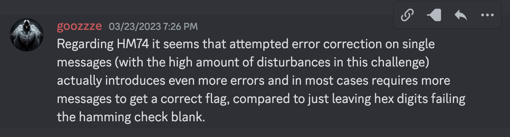
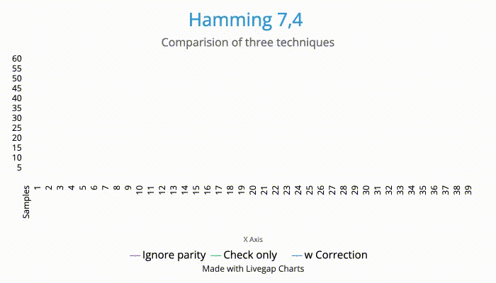

## HM74
##### Category: Hardware/Medium: (325 points)

### Description
As you venture further into the depths of the tomb, your communication with your team becomes increasingly disrupted by noise. Despite their attempts to encode the data packets, the errors persist and prove to be a formidable obstacle. Fortunately, you have the exact Verilog module used in both ends of the communication. Will you be able to discover a solution to overcome the communication disruptions and proceed with your mission?

### Files
The following Verilog file was included. Examining the file indicates that this is an implementation of a Hamming (7,4) code. This method uses 3 parity bits for every 4 bits of data. This allows the receiver of the information to correct upto 1 bit of data errors (bit flipped from 1 to 0 or the other way around). If there are more than 1 bit errors, this parity is insufficient. 

* [Hamming (7,4) Code](https://en.wikipedia.org/wiki/Hamming(7,4))

```verilog
module encoder(
    input [3:0] data_in,
    output [6:0] ham_out
    );

    wire p0, p1, p2;

    assign p0 = data_in[3] ^ data_in[2] ^ data_in[0];
    assign p1 = data_in[3] ^ data_in[1] ^ data_in[0];
    assign p2 = data_in[2] ^ data_in[1] ^ data_in[0];
    
    assign ham_out = {p0, p1, data_in[3], p2, data_in[2], data_in[1], data_in[0]};
endmodule

module main;
    wire[3:0] data_in = 5;
    wire[6:0] ham_out;

    encoder en(data_in, ham_out);

    initial begin
        #10;                     //update every 10ns
        $display("%b", ham_out); //print 3 parity bits + 4 data bits = 7 bits
    end
endmodule
```
Note the positions of the parity bits and the data bits. `[p0 p1 d3 p2 d2 d1 d0]`

### Input
There was a server you could connect via netcat. The server continuouly printed data like:
```
Captured: 1100101101010000000011001100100010000010101001111000011101000001110000110011110100011100110111111101000111100110011101101001111000011110110110010011001010110011011111010100101011011110000111000011100001001000000100110101010100000111000011010010011111001100010110010111001100010010110011011010010000110110100100010110011001000111110100011101011000100110000010110000111010110111010011111001000100010110000000000111001000000100101010101111001001100111111001001011011000110001111001001011011111110101110000110001111101010111001110000101001111001010001100110100100111001100010111010111110011110100101111110110000110001111110111111100001000011100001101001011111111110000110100001000011000010011001001110011100111010100111100110101101111001111010010001001010111000000101111111011000110000111111000111011111000011110100000001010101111010001100011111100001001010010001101001011000010111101110110110110110101001100111100100001010011011000010011101100011001100001
Captured: 1001100111010011111011001100100110001010100001111001001110001101101000010001110111011000111100001111000011101101000101110111101010110110100110011011001100100011011101000100101111111100011100000011000011100010001110100000010110000111011011010001011111111100110110000111011110010001111011010010111100010110100100010110011100101011110000111000011110100110000110101101011010111111110001011100101110000110000000000111101001010000101101110111001101000001110010110111101100110001111001000100101111110010110010000001011111000010000110011111000111101010100101111111100100011101010101100110010001000101111111111110000110001111111000001100001000111100000000001011111110010001110000011000011110110011101101010101010011011101011100110001000011000101000010100001100100010100001110010110110111001111011110011111111110011100110001001011111111100001001000010110100001011011101001000011010011111111111100110010010011010001110100000101110010011000001001110000000011110111
```
Analysing the data, we can see that:
* The length of the bit stream is 952 bits
* There are 136 blocks, each having 7 bits. Each block has 4 bits of data and 3 bits of parity.
* So, there are 68 characters of information in each bit stream, which is presumably our flag.

I captured a few seconds of output and [saved it locally](hamming_data.txt). 

### Hamming Code Algorithm.

* The input stream contains 4 bits of data and 3 bits of parity.
* Recalculate the parity using the 4 bits of data using the same calculation
* Say, the calculated parity bits were `cp0, cp1, and cp2`
* Now, comparing the calculated parity bits to the transmitted parity bits results in the following scenarios
* Remember, we are considering only errors in one-bit per block only. 
```
error in bit >>| p0 | p1 | d3 | p2 | d2 | d1 | d0 | no error
---------------+---------------------------------------------
cp0 matches p0 | no | yes| no | yes| no | yes| no | yes
cp1 matches p1 | yes| no | no | yes| yes| no | no | yes
cp2 matches p2 | yes| yes| yes| no | no | no | no | yes
```
modified from [Code Golf - Correct errors using Hamming(7,4)](https://codegolf.stackexchange.com/questions/45684/correct-errors-using-hamming7-4)
### Implementation 
* For each block of 7 bits, apply the algorithm above to find the index of the error (if any)
* If the data bit is in error, flip it. (We can handle only one error)
* Save the 4 bits from the block and correct the errors in the next block too.
* Convert the 8 bits from 2 blocks to a character. Add it to our potential flag.
* Doing this for a single bitstream, yields a character string like:
```
H L»ømm]w5Th_u2m][!ÎaÑ@sQ5 yp}_c4n_3x1ract¸ hS aami n Vg_4 3 Ó]f|¢^-
```
* That doesn't look like the flag we want!  
* However we have some readable segments of the flag there. So, logic suggests that we had more errors in the bitstream than what we could correct using the parity bits. 
* Running the same logic on several more samples gives us results like:
```
H L»ømm]w5Th_u2m][!ÎaÑ@sQ5 yp}_c4n_3x1ract¸ hS aami n Vg_4 3 Ó]f|¢^-
HT ;8mmYwqlh_q0o3_ana=ys9EQ¹6e_j4ýf3x9ract 9h3\h0moÛm0ï7S0_:îj_6l¼:}
øTBÛ-mm_w1}` s c=_a`aÕxs1=Z~0 _c4n :r9¸áÃtÏ7hS øßmmkþ=_wo _9îº_eb 9}
...
```
* So, we can deduce that while errors are randomly distributed, we are getting the flag being transmitted continuously in the bitstream. 
* The "correct" character in each position is determined by most frequently appearing character in that position across many samples.
* Create a small program to count the frequency of every letter that appears in each position. 
* Running the error correction logic against the samples I had saved locally and selecting the most frequently appearing character yields the flag `HTB{hmm_w1th_s0m3_ana1ys15_y0u_c4n_3x7ract_7h3_h4mmin9_7_4_3nc_fl49}`

* The complete code for the solution is [here](solve_hm74.py)

### Pedantry

In the writeup section after the CTF, I read an interesting comment that said it is more efficient to ignore the data if there are parity errors than to attempt to corrent the bits. I wanted to see if this was indeed the case. So, I set up an experiment with the sample data that I had. 




The techniques I used were: 

1. Ignore parity and just brute-force it: Since, we have an potentially unlimited messages, if we collect enough messages, we should have enough message fragments to give us the full flag.  I saw that some teams indeed solved the puzzle this way. 

2. Check the parity bits and accept the data bits only if the parity check passes. Else, discard the data bits. This was the scenario mentioned in the discord comment. 

3. Check the parity bits and correct the bit errors as intended. The hypothesis is that this approach should be most efficient, as it maximizes the information in the messages. 

I ran the same samples I had gathered against all the three algorithms.  The results were not very surprising. 

| Approach | # of samples |
|----------|--------------|
| Ignore parity | 39 (still was one character off) |
| Check parity only | 28 |
| Check & correct | 18 |


So, it is efficient to take the effort and correct the bit errors, even if it does not eliminate __all__ errors in the message.

Here is a relative comparison of the three techniques. 

`[X axis - # of samples, Y axis - # of errors from the expected flag]`




Any of these techniques would work in the context of this challenge, as there were unlimited samples. The distinction would become onlly relevant when we have a limited set of samples. 

Thank you for indulging in my silly pedantry. 


