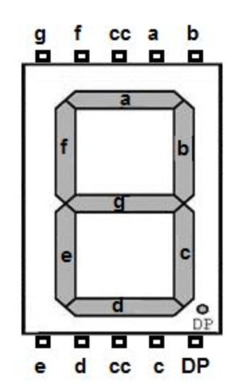
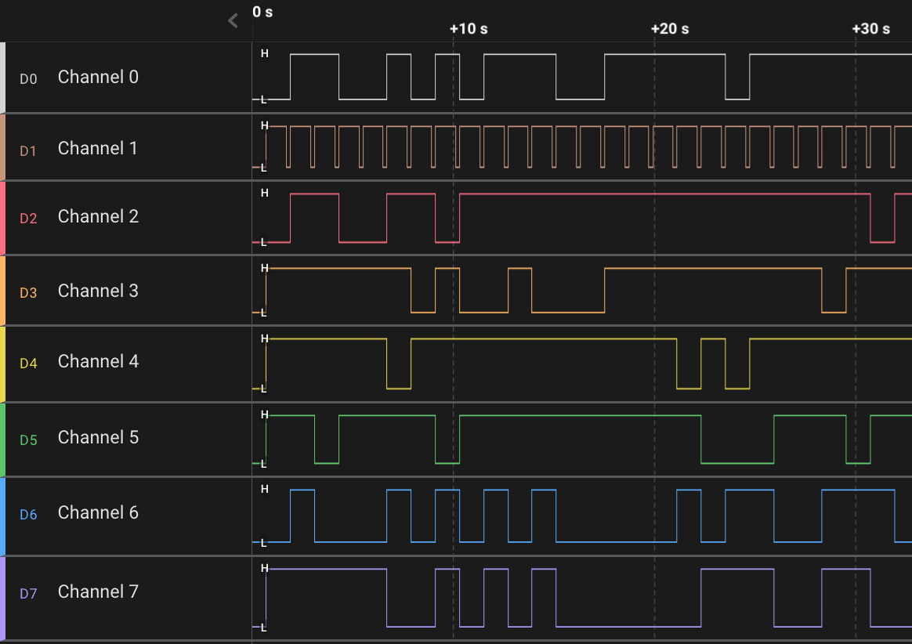

## Secret Code
##### Category: Hardware/Easy: (300 points)
### Description

To gain access to the tomb containing the relic, you must find a way to open the door. While scanning the surrounding area for any unusual signals, you come across a device that appears to be a fusion of various alien technologies. However, the device is broken into two pieces and you are unable to see the secret code displayed on it. The device is transmitting a new character every second and you must decipher the transmitted signals in order to retrieve the code and gain entry to the tomb.

### Files
``` 
  Archive:  hw_secret_code.zip
  Length   Name
---------  ----
        0  broken_board/
      592  broken_board/RA_CA_2023_6-Edge_Cuts.gbr
     1173  broken_board/RA_CA_2023_6-F_Mask.gbr
     2670  broken_board/RA_CA_2023_6-job.gbrjob
      788  broken_board/RA_CA_2023_6-F_Paste.gbr
     8722  broken_board/RA_CA_2023_6-F_Cu.gbr
     1990  broken_board/RA_CA_2023_6-B_Silkscreen.gbr
      474  broken_board/RA_CA_2023_6-B_Paste.gbr
   329373  broken_board/RA_CA_2023_6-F_Silkscreen.gbr
     2869  broken_board/RA_CA_2023_6-B_Cu.gbr
      859  broken_board/RA_CA_2023_6-B_Mask.gbr
    96157  hw_secret_codes.sal
---------  -------
   445667  12 files
```

### PCB analysis 

Upload the zip file to a site like [PCBWay](https://www.pcbway.com/project/OnlineGerberViewer.html) to view the Gerber files. 
Tip: tweak the colors for the different layers to improve visibility

The most important information is from this section of the PCB.  Note the magenta colored links are on the bottom side of the PCB, acting as cross-overs. 


Tracing the connections to the typical 7-segment LED display, which is silkscreened on the PCB, gives us the following signal paths


| Channel      | Segment |
| ----------- | ----------- |
| 0   | d |
| 1   | DP (dot) |
| 2   | a |
| 3   | g |
| 4   | c | 
| 5   | b |
| 6   | e |
| 7   | f |

### Signals
Also included in the zip file is the Saleae Logic 2 file called  `hw_secret_codes.sal`



Using `File -> Export Data -> CSV` lets us have the data in a CSV file. Looking at the channel 1 (the dot on the display), it pulses approximately once a second. So, we cue off that signal and read the values when channel #1 is high (i.e equal to 1). 

```
Time [s],Channel 0,Channel 1,Channel 2,Channel 3,Channel 4,Channel 5,Channel 6,Channel 7
0.000000000,0,0,0,0,0,0,0,0
0.695667880,0,0,0,1,0,0,0,0
0.695672280,0,0,0,1,0,0,0,1
0.695680200,0,0,0,1,0,1,0,1                    
0.695691400,0,0,0,1,1,1,0,1                      |_|
0.695695040,0,1,0,1,1,1,0,1    <=== reading #1     |.
1.696727760,0,0,0,1,1,1,0,1
1.897122440,0,0,1,1,1,1,0,1
1.897129960,0,0,1,1,1,1,1,1                       _
1.897133720,1,0,1,1,1,1,1,1                      |_|
1.897141520,1,1,1,1,1,1,1,1    <=== reading #2   |_|.
<snip>
```
The CSV data is as depicted above. Ignoring the timestamp and all entries where channel #1 is 0, leaves us only the good readings. In the snippet shown, there are two valid readings. If we map the channel values to the segments as described before, we can see that the segments spell `4` and `8` as two consecutive readings. 0x48 is the ascii value of the letter `H`.

### Code
Instead of building an elaborate lookup table, I decided to just print the character on the LED display to the screen and transcribe it over to Cyberchef. 

```python
def print_digit(sig):
    CHARS = "_ __|||||"
    DISPLAY = [ 
        [' ',' ',' '],
        [' ',' ',' '],
        [' ',' ',' '],
    ]
    POSITIONS = [7,2,1,4,8,5,6,3]

    for i,c in enumerate(sig):
        if (c):
            p = POSITIONS[i]
            DISPLAY[p//3][p%3] = CHARS[i]    
    D = []
    for l in DISPLAY: 
        D.append(''.join(l))
    return D

    # returns 3 strings corresponding to the three lines of the display.  
```

### Flag
Printing the LED display for the entire set of signals (where channel #1 is 1), gives us the following output:


Transcribing the hex values displayed `4854427b70307733325f63306d33355f6632306d5f77313768316e4021237d` into ASCII using CyberChef yields the flag : `HTB{p0w32_c0m35_f20m_w17h1n@!#}` 

### Reflection
This was a very enjoyable challenge. It brought back memories of my early experiments of tinkering with electronic circuits.
