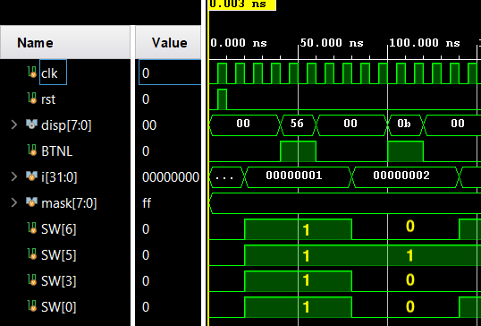

# Garys Sauce - Writeup
Created Sunday 01 May 2022

#### **__``simulation/flag_tb.v``__**
	    flag_capture fc(.clk(clk), .rst(rst), .BTNL(BTNL), .SW(SW), .disp(disp));

The workhorse is the main loop that takes the last character (8 bits) of the flag, sets the signals (SW) based on their binary values.  These signals are bound to the SW variables for the **``flag_capture``** function. That is where we need to look next. 

```verilog
	    reg [7:0] mask = 8'b11111111;
	    initial 
	    begin
	        SW = 16'b0000000000000000;
	        BTNL = 1'b0;
	
	        for (i=1; i <= 38; i=i+1) begin
	            SW = flag & mask; #20; BTNL = 1'b1; #20; BTNL = 1'b0; #40;
	            
			// The flag is processed from the back, and shifted right by 1 char 
	            flag = flag >> 8;
	        end
	    end
```

**__``src/flag_capture.v``__**
	module flag_capture(input clk, input rst, input [7:0] SW, input BTNL, output [7:0] disp);
	    wire clk_1hz;
	    clk_1hz cl(.clk(clk), .clk_1hz(clk_1hz));
	    garys_sauce gs(.clk(clk_1hz), .rst(rst), .BTNL(BTNL), .switches(SW), .Disp(disp));
	endmodule

Not much in here, other than the SW inputs being passed to **``garys_sauce``** function. Let's go there next.
 
**__``src/garys_sauce.v``__**
```verilog
	// a few interesting things here ... an intermediate value
	    wire [7:0] intermediate;
	
	//...
	// When BTNL is high, the outputs Disp has the value of intermediate
	        if (BTNL) begin
	            Disp[7:0] = intermediate;
	// ...
	// The msb 4 bits of switches are multiplied with lsb 4 bits and the product..
	// I assumed that this implementation using Full and Half Adders was correct
	    fourbit_mult fbm(.a(switches[7:4]), .b(switches[3:0]), .s(mult_out));
	    
	// .. is fed in to the myxor function, resulting in the intermediate values 
	    myxor x(.in(mult_out), .out(intermediate));
```

From **``flag_capture.v``**, we can see that intermediate is tied to the display variables. Let's check out **``myxor``**.

**__``src/myxor.v``__**
```verilog
	// output = input ^ 0x0d
	module myxor(input [7:0] in, output [7:0] out);
	    reg [7:0] value = 8'hd;  // hex 0x0d
	    assign out = in ^ value;
	endmodule
```
The file has the key (0x0d) that is XOR-ed with input and returned as the output. 
Hence,   
**``display = intermediate = (sw[7:4] * sw[3:0]) ^ 0x0d``**
**``sw[7:0]``** contains the value of one character from the flag.

From the trace images, we are given the values of ``display`` and four bits of the switches, ``sw[0], sw[3], sw[5] and sw[6].``



We should read the values of ``disp, SW``, when ``BTNL`` is high. 
For example: 
For i=1 (i.e, the last character of the flag),

``disp[7:0] is 0x56``  (from the 3rd row of the image above)
``SW[0, 3, 5, 6] are [1,1,1,1]`` 

From the relation given above,  

``SW = disp ^ 0x0d = 0x56 ^ 0x0d = 0x5b.``

``MSB	LSB``
``0``**__``11``__**``1 x ``**__``1``__**``10``**__``1``__**`` = 01011011 [0x5b]	SW[0,3,5,6] = [1,1,1,1]``
``1``**__``10``__**``1 x ``**__``0``__**``11``**__``1``__**`` = 01011011 [0x5b]	SW[0,3,5,6] != [1,1,1,1]``

``>>> chr(int('01111101', 2))``
'``}'  	//``**``(correct character)``**
``>>> chr(int('11010111', 2))``
'``×``'

Finally, we can automate the solution in a simple python script. To optimize the factoring, I created a dictionary of all possible product of 4 bit values, and stored their respective MSB and LSB factors. Then I laboriously captured the switch values and display values into an array and iterated through them to decipher the original character from the flag. I assembled it into a flag and reversed it, so that the order of the characters is correct, giving the final flag as **``flag{6082d68407f62c5c0f29820e0c42dea2}``**``. ``The complete solution can be found in **``solve_gary.py``**
