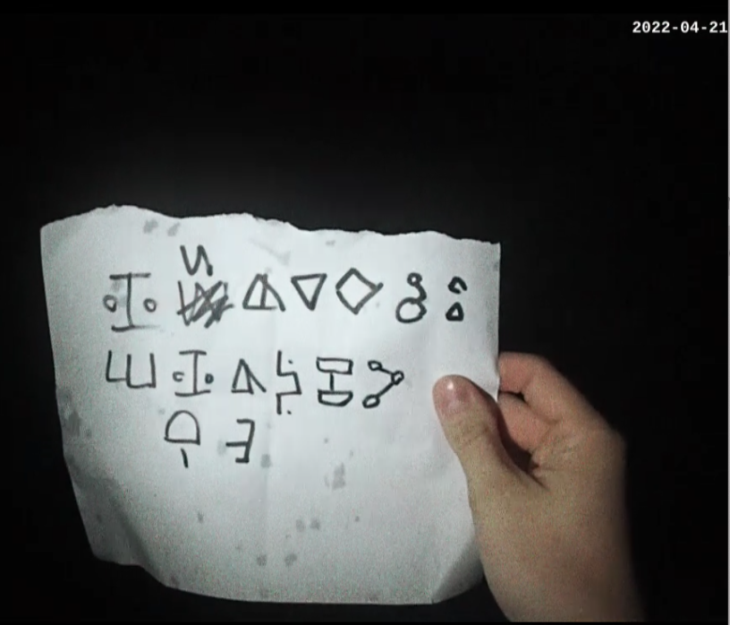
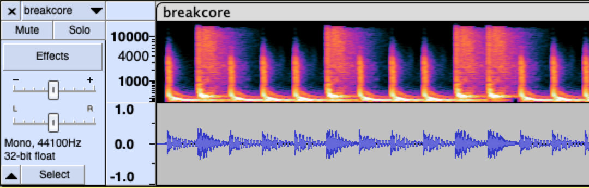
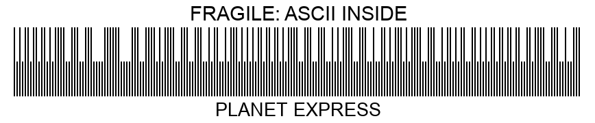
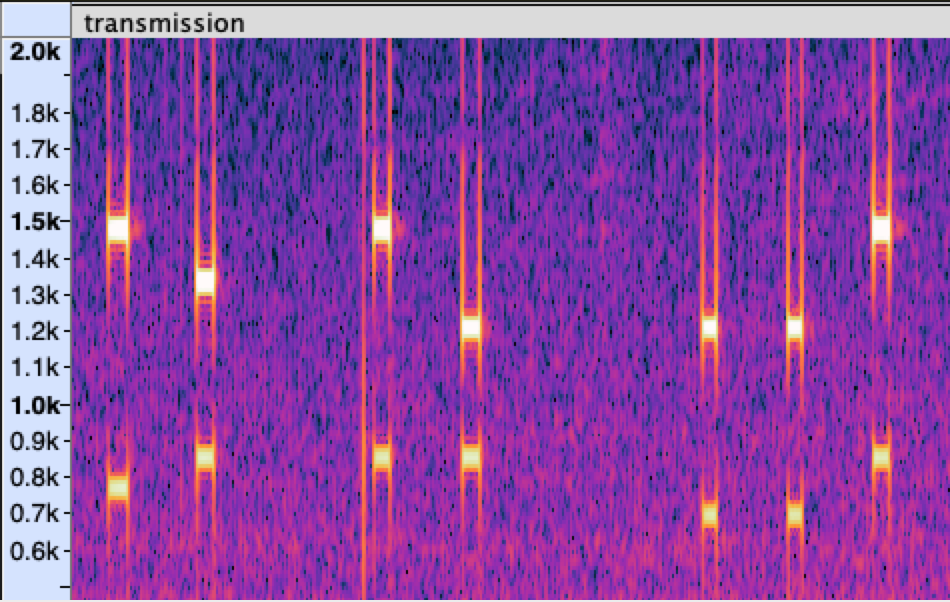
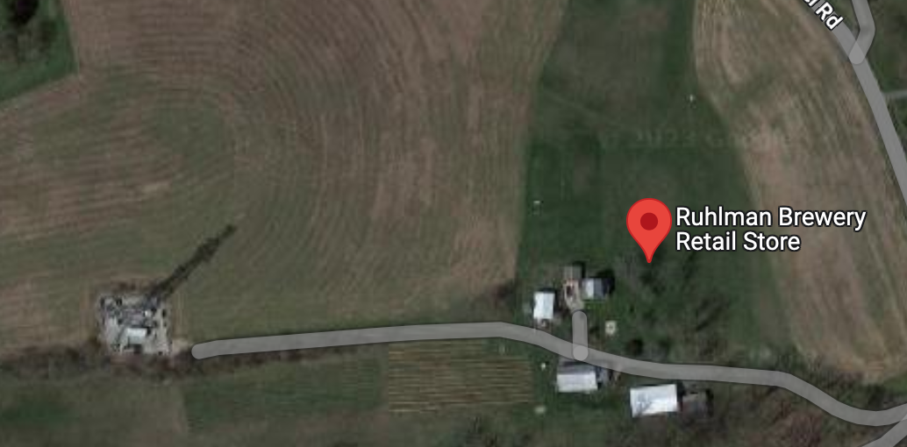
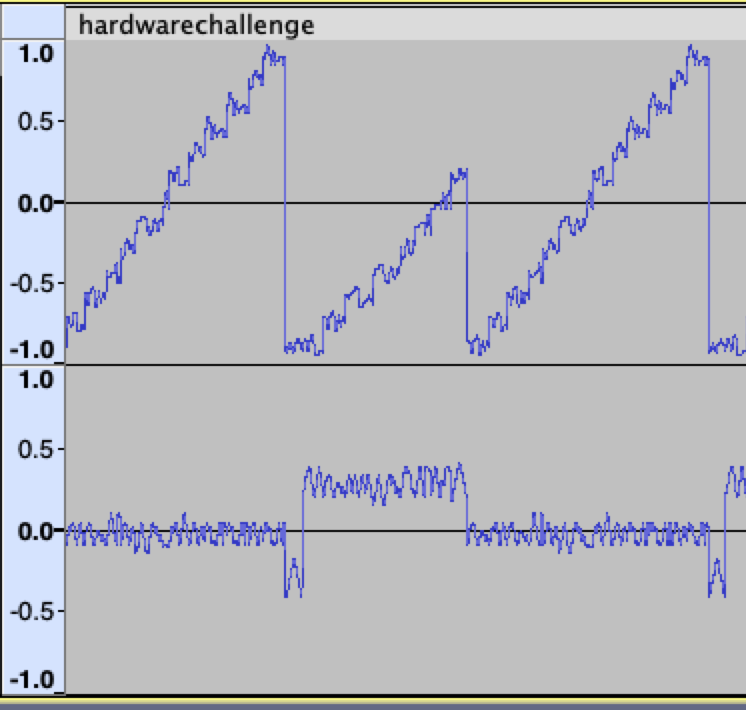
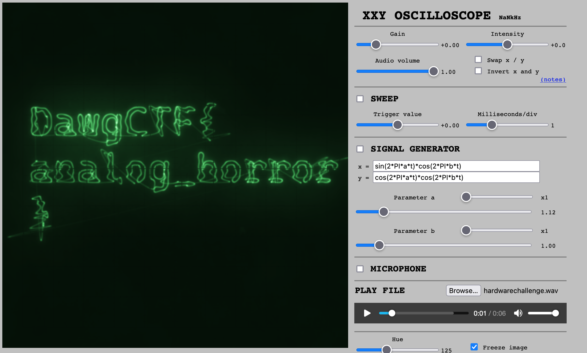

I participated in a very nice CTF over the weekend as a member of team `Weak But Leet`. The challenges were a good mix of ciphers, reverse-engineering and some unique challenges. We scored 4920 points and were placed 10th. We also scored a first blood on one challenge. 

This CTF was more of a 'puzzle-solving' type CTF, rather than a purely security-centric one. Had a good mix of ciphers. And more importantly, the puzzles were constructed to be engaging and not be too guessy. 
<!--more-->

## Crypto
### Et tu Bacon 
The name suggests it is the Bacon cipher. The resulting string will need to be reversed to give us the flag.

The cyberchef recipe - [deeplinked](https://gchq.github.io/CyberChef/#recipe=Bacon_Cipher_Decode('Complete','0/1',true)Reverse('Character')&input=MDExMDEgMTExMDAgMDExMTAgMTEwMTEgMTAwMTAgMTEwMTAgMTAwMDEgMTEwMTEgMTEwMDEgMTExMTEgMDEwMTEgMTEwMDEgMTAwMTAgMTExMTEgMTAxMDAgMTEwMTEgMTEwMDAgMDExMDAgMDExMDEgMTAxMTEgMTAwMTAgMTAxMTEgMDExMDAgMTExMTEgMTAxMDAgMDEwMTEgMTAwMTE)

```
    Bacon_Cipher_Decode('Complete','0/1',true)
    Reverse('Character')
```
__Flag__: `DawgCTF{MULATINISTHELANGUAGEOFNERDS}`

### Choo Choo 

> My friend is the manager of a train company, and he sent me this note that he intercepted from a secret conductoTheser's union meeting. The only other clue he noticed was that the note had a picture of a railroad line with 10 tracks on it. Can you help him decode the note?

The name suggests rail cipher and the problem description gives us 10 tracks as a hint. 

Plugging the given string in `chugga.txt` to dCode and using the Rail cipher or Railfence cipher, gives us the flag.

String: `D1_a4nrCwrs30gt_poC_tu1T3h5!Fk3_}{1y31l_r_4`

```
10↕ ↘↗
D                                    1      ...
  a                                4    n   ...
    w                            r        s ...
      g                        t            ...
        C                    _              ...
          T                3                ...
            F            k                  ...
              {        1                    ...
                1    l                      ...
                  _                         ...

```

__Flag__: DawgCTF{1_l1k3_tr41ns_th3y_4r3_5up3r_C0o1!}


### Thermodynamic Analysis

We are given a document that looks like a study guide for Physics/Thermodynamics.
```
    D=1/2mv^2 (force * displacement) = 1/2 * mass * velocity^2 + alpha
    w=fd (force * displacement) with respect to displacement lag
    Cp=20.79 J/K/Mol for a constant pressure ONLY FOR OUTPUT
    FINAL TEMPERATURE ALWAYS COMES FIRST BECAUSE THE TEMPERATURE DELTA IS INSIDE {
    temperature min, temperature max}, like with
    e=u+pVr
    m=0

    <snip>
```
I noticed that the first character for the first three lines were `D`, `w` and `C`. So, obviously the last character of each line would be of interest. Very quickly, it confirmed that the first three lines gave up the header of the flag. 

I wrote a small `sed` script to grab the first and last character of each line and append them together and collapse all the pairs together as well. It gives me immense joy to write these one-line solutions.

This challenge could've been a lot more challenging if the flag were to start in the middle of the text, rather than at the beginning. 

```bash
(py3) √ dawgctf % sed -rn 's/^(.{1}).*(.).{1}$/\1\2/p' STUDYME.txt | tr -d '\n'
DawgCTF{therm0dyn4mic5sucks!}Thisisn0tpartoftheflag!TnmnQ, )∆)W,o:QiadLpa)RS(ns)
```
__Flag__ : `DawgCTF{therm0dyn4mic5sucks!}`

### You step away for just ONE minute 

After futzing with creating movable puzzle pieces with Gimp, I approached it differently. It was a simple transposition cipher. Quickly wrote the following code to solve it. I am sure there is more pythonic way to write this code. But, this works!

```python
scramble = "wTw13!!5aC{_vs1gDgF30_bn}"
idx= scramble.index('D')
flag = ""
for i in range(len(scramble)):
    flag += scramble[idx]
    idx = (idx - 8)% len(scramble)
print(flag)  
```
__Flag__: `DawgCTF{w3_10v3_s!b1!ng5}`

### Maximum Headspace

The video was instantly recognizable as Max Headroom and incident referred was the signal hijacking incident.  Google provided the date - 11/22/1987

More details here : https://en.wikipedia.org/wiki/Max_Headroom_signal_hijacking

__Flag__: `DawgCTF{11/22/1987}`

### Bravo Six Going Dark 

Nice production value on this challenge. A video done in the style of Blair Witch Project. One of the frames of the video has a hand-written cryptogram. 



Using the [symbol ciphers reference](https://www.dcode.fr/symbols-ciphers) on dCode, we identify the script as `Gravity Falls Bill Cipher`
Plugging in the symbols in to the decoder, gives us the string `HEISWATCHINGYOU`

__Flag__: `DawgCTF{HEISWATCHINGYOU}`

### Break Core - first blood 

We are given a music file in mp3 format, that has the drums and has a rhythm to it. Opening the file in Audacity and looking at the waveforms and the spectrogram, shows us there are two different type of sounds. This obviously indicates some kind of the binary system. 



Treating the quick beat as `0` and the longer beat at `1`, gives us a binary string. Loading it into CyberChef, gives us the flag.  I believe I got the first blood on this challenge. 

__Flag__: `DawgCTF{br34kc0re_1snt_mus1c}`

### Planet Express 



Looking through the online barcode reader sites, this seems to indicate a barcode in the PostNet format. The challenge author later confirmed that it was in AVGFX format actually. 

```
101011011011010111100111001110000111111000011100111101011110011100111001011001011101010101101101101011110011100111001010111100111001001101011101011110011100101101011001101010110110110110011011110011100100111
```
Decoding this using the Postnet [decoder on dCode](https://www.dcode.fr/barcode-postnet) gives us this string of numbers: `98511101005111495985111511695114489848116`

Separating them into appropriate two or three digits numbers and convering from decimal to ASCII, gives us the flag. 

__Flag__: `DawgCTF{b3nd3r_b3st_r0b0t}`


## Binary Exploitation
### String Things 

We are given an ELF binary called `secrets`. As the challenge name suggests, I did strings on it and looked for anything that seems out of place.

```bash
    strings -n 20 secrets | more 
```

One of the first items seems to look like a Base64 string, which it was. Decoding it gives us the flag.

__Flag__: `DawgCTF{str1ng5_w1ng5}`

## Misc
### Down on the Farm 
We are given a very short binary file. 

```
    00000000: 4547 4741 0001 2a3d 373b 0000 0000 2282  EGGA..*=7;....".
    00000010: e208 e390 850a 0000 0000 2800 0000 0000  ..........(.....
    00000020: 0000 ac91 850a 0006 0030 3030 3030 300b  .........000000.
    00000030: 9586 2c00 0900 80b9 d402 0e74 d901 0022  ..,........t..."
    00000040: 82e2 0813 0cb5 0201 0428 0000 002a 0000  .........(...*..
    00000050: 00c8 388f 8222 82e2 08f3 0c0a 8cf0 8f32  ..8..".........2
    00000060: 72f1 0e72 f108 3735 f674 0f34 0e33 8b8c  r..r..75.t.4.3..
    00000070: 0af5 0b8d 0a33 8b0a 0af2 f78c f2f0 34f7  .....3........4.
    00000080: b405 0022 82e2 08                        ..."...
```

Analyzing the file in hex format, clues us to the magic bytes of the file, spelling `EGGA`. More google-fu later, we were able to find this additional information:
1. https://github.com/file/file/blob/master/magic/Magdir/archive
    ```
        # https://cf-aldn.altools.co.kr/setup/EGG_Specification.zip
        0	string	EGGA		EGG archive data,
        !:ext   egg
        >5	byte	x		version %u
        >4	byte	x		\b.%u
        >>0x0E	ulelong	=0x08E28222
        >>0x0E	ulelong	=0x24F5A262	\b, split
        >>0x0E	ulelong	=0x24E5A060	\b, solid
        >>0x0E	default	x		\b, unknown
    ```
1. Some of the headers, appear in our file too, leading us to believe we are on the right path. The EGG file specification confirms it as well.
1. Going back to the trusty Wikipedia, we get this article : https://en.wikipedia.org/wiki/EGG_(file_format)
    > The EGG file format is a compressed archive file format that supports Unicode and intelligent compression algorithms. The EGG format was created by ESTsoft, and was first applied in their file compression software ALZip. 
1. The Wikipedia article has a reference to the source-code, that has been since (archived by the Internet Archive)[https://web.archive.org/web/20160304200252/http://sdn.altools.co.kr/etc/unegg.tar.bz].
1. Extracting the source code archive, gave us the binary for `unegg`, which was used to extract the contents of the EGG archive, which was a file named `000000`. The file contents seem like a bse64 encoded string `IRQXOZ2DKRDHW53IGQ3V6YZUNUZV6ZRROIZHI7I=`, which yields `T5FUQ8G` when decoded. That does not look like a flag.
1. Observing that the encoded string does not have any lowercase letters, led me to believe that it could be base32 instead. 
1. Decoding the string with base32, gives us the flag : `DawgCTF{wh47_c4m3_f1r2t}`

__Flag__: `DawgCTF{wh47_c4m3_f1r2t}`


### Transmission from Pripyat 

We are given a wavefile that when played back, gives us the familiar tones of DTMF.

Loading the audio into Audacity confirms that it is indeed DTMF, where two frequencies are used to indicate the button being pressed.



```
        1209 Hz    1336 Hz    1477 Hz      1633 Hz
697 Hz      1         2           3           A
770 Hz      4         5           6           B
852 Hz      7         8           9           C
941 Hz      *         0           #           D
```

There are online DTMF decoders available. I used the [DTMF detector](https://github.com/ribt/dtmf-decoder) I found on Github.  It samples the sound file at the rate you specify and dumps any information it finds at that index. 

The following snippet of the output shows that the first few tones are `68971`

```
0:00 .........................
0:01 .........................
0:02 ....................6.6..
0:03 ...........88............
0:04 ...............99........
0:05 .....77..................
0:06 .....................11..
[snip]
```
Transcribing this and converting decimal values to ASCII, gives us our flag.

__Flag__: `DawgCTF{get_out_of_here_stalker}`


### Hip to be square 

We are given a text file with a list of numbers.  As the title suggests, we need to look closely to identify numbers that are squares. 

```bash
    $ for i in `cat thelist.txt`; do ;printf "$i ."; bc <<< "scale=${2:-3}; sqrt($i)"; done | grep ".000" | cut -d. -f2 | xargs
```
The command above echos the number, uses `bc` to calculate the square root of the number to three decimal places, picks the ones that are perfect squares and returns the list of square roots as a string.

`68 97 119 103 67 84 70 70 123 84 104 51 114 51 95 49 53 95 78 48 95 100 51 110 121 49 110 103 125`

Converting this string to ASCII gives the flag.

__Flag__: `DawgCTFF{Th3r3_15_N0_d3ny1ng}`

### Breaker Breaker 

We are given a audio recording of a police scanner. 

The transcript of the audio is: 
```
    Unit alpha 10 1B            [Bad reception]
    This is unit alpha 10 7     [Out of commission]
    unit bravo 10 0             [Caution]
    unit bravo 10 17            [Request for gasoline]
    unit Charlie 10 15 over     [Prisoner in custody]
    dispatch 10 four there Charlie  [Acknowledged]
    unit delta is 10 zero,      [Caution]
    dispatch markings echo as 10 17 [Request for gas]
    unit foxtrot 10 18 over     [Equipment exchange]
    dispatch confirms all 
    offsets starting 65 and all letters out.
```
If we ignore the repeated `10`, the remaining numbers seems to be indicating to our flag. 
    `1B 7 0 17 15 4 0 17 18`

The hint is in the message, that says to offset these numbers from 65 (which is an ASCII code for `A`). Also, we need to refine `1B` to `18` as it is in leetspeak. 

This gives us `83 72 65 82 80 69 65 82 83`, which translates to `SHARPEARS`

__Flag__: `DawgCTF{SHARPEARS}`

## Fwn

This category was *F*orensics, *W*eb and *N*etworking. Some really interesting challenges here. 

### UMBC [urgent] 

We are given a jpeg file `UMBC.jpg`. In trying the usual stego techniques, I notice this output from `steghide`

```
    root@stego:/input/2023/dawgctf# steghide info UMBC.jpg 
    Corrupt JPEG data: 45 extraneous bytes before marker 0xd9
    "UMBC.jpg":
    format: jpeg
    capacity: 39.2 KB
    Try to get information about embedded data ? (y/n) 
```
Looking at the jpg in hex view, shows some interesting information towards the end of the file. There seems to be a binary string inserted before the marker `FFD9`

```
000a69b0: 474c 96f2 16f3 9665 d8c7 e518 e7dc 1f51  GL.....e.......Q
000a69c0: 5cb5 2927 b16a 76d4 0110 0011 0100 0111  \.)'.jv.........
000a69d0: 0100 0110 0111 1010 0110 0011 0011 0001  ................
000a69e0: 0100 1110 0011 0000 0101 1010 0101 0111  ................
000a69f0: 0110 0011 0011 1101 ffd9                 ..........
```

Grabbing those values and converting them to ASCII gives us a string `cGFzc1N0ZWc=`, which when decoded as B64, gives us `passSteg`

Going back to steghide and using the newly acquired password gives us a file `f.txt`, which contains the flag.

__Flag__: `DawgCTF{b1n4ry_64_p4ssw0rd}`


### Tower Trouble 

We are given a HEIC file, which is the Apple iPhone picture format. In the metadata of the file, we found the GPS coordinates where the photo was taken. Plugging in the GPS coordinates in Google Maps, gives us the location of the tower and the flag.



__Flag__:`DawgCTF{ruhlmanbrewery}`

### These Names 

> 130.85.56.42, port 4389.  Bind using *cn=guest,dc=initech,dc=com* and password *guest*. Find a person named George in the Engineering department.

The use of `cn`, `dc` etc in the challenge indicates that this is a LDAP based challenge. I used the `ldapsearch` utility to connect to the server.

The main command is `ldapsearch -h 130.85.56.42 -p 4389 -D "cn=guest,dc=initech,dc=com" -x -w "guest" -b cn=guest,dc=initech,dc=com`

This dumps the entire content of the directory. Redirecting this to a file and searching for `George` is how I solved the problem. I however wanted to capture the intended way too. 

`ldapsearch [ ... ] | grep George` - tells us the `givenName` is the property that holds the name and `ou` is the department

`ldapsearch [ ... ] "(& (givenName=George)(ou=engineering))"` - adds a filter criteria to the LDAP query. We can see that George has an attribute called `secretemployeeinformation`

This turned out to be a Base64 encoded string of the flag. 

The full one-liner solution is:
```bash
    $ ldapsearch -h 130.85.56.42 -p 4389 -D "cn=guest,dc=initech,dc=com" -x -w "guest" -b cn=guest,dc=initech,dc=com "(& (givenName=George)(ou=engineering))" secretemployeeinformation | grep "secretemployeeinformation:" | cut -d : -f2 | base64 -d
    DawgCTF{i_aint_no_lightweight}
```
__Flag__: `DawgCTF{i_aint_no_lightweight}`

I presume the flag is referring to LDAP being a __Lightweight__ Directory Access Protocal. 

### Crag's Hardware Challenge

We are given a audio file that seems to have no discernible patterns. Loading the file up in Audacity, shows that sound has two channels, with one sweeping with a sawtooth pattern, and other being a pulse. You can see what I mean in the screenshot below. 



I have seen similar patterns to produce Lissajous figures on the oscilloscope. It works like a dynamic Etch-a-sketch, with the two channels working together to control the electron beam. 

I went old-school and used my oscilloscope to feed the L and R channels, which immediately showed the flag.   Subsequently, I learnt that there are online sites where we can plug in the sound file and visualize what a scope would give.   This was one of the most satisfying challenges that I solved in this CTF. 



__Flag__: `DawgCTF{analog_horror}`

## Close but no cigar
* Came close setting up to solve Binary Bomb level 3 with Z3. Did not complete.
* `Table for you`. Cracked the password for the 7z file using J-T-R - got the password almost instaneously. I noticed that of the 1023 entries in the table, only one of them was odd becuase it used different letters. Did not realize that the string like `RUVFRUVFRUVFZUVFRWVFRUVFRU ...` can be B64. Here is the full solution:
```bash
    (py3) √ dawgctf % cat jurassic_line.txt | base64 -d | tr 'Ee' '01' | perl -lpe '$_=pack"B*",$_'
    DawgCTF{y0u_kn3w_th3_m4g1c_w0rd!}
```
* `Eighty FGX`: Presumably an Enigma problem. But did not know to how decode the barcodes.
* `Bravo Six Going Dark II`: Decoded morse from the flashlights, but it was not yielding sensible values. My morse reading skills need work. 
* `CarBode`: I presume this has some data in each frame of the GIF, but no clue yet on how to solve it.
* `Ring Ring`: The area code does not go live until June 2023. So, I am not sure how we are supposed to narrow it down to a town. Must benefit from familiarity to the local area, as the organizers are from Maryland. 


## Post event

* I really wanted to use `angr` to solve the binary bomb challenges. A takeaway for me. 
* The keys for the Enigma machine challenge was in barcode format `93`
* The Birds-on-a-wire cipher and Lunar alphabet ciphers are something to remember for the future. 
* Other ciphers to remember for the future are : 
    * hexa vue cipher : used in the Amongus challenge
    * 

## References
* https://online-barcode-reader.inliteresearch.com/ : Used this to identify bar codes and translate them
* https://flixier.com/tools/convert-audio-to-text : Used this to transcribe voice to text
* http://linux.die.net/man/1/ldapsearch : Man page for ldapsearch
* https://devconnected.com/how-to-search-ldap-using-ldapsearch-examples/ : How to use ldapsearch
* https://github.com/jameshball/osci-render/ : Utility to generate oscilloscope images. Really cool.
* https://github.com/ByteTh1ef/writeups/blob/main/DawgCTF2023/BeforeandAfter.md
* https://github.com/dterracino/UnEgg 
* https://github.com/ribt/dtmf-decoder: Nice, functional DTMF decoder
* http://genave.com/dtmf/ : DTMF description
