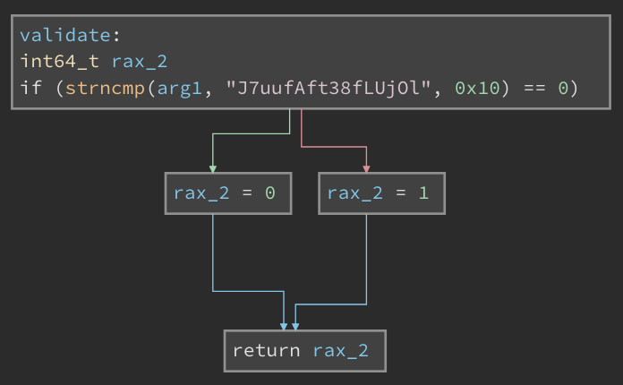

Being constrained for time this weekend, I was able to tackle only one or two challenges in NCSU's [HackPack 2023](https://hackpack.club/ctf2023/).
There was an interesting binary challenge that I used to learn more about Angr. Solved a challenge that was a tongue-in-cheek attempt at mimicking the LLM/ChatBot craze. 
<!--more-->

### __SpeedRev-Bot__

I did not solve this during the CTF. Used it as an opportunity to learn `angr` to solve these problems. The core of the solution was provided by `watchdog`@`OpenToAll` discord channel. 

```
Welcome to the speedrun challenge! You have 3 minutes to solve 6 levels!

Level 1, here is the binary!

b'f0VMRgIBAQAAAAAAAAAAAAMAPgABAAAAcBAAAAA...
...
... AAAAAAAAAAAAAAAAAABAAAAAAAAAAAAAAAAAAAA'
What is the flag?

(waits for 30 seconds)

BZZZTS TIMES UP
```

The premise of the challenge is interesting. The challenge server provides us with an ELF binary, encoded in B64. The binary is a flag validator and takes in the input from `<stdin>`. If the flag is valid, it serves the next binary. The challenge calls for analyzing the binary and providing an input that would pass the validation in about 30 seconds on average.

Capturing the binary for the first level into a file and analyzing it through Ghidra or Binary Ninja tells us that there is a `validate(char* flag_param)` function that takes the input from `<stdin>` and validates it. 

For the first level, the implementation is a simple string comparison to a static flag string. We also see that the flag is `0x10` or 16 characters long. The problem description also indicated that the flag consists of numbers, upper and lowercase alphabets.  I also confirmed that the flag string is randomized for each connection - so an offline reverseengineering would not help. 



Looking ahead, we would see that the `validate(char* )` function becomes more complex with additional checks on characters. However, the overall structure still remains the same. 

I wanted to approach solving this problem through `angr`.  The first line of thought was to isolate the call to `validate(char* )` and solve for input parameter that would return a value of `0`. This took me down the path of using `call_state` instead of the typical `entry_state` in `angr`. Also, it helped me understand the `cdecl` calling conventions, use of the EAX register for return values and accessing registers in `angr`. 

Finally, with the help of `watchdog` on the `OpenToAll` discord, here is the final solution. 

First, setting up the `angr` project. 
```python
    project = angr.Project(path_to_binary)
    flag = claripy.BVS('F', 16*8)

    initial_state = project.factory.entry_state(
        stdin=angr.SimPackets(name='stdin', content=[(flag, 16)]),
        add_options = { angr.options.SYMBOL_FILL_UNCONSTRAINED_MEMORY,
                        angr.options.SYMBOL_FILL_UNCONSTRAINED_REGISTERS}
    )
```
Apart from the boilerplate, I learnt about using `SimPackets` to setup `<stdin>`, instead of `SimFile`. Second, about `SYMBOL_FILL_UNCONSTRAINED_MEMORY` and `..._REGISTERS`. 
Next comes the constraints for the input (or the flag characters). It is a simple set of constraints to set the byte values in the flag to be alphanumeric. 
```python
  for byte in flag.chop(8):
    initial_state.solver.add(Or( And(byte >= ord('0'), byte <= ord('9')),
                              And(byte >= ord('a'), byte <= ord('z')),
                              And(byte >= ord('A'), byte <= ord('Z'))))
```
More boiler plate code to setup the simulation manager. 

```python
  for s in simulation.deadended:
    s.solver.add(s.regs.eax == 0)       # set the condition to have the return value be equal to zero. see `cdecl`
    try:
      if (s.satisfiable()):             # if this is satisfied, some debug info and then 
        logging.debug("<<< deadended[%d] >>>" % n)
        logging.debug("  return val = %s" % s.regs.eax)
        logging.debug ("  registers = %s" % s.regs)
        logging.debug ("  bbl_addrs = %s" % [hex(a) for a in s.history.bbl_addrs])
        logging.debug ("  satisfiable = %s" % s.satisfiable())
        for c in s.solver.constraints:
          logging.debug(f"  constraint: {c}")
        return s.posix.dumps(0)         # print the state of the posix file with a FD=0, which is /dev/stdin  This should be the symbolic value of the flag
```

The rest of the code is some boilerplate to use `pwntools` to automate the connection, receive the binary, feed it to `angr` and send the flag. Doing it 6 times, gives us the final flag: 

```
[+] Opening connection to cha.hackpack.club on port 41702: Done
INFO     | 2023-04-21 12:30:51,050 | pwnlib.tubes.remote.remote.4375363488 | Opening connection to cha.hackpack.club on port 41702: Done
Solved level 1, Flag = b'WjT0tK5GhfiCtpuf'
Solved level 2, Flag = b'7lOo7IYOQtVYzl5F'
Solved level 3, Flag = b'ZdaGJqDBm9Lafnbt'
Solved level 4, Flag = b'1OB0YFOUgUTtmUHY'
Solved level 5, Flag = b'7KcMRJzFv2IN0Q53'
Solved level 6, Flag = b'Z72FkJ5tmjdsfUpE'

Congrats! Here is your flag!
flag{speedruns_are_aw3s0m3_4nd_4ll}

[*] Got EOF while reading in interactive
```

A really fun challenge. Opened up the potential for using `angr` for similar challenges in the future.

### __EZILA__


### __Stop-Drop-Roll__

### Other writeups of interest
* https://www.madrhacks.org/writeups/hackpack_2023/#speed-rev-bot 
* https://github.com/jakespringer/angr_ctf
* https://blog.notso.pro/2019-03-20-angr-introduction-part0/
* https://hackmd.io/@cwXgzjB3S1eEs_BPxM1n8A/r1fxyAfzq


