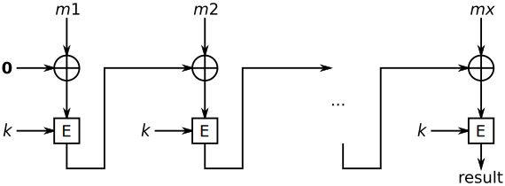
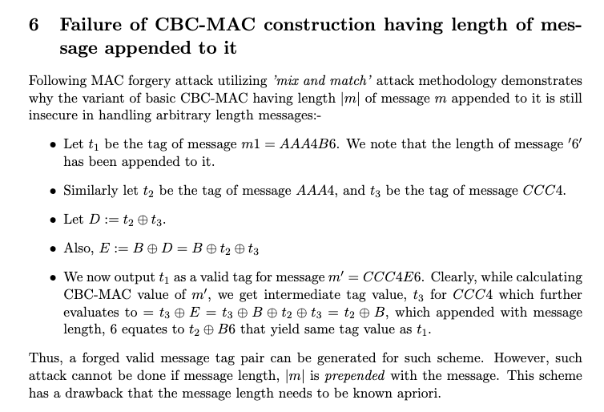
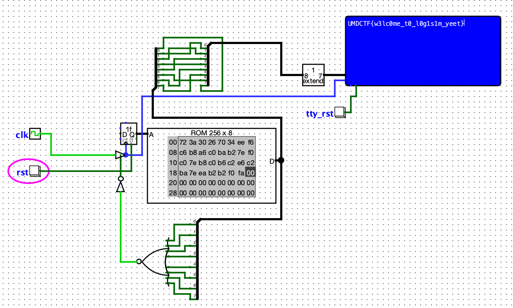
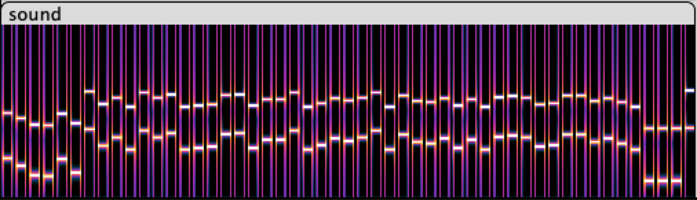
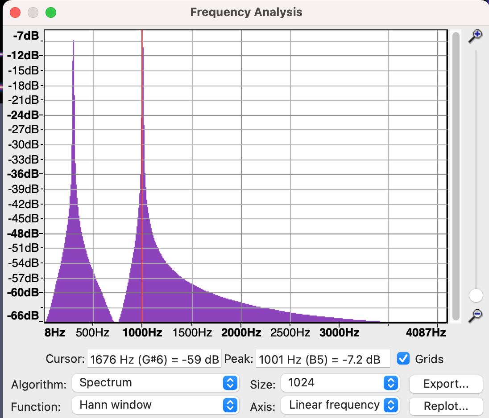
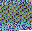
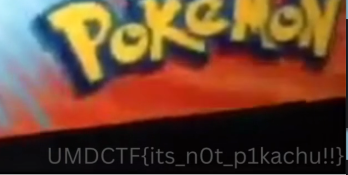
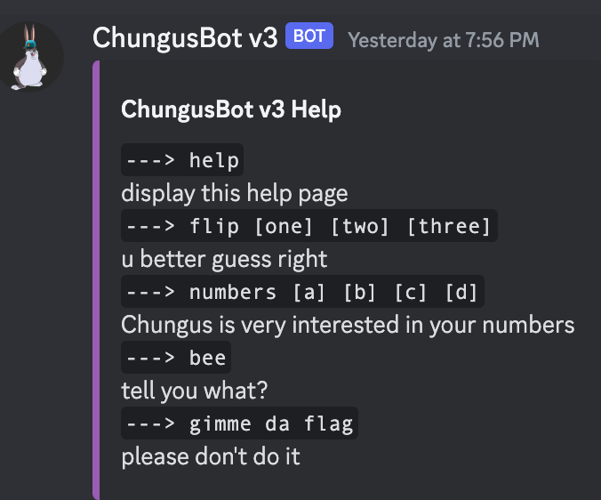

Joined the UMDCTF after the CTF already had started. Nice varieties in this CTF. I especially enjoyed the Hardware category. 
<!--more-->

### Crypto
#### CBC-MAC 1

`"Team Rocket told me CBC-MAC with arbitrary-length messages is safe from forgery. I don't think they can be trusted, so I built this oracle for it to be tested before I use it for my own important needs."`

This set of challenges turned out to be a really good refreshers for the CBC cryptography. 

<cite>[^1]</cite>

[^1]: By Benjamin D. Esham (bdesham) - Own work based on: Cbcmac.png by en:User:PeterPearson. Own work  by bdesham using: Inkscape., Public Domain, https://commons.wikimedia.org/w/index.php?curid=2277179.

The basic structure of Cipher Block Chaining is given by the diagram above. The message is chopped up into blocks of equal size (with necessary padding). The first block is XORed with an initialization vector and the resulting block is encrypted using a secret key. The encrypted output becomes the initialization vector for the next block, and so on. 

With Message Authentication Code, the idea is that an entire message is treated with CBC and only the cipher output of the __last__ block is provided as a proof of authenticity. The principle is that if the message is tampered in any way, the intermediate ciphers will change, creating a cascading effect and invalidate the final cipher. 

As you will see if the scheme allows for variable length messages, it is vulnerable to forgery. 

For the CBC-MAC schemes, the IV for the first block is always 0.

The challenge server is running a program that presents a menu when we connect to it.

```
    Team Rocket told me CBC-MAC with arbitrary-length messages is safe from forgery. If you manage to forge a message you haven't queried using my oracle, I'll give you something in return.

    What would you like to do?
        (1) MAC Query
        (2) Forgery
        (3) Exit

    Choice: 
```

The approach is that you can request MACs for upto 10 messages that you can send to the server. The goal is to send a message to the server, using option 2, and predict the MAC tag to get the flag. 

The most important part of the server code is this bit where the MAC tag is calculated and returned. As we see here, IV = 0 and the incoming message (which is validated to be aligned to the block size), is passed to the cipher function. The last 16 bytes of the cipher is returned as the MAC tag. 

```python
    def cbc_mac(msg, key):
        iv = b'\x00'*BS
        cipher = AES.new(key, AES.MODE_CBC, iv=iv)
        t = cipher.encrypt(msg)[-16:]
        return hexlify(t)
```

The approach to forge the message is as follows. 

1. We will send one block of known plain text A (b'aaaaaaaaaaaaaaaa') and recieve a tag (T1)
1. We will calculate the XOR value of the plain text and the tag (E = A xor T1)
1. We will append this calculated value to the original plain text and send it for the forgery option, with the expected tag of T1
1. Why does this work ? 
```
    T1 = Encryption(A , key)
    E = A xor T1

    When we send a message A||E, 
    A being the first block, gets treated the same as before, yeilding T1 as the cipher. 
    Now this cipher is XORed with E, the next block. 
    But, T1 xor E ==> T1 xor T1 xor A => A
    Hence the Tag from the second encryption function is Tag = Encryption(E xor T1, key)  = Encryption(A, key) = T1

    Thus, the tag is predicable. 
```

The full solution is provided here:
```python
        A = b'A'*16

        def getTag(p, msg):
            p.recvuntil(b'Choice: ')
            p.sendline(b'1')
            p.recvuntil(b'msg (hex): ')

            hexed_msg = hexlify(msg)
            p.send(hexed_msg)

            p.recvuntil(b'(msg):')
            tag = p.recvline().strip()
            print(f"{msg =}\nX:{tag= }")

            return unhexlify(tag)    

        def forgeMessage(p, msg, tag):
            p.recvuntil(b'Choice: ')
            p.sendline(b'2')
            p.recvuntil(b'msg (hex): ')
            p.send(hexlify(msg))
            p.recvuntil(b'tag (hex): ')
            p.send(hexlify(tag))

        p = remote('0.cloud.chals.io', 12769)
        t1 = getTag(p, A)
        E = strxor(A, t1)

        print(hexlify(t1))
        forgeMessage(p, A + E, t1)

        p.interactive()
```

__flag__: `UMDCTF{Th!s_M@C_Sch3M3_1s_0nly_S3cur3_f0r_f!xed_l3ngth_m3ss4g3s_78232813}`

#### CBC-MAC 2

`"Okay so I came up with a scheme that might just work. Definitely not trusting those TR peeps anymore. I'm not sure how to prove the security of this besides jsut having you test it again."`

As we saw with the previous challenge, CBC-MAC schemes are vulnerable to forgery if messages of arbitrary lengths are allowed. So, one of the protections designed for this scheme is to calculate and use the length of the message (or the number of blocks), as part of the message. So that message cannot be forged. This approach works only when the length is in the __FIRST__ block of the message.

The most important part of the challenge server again is the MAC calculation function here : 

```python
    def cbc_mac(msg, key):
        iv = b'\x00'*BS
        cipher = AES.new(key, AES.MODE_CBC, iv=iv)
        ct = cipher.encrypt(msg + l2b(len(msg)//BS, BS))
        t = ct[-16:]
        return hexlify(t)
```

Here we see that the length of the message is calculated, but appended at the __END__ of the message. This makes it vulnerable to message code forgery. 

I relied on the following paper to formulate my attack. 

<cite>[^2]</cite>

[^2]: https://www.csa.iisc.ac.in/~arpita/Cryptography15/CT3.pdf


The attack consists of these steps

1. `t1 = getTag(p, A+block_one+B+B+B)` Construct a message of `A1BBB` and get its tag (t1).  Assume each letter is a full block. 
1. `t2 = getTag(p, A)` Construct a message of just A and get its tag (t2). Note that the server will automatically add a block with `1` to this message 
1. `t3 = getTag(p, C)` Construct a message of same length with a differet content, say C. Get its tag (t3)
1. `t2_xor_t3 = strxor(t2 ,t3)` Calculate `XOR(t2, t3)`
1. `E = strxor(B, t2_xor_t3)`  Calculate `E = XOR(B, XOR(t2, t3))`
1. `forgeMessage(p, C + block_one + E + B + B, t1)` Construct a message like `C1EBB` and send it with the tag t1

The complete solution is as below:

```python
        A = b'A'*16
        B = b'B'*16
        C = b'C'*16
        block_one = b'\x00'*15 + b'\x01'

        def getTag(p, msg):
            p.recvuntil(b'Choice: ')
            p.sendline(b'1')
            p.recvuntil(b'msg (hex): ')

            hexed_msg = hexlify(msg)
            p.send(hexed_msg)

            p.recvuntil(b'<|msg|>):')
            tag = p.recvline().strip()
            print(f"{msg =}\nX:{tag= }")

            return unhexlify(tag)    

        def forgeMessage(p, msg, tag):
            p.recvuntil(b'Choice: ')
            p.sendline(b'2')
            p.recvuntil(b'msg (hex): ')
            p.send(hexlify(msg))
            p.recvuntil(b'tag (hex): ')
            p.send(hexlify(tag))

        #p = remote('localhost', 60002)

        p = remote('0.cloud.chals.io', 31220)
        t1 = getTag(p, A+block_one+B+B+B)
        t2 = getTag(p, A)
        t3 = getTag(p, C)

        t2_xor_t3 = strxor(t2 ,t3)
        E = strxor(B, t2_xor_t3)
        # for testing 
        # t4 = getTag(p, C + block_one + E + B + B )
        # print(hexlify(t4))   # should be same as t1 
        print(hexlify(t1))

        forgeMessage(p, C + block_one + E + B + B, t1)
        p.interactive()
```
__flag__: `UMDCTF{W3lp_l00k5_l!k3_I_n33d_t0_ch4ng3_th1s_ag41n_s4d_f4ce_3m0j1_927323}`

#### Pokecomms
`Comms are vital to winning matches. Pikachu looks a little angry. You should figure out what he's saying before he bytes you`

We are given a text file filled with statements like: 
```
 CHU! PIKA CHU! PIKA CHU! PIKA CHU! PIKA
 CHU! PIKA CHU! CHU! PIKA PIKA CHU! PIKA
 CHU! PIKA CHU! CHU! CHU! PIKA CHU! CHU!
 CHU! PIKA CHU! CHU! CHU! CHU! PIKA PIKA
 CHU! PIKA CHU! PIKA CHU! PIKA CHU! CHU!
```

Time for a one-line solution.

```bash
    % sed -e 's/CHU!/0/g' pokecomms.txt | sed -e 's/PIKA/1/g' | tr -d ' ' | perl -lpe '$_=pack"B*",$_' | tr -d "\n"
```
A very simple cipher that can be solved by replacing `PIKA` with `1` and `CHU!` with `0`. The payoff is perhaps the longest flag I have ever seen in a CTF.

__flag__: `UMDCTF{P1K4CHU_Once_upon_a_time,_there_was_a_young_boy_named_Ash_who_dreamed_of_becoming_the_world's_greatest_Pokemon_trainer._He_set_out_on_a_journey_with_his_trusty_Pokemon_partner,_Pikachu,_a_cute_and_powerful_electric-type_Pokemon._As_Ash_and_Pikachu_traveled_through_the_regions,_they_encountered_many_challenges_and_made_many_friends._But_they_also_faced_their_fair_share_of_enemies,_including_the_notorious_Team_Rocket,_who_were_always_trying_to_steal_Pikachu._Despite_the_odds_stacked_against_them,_Ash_and_Pikachu_never_gave_up._They_trained_hard_and_battled_even_harder,_always_looking_for_ways_to_improve_their_skills_and_strengthen_their_bond._And_along_the_way,_they_learned_valuable_lessons_about_friendship,_determination,_and_the_power_of_believing_in_oneself._Eventually,_Ash_and_Pikachu's_hard_work_paid_off._They_defeated_powerful_opponents,_earned_badges_from_Gym_Leaders,_and_even_competed_in_the_prestigious_Pokemon_League_tournaments._But_no_matter_how_many_victories_they_achieved,_Ash_and_Pikachu_never_forgot_where_they_came_from_or_the_importance_of_their_friendship._In_the_end,_Ash_and_Pikachu_became_a_legendary_team,_admired_by_Pokemon_trainers_around_the_world._And_although_their_journey_may_have_had_its_ups_and_downs,_they_always_knew_that_as_long_as_they_had_each_other,_they_could_overcome_any_obstacle_that_stood_in_their_way}`

### Hardware

#### Bleep 1

`Toss the flag.enc contents into the ROM and press play :)`

The description says it all. That's it. That is the writeup. 

1. Fire up Logisim-evolution. The circuit file is a XML file and has the [link to the Github site.](https://github.com/logisim-evolution/) 
1. Open up the ROM and load the contents of the given encoded file (after converting it to binary first)
1. Start the simulation and the clock. Profit!



The criss-cross of green wires at the top of the diagram unscrambles the orders of the bits for each character (byte), which is the decoding mechanism. 
The blue box is the TTY which shows the characters, which happens to be our flag. 

__flag__: `UMDCTF{w3lc0me_t0_l0g1s1m_yeet}`

#### Clutter

`I wrote this machine code but Giovanni wiped my memory! I'm all scatter-brained and can't remember where I wrote the flag to :(`

We are given a link to [VeSP]() - a barebones micro-controller simulator. The attached VESP file are the opcodes for a simple program that enter two values into the registers, adds them and stores them at a memory address.  

I ran the program, redirecting the output to a file. Subsequently, I went through the output file to pick out the MOV instructions that  were storing the result of the ADD operations to random memory locations (Hence the name `clutter`, I think)

The full output for each MOV operation was something like this: 
```
 DECODE SUBCYCLE
 Decoded instruction is: MOV
 Clock cycle = 11
 EXECUTE SUBCYCLE
 Clock cycle = 13

 *************Begin[Machine Level]***************** 
 A = 0055, B = 0003, Z = 0, S = 0, C = 0, F = 0
 MAR = 0A09, PC = 0A0B, IR = 315B, reset = 0
 add = 0 complement = 0
  
 Memory[015B] = 0055                <=== This is the statement of interest for us
```

```
    $ grep Memory vesp_out.txt | grep -v "\[0000\]" | grep -v "\[0001\]"
    Memory[015B] = 0055
    Memory[0285] = 004D
    Memory[0185] = 0044
    Memory[022A] = 0043
    Memory[011D] = 0054
    Memory[0153] = 0046
    Memory[02E9] = 007B
    Memory[0266] = 0055
    Memory[029E] = 0078
    Memory[02A7] = 0031
    Memory[0213] = 0033
    Memory[0298] = 002D
    Memory[0121] = 0075
    Memory[01C7] = 0073
    Memory[01B5] = 0033
    Memory[0256] = 002D
    Memory[0265] = 006D
    Memory[0150] = 0033
    Memory[0159] = 006D
    Memory[028C] = 0030
    Memory[0134] = 0072
    Memory[0268] = 0079
    Memory[02E7] = 002D
    Memory[01DE] = 0077
    Memory[0214] = 0031
    Memory[023A] = 0070
    Memory[019C] = 0033
    Memory[0171] = 0021
    Memory[012A] = 007D
    Memory[0153] = 000A
```

We can further refine the solution to give the flag directly. 

```bash
    $ grep Memory vesp_out.txt | grep -v "\[0000\]" | grep -v "\[0001\]" | cut -d = -f2 | xxd -r -p
    UMDCTF{Ux13-us3-m3m0ry-w1p3!}
```

__flag__: `UMDCTF{Ux13-us3-m3m0ry-w1p3!}`

#### beep-boop

We are given a sound file and a Matlab build script that created that sound file. 

```matlab
    %Build script to beep-boop (UMDCTF2023, author: Assgent)

    %{
    A flag was encoded into a sound file using the script below. 
    Analyze the script and reverse-engineer the flag!
    %}

    close
    clear all

    flag = fileread("flag.txt");

    Fs = 8192;
    sound = string_to_sound(flag, Fs, 1, 0.5);

    sound_normalized = sound / (max(abs(sound)));
    audiowrite("sound.wav", sound_normalized, Fs);

    function freq = get_frequency_1(char)
        freq = char * 13;
    end

    function freq = get_frequency_2(char)
        freq = (char - 50) * 11;
    end


    % Fs is the samples/sec.
    % T is the duration of each key. (in seconds)
    % Tpause is the pause between keys. (in seconds)
    function x = string_to_sound(keys,Fs,T,Tpause)
        t = (0:fix(T*Fs)).'/Fs ;
        zp = zeros(fix(Tpause*Fs/2),1) ;
        x = [];
        for r = 1:length(keys(:))
            char = keys(r);
            x = [x ; zp ; cos(2*pi*get_frequency_1(char)*t) + cos(2*pi*get_frequency_2(char)*t) ; zp];
        end
    end%   
```

The most important part of the build script is that there are two frequencies that are chosen based on the ASCII value of the character of the flag. 
1. One frequency is 13 times the character value  (this is the higher frequency)
1. The second frequency is 11 times (character value - 50) (this is the lower frequency)

In the spectrogram view of the sound file, the two frequencies are clearly visible. The tones are 1 second in length and have a 0.5 second pause between them. 


The plot spectrum analysis of the segment in Audacity, clearly shows the frequency distribution of the section. I hacked together several scripts to dump the frequency that has the peak amplitude for each 1 second segment, jump 0.5 seconds and repeat. 


The frequencies were dumped into a text file and I wrote the following script to calculate the original characters and display it. Since the frequencies were not exact multiples, I provided some room for error. Also, even though I needed only one frequency to determine the character, I calculated using both the frequencies to check them against each other. 

```python
        flag1 = ""
        flag2 = ""
        with open("freqs.txt", "r") as F:
            for l in F.readlines():
                low,hi = map(int, l.strip().split(','))
                print(f"Low: {low}  {low%11}")
                print(f"Hi : {hi}  {hi%13}")

                if (low%11 <=2):
                    flag1 += chr(50 + (low - low%11)//11 )

                if (hi%13 <=2):
                    flag2 += chr((hi - (hi%13))//13)

        print(flag1)
        print(flag2)
```

__flag__: `UMDCTF{do_you_actually_enjoy_signal_processing_???}`


### Rev

#### Introduction to C
`*Welcome to CMSC216. Weeeeee have a lecture worksheet that the TAs will now hand out. You must write your name, student ID, and discussion session **CORRECTLY** at the top of the worksheet. I have 3**69** students, so any time I need to spend finding out who to grade will cause YOU to lose credit.*  **(Larry Herman)**`


Which came first? Python or C ? 

In this case, Python certainly came before C. We are given a tiny image (32 x 31 pixels) and a text file with some look up values. 



```
    This knowledge might prove useful:

    Key: 0, Value: RGB(0, 0, 0)
    Key: 1, Value: RGB(210, 126, 15)
    Key: 2, Value: RGB(164, 252, 30)
    Key: 3, Value: RGB(118, 122, 45)
    Key: 4, Value: RGB(72, 248, 60)
    ...
```

The obvious approach is to go through the image, pick the color value for each pixel. Use it as an index to pick the corresponding key. After printing the initial set, it was apparent that the keys were making up the ASCII codes. So, I collected all the letters and printed it out as a string. 

```python
    from PIL import Image

    im = Image.open('intro_to_c.png')
    pix = im.load()
    h,w = im.size  # Get the width and hight of the image for iterating over

    lookup_keys = {}

    def init_dictionary():

        with open('intro_to_c.txt', 'r') as F:
            for l in F.readlines():
                if 'Key' in l:
                    tokens = l.strip().split()
                    key = int(tokens[1].replace(',',''))
                    red = int(tokens[3].replace('RGB(','').replace(',', ''))
                    green = int(tokens[4].replace(',', ''))
                    blue = int(tokens[5].replace(')', ''))
                    color = (red, green, blue)
                    lookup_keys[color] = key
        lookup_keys[(255,255,255)] = 10 # map white to newline.
        print("# of entries loaded : ", len(lookup_keys.keys()))

    init_dictionary()

    prog = ""
    for col in range(w):
        for row in range(h):
            prog+= chr(lookup_keys[pix[row,col]])
    print(prog)
```

The printed string is a small C program.

```c
        #include <stdio.h>

        #define LEN(array) sizeof(array) / sizeof(*array)

        #define SALT_1 97
        #define SALT_2 4563246763
        const long numbers[] = {4563246815, 4563246807, 4563246800, 4563246797, 4563246816, 4563246802, 4563246789, \
        4563246780, 4563246783, 4563246850, 4563246843, 4563246771, 4563246765, 4563246825, 4563246781, 4563246784, \
        4563246796, 4563246784, 4563246843, 4563246765, 4563246825, 4563246786, 4563246844, 4563246803, 4563246800, \
        4563246825, 4563246775, 4563246852, 4563246843, 4563246778, 4563246825, 4563246781, 4563246849, 4563246782, \
        4563246843, 4563246778, 4563246769, 4563246825, 4563246796, 4563246782, 4563246769, 4563246781, 4563246821, \
        4563246823, 4563246827, 4563246827, 4563246827, 4563246791};

        int main(void)
        {
            size_t i;
            char undecyphered_char;

            for (i = 0; i < LEN(numbers); i++)
            {
                undecyphered_char = (char)((numbers[i] - SALT_2) ^ 97);

                printf("%c", undecyphered_char);
            }

            printf("\n");

            return 0;
        }
```
Compiling and running the program gave us the flag.

__flag__: `UMDCTF{pu61ic_st@t1c_v0ID_m81n_s7r1ng_@rgs[]!!!}`


### Other
#### Mirror Unknown

1. Use dCode to translate the glyphs using the Pokemon alphabet. We should mirror the sybols. 
    `HOJNIS`
    `SNIUR`
1. Due to the reference to a `mirror`, we must reverse the order of the letters, giving
    `SINJOH`
    `RUINS`
1. The flag is `SINJOHRUINS`

__flag__: `UMDCTF{SINJOHRUINS}`


#### Fire Type Pokemon Only
`Some wannabe trainer with no pokemon left their PC connected to the internet. Watch as I hack this nerd lol`

We are given a network capture file in `pcapng` format.  Before we start on this challenge, notice that the title of the challenge hints to `FTP Only`. 

As usual, I use the protocol-hierarchy statistics to see the data in the capture. Nearly 85% of the traffic is TLS. Except in rare circumstances, we would not be asked to decrypt TLS traffic. So, it is safe to ignore. Given this fact and because of the hint from the challenge name, I decided to focus on FTP next. 
```
$ tshark -r fire-type-pokemon-only.pcapng -z io,phs

Protocol Hierarchy Statistics
Filter: 

eth                                      frames:34235 bytes:34205924
  ip                                     frames:34210 bytes:34203112
    udp                                  frames:1435 bytes:806033
      data                               frames:119 bytes:25096
      mdns                               frames:17 bytes:1894
      ssdp                               frames:6 bytes:1178
      quic                               frames:1251 bytes:773290
        quic                             frames:246 bytes:165711
          quic                           frames:77 bytes:74202
      dns                                frames:34 bytes:3780
      llmnr                              frames:4 bytes:276
      nbns                               frames:3 bytes:276
      nbdgm                              frames:1 bytes:243
        smb                              frames:1 bytes:243
          mailslot                       frames:1 bytes:243
            browser                      frames:1 bytes:243
    tcp                                  frames:32735 bytes:33385239
      tls                                frames:14954 bytes:20300524
        tcp.segments                     frames:1528 bytes:12490280
          tls                            frames:1443 bytes:12143373
      http                               frames:22 bytes:17182
        ocsp                             frames:14 bytes:14951
        data-text-lines                  frames:2 bytes:622
      ftp                                frames:112 bytes:9701
        ftp.current-working-directory    frames:112 bytes:9701
      ftp-data                           frames:122 bytes:3231223
        ftp-data.setup-frame             frames:122 bytes:3231223
          ftp-data.setup-method          frames:122 bytes:3231223
            ftp-data.command             frames:122 bytes:3231223
              ftp-data.command-frame     frames:122 bytes:3231223
                ftp-data.current-working-directory frames:122 bytes:3231223
                  data-text-lines        frames:6 bytes:2348
    icmp                                 frames:40 bytes:11840
      data                               frames:8 bytes:2760
      quic                               frames:32 bytes:9080
  ipv6                                   frames:21 bytes:2590
    udp                                  frames:21 bytes:2590
      mdns                               frames:17 bytes:2234
      llmnr                              frames:4 bytes:356
  arp                                    frames:4 bytes:222
===================================================================
```

Filtering on FTP as the protocol shows the FTP commands as well as the FTP-Passive transfers initiated by the client `192.168.16.129`.  The relevant commands are shown below. From this interaction, we can see that the user `pokemonfan1` retrieved several files from the FTP server. 
```
    12476	43.815884924	192.168.16.129	192.168.16.130	FTP	84	Request: USER pokemonfan1
    12576	45.011050717	192.168.16.129	192.168.16.130	FTP	77	Request: PASS pika
    14205	54.775654966	192.168.16.129	192.168.16.130	FTP	88	Request: CWD secret_documents
    14490	59.871546649	192.168.16.129	192.168.16.130	FTP	84	Request: RETR Diglett.png
    14804	64.976928456	192.168.16.129	192.168.16.130	FTP	77	Request: RETR hmmm
    15290	69.553040363	192.168.16.129	192.168.16.130	FTP	87	Request: RETR secretpic1.png
    28927	100.082641502	192.168.16.129	192.168.16.130	FTP	79	Request: RETR secret
```

An easy way to retrieve all the files from the packet capture is to use the Export Objects feature. `Wireshark --> File --> Export Objects --> FTP-DATA`, shows the files that are available to be retrieved.  Export the four files. 


Examining these files, we can see that three of them are small PNG files and one zip file.  I tried the usual stego techniques for PNG files (`zsteg, binwalk, etc`), but they did not seem to hold any additional information.  So, I tried to extract the files from the zip archive, and I was prompted for a password.

```
    $ file *
    Diglett.png:      PNG image data, 70 x 70, 8-bit/color RGBA, non-interlaced
    hmmm:             PNG image data, 70 x 70, 8-bit/color RGBA, non-interlaced
    secret:           Zip archive data, at least v2.0 to extract
    secretpic1.png:   PNG image data, 70 x 70, 8-bit/color RGBA, non-interlaced

    $ unzip -l secret
    Archive:  secret
    Length      Date    Time    Name
    ---------  ---------- -----   ----
    3205229  04-27-2023 12:12   wisdom.mp4
    ---------                     -------
    3205229                     1 file

    $ unzip -x secret
    Archive:  secret
    [secret] wisdom.mp4 password: 
```

I tried the filenames of the PNG files, `Diglett, hmmm and secretpic1` each as the password, but was unsuccessful. I then used the password that was used for the FTP transfer `pika` as the password and was successful in extracting `wisdom.mp4`.  The video was a 6 second clip of the Pokemon TV show and the flag was overlaid on the bottom of the video. 



__flag__: `UMDCTF{its_n0t_p1kachu!!}`

#### A TXT for You and Me

Used the following online tool to get the TXT records for the subdomain, which contained the flag.

* https://mxtoolbox.com/SuperTool.aspx?action=txt%3achall.lol&run=toolpage

```
    Type 	Domain Name                       TTL        Record
    TXT 	a-txt-for-you-and-me.chall.lol 	35 days 	"UMDCTF{just_old_school_texting}"
```

#### Chungus Bot v3

Searching for Github for `ChungusBot` brought us to this repository. Looking through the sourcecode of the Bot, tells us that the flag is split into 4 parts and each part can be obtained by a different command. 

* https://github.com/UMD-CSEC/ChungusBot_v3




```
        //attach https://tenor.com/view/sigma-sigma-male-sigma-rule-b2k-sigma-expression-gif-27239871
            flag0: UMDCTF{Chungu
        ---> flip tails tails heads
            flag1: 5_4ppr3c1@t3s
        ---> numbers 53000  481  20  5
            flag2: _y0ur_l0y@lty
        ---> bee It's a bee law. <snip>"You like jazz?" No, that's no good.
            flag3: _a61527bd8ec}
```

__flag__: `UMDCTF{Chungu5_4ppr3c1@t3s_y0ur_l0y@lty_a61527bd8ec`


### After the CTF

#### EP-815 
This was another VESP chall. I could not solve it during the CTF. However inspecting the program afterwards leads to an easier, definitely unintended solution

```bash
$ awk '!/^(2000|0000|0001|2001|2010|1000|3001)/' EP_815_program.vsp | sed -e 's/^[7|0]//g' | tr -d '\n' | xxd -r -p
UMDCTF{smuggl3d_n0m5}
```

#### Beep Boop

I had hacked together some scripts to solve the Beep Boop challenge during the CTF. This is a more refined solution. For future reference.

```python
    import scipy
    import numpy as np
    from scipy.io import wavfile

    fps, data = wavfile.read("sound.wav")
    print(f"Read data {data.size}  FPS:{fps}")

    tone_dur = 1
    pause_dur = 0.5

    start = 0
    while (data[start] == 0):
        start += 1
    print(f"Starting to get data at position {start}")

    flag_low = ""
    flag_hi = ""


    for i in range(start, data.size, int((tone_dur+pause_dur)*fps)):
        begin, end = i, int(i+(tone_dur * fps))
        # print(f"Processing {begin} to {end}")
        signal = data[begin:end]
        freqs = np.fft.fftfreq(signal.size, d=1/fps)
        amplitudes = np.fft.fft(signal)         # produces a complex number. 
        amp = abs(amplitudes.real[:])

        # get frequencies where the amplitude is near maximum    
        f = freqs[np.where((amp > max(amp)*0.04) & (freqs > 0))]
        fLow, fHi = int(f[0]), int(f[1])
        flag_low += chr(50+(fLow//11))
        flag_hi += chr(fHi//13)

    print(flag_low)
    print(flag_hi)

```


#### Writeups
* https://txnn3r.github.io/UMDCTF : Construct an ELF binary to meet YARA rules, multiple QRs in a GIF, PDF dot extraction and decode
* https://github.com/yarml/Writeups/blob/main/TamuCTF2023/Embedded-Courier/README.md : Communicating over UART with an unknown device emulated with `qemu`
* https://dree.blog/posts/umd-ctf-2023/
* 


