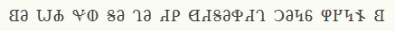
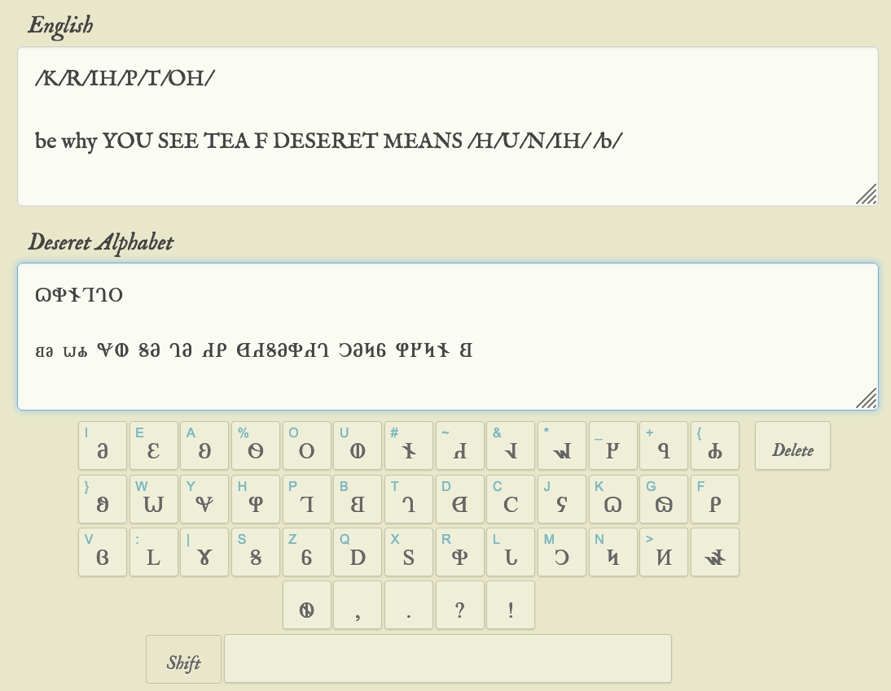
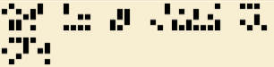
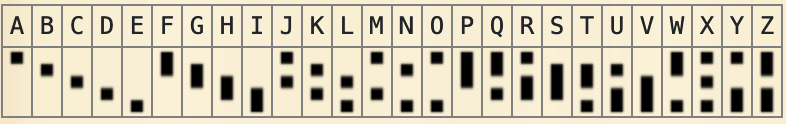
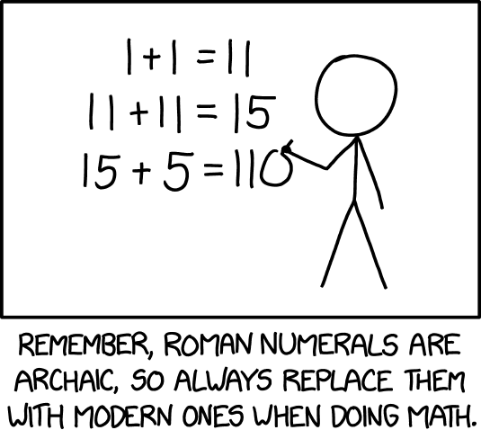
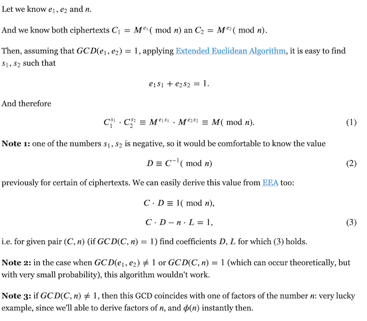
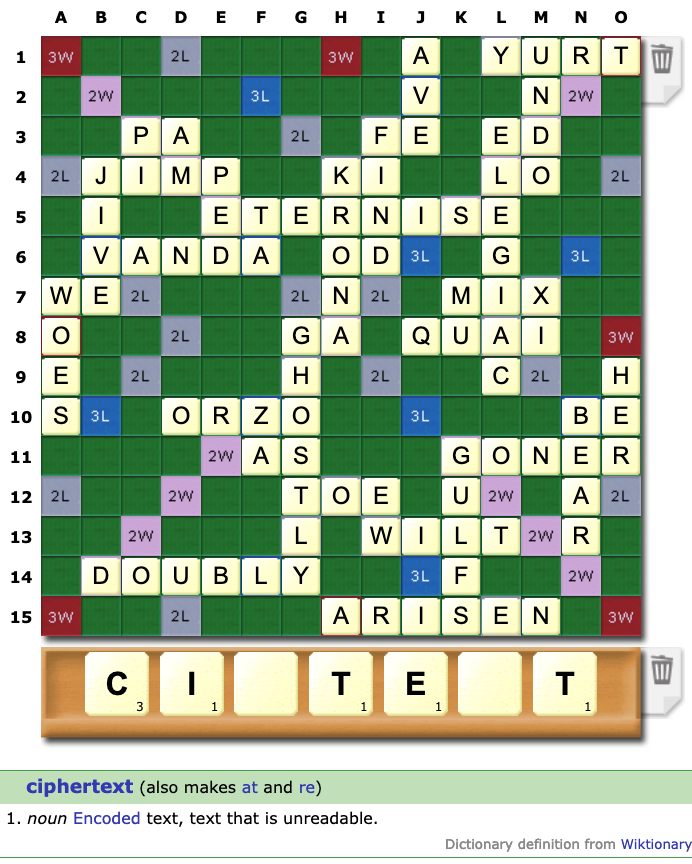

Solved a few challenges in the BYU CTF organized by the Brigham Young University's Cyberia academic team. 

<!--more-->

### 𐐗𐐡𐐆𐐑𐐓𐐄?

We are given a PNG file with some uncommon runes/symbols.  I checked the symbol cipher page at dcode.fr and could not spot the scheme used. 



Then I noticed that the title of the puzzle is in unicode characters. So, I searched for the first character in the challenge title and it led me to this site: https://graphemica.com/%F0%90%90%97  This page indicates that this is an character from the Deseret alphabet. So searching some more led me to this page, https://www.2deseret.com/ which offers a converter from English alphabet to Deseret and vice versa.

Entering the characters from the challenge title translates to the phonetic equivalent of CRYPTO `/K/R/IH/P/T/OH/`

The challenge text seems to translate to `BE WHY YOU SEE TEA F DESERET MEANS /H/U/N/IH /b/`



Phonetically, it seems to be saying `byuctf deseret means honey bee`. Inserting the braces, gives us the flag.

Flag: `byuctf{deseret_means_honey_bee}`

### Poem

We are given the following text in the challenge description. 

`epcndkohlxfgvenkzcllkoclivdckskvpkddcyoceipkvrcslkdhycbcscwcsc`

Dcode cipher identifier suggested the Keyboard Change Cipher as the top choice. Exploring it further, the combination of Alphabetical -> QWERTY seems to give a sensible sentence.

`thefragisbyuctfamessagesocrealacharrengetohackelsarinewelevele`

But, not exactly.  It seems that `r` and `l` have been switched. So, switching all `l` and `r` gives us the following sentence.

`theflagisbyuctfamessagesoclearachallengetohackersalinewerevere`

Adding a space after each word, gives us a proper sentence. 

`the flag is byuctf a message so clear a challenge to hackers a line we revere`

Flag: `byuctf{a message so clear a challenge to hackers a line we revere}`

### Compact



Using the symbol cipher list on dcode.fr, we are able to determine that this cipher is Dotsies Font.



A simple matter of transcribing the symbols, yeilds the flag.

Flag: `byuctf{well its definitely more compact}`

### XKCD 2637

The challenge title refers to this edition of the XKCD comics.



The notion is to represent a number in romal numerals, but replace the roman letters with the decimal equivalent. So, 123 represented in roman is CXXIII, and will be written as 1001010111  `or 100-10-10-1-1-1` in XKCD terms.

We are given a challenge server, that would serve 500 of these problems and if we answer them all correctly, we would get the flag.  

First, we formulate our approach:
1. We will be given a math statement in xkcd form (eg. `501010 + 101010`)
1. Turn this into a proper roman numeral representation ( `LXX + XXXV`)
1. Turn each roman numeral to decimal (`70 + 35`)
1. Evaluate this statement to get the answer (`105`)
1. Turn this answer in decimal to roman representation (`CV`)
1. Turn the roman representation to XKCD representation (`1005`)
1. Send this as the answer to the server. 

```
    501010 + 1010105 ==> LXX + XXXV ==>  70 + 35  ==> eval() ==> 105 ==> CV ==> 1005 (answer to be sent)
```

The solution for doing the calculation and sending the results to the challenge server is given below. 

```python
    '''
        # included some helper routines to do roman to decimal and decimal to roman conversions
        def roman_to_int(stringvalue)
        def int_to_roman(intvalue)
    '''
    def xkcd_to_roman(input):
        input = input.replace('1000', 'M')
        input = input.replace('500', 'D')
        input = input.replace('100', 'C')
        input = input.replace('50', 'L')
        input = input.replace('10', 'X')
        input = input.replace('5', 'V')
        input = input.replace('1', 'I')
        return input

    def roman_to_xkcd(input):
        input = input.replace('M', '1000')
        input = input.replace('D', '500')
        input = input.replace('C', '100')
        input = input.replace('L', '50')
        input = input.replace('X', '10')
        input = input.replace('V', '5')
        input = input.replace('I', '1')
        return input

    tries = 0
    while(tries<500):
        line = r.recvuntil(b'=')
        tries += 1
        #print(line)

        l = line.strip().split()
        S = ""
        S+= str(roman_to_int(xkcd_to_roman(l[0].decode())))
        S+= l[1].decode()
        S+= str(roman_to_int(xkcd_to_roman(l[2].decode())))
        
        A = roman_to_xkcd(int_to_roman(eval(S)))
        print(f"{tries}: {line} | {S} | {A}")
        r.sendline(A)

    r.interactive()
```
Flag: `byuctf{just_over_here_testing_your_programming_skills_:)}`

### Scooter Web
1. Get EXIF comments from 8 images. We get eight 196 character hex strings 
1. Take every combination of 7 hex strings and XOR them. 
1. One of the combinations will yield the flag.

```python
from Crypto.Util.strxor import strxor
from binascii import unhexlify

hex_strings = [
"0b6230db558118b1fe...f4255bb3a3307937c7707",
"8fd2604fe1f8fedda3...e0176a225c42693872736",
"a2dc9c847c41d04cef...c57510caa135f06130c43",
"d5b6b130f04a14ffab...3e637335e5ab3d88f0cc0",
"75bdfbbe1c2e465af4...43823dc35cf34ea437b4e",
"7dd7816c3b2a2d36ba...f6a4ce1738232fb31f6a1",
"b8dc32c994e2393ad3...04a61e486cd2520e1c6b0",
"54a8bbe6e3dc4d8718...1d268231ef1da05b760a3",
]

for i in range(8):
    result = b'\x00'* 96
    for j in range(8):
        if (i != j):
            hex_j = unhexlify(hex_strings[j])
            result = strxor(result, hex_j)
    print(f"{i} --> {result}")                  
```

### Ducky 1

The `Ducky` series of challenges are based on the [`USB Rubber Ducky`](https://shop.hak5.org/products/usb-rubber-ducky) product. This innocent-looking device emulates a keyboard when plugged into the victim's computer and injects keyboard strokes, which could execute commands as the victim. Very nasty. The malicious payload can be scripted using Ducky Script, which is compiled into op-codes. 

I used the [Duck toolkit on Github](https://github.com/kevthehermit/DuckToolkit) to solve stages 1 and 2. Stage 3 needed a custom solution. 

* https://usbrubberducky.com/
* https://ducktoolkit.com/decode

```
DuckToolkit-master % python3 ducktools.py -l us -d ../ducky1_inject.bin /dev/stdout
[+] Reading Duck Bin file
  [-] Decoding file
  [-] Writing ducky text to /dev/stdout
DELAY
byuctf{this_was_just_an_intro_alright??}
[+] Process Complete
```
### Ducky 2

For this challenge, while the text part of the string seems to decode easily, the symbols at the end are challenging. In the discord chat, the organizers mentioned that the flag is fully formed, i.e includes the braces. So, I bruteforced the decoding using all possible languages and searched only for the ones that provides us the flag in the correct format. 

Both SK and CZ keybord layouts seems to provide the flat in the right format. The first one I tried was accepted. 

```
    for i in `cat langs.txt` 
    for> do
    for> echo LANG=$i     
    for> python3 ducktools.py -l $i -d ../ducky2_inject.bin /dev/stdout | grep "byuctf{"
    for> done
    LANG=ch
    LANG=de
    LANG=fi
    LANG=mx
    LANG=sk
            byuctf{makesureyourkeyboardissetupright)@&%(#@)!(#*$)}
    LANG=us
    LANG=gb
    LANG=pt
    LANG=be
    LANG=it
    LANG=cz
            byuctf{makesureyourkeyboardissetupright'@&%(#@'!(#*$'}
    LANG=hr
    LANG=dk
    LANG=fr
    LANG=br
    LANG=ca
    LANG=si
    LANG=se
    LANG=es-la
    LANG=ca-fr
    LANG=no
    LANG=es
```
### Ducky 3

This challenge uses a custom mapping for characters/keyboard. Since we are given the payload:
```
    STRING abcdefghijklmnopqrstuvwxyz
    STRING ABCDEFGHIJKLMNOPQRSTUVWXYZ
    STRING 0123456789
    STRING !@#$%^&*()-_
    STRING                  <--- presume that this is the flag
```

We will use the first 74 op-codes to match them with these strings and use the rest to decode the final string. 

```python
chars = "abcdefghijklmnopqrstuvwxyzABCDEFGHIJKLMNOPQRSTUVWXYZ0123456789!@#$%^&*()-_"

with open('ducky3_inject.bin', 'rb') as F:
    duckbin = F.read()
    ducks = hexlify(duckbin)
    lookup = {}   # lookup table
    i = 0
    # build the lookup table: key = hex code; value = character
    for c in chars:
        lookup[ducks[i:i+4]]=c
        i+=4

    s = ""
    while(i<len(ducks)):
        try:
            print(f"{ducks[i:i+4]} --> {lookup[ducks[i:i+4]]}")
            s += lookup[ducks[i:i+4]]
        except Exception as e:
            print (e)   # print and ignore if a character appears in the flag, but not in the lookup table. This happens for { and }
            #continue
        i+=4    
    print(s)

    # byuctf{1_h0p3_y0u_enj0yed-thi5_very_muCH}
```

### RSA 1
This very basic example of RSA, has very small prime factors that N just becomes a 128-bit number. This can be easily factored from base principles or by consulting FactorDB. 

```python
    print(f"Bit length of N : {n.bit_length()}")

    f = FactorDB(n)
    f.connect()
    r = f.get_factor_list()

    if (len(r) != 2):
        print(f"{r} .. does not have exactly two factors")
        raise Exception("Factor count not 2")
    p,q = r

    print(p,q)

    phi = (p-1)*(q-1)

    d = inverse(e, phi)
    m = pow(c, d, n)
    print(long_to_bytes(m))

    # byuctf{too_smol}
```

### RSA 2
This case seems to be a case of normal RSA, but the modulus N can be factored by consulting FactorDB. The solution for `RSA 1` also works here. 

### RSA 3

In this case, it seems to be a case of a normal RSA, which is hard to break, but one of the prime factors of N is reused. We detect it by calculating the GCD of the two values of N.  This allows us to factor N easily.

```python

    # We are given, n1, e1=65537, c1    n2, e2=65537, c2

    from Crypto.Util.number import inverse, long_to_bytes, bytes_to_long
    from math import gcd


    # test for co-prime
    p = gcd(n1, n2) # p != 1, means we have found a factor of N

    if (p != 1):
        # n1 and n2 are not co-prime
        q1 = n1 // p

        phi = (p-1)*(q1-1)

        d = inverse(e1, phi)
        m = pow(c1, d, n1)
        print(long_to_bytes(m))

        # byuctf{coprime_means_factoring_N_becomes_much_easier}
```

### RSA 4
In this scenario, the exponent is a small number (3). The same text is encrypted three times with different prime factors and hence different modulus. 

In this case, if `m` is small compared to `n`, `c`, which is `pow(m, e, n)`, can just be `m ** e`. Thus, we can take `e`-th root of `c` to get back `m`. In this problem, only one ciphertext value is sufficient to recover the plaintext. Normally we need atleast `e` samples to recover the plaintext.

```python
    # We are given, n1, e1=3, c1    n2, e2=3, c2    n3, e3=3, c3

    # test for co-prime, if all are equal to 1, no factors are shared.
    print(f"{gcd(n1,n2)=}") 
    print(f"{gcd(n2,n3)=}") 
    print(f"{gcd(n3,n1)=}")

    e = 3

    m = find_invpow(c3,e)   # pick the cipher text corresponding to the largest n, find its cube-root (for e=3)
    print(long_to_bytes(m))

    m,result = gmpy2.iroot(c3, e)
    if (result):
        print(long_to_bytes(int(m)))
    else: 
        print(f"{e}-root not found")

    # byuctf{hastad_broadcast_attack_is_why_e_needs_to_be_very_large}
```

### RSA 5

In this scenario, we have the modulus reused twice to encode the same ciphertext, with different exponents. Since we have `gcd(e1, e2) = 1` we are able to use the common modulus attack described in the [stackoverflow article](https://math.stackexchange.com/questions/2730675/decrypt-an-rsa-message-when-its-encrypted-by-same-modulus) as shown below. 



The steps are: 
1. `gcd(e1, e2) MUST be 1`
1. Also, `gcd(c1, n) MOST likely will be 1`. If not, use the GCD as one of the factors and factor N.
1. Calculate euclidean extended gcd of e1 and e2, `u` and `v`
1. This implies that `e1*u + e2*v MUST be 1`
1. Calculcate `(pow(c1,u) * pow(c2,v)) % n`.  This will be the numeric value of the plaintext.


```python

    # We are given, n   e1=65537,c1   e2=65521,c2 

    from Crypto.Util.number import inverse, long_to_bytes, bytes_to_long
    from math import gcd

    def egcd(a, b):
        if a == 0:
            return (0, 1, b)
        else:
            y, x, g = egcd(b % a, a)
            return (x - (b // a) * y, y, g)

    print(f"{gcd(e1,e2)=}") # must be co-prime
    u, v, g = egcd(e1, e2)
    # check
    assert u*e1 + v*e2 == 1   # definition of EGCD

    print(f"{gcd(c1,n)=}")
    print(f"{gcd(c2,n)=}")

    m = (pow(c1, u, n) * pow(c2, v, n)) % n
    print(long_to_bytes(m))

    # byuctf{NEVER_USE_SAME_MODULUS_WITH_DIFFERENT_e_VALUES}
```

## After the CTF
Some of the challenges that I had attempted, but did not solve.

### Q10
We are given an image file that looks like a scrabble board. The title Q10 also confirms that this is related to the game Scrabble. While I went down the path of trying to determine a pattern with the tiles that were already placed on the board, the solution was in the tiles that were __not__ placed on the board. There are exactly seven tiles left to be placed and the best possible word that can be made is `CIpHERTExT` (The lower case letters are blank tiles, which act as wild cards). The flag then is determined as `byuctf{ciphertext}`



* https://www.scrabulizer.com/


## Writeups & Resources
* Official writeups/challenges : https://github.com/BYU-CSA/BYUCTF-2023/
* https://github.com/BYU-CSA/ctf-training
* https://www.bleepingcomputer.com/news/security/an-encrypted-zip-file-can-have-two-correct-passwords-heres-why/
* Reverse engineering CRC : https://www.csse.canterbury.ac.nz/greg.ewing/essays/CRC-Reverse-Engineering.html


## Challenges

|Category|Challenge|Description
|----|----|----
|Crypto|Compact| * Dotsies font
|Crypto|Poem| * Keyboard change 
|Crypto|RSA1| small n, factorizable
|Crypto|RSA2| large n, in factorDB
|Crypto|RSA3| same plain text, same e, different N; non-co-prime N
|Crypto|RSA4| small e, same plaintext, large N;
|Crypto|RSA5| same N, same plaintext, similar e; common modulus
|Crypto|𐐗𐐡𐐆𐐑𐐓𐐄?| *  Deseret alphabet
|Forensics|Bing Chilling|
|Forensics|CRConfusion|many samples with different CRC polynomials
|Forensics|Paleontology|
|Forensics|Q10|Scrabble based, use unused tiles
|Forensics|ScooterWeb|* EXIF + XOR
|Forensics|What does the cougar say?| Video frame + spectogram
|Forensics|kcpassword|
|Jail|Builtins 1|
|Jail|Builtins 2|
|Jail|Leet 1|
|Jail|Leet 2|
|Jail|a-z0-9|
|Jail|abcdefghijklm|
|Jail|nopqrstuvwxyz|
|Misc|006 I|
|Misc|006 II|
|Misc|006 III|
|Misc|Collision|
|Misc|Hexadecalingo|
|Misc|Lost|
|Misc|National Park|
|Misc|PBKDF2|
|Misc|Sanity Check|
|Misc|Sluethr|
|Misc|Survey|
|Misc|xkcd 2637|*
|OSINT|Criterion|
|OSINT|It All Ads Up|
|OSINT|It All Ads Up 2|
|OSINT|Legoclones 1|
|OSINT|Legoclones 2|
|OSINT|Legoclones 3|
|OSINT|Legoclones 4|
|OSINT|Legoclones 5|
|Pentesting|MI6configuration 1| nmap + anonymous ftp
|Pentesting|MI6configuration 3| ssh + sudo
|Pentesting|MI6configuration 4| reverse shell + priv/esc
|Pentesting|VMception|
|Pwn|2038|
|Pwn|ScooterAdmin1|
|Pwn|ScooterAdmin2|
|Pwn|ScooterAdmin3|
|Pwn|Shellcode|
|Pwn|VFS 1|
|Pwn|frorg|
|Rev|Chain|
|Rev|Chicken Again|
|Rev|Ducky1|*
|Rev|Ducky2|*
|Rev|Ducky3|*
|Rev|Go|
|Rev|RevEng|
|Rev|Sassie|
|Rev|bad2|
|Rev|obfuscJStor|
|Web|HUUP|
|Web|Notes|
|Web|urmombotnetdotnet.com 1|
|Web|urmombotnetdotnet.com 2|
|Web|urmombotnetdotnet.com 3|
|Web|urmombotnetdotnet.com 4|
|Web|urmombotnetdotnet.com 5|