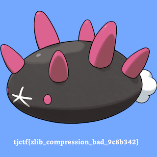

This was a nice CTF organized by Thomas Jefferson Highschool. It was a nice mix of challenges. I was able to attempt only a few challenges. 

<!--more-->

### div3rev

This challenge in the rev category has a python program that uses reads the content of `flag.txt` and processes it through a recursive function. This function seems to recursively divide the input bytearray into three parts and calls `op1()`, `op2()` and `op3()` on those parts respectively.

My initial thought process was to use Z3 symbolic variables and solve for the input bytes that would yield the final result. However, while implementing that solution, I noticed that we can just as easily brute-force this solution. We know the following:
1. The flag is 27 characters long
2. The flag starts with `tjctf{` and contains printable characters. 

So, the approach is a simple brute-force logic, with progressively building the flag character-by-character, passing it to the original challenge function. By comparing the output to the expected solution, we can determine the correct character that comes next. The full solution is as shown below.

```python
    ans = b'\x8c\x86\xb1\x90\x86\xc9=\xbe\x9b\x80\x87\xca\x86\x8dKJ\xc4e?\xbc\xdbC\xbe!Y \xaf'

    flag= "tjctf{"
    pos = len(flag)
    match = 0
    while(len(flag)<27):
        b = bytearray()
        b.extend(map(ord,flag))     # start with the known flag fragment
        b.extend(b' '*(27-pos))     # fill the rest with blank spaces
        for i in range(32,127):
            b[pos] = i              # brute-force the last character
            val = recur(b)          # recursion function from the challenge
            new_match = next(  (k for k, (e1, e2) in enumerate(zip(val, ans)) if e1 != e2), None)
            #print(f"{i=} {val=} {new_match=}")
            print(f"{flag}{chr(i)}", end='\r')
            if (new_match is None):  # the strings match entirely
                flag += chr(i)
                pos = len(flag)
                print(flag)
                break        
            if (new_match > match): # matched segment is longer
                if (match > 0):
                    flag += chr(i)
                    pos = len(flag)
                    print(flag, end='\r')
                match = new_match
```

### squishy

The challenge server supports two functions: 

1. _new_  : which registers a new user and returns the signature, which is the RSA private key \\(m^{d}\\pmod N\\)
1. _login_: which allows a user to login using the signature. 

The user `admin` is pre-registered - so we would not be able to register it and get the signature. If we are able to login as `admin` we would get the flag. So, the challenge boils down to getting the private signature for the user `admin`.

Since the challenge server allows unlimited calls to `new` function, and we can pass in any value as the user name, we can use this control of the plaintext to determine the private key of the user `admin`. 

The approach is as follows: 
1. Let \\(m\\) be the user name `admin`.  We need to determine \\(m^{d} \\pmod N\\)  
1. `N` and `e` are known
1. Take any random message, \\(m_1\\) and get its signature \\(s_1\\).  I chose \\(m_1 = 2\\)
1. Determine \\(m_2\\) as the second message, where \\(m_2 = (m * m_1^{-1})\\)
1. Get the signature \\(s_2 =  m_2^{d}  \\pmod N  = ({m * m_1^{-1}})^{d} \\pmod N \\) for the message \\(m_2\\)
1. Calculate \\(s = s_1 * s_2 = m_1^{d} * m^d * m_1^{-d} \\pmod N = m^{d} \\pmod N \\)
1. Hence `s` is the private signature of the user `admin`. Login using this signature for user `admin` and get the flag.

The inspiration for the solution came from this [stackexchange article](https://crypto.stackexchange.com/questions/35644/chosen-message-attack-rsa-signature)


The solution is as follows: 
```python
    def getSignature(r, name):
        r.recvuntil(b'Cmd: ')
        r.sendline(b'new')
        r.recvuntil(b'Name: ')
        r.sendline(name)
        #accommodate spaces within the name bytearray
        tokens = r.recvline().strip().split(b' ')
        #signature is the last token as a numeric string
        signature = int(tokens[-1])
        return signature

    def loginUser(r, name, sig):
        r.recvuntil(b'Cmd: ')
        r.sendline(b'login')
        r.recvuntil(b'Name: ')
        r.sendline(name)
        r.recvuntil(b'Sign: ')
        r.sendline(str(sig).encode())

    # r = process(['python3', 'squishy-rsa.py'])
    r = remote('tjc.tf',31358)

    N = int(r.recvline().strip().decode())
    e = 65537

    p_orig = b'admin'
    p_orig_long = bytes_to_long(p_orig)

    p_attack1 = 2
    s_attack1 = getSignature(r, long_to_bytes(p_attack1))

    p_attack2 = (p_orig_long * pow(p_attack1, -1, N)) % N
    s_attack2 = getSignature(r, long_to_bytes(p_attack2))

    s_admin = (s_attack1 * s_attack2) % N

    loginUser(r, p_orig, s_admin)
    r.interactive()
```
Alternate solution: Since `long_to_bytes(b'admin') == long_to_bytes(b'\x00admin')` register a user called `\x00admin` and get the signature to use with `admin` [from Alol on discord]

### baby-rsa

When `e` is small as it is in this case, if the message is not long enough or appropriately padded, the cipher becomes smaller than N, allowing us to take the cuberoot of `c` to obtain the original message.

```python
    e = 3
    m,result = gmpy2.iroot(c, e)
    if (result):
        print(long_to_bytes(int(m)))
```

### iheartrsa

We are given the source of the program running on the challenge server. The important bits of the program are:

```python
    with open('flag.txt') as f:
        flag = f.readline()

    raw_bin = str(
        bin(int('0x'+str(hashlib.sha256(flag.encode('utf-8')).hexdigest()), 16))[2:])
    hsh = int('0b1' + '0' * (256 - len(raw_bin)) + raw_bin, 2)      # padded to 256 bits
```
The flag is read from a file, encoded into bytes, converted to a hashdigest, further turned to binary and padded to 256 bits. The msb of the hash is set to be `1`.  This is used as message \\(hsh\\) for RSA and can be at most 256bits.

```python
    p = number.getPrime(1024)
    q = number.getPrime(1024)
    n = p * q       #2048 bits
    e = 0

    for i in range(0, 100):
        if pow(hsh, i) >= n:
            e = i
            break
    m = pow(hsh, e, n)  #hsh is 256 bits, hence e = 8  
```
The message \\(hsh\\) is used as the plaintext for textbook RSA, with the smallest choice of \\(e\\) that will cause \\((hsh)^{e} \\ge \\;n\\). Since `n` is 2048 bits and `hsh` is 256 bits, `e` is most likely equal to `8`.

```python
print(f'm: {m}')
print(f'n: {n}')

try:
    answer = input_with_timeout('', 20)
    try:
        answer = ast.literal_eval(answer)   # <----- pass a literal value. AST is not relevant. 
        if hsh == answer:                   # <----- win condition
            print('you love rsa so i <3 you :DD')
            print(flag)
        else:
            print("im upset")
    except Exception as e:
        print("im very upset")
except Exception as e:
    print("\nyou've let me down :(")
```
We are given the ciphertext `m` and modulus `n`. Our task is to determine the original hash, which is used as the plaintext for RSA. 

Note that the plaintext, which is the hash of the flag, is always the same. Hence successive connections to the challenge server will give us the same message \\(hsh\\) encrypted with different values of `n`, with different prime factors.  Also, since `e = 8` and is quite small, this allows us to use `Håstad's broadcast attack`.

Our approach is: 
1. Connect to the server at most 8 times (as `e = 8`) and collect the pairs of `m` and `n`
1. Use chinese remainder theorem on the lists of \\(M=[m_1, m_2, m_3 ... m_8]\\; and \\; N=[n_1, n_2, n_3 ... n_8]\\), and take the 8th-root to determine the value of `hsh`. 
1. Pass this value of the `hsh` to the challenge server to get the flag.

```python
    def crt(a, n):
        sum = 0
        prod = reduce(lambda a,b: a*b, n)

        for n_i, a_i in zip(n, a):
            p = prod // n_i
            sum += a_i * gmpy2.invert(p, n_i) * p
        return sum % prod

    def getConn():
        # p = remote('tjc.tf', 31628)
        p = process(["python3", "iheartrsa.py"])
        
    M = []  # collection of ciphers
    N = []  # collection of modulii

    def get_mn():
        r = getConn()
        mi = int(r.recvline().split(b':')[1].strip())   # "m: <nnn...nn>"
        ni = int(r.recvline().split(b':')[1].strip())   # "n: <nnn...nn>"
        M.append(mi)
        N.append(ni)
        r.close()
        return

    for i in range(8):
        get_mn()

    calc_crt = crt(M, N)
    calc_hash, result = gmpy2.iroot(calc_crt, 8)
    if (result):
        print(f"[^] sending {calc_hash}")
        r = getConn()
        r.recvline()
        r.recvline()
        r.sendline(str(calc_hash).encode())
        r.interactive()
    else:
        print(f"8th-root not found")
```
Executing the script against the challenge server, gives us the original hash value and also gets us the flag. 

```
    ...
    [^] sending 146913410772757766194482407144214295333114411765260602423197339861209058274813
    [+] Opening connection to tjc.tf on port 31628: Done
    [*] Switching to interactive mode
    you love rsa so i <3 you :DD
    tjctf{iloversaasmuchasilovemymom0xae701ebb}
```

**Alternate solution**:  This solution uses only a single set of values for \\((m,n)\\). It tries to find the smallest value of \\(k\\) that gives a rational value for \\(\sqrt[8]{m+n\\cdotp k}\\)
```python
e=8
[f"k: {k}, c: {c}" for k in range(1, 50) if (c:=(m+(n*k))**(1/e)) < 2^257 and isinstance(c, sage.rings.rational.Rational) ]
```

## After the CTF
### Miniscule
`my friend did something really weird to my picture! she swears that it's the same image, but it's half the size and won't open! can you figure out why it's broken?`

Use `pngcheck` or `pngchunks` to examine the structure of the PNG. 
```
root@stego# pngchunks miniscule.png 
Chunk: Data Length 13 (max 2147483647), Type 1380206665 [IHDR]
  Critical, public, PNG 1.2 compliant, unsafe to copy
  IHDR Width: 800
  IHDR Height: 800
  IHDR Bitdepth: 8          <Each color is 8 bits>
  IHDR Colortype: 2         <Each pixel is an R,G,B triple>
  IHDR Compression: 1
  IHDR Filter: 0
  IHDR Interlace: 0
  IHDR Compression algorithm is unknown     <Invalid compression>
  IHDR Filter method is type zero (None, Sub, Up, Average, Paeth)
  IHDR Interlacing is disabled
  Chunk CRC: 1439759112
Chunk: Data Length 217116 (max 2147483647), Type 1413563465 [IDAT]
  Critical, public, PNG 1.2 compliant, unsafe to copy
  IDAT contains image data
  Chunk CRC: 1757766459
Chunk: Data Length 0 (max 2147483647), Type 1145980233 [IEND]
  Critical, public, PNG 1.2 compliant, unsafe to copy
  IEND contains no data
  Chunk CRC: -1371381630
```
A few things of note.
1. The image size is 800x800. 8 bits per color and it is an RGB image (3 bytes per pixel)
1. The compression algorithm is unknown and invalid. The PNG specs only support the compression algorithm of `Deflate` with a value of `0`. Here we have a compression algo with a value `1`. 
1. This fact, along with the challenge description, points us to look closer at the compressed image data
1. Furthermore, the IDAT chunk shows that the first few bytes after the "IDAT" header declaration is `0x28B52FFD`. This is the little endian version of the magic bytes for the `zstd` compression algorithm that was developed by Facebook. 
1. Since PNG supports only Zlib compression, whose magic bytes start with 0x78, we can conclude that we have image data that is compressed with Zstd compression. 
```
IDAT header
-----------

00000024: 1c49 4441 5428 b52f fda0 204f 1d00 cc03  .IDAT(./.. O....
                      ^^ ^^^^ ^^

Possible Magic Bytes for Zlib (standard for PNG)
------------------------------------------------
 CMF |  FLG
0x78 | 0x01 - No Compression/low
0x78 | 0x9C - Default Compression
0x78 | 0xDA - Best Compression 
```

From the [specs of Zstandard](https://github.com/facebook/zstd/blob/dev/doc/zstd_compression_format.md),

**Magic_Number**

4 Bytes, **little-endian format. Value : 0xFD2FB528** Note: This value was selected to be less probable to find at the beginning of some random file. It avoids trivial patterns (0x00, 0xFF, repeated bytes, increasing bytes, etc.), contains byte values outside of ASCII range, and doesn't map into UTF8 space. It reduces the chances that a text file represent this value by accident.


So, considering these facts, we can extract the compressed image data, decompress it using Zstandard, reconstruct the image in memory (so that the CRC checksums are properly recalculated), and display the image. The complete program to fix and display the image using `matplotlib` is as below. 

```python
    import binascii
    import struct
    import zstandard
    from PIL import Image
    import matplotlib.pyplot as plt

    with open("miniscule.png", "rb") as image:
        imagedata = image.read()
        print(f"Read {len(imagedata)} bytes from the file")
        idat_offset = 8+4+4+13+4        #PNG HDR+LEN+"IHDR"+IHDR data+CHKSUM
        index = idat_offset
        idat_len =  struct.unpack(">I",imagedata[index:index+4])[0]
        print(idat_len)
        index+=4
        print("Chunk type: ", imagedata[index:index+4]) #sanity check: IDAT
        index+=4
        print("Compression magic bytes:", binascii.hexlify(imagedata[index:index+4])) #0xFD2FB528 (little endian)
        compressed_data = imagedata[index:index+idat_len]   #zstd-compressed image data

        zstd = zstandard.ZstdDecompressor()
        img_raw = zstd.decompress(compressed_data)
        img_unfilt = bytearray()
        offset = 0
        for h in range(800):
            img_unfilt+=img_raw[offset+1:offset+1+(800*3)]  #Every scanline is prefixed with one filter byte. Extract and ignore it. 
            offset += (800*3)+1

        flag = Image.frombytes('RGB', (800,800), bytes(img_unfilt)) #Rebuild the image from bytes
        plt.imshow(flag)
        plt.show()      #Matplotlib shows the image
```
The resulting image contains the flag.




## Resources
* https://github.com/ret2school/ctf/tree/master/2023/tjctf/pwn
* https://pyokagan.name/blog/2019-10-14-png/ 
* https://crypto.stackexchange.com/questions/8902/given-a-message-and-signature-find-a-public-key-that-makes-the-signature-valid
* https://github.com/TJCSec/tjctf-2023-challenges


## Challenges
|Category|Challenge|Description
|----|----|----
|crypto|aluminum-isopropoxide|
|crypto|baby-rsa| small-e. take cuberoot
|crypto|drm-1|
|crypto|e|
|crypto|ezdlp|
|crypto|iheartrsa| small-e, same m, different N
|crypto|keysmith|
|crypto|merky-hell|
|crypto|squishy| RSA oracle, control on plaintext
|forensics|beep-boop-robot| Morse code
|forensics|miniscule|IDAT contains Zstd instead of Zlib. Extract, reconstruct & display 
|forensics|neofeudalism|`zsteg --all`
|forensics|nothing-to-see|`binwalk -eM` and `strings`
|misc|gish|
|pwn|flip-out|
|pwn|formatter|
|pwn|groppling-hook|
|pwn|painter|
|pwn|shelly|
|pwn|teenage-game|
|rev|div3rev|bruteforce or Z3
|rev|dream|
|rev|drm-2|
|rev|ily-df|
|rev|maybe|
|rev|save-trees|
|rev|scramble|
|rev|wtmoo|
|web|back-to-the-past|
|web|complainer|
|web|ez-sql|
|web|hi|
|web|notes|
|web|outdated|
|web|pay-to-win|
|web|swill-squill|
|web|yolo|