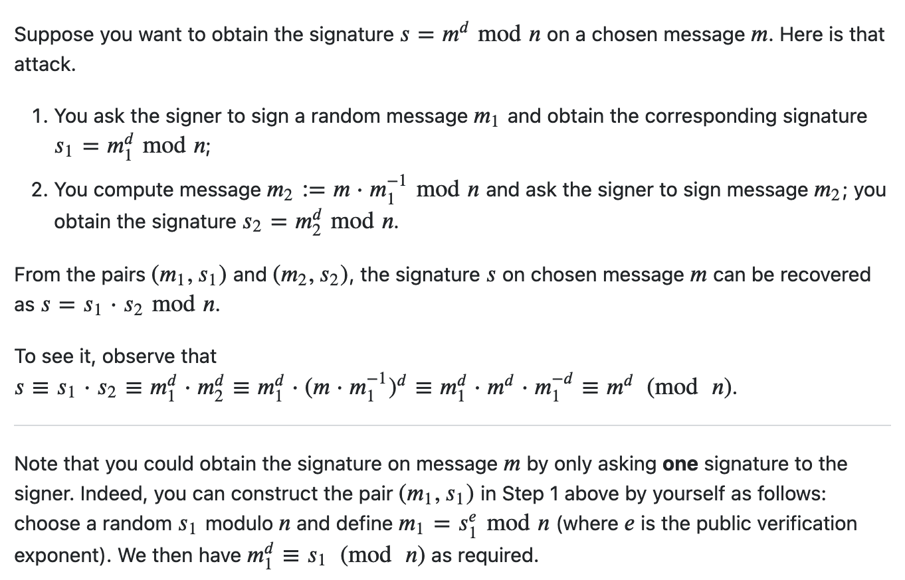

This was a nice CTF organized by Thomas Jefferson Highschool. It was a nice mix of challenges. I was able to attempt only a few challenges. 

<!--more-->

### div3rev

This challenge in the rev category has a python program that uses reads the content of `flag.txt` and processes it through a recursive function. This function seems to recursively divide the input bytearray into three parts and calls `op1()`, `op2()` and `op3()` on those parts respectively.

My initial thought process was to use Z3 symbolic variables and solve for the input bytes that would yield the final result. However, while implementing that solution, I noticed that we can just as easily brute-force this solution. We know the following:
1. The flag is 27 characters long
2. The flag starts with `tjctf{` and contains printable characters. 

So, the approch is a simple brute-force logic, with progressively building the flag character-by-character, passing it to the original challenge function. By comparing the output to the expected solution, we can determine the correct character that comes next. The full solution is as shown below.

```python
    ans = b'\x8c\x86\xb1\x90\x86\xc9=\xbe\x9b\x80\x87\xca\x86\x8dKJ\xc4e?\xbc\xdbC\xbe!Y \xaf'

    flag= "tjctf{"
    pos = len(flag)
    match = 0
    while(len(flag)<27):
        b = bytearray()
        b.extend(map(ord,flag))     # start with the known flag fragment
        b.extend(b' '*(27-pos))     # fill the rest with blank spaces
        for i in range(32,127):
            b[pos] = i              # brute-force the last character
            val = recur(b)          # recursion function from the challenge
            new_match = next(  (k for k, (e1, e2) in enumerate(zip(val, ans)) if e1 != e2), None)
            #print(f"{i=} {val=} {new_match=}")
            print(f"{flag}{chr(i)}", end='\r')
            if (new_match is None):  # the strings match entirely
                flag += chr(i)
                pos = len(flag)
                print(flag)
                break        
            if (new_match > match): # matched segment is longer
                if (match > 0):
                    flag += chr(i)
                    pos = len(flag)
                    print(flag, end='\r')
                match = new_match
```

### squishy

The challenge server supports two functions: 

1. _new_  : which registers a new user and returns the signature, which is the RSA private key (m^d mod N)
1. _login_: which allows a user to login using the signature. 

The user `admin` is pre-registered - so we would not be able to register it and get the signature. If we are able to login as `admin` we would get the flag. So, the challenge boils down to getting the private signature for the user `admin`.

Since the challenge server allows unlimited calls to `new` function, and we can pass in any value as the user name, we can use this control of the plaintext to determine the private key of the user `admin`. 

The approach is as follows: 
1. Let m be the user name `admin`.  We need to determine $$ m^{d}  mod N $$
1. N and e are known
1. Take any random message, $$m_1$$ and get its signature $$s_1$$.  I chose $$m_1 = 2$$
1. Determine $$m_2$$ as the second message, where $$ m_2 = (m * m_1^{-1}) $$
1. Get the signature $$s_2 =  m_2^{d}  mod N  = ({m * m_1^{-1}})^{d} mod N $$ for the message $$m_2$$
1. Calculate $$s = s_1 * s_2 = m_1^{d} * m^d * m_1^{-d} mod N = m^{d} mod N $$
1. Hence `s` is the private signature of the user `admin`. Login using this signature for user `admin` and get the flag.

The inspiration for the solution came from this [stackexchange article](https://crypto.stackexchange.com/questions/35644/chosen-message-attack-rsa-signature)



The solution is as follows: 
```python
    def getSignature(r, name):
        r.recvuntil(b'Cmd: ')
        r.sendline(b'new')
        r.recvuntil(b'Name: ')
        r.sendline(name)
        #accommodate spaces within the name bytearray
        tokens = r.recvline().strip().split(b' ')
        #signature is the last token as a numeric string
        signature = int(tokens[-1])
        return signature

    def loginUser(r, name, sig):
        r.recvuntil(b'Cmd: ')
        r.sendline(b'login')
        r.recvuntil(b'Name: ')
        r.sendline(name)
        r.recvuntil(b'Sign: ')
        r.sendline(str(sig).encode())

    # r = process(['python3', 'squishy-rsa.py'])
    r = remote('tjc.tf',31358)

    N = int(r.recvline().strip().decode())
    e = 65537

    p_orig = b'admin'
    p_orig_long = bytes_to_long(p_orig)

    p_attack1 = 2
    s_attack1 = getSignature(r, long_to_bytes(p_attack1))

    p_attack2 = (p_orig_long * pow(p_attack1, -1, N)) % N
    s_attack2 = getSignature(r, long_to_bytes(p_attack2))

    s_admin = (s_attack1 * s_attack2) % N

    loginUser(r, p_orig, s_admin)
    r.interactive()
```
