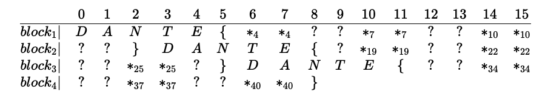

A very high quality Dante-themed CTF by the team Born2Scan. A very nice array of challenges, including some signals/radio ones. 
<!--more-->
### Challenges

#### Route Marks the Spot
`Aha, the little spirit says that the human became more ingenious! What a weird way to transmit something, though.`

We are given a PCAP file that contains captured network traffic.  As a first step in the analysis, we look at the protocol statistics:

```bash
$ tshark -r RoutesMarkTheSpot.pcapng -z io,phs
===================================================================
Protocol Hierarchy Statistics
Filter: 
eth                                      frames:5975 bytes:7861529
  ip                                     frames:5937 bytes:7852745
    tcp                                  frames:4943 bytes:7121215
      tls                                frames:1307 bytes:3687484
        tcp.segments                     frames:635 bytes:3135839
          tls                            frames:588 bytes:3017541
      http                               frames:33 bytes:21576
        ocsp                             frames:24 bytes:16675
        tcp.segments                     frames:2 bytes:3044
    udp                                  frames:994 bytes:731530
      dns                                frames:136 bytes:17775
      data                               frames:58 bytes:18063
      quic                               frames:800 bytes:695692
        quic                             frames:19 bytes:17994
          quic                           frames:4 bytes:5596
  ipv6                                   frames:34 bytes:8580
    data                                 frames:34 bytes:8580
  arp                                    frames:4 bytes:204
===================================================================
```
As with typical CTF challenges, TLS is usually out of scope. Hence, here we eliminate the 588 TLS frames and the 800 QUIC frames. This leaves the HTTP, IPv6 and the ARP traffic to examine. Cursory examination shows us that the HTTP traffic is not relevant to the challenge and there is nothing out of ordinary with the ARP packets. 

So, we examine one of the packets of the IPv6 traffic.  There are two fields that look interesting. The `ipv6.flow` field has a value that seems to be different in each packet. The `data` field seems to contain text data - which seems to indicate some kind of an encoding scheme (like base64).

```xml
    <field name="ipv6.flow" showname=".... 0000 0000 0000 0001 1110 = Flow Label: 0x0001e" size="3" pos="15" show="0x00001e" value="1E" unmaskedvalue="00001e"/>
    ...
    <field name="data" value="3479434b36463078457333766b30535259413374307354514b4a61467471426c3350334974466475664a746e4b4f496748785942574951474a6464474f3238474b4274596f774d6e74326935393532716e4b56597074583a6e3a777349645a566e3546325565645a4171776a5377694a44474668616d6a4d444d576b35747a4f4361664779327353655647646779317571746c484d51524c346c52417967716b616f39714959354c725135624863787144377a57394a31356f416f4f39616d4c6e54746e6d306c745135544a5a3662673754345674393430">
```

We will extract these two fields and store them in a file for further processing. 
```bash
    $ tshark -r RoutesMarkTheSpot.pcapng -T fields -e ipv6.flow -e data -Y ipv6  > ipv6.txt

    0x00001e	3479434b36463078457333766b30535259413374307354514b4  ...
    0x00001a	71376b53496774614f304169623467424e6b4754464e6b795a4  ...
    0x000018	6955447832495a413546365763626c6d35477333367247785a3  ...
    0x000000	6e69456d6f444f71396f524176706935665934556e644e316f6  ...
    0x00001b	7759534a4357306f644c4a65753074396255355373445765384  ...
    0x00001d	467362544b326d4b384a5274554c766344644e5256615030436  ...
    0x000021	4774336e324d44674165703957735a436e32473162744d69594  ...
    0x00000f	5879536c77626d4c736a46767a456872784d37395a4a636d397  ...
    0x000009	7a506345654b65775645586d6f6f41685859597765536979384  ...
    0x000005	71654e504e63387a617042544534344a7368595a4d7938356c5  ...
    0x00000c	67484b374a617937336c4465634a377855536c6673524352653  ...
    0x000011	753875547732454442577947597766656655667a46784e5a653  ...
    0x000006	7472784837684979656d6c7145785565443266684c395634427  ...
    0x000016	3066305a334555676569326d7836454a367a694245533270724  ...
    0x000008	656c67485769486357764165354849336e52383677305342744  ...
    0x00000e	546b644e596b72664b47613938536c51314d666c72527a5a556  ...
    0x000015	5834784b4e57396232794b32774b486f6a674c7375786637734  ...
    0x00000d	6d434878634748704542626f78587a7649726243724d55536f7  ...
    0x000004	3474316e77734a415431586a76324b424a34555479336f61644  ...
    0x000019	31657853396d75585a4964757355336941413278486f3358674  ...
    0x000020	6149517134637532534c306461466d7171367a77637776374c7  ...
    0x000001	36375a764d456f6c54744b6d54534f5a6c64737854477149366  ...
    0x00001f	72366f574365593772634d6467337a307771726f584248674c6  ...
    0x00000b	42544c3771456b4b614759347a674b765a7a6562764862776d4  ...
    0x000007	6348784833346f7650723150555a583874633773554e4455474  ...
    0x000013	316542306e4f79774f753841787666436f4d42756d333073517  ...
    0x000012	51567873316f63417a564e36574c693970724d56583364356e6  ...
    0x000017	6e62516c78466a3935596d34736b4c595a7179457a306c6c4d7  ...
    0x00000a	456c55666e5a6f54774f7a5864496e524f3670794e4d6849473  ...
    0x000002	4a52784159656958704a4a6b4c5365556261764773634e7a426  ...
    0x000010	56565079517659646239595870525679505574434a446338677  ...
    0x00001c	4c4e76546a79593772587a41646f48456770384f734173384c3  ...
    0x000014	6771586b7974464d4b525950733454617346534e4c587073564  ...
    0x000003	3868736b3334344a4e6f39527a596e545a554c336e733743563  ...
```

Converting the first data packet to text and trying to decode it using Base64, gives us an error due to the presence of colons(`:`) in the string, which is illegal for a base64 encoded string. This points us towards a single letter that is held between two colons in the unhexlified string. 
```
                                                                                  -----vvv-----
4yCK6F0xEs3vk0SRYA3t0sTQKJaFtqBl3P3ItFdufJtnKOIgHxYBWIQGJddGO28GKBtYowMnt2i5952qnKVYptX:n:wsIdZVn5F2UedZAqwjSwiJDGFhamjMDMWk5tzOCafGy2sSeVGdgy1uqtlHMQRL4lRAygqkao9qIY5LrQ5bHcxqD7zW9J15oAoO9amLnTtnm0ltQ5TJZ6bg7T4Vt940
```

```python
    flag = {}
    with open("ipv6.txt", 'r') as F:
        for l in F.readlines():
            f,d = l.strip().split('\t')
            b = binascii.unhexlify(d).split(b':')
            f = int(f[2:],16)
            flag[f] = b[1].decode()        
            print(f"{f:3d} {b[1].decode()}")

    print(''.join([flag[x] for x in sorted(flag.keys())]))

    # DANTE{l4b3l5_c4n_m34n_m4ny_7h1ngs}
```

#### Almost Perfect Remote Signing
` I c4n't re?d you Are_you a beacon fAom 1200 0r smthing?`

We are given a WAV file. Loading the file into Audacity and examing both the waveform and spectrogram does not reveal any information, except that the sound starts and ends abruptly, which seems to indicate some kind of a digital data encoding.

Searching for the abbreviation of the challenge title, APRS, leads us to this [page on SignalsWiki](https://www.sigidwiki.com/wiki/Automatic_Packet_Reporting_System_(APRS)). Automatic Packet Reporting System is a packet system for real time data communications. Used by hams for location reporting, weather stations etc. APRS is transported over the AX.25 protocol using 1200 bit/s Bell 202 AFSK on frequencies located within the 2 meter amateur band. 

Further research led me to a tool called [DireWolf](https://github.com/wb2osz/direwolf) on GitHub, which has a set of utilities to deal with AX.25.  I used a tool in the toolkit called `atest` to extract data from the wave file, which looks like this: 
```
    DECODED[1] 0:02.175 N0CALL audio level = 63(33/33)     
    [0] N0CALL>APN001:!4346.02N\01115.45EgHello flag! Pkt 0002/1080
    ------
    U frame UI: p/f=0, No layer 3 protocol implemented., length = 61
    dest    APN001  0 c/r=1 res=3 last=0
    source  N0CALL  0 c/r=1 res=3 last=1
    000:  82 a0 9c 60 60 62 e0 9c 60 86 82 98 98 e1 03 f0  ...``b..`.......
    010:  21 34 33 34 36 2e 30 32 4e 5c 30 31 31 31 35 2e  !4346.02N\01115.
    020:  34 35 45 67 48 65 6c 6c 6f 20 66 6c 61 67 21 20  45EgHello flag! 
    030:  50 6b 74 20 30 30 30 32 2f 31 30 38 30           Pkt 0002/1080
```
As depicted, there are 1080 packets of data - each containing a GPS coordinate, an icon `g` and the label `Hello flag!`. Given that the label and the icon are repeated for each packet, I ignored them and extracted only the GPS coordinates and imported it into GPSVisualizer. With moderate tweaking, and changing the plot type from tracks to waypoints, we get to read the flag. There are some displacements, but it was close enough to give us the flag : `DANTE{FLAG_REPORTING_SYSTEM}`


#### Imago Qualitatis
`A wondrous electromagnetic wave was captured by a metal-stick-handed devil. "But.. What? No, not this way. Maybe, if I turn around like this... Aha!"`

Use `gqrx` to load the given raw file. The file contains the raw IQ signals and processing the data using default settings shows the Dante logo image interspersed with the characters of the flag. Capturing the displayed characters gives the flag: `DANTE{n3w_w4v35_0ld_5ch00l} ` 


#### Hanging Nose
`Divine Comedy-themed Christmas tree baubles: that's the future of the ornaments business, I'm telling you!`

We are given an 3D STL file of a christmas tree ornament. Examining the inside of the object reveals the flag.


#### DIY Enc
`I met a strange soul who claimed to have invented a more robust version of AES and dared me to break it. Could you help me?`

We are given a python program that implements the AES-CBC-CTR encoding scheme and returns the encrypted value of the flag. AES-CBC-CTR is a variant of the CBC cipher technique where each block can be processed in parallel and there is no chaining of initial values (IV) from one block to the next, like with standard AES. The variation of the encryption key for each block is achieved by appending the block number (aka Counter) to the `nonce` for each block. This along with the key produces a predictable and reproducible key material that is XOR'd with the data block to produce the encrypted block.

Note that the XOR input for each block is different, due to the counter that is different from block to block. So we have to unencrypt each block independently. 


Here are the important parts of the server program:
```python
        assert len(FLAG) == 19
        print('Encrypting flag...')
        key = os.urandom(16)            # random key 
        nonce = os.urandom(15)          # random nonce
        cipher = AES.new(key, AES.MODE_CTR, nonce=nonce)
        
        # longer ciphertext => safer ciphertext
        flag_enc = cipher.encrypt(FLAG*3).hex() # encrypted flag is 19*3=57 bytes => 4 blocks of 16 bytes
        print(f'Encrypted flag = {flag_enc}\n')

        print('You can choose only the length of the plaintext, but not the plaintext. You will not trick me :)')
        # 7 attempts to get encrypted value of random bytes of the length we get to specify
        for i in range(7): 
            length = int(input('> '))
            assert length > 3 and length < 100, "Invalid input"
            pt = b64encode(os.urandom(length)) # The bytes are b64 encoded and then encrypted 
            # if bytes are longer than 16, multiple blocks are used.
            cipher = AES.new(key, AES.MODE_CTR, nonce=nonce) 
            # share the hex value of the encrypted bytes.
            ct = cipher.encrypt(pt).hex()
            print(f'ct = {ct}')
        print('Enough.')
```
Couple of observations.
1. The flag is repeated twice in addition to the original bytestring. 
1. The same `key+nonce` combination is used to encrypt both the flag and the random bytes.
1. The `nonce` is only 15 bytes, to allow the last byte to be used as the counter. 
1. The random bytes are base64 encoded before fed into the cipher 
1. Base64 encoding relies on padding if the original text is not long enough. The padding character in the output is the equals sign `=`. There can be a maximum of 2 consecutive `=` signs in a B64-encoded string.

To understand the relation between the length of the input bytes and the padding that is necessary, I wrote the small script below.  This shows that if we use data lengths of 4, 7, 10, 13 etc, we can determine that there would be two equal signs at the end of the base-64 string. We can also calculate the index/position of those equal signs. 

```python
    for i in range(30):
        b64str = b64encode(os.urandom(i))
        print(f"Plain text len = {i} ... B64 len = {len(b64str)} ... Last two chars = {b64str[-2:]} ")
    '''
    # produces 
        Plain text len =  4 ... B64 len =  8 ... Last two chars = b'==' 
        Plain text len =  7 ... B64 len = 12 ... Last two chars = b'==' 
        Plain text len = 10 ... B64 len = 16 ... Last two chars = b'==' 
    ''' 
```
So, we can conclude that by choosing the length of the plaintext, we can control the last two characters of the plaintext to be equal to `=`. Since the AES encryption is a simple XOR operation, we can get back the corresponding bytes of the encryption key, when we know the plaintext. Also, the length of the input determines the length of the B64 string, hence, we can predict the positions of the equal signs in the B64 string. 

The flag being repeated gives us an opportunity to retrieve the XOR input value for each block, as depicted in the table below. For instance, in Block 1,  the known text of the flag_header `DANTE{` can be used to determine the key for the first 6 bytes. The 7th and 8th bytes can be determined by getting the encrypted value with length 4, as it results in a B64 string of 8 characters, the last two (i.e 7th and 8th) being equal signs (`=`). Continuing similarly, the length that is depicted in the subscript of the asterisks in the following table determines the corresponding bytes of the key. Using this key values, we can decrypt the original encrypted flag.



The following shows the characters that can be determined by the plain-text lengths shown. Since, there are 8 distinct length values, we need 8 tries to fully determine the flag characters. The challenge only allows for 7 tries. During the CTF, I was able to guess the missing character. However, for completeness sake, a second try would be necessary to determine the last character. 


The full solution is as follows:
```python
    p = process(['python3', 'DIYenc.py'])
    # p = remote("challs.dantectf.it", 31510)
    my_flag = list("DANTE{????????????}")*3  # pick any character that would not appear in the actual flag
    p.recvuntil(b'= ')
    flag_str = p.recvline().strip().decode()

    flag_hex = binascii.unhexlify(flag_str)

    LEN=[4, 7, 10, 19, 22, 34, 37]  #First try. Add 40 and remove one of the numbers for the next try

    for rand_len in LEN:
        p.recvuntil(b'>')
        p.sendline(bytes(str(rand_len), 'utf-8'))
        p.recvuntil(b'= ')
        ct = p.recvline().strip().decode()
        ct_bytes = binascii.unhexlify(ct)
        L = len(ct_bytes)   # L-1 is the last index, L-2 is the penultimate. They should be "=="
        my_flag[L-2] = chr(ct_bytes[L-2]^ord('=')^flag_hex[L-2])
        my_flag[L-1] = chr(ct_bytes[L-1]^ord('=')^flag_hex[L-1])

        # print(f"{L}:{ct}{len(ct)}\n->{''.join(my_flag)}")

    FLAG = my_flag[0:19]   
    for i,x in enumerate(FLAG):   # collapse and overlay the repeated flag segments onto the first one.
        y = my_flag[19:38][i]
        z = my_flag[38:57][i]
        if (x == '?'): FLAG[i] = y if y != '?' else z
    print(''.join(FLAG))
```

__Flag:__ `DANTE{l355_1S_m0R3}`


#### PiedPic
`Dante took many pictures of his journey to the afterlife. They contain many revelations. I'll give you one of these pictures if you'll give me one of yours!`

### After the CTF
#### Adventurer's Knapsack
`For every good trip in the afterworld you need a good knapsack!`

I did not solve this problem during the CTF. It is quite an interesting challenge and led me down several paths of investigating the vulnerabilities of Merkle_Hellman cryptography system. I focused too much on breaking into the encryption side of the challenge. The solution was in the decryption side, with a low-density attack on the public keys. 

The problem is succinctly captured in a small sage script that I have annotated below:

```python
    from SECRET import flag, privk, m, n
    from sage.numerical.knapsack import Superincreasing
    # Superincreasing is a series in which each item is larger than the sum of all previous items.

    flag_int=bytes_to_long(flag)
    L=len(flag)*8
    assert L==176       #Flag is 176 bits 

    # This is an implementation of Merkle_Hellman cryptography system with random shuffling
    assert Superincreasing(privk).is_superincreasing()  # private key is a superincreasing series
    assert m > sum(privk)   # m is larger than the sum, i.e larger than the last element
    assert gcd(n,m) == 1    # m and n are co-prime, hence n is invertible

    pubk= [(n*i)%m for i in privk]  # Obfuscate the private keys using modulo-m
    shuffle(pubk)               # Random shuffling of the public keys to mask it further

    ct=0
    for i in range(L):
        if flag_int & 2^(L-i-1) != 0:   # if the bit is 1, add the corresponding element to the ciphertext
            ct += pubk[i]

    print(f'{ct=}')     # share the cipher text and the public key array
    print(f'{pubk=}')
```
So, we are given a numeric representation of the cipher text and a randomly shuffled array of public keys - which are derived from a superincreasing series of private keys. 

So, the ciphertext  \\(ct = \\sum_1^n b_i * P_i\\), where \\(b_i\\) is the bit value at position `i` and \\(P_i\\) is the corresponding public key value in the shuffled array. 

So, deriving the bitstream need us to find the values of \\(b_i\\) given the values of \\(ct\\) and \\(P_i\\).

There are two general methods to solve this problem. 
1. [Lenstra–Lenstra–Lovász (LLL) lattice basis reduction](https://en.wikipedia.org/wiki/Lenstra%E2%80%93Lenstra%E2%80%93Lov%C3%A1sz_lattice_basis_reduction_algorithm).  
1. [Low Density attack on low-density knapsacks](https://static.aminer.org/pdf/PDF/000/119/853/solving_low_density_knapsacks.pdf). 

Low Density Attack 

For a given set of positive integers `A = {a_1, . . . , a_n} (a_i != a_j)` and a given positive integer `s`,
determining whether there exists a subset of `A` with its sum being `s`, or finding a vector
`e = (e_1, . . . , e_n) ∈ {0, 1}^n` satisfying `Σ_{i=1}^n a_i·e_i = s`, is called the subset sum problem
(or the knapsack problem), and is known as an NP-hard problem in general.

Low-density attack is a method which works effectively against subset sum problems with low density.
The density of the subset sum problem `d` is defined by \\(d = \\dfrac{N}{\\log_2 max(a_i)}\\).

There are two well-known algorithms:
- Lagarias and Odlyzko (LO) algorithm (works on `d < 0.6463`)
- [Coster, Joux, LaMacchia, Odlyzko, Schnorr, and Stern (CJLOSS)](https://www.di.ens.fr/~fouque/ens-rennes/sac-LLL.pdf) algorithm (works on `d < 0.9408`)

I was not able to solve the problem using LLL method. After the CTF, I was able to apply the CJLOSS algorithm to solve the challenge and get the flag. The implementation was borrowed from Hyunsik Jeong's [excellent GitHub site](https://github.com/hyunsikjeong/LLL).


```python
class HighDensityException(Exception):
    pass

class CJLOSSAttack:
    def __init__(self, array, target_sum, try_on_high_density=False):
        self.array = array
        self.n = len(self.array)
        self.target_sum = target_sum
        self.density = self._calc_density()
        self.try_on_high_density = try_on_high_density

    def _calc_density(self):
        return self.n / log(max(self.array), 2)

    def _check_ans(self, ans):
        calc_sum = sum(map(lambda x: x[0] * x[1], zip(self.array, ans)))
        return self.target_sum == calc_sum

    def solve(self):
        if self.density >= 0.9408 and not self.try_on_high_density:
            raise HighDensityException()

        # 1. Initialize Lattice
        L = Matrix(ZZ, self.n + 1, self.n + 1)
        N = ceil(self.n ^ 0.5 / 2)
        for i in range(self.n + 1):
            for j in range(self.n + 1):
                if j == self.n and i < self.n:
                    L[i, j] = 2 * N * self.array[i]
                elif j == self.n:
                    L[i, j] = 2 * N * self.target_sum
                elif i == j:
                    L[i, j] = 2
                elif i == self.n:
                    L[i, j] = 1
                else:
                    L[i, j] = 0

        # 2. LLL!
        B = L.LLL()

        # 3. Find answer
        for i in range(self.n + 1):
            if B[i, self.n] != 0:
                continue

            if all(v == -1 or v == 1 for v in B[i][:self.n]):
                ans = [ (-B[i, j] + 1) // 2 for j in range(self.n)]
                if self._check_ans(ans):
                    return ans

        # Failed to find answer
        return None

# Example
if __name__ == "__main__":
    ct = 134386949562122693902447468860044804076193605907011732452713809
    pubKey = [ ... ]

    attack = CJLOSSAttack(pubKey, ct, True)
    ans = attack.solve()
    if ans is None: 
        print("CJLOSS: No solution")
    else:
        bitstr = ''.join(str(x) for x in ans)
        print("CJLOSS:", bitstr)
        print("CJLOSS:", ''.join(chr(int(bitstr[i:i+8],2)) for i in range(0, len(bitstr), 8)))
```

Flag: `DANTE{kN4ps4ck_w_l0w_d3NS1ty}`

#### Strange Bytes

`I got hacked by a ransomware and it encrypted some important files. Some crypto analyst told me they were encrypted using AES CBC, but there is something strange in them which can probably be exploited. I don't have enough money to give the job to proper crypto analysts, could you decrypt them for me please?`

We are given a zip file that contains 250 files with randomized names and binary content. 

```bash
$ ls
    AIUbdNOXwWGlWnYr	LEKCIcfOKyxBAnPr	aomdlkohWfOVeIZh	nNHIvmwxHKaJoLyX
    AYsHuuyNNpslggKC	LMTRnXCEdvIiqTeg	arsuyluKISNANMOb	nRtYrRplqNBHPFGA
    AakqpTMQRCNybbGO	LQHDlEYGVtlFrHEG	axyyjKyNkoNyyYdq	nWlaOgEzUKQbETKN
    ...

(py3) % xxd AIUbdNOXwWGlWnYr 
    00000000: 6de1 ff83 3ea9 4d88 5330 cda7 fc75 a7f6  m...>.M.S0...u..
    00000010: b05d 0de1 0ab3 776e 450f 07fa d78e c3aa  .]....wnE.......
    00000020: 7a13 b35f 310f d30a 7cab 3276 11d9 85e3  z.._1...|.2v....
    00000030: f302 1c11 1af1 0464 7f2b 39e7 dee4 c512  .......d.+9.....
    00000040: 4e82 4bb0 bcbc d50a d087 02bb abee ec86  N.K.............
    00000050: eb0e 088c e534 06c4 613d 2bcc ebcb cc33  .....4..a=+....3
    00000060: 8f8d 886f fb3d 459b 592c 78bb f85b 189c  ...o.=E.Y,x..[..
    00000070: eb5d 026f 40e2 febc 5ecd 52ce 655b a05c  .].o@...^.R.e[.\
    00000080: f3c0 f06f fb02 fea3 9b6d abde 2867 209e  ...o.....m..(g .
    00000090: 9686 3463 a4b7 8b55 aa4d 88b0 3381 1e3a  ..4c...U.M..3..:
    000000a0: ba1b 2579 44af df4f 620b 0fe4 7ba1 b85c  ..%yD..Ob...{..\
    000000b0: 3a43 4243 9e7e 73a6 6608 cda3 9359 1d08  :CBC.~s.f....Y..
    000000c0: 0805 c03e a3ca 1eae 881f 9188 d1a7 df87  ...>............
    000000d0: 03c4 b1ab 405f c964 b629 80ff ccf3 fce6  ....@_.d.)......
    000000e0: 609d 031f c4f5 94c5 3195 3c63 967b 81f1  `.......1.<c.{..
    000000f0: 3445 5ef7 04f1 65ea d263 c2fb 911d deb0  4E^...e..c......
    00000100: 3f22 fd1f d015 344a 31a9 95e4 1887 07da  ?"....4J1.......
    00000110: b3f6 bf1d 89                             .....

(py3) % ls | wc
     250     250    4250
(py3) % strings * | grep CBC | wc
     250     250    1635
```

`common_substring.sh` is a bash script that compiles two strings (which are the long hex strings representing the content of two randomly picked files). Given that the problem descripts states that the encryption is AES-CBC, we can presume that these 48 bytes are the KEY and IV.  The only matching scheme is AES-256-CBC, which has a 16 Byte IV and a 32 Byte Key.

```
(py3) % common_substring.sh `xxd -c 1000 -p WHKDzNMIpiCJkEcC` `xxd -c 1000 -p xxTNmngkPZJyezEo`  | fold -w 32
    5cf3c0f06ffb02fea39b6dabde286720        IV      KEY
    9e96863463a4b78b55aa4d88b033811e        KEY  or KEY
    3aba1b257944afdf4f620b0fe47ba1b8        KEY     IV
    5c3a434243
                                            (1)     (2)
```
The 48 bytes of the information can be either IV (16) + KEY (32)  or KEY(32) + IV (16).   The second combination worked for a sample file. Now, we need to automate the decryption. I wanted to take a slightly more complicated route of decrypting everything on the fly, without having to create any copies. 

The following script accomplishes this. 
1. It converts the binary file into one long hex string
1. It deletes the `strange bytes`, which is the AES IV and the KEY
1. Remove the new-line character
1. Convert back to a binary file 
1. Use `openssl` to decrypt the file and stream the content to the terminal.

```bash decrypt_file.sh
(py3) % xxd -c 1000 -p $1 | sed -e 's/5cf3c0f06ffb02fea39b6dabde2867209e96863463a4b78b55aa4d88b033811e3aba1b257944afdf4f620b0fe47ba1b85c3a434243//g' | tr -d '\n' | xxd -r -p | openssl aes-256-cbc -d -nosalt -iv 3aba1b257944afdf4f620b0fe47ba1b8 -K 5cf3c0f06ffb02fea39b6dabde2867209e96863463a4b78b55aa4d88b033811e  
```
The following driver script repeatedly calls the decryption script for each file and looks for the string `DANTE` in the output. 

```bash
(py3) % for i in `ls`
for> do
for> echo $i
for> decrypt_file.sh $i | awk '/DANTE/'
for> done
    ...
    vZuyuEAaHLTynMwH
    veUIZbPBWvSDVcdL
    S(H...DqQkHyfTzsGYttyRZvCSPJDANTE{AHh9HhH0hH_ThAat_RAnsomware_maDe_m3_SaD_FFFFAAABBBBDDDD67}
    vhMLZuwFhjUlSLfX            ^^^^^^^^^^^^^^^^^^^^^^^^^^^^^^^^^^^^^^^^^^^^^^^^^^^^^^^^^^^^^^^^
    ...
```
__Flag:__`DANTE{AHh9HhH0hH_ThAat_RAnsomware_maDe_m3_SaD_FFFFAAABBBBDDDD67}`

#### HellJail

```python
# from the writeups - @AbuQasem
import string,sys

fake_alphabet = "𝔞 𝔟 𝔠 𝔡 𝔢 𝔣 𝔤 𝔥 𝔦 𝔧 𝔨 𝔩 𝔪 𝔫 𝔬 𝔭 𝔮 𝔯 𝔰 𝔱 𝔲 𝔳 𝔴 𝔵 𝔶 𝔷".split(" ")
real_alphabet = string.ascii_lowercase
trans = str.maketrans("".join(real_alphabet), "".join(fake_alphabet))

code = sys.argv[1]
converted_code = code.translate(trans)

print(converted_code)

# python3 exploit.py "eval(input('x '))"
# __import__('os').system('sh')
# cat flag.txt
```


### Resources
* http://www.aprs.org/iss-aprs/issicons.html
* http://www.aprs.org/doc/APRS101.PDF
* https://inst.eecs.berkeley.edu/~ee123/sp15/lab/lab6/Lab6_Part_B-APRS.html
* https://github.com/BlackVS/Awesome-CTS
* https://crypto.stackexchange.com/questions/50068/how-to-attack-merkle-hellman-cryptosystem-if-the-first-element-in-the-superincre
* http://www.cs.sjsu.edu/faculty/stamp/papers/topics/topic16/Knapsack.pdf


### List
|Category|Challenge|Description
|----|----|----
|Crypto|Adventurer's Knapsack|Low density attack on Merkle-Hellman Knapsack cryptography
|Crypto|DIY enc|control plain-text length attack
|Crypto|PiedPic|Image cryptography
|Crypto|Small Inscription|
|Forensics|Almost Perfect Remote Signing|APRS signals in wav -> GPS coords -> Plot
|Forensics|Dirty Checkerboard|
|Forensics|Do You Know GIF?|
|Forensics|Imago Qualitatis|text/image in Raw IQ data
|Forensics|Routes Mark The Spot|PCAP with ipv6 traffic
|Forensics|Who Can Haz Flag|
|Misc|Demonic Navigation Skills|DNS navigation of CLASS9 records
|Misc|Flag Fabber|
|Misc|Gloomy Wood|
|Misc|Hanging Nose|
|Misc|HellJail|
|Misc|StrangeBytes| AES encrypted files with IV+KEY injected into each file
|Misc|Survey|
|Pwn|Dante's Notebook|
|Pwn|Infernal Break|
|Pwn|Sentence To Hell|
|Pwn|Soulcode|
|Reverse|Rusty Safe|
|Web|CryptoMarket|
|Web|Dante Barber Shop|
|Web|Dumb Admin|
|Web|FlagShop|
|Web|SecureHashedDb|
|Web|Unknown Site 1|
|Web|Unknown Site 2|