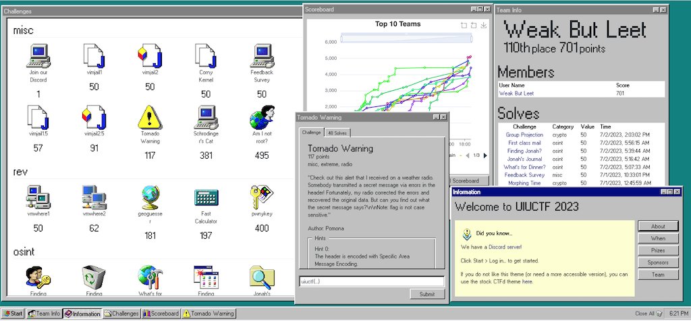

An interesting CTF challenge from UIUC. Had a good mix of beginner and advanced level challenges. 

<!--more-->

#### Corny Kernel
`Use our corny little driver to mess with the Linux kernel at runtime!`

We are given the source file of a linux kernel. It prints out the two fragments of the flag when it is loaded and when it is unloaded from the kernel. 
```c
    // SPDX-License-Identifier: GPL-2.0-only
    #define pr_fmt(fmt) KBUILD_MODNAME ": " fmt
    #include <linux/module.h>
    #include <linux/init.h>
    #include <linux/kernel.h>

    extern const char *flag1, *flag2;

    static int __init pwny_init(void){
        pr_alert("%s\n", flag1);
        return 0;
    }

    static void __exit pwny_exit(void){
        pr_info("%s\n", flag2);
    }

    module_init(pwny_init);
    module_exit(pwny_exit);

    MODULE_AUTHOR("Nitya");
    MODULE_DESCRIPTION("UIUCTF23");
    MODULE_LICENSE("GPL");
    MODULE_VERSION("0.1");
```


```
== proof-of-work: disabled ==
+ mount -n -t proc -o nosuid,noexec,nodev proc /proc/
+ mkdir -p /dev /sys /etc
+ mount -n -t devtmpfs -o 'mode=0755,nosuid,noexec' devtmpfs /dev
+ mount -n -t sysfs -o nosuid,noexec,nodev sys /sys
+ cd /root
+ exec setsid cttyhack ash -l
/root # pwd
/root
/root # ls
pwnymodule.ko.gz
/root # gunzip pwnymodule.ko.gz 
/root # ls
pwnymodule.ko
/root # insmod pwnymodule.ko 
[   85.410281] pwnymodule: uiuctf{m4ster_
/root # lsmod
pwnymodule 16384 0 - Live 0xffffffffc0233000
/root # rmmod pwnymodule
/root # dmesg | tail -5
[    0.188494]     HOME=/
[    0.188494]     TERM=linux
[    0.194004] mount (31) used greatest stack depth: 13464 bytes left
[   85.410281] pwnymodule: uiuctf{m4ster_
[  147.974512] pwnymodule: k3rNE1_haCk3r}
```

#### Three-time Pad
`"We've been monitoring our adversaries' communication channels, but they encrypt their data with XOR one-time pads! However, we hear rumors that they're reusing the pads...\n\nEnclosed are three encrypted messages. Our mole overheard the plaintext of message 2. Given this information, can you break the enemy's encryption and get the plaintext of the other messages?"`

We are given three encoded messages and the plain text of one of those messages. We are also told that it is an XOR encoding scheme and the key is reused. Thus, it is trivial to retrieve the key and decode the other messages. 

```python
    from pwn import *

    c1 = open("c1", "rb").read()
    c2 = open("c2", "rb").read()
    c3 = open("c3", "rb").read()
    p2 = open("p2", "rb").read()
    key = xor(c2, p2)
    print(xor(c1, key))
    print(xor(c2, key))
    print(xor(c3, key))
```
#### Group Project (todo)
`In any good project, you split the work into smaller tasks...`

We are given the following challenge file and a challenge server.
```python
    print("[$] Did no one ever tell you to mind your own business??")

    g, p = 2, getPrime(1024)    # g = 2, p = 1024 bit prime
    a = randint(2, p - 1)       # a is a random integer between 2 and p-1
    A = pow(g, a, p)            # A = pow(g, a, p)  Diffie Hellman step #1
    print("[$] Public:")
    print(f"[$]     {g = }")
    print(f"[$]     {p = }")
    print(f"[$]     {A = }")

    try:
        k = int(input("[$] Choose k = "))
    except:
        print("[$] I said a number...")     # BUG1 : note that there is no return, hence execution continues

    if k == 1 or k == p - 1 or k == (p - 1) // 2:
        print("[$] I'm not that dumb...")   # BUG2 : note that there is no return, hence execution continues

    Ak = pow(A, k, p)           # Spurious step. Not used
    b = randint(2, p - 1)       # second random number
    B = pow(g, b, p)            # B = pow(g, b, p)  Diffie Hellman step #2
    Bk = pow(B, k, p)           # We provide k - so the only thing we control
    S = pow(Bk, a, p)           # Shared key - Diffie Hellman step #3

    key = hashlib.md5(long_to_bytes(S)).digest()        # Hash of the shared key is the encryption key
    cipher = AES.new(key, AES.MODE_ECB)
    c = int.from_bytes(cipher.encrypt(pad(flag, 16)), "big")

    print("[$] Ciphertext using shared 'secret' ;)")
    print(f"[$]     {c = }")
```


#### Group Projection (todo)


#### Tornado Warning (todo)

`"Check out this alert that I received on a weather radio. Somebody transmitted a secret message via errors in the header! Fortunately, my radio corrected the errors and recovered the original data. But can you find out what the secret message says?  Note: flag is not case sensitive."`


```
$ multimon-ng -t wav -v 2 warning.wav -a EAS 2>/dev/null | grep part | cut -d: -f2 |python -c "from pwn import *; a = xor(input().encode(),input().encode()); print(xor(input().encode(), a))"
 ZCZC-UXU-TFR-R18007ST_45-0910BR5-KIND3RWS-
 ZCZC-WIR-TO{3018W0R+00T5-09UT115-K_EV/NWS-
 ZCZC-WXRCTOR-0D_007+004OR_O1011E@KIND/N}S-
b' ZCZC-UIUCTF{3RD_W0RST_TOR_OUTBRE@K_EV3R}S-\n'
```

* https://notebook.community/calebmadrigal/radio-hacking-scripts/fsk_modem_research
* https://stackoverflow.com/questions/35759353/demodulating-an-fsk-signal-in-python
* https://dsp.stackexchange.com/questions/29946/demodulating-fsk-audio-in-python
* https://github.com/mobilinkd/afsk-demodulator/blob/master/afsk-demodulator.ipynb


#### Vim Jails (todo)

* https://ur4ndom.dev/posts/2023-07-02-uiuctf-vimjail/
* https://github.com/Norske-Nokkelsnikere/writeups/blob/main/2023/uiuctf-2023/misc-vimjail.md

#### Crack the Safe (todo)

```python
    from Crypto.Cipher import AES
    from secret import key, FLAG

    p = 4170887899225220949299992515778389605737976266979828742347
    ct = bytes.fromhex("ae7d2e82a804a5a2dcbc5d5622c94b3e14f8c5a752a51326e42cda6d8efa4696")

    def crack_safe(key):
        return pow(7, int.from_bytes(key, 'big'), p) == 0x49545b7d5204bd639e299bc265ca987fb4b949c461b33759

    assert crack_safe(key) and AES.new(key,AES.MODE_ECB).decrypt(ct) == FLAG
```
The challenge author cites this CodeGolf solution as the inspiration for this challenge:  https://codegolf.stackexchange.com/a/36822.

This is a basic discrete algorithm challenge, where 
$$
    7^{key} = K \mod p \\\
    key = log_7 {K} \mod p \\\
$$

Also, \\(p - 1\\) can be easily factored, giving the following prime factors.
$$
    p-1 = 2 \\cdot 19 \\cdot 151 \\cdot 577 \\cdot 67061 \\cdot 18279232319_{<11>} \\cdot 111543376699_{<12>}\\cdot 9213409941746658353293481_{<25>}
$$

* https://crypto.stackexchange.com/questions/32415/how-does-a-non-prime-modulus-for-diffie-hellman-allow-for-a-backdoor
* https://risencrypto.github.io/PohligHellman/
* https://bronson113.github.io/2023/07/03/uiuctf-2023-writeups.html#crack-the-safe
* https://github.com/abhishekg999/UIUCTF-2023
* https://pseudoleon.github.io/uiuctf-23/
* https://github.com/sigpwny/UIUCTF-2023-Public/
* https://sigpwny.com/events/uiuctf/2023/
* https://hackmd.io/@pilvar/ByznZMLF3#futuredisk-2


#### UIUC CTFd Theme

A pretty cool Win95 theme for CTFd by the organizers. They really went overboard on this one. 




### Challenges
|Category|Challenge|Description
|----|----|----
|crypto|At Home|
|crypto|Group Projection|
|crypto|Group Project|
|crypto|Morphing Time|
|crypto|Three-Time Pad|
|crypto|crack_the_safe|
|misc|Am I not root?|
|misc|Corny Kernel|
|misc|Feedback Survey|
|misc|Join our Discord|
|misc|Schrodinger's Cat|
|misc|Tornado Warning| Specific Area Message Encoding (SAME) - decode digital data in AFSK
|misc|vimjail1|
|misc|vimjail1.5|
|misc|vimjail2|
|misc|vimjail2.5|
|osint|Finding Artifacts 1|
|osint|Finding Artifacts 2|
|osint|Finding Jonah?|
|osint|First class mail|
|osint|Jonah's Journal|
|osint|What's for Dinner?|
|pwn|Chainmail| Beginner level ret2win
|pwn|Mock Kernel|
|pwn|Rattler Read|
|pwn|Virophage|
|pwn|Zapping a Setuid 1|
|pwn|Zapping a Setuid 2|
|rev|Fast Calculator|
|rev|geoguesser|
|rev|pwnykey|
|rev|vmwhere1|
|rev|vmwhere2|
|web|adminplz|
|web|futuredisk|
|web|futuredisk2|
|web|peanut-xss|