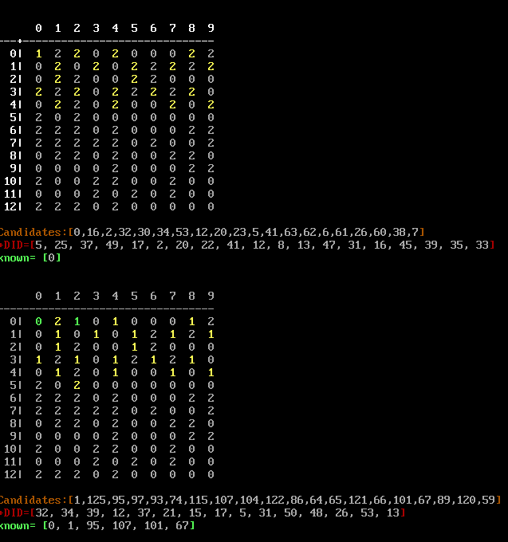
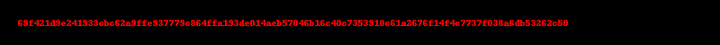

This is a challenging crypto-centric CTF organized by ASIS. 
<!--more-->

### Solved Challenges

#### Blue Office
`The Blue Office's ingenious cipher, meticulously crafted for the prestigious CCTF, became an impenetrable enigma that left even the most seasoned cryptanalysts baffled.`

```python
    def encrypt(s, msg):
        assert s <= 2**32
        c, d = 0, s
        enc, l = b'', len(msg)
        while c < l:
            d = reseed(d)
            enc += (msg[c] ^ ((d >> 16) & 0xff)).to_bytes(1, 'big')
            c += 1
        return enc
```
The following python script represents the solution.  We would bruteforce the `orig_seed` in the space of \\(2^{32}\\). We can ignore the red herring with the `gen_seed(seed_str)` function, which generates the starting seed from a secret string. 

```python
'''
known_bytes = [f3, 88, 37, 50, 42]  -- corresponds to b'CCTF{'
    43^b0 = f3  'C' 
    43^cb = 88  'C'
    54^63 = 37  'T'
    46^16 = 50  'F'
    7b^39 = 42  '{'
'''
hex_str = unhexlify(b'b0cb631639f8a5ab20ff7385926383f89a71bbc4ed2d57142e05f39d434fce')

# Bruteforce the seed and check for the first 5 characters to be  b'CCTF{'
def check_next_seed(orig_seed, cur_seed, index):
    marker_byte = (cur_seed >> 16) & 0xFF 
    if (marker_byte == known_bytes[index]): 
        next_seed = reseed(cur_seed)
        if (index <= 3):
            check_next_seed(orig_seed, next_seed, index+1)
        elif(index == 4):
            # We have found "CCTF{". So, stop recursion and decrypt the full flag
            flag=b''
            d = orig_seed
            for c in hex_str:
                flag += (c ^ ((d >> 16) & 0xff)).to_bytes(1, 'big')
                d = reseed(d)
            print(f"Seed found : {orig_seed:08x} {flag}")
```
As an alternative to bruteforcing the initial seed, some teams used Z3 to solve for the seed using symbolic execution. 

```python
# Solution by LiamoOo
# Define Z3 variables
s = BitVec("s", 32)
d = BitVec("d", 32)
flag = [BitVec(f"flag_{i}", 8) for i in range(len(enc))]

solver = Solver()

_flag = b"CCTF{"
for i in range(len(_flag)):
    solver.add(flag[i] == _flag[i])

solver.add(s <= 2**32)  # Add constraints for the seed value
solver.add(d == s)      # Initialize d with the seed value

for i in range(len(enc)):  # Encrypt the message and add constraints
    d = reseed(d)
    # solver.add(flag[i] == (enc[i] ^ ((d >> 16) & 0xFF)))
    solver.add((flag[i] ^ ((Extract(7, 0, d >> 16)))) == enc[i])

if solver.check() == sat:       # Check if there is a solution
    model = solver.model()

    seed_value = model[s].as_long()     # Get the seed value
    print(f"Seed: {seed_value}")

    flag_value = "".join([chr(model[flag[i]].as_long()) for i in range(len(enc))])     # Get the flag
    print(f"Flag: {flag_value}")
else:
    print("No solution found.")
```

#### Suction
`The easy suction cryptosystem is designed with a primary focus on simplicity and user-friendliness, employing streamlined algorithms that make encryption straightforward and accessible even for individuals without extensive technical knowledge.`

This is an RSA challenge with `N` and `e` obscured by hiding the last 8 bits of each. Since `p` and `q` are equally sized primes, we can deduce that `N` is odd and has only two equal sized factors. We can bruteforce `N` through 128 possible values to complete `N` and checking it for two equal-sized factors. 

```python
    for p,q in possible_n:          # check the 128 values for N to have only two equal sized factors
        n = p*q
        phi = (p-1)*(q-1)

        for e_ in possible_e:       # 28 prime values 
            if (GCD(e_, phi) == 1):
                d = inverse(e_, phi)
                for i in range(256):    # 256
                    pt = bytearray(long_to_bytes(pow((ENC<<8) + i, d, n)))
                    count +=1
                    if (pt.isascii()):      # cannot check for 'CCTF' as it is removed before encryption
                        print(pt)
```


#### TPSD
`Solving Diophantine equations is a notoriously challenging problem in number theory, and finding non-trivial integer solutions for certain equations is considered a major open problem in mathematics.`

In this challenge, we are asked to solve 20 levels of the diophantane equation \\(x^3 + y^3 + z^3 = 1\\). Common to all the 20 levels are the following conditions:
1. The values of `x`, `y` and `z` are integers. 
1. One of the values has to be a prime number. 
1. At each level, there are minimum and maximum values (expressed in terms of bit lengths of the absolute values of x, y and z). The minimum bit lengths become progressively longer at advanced levels. 

Luckily for us, this particular variant of the diophantane equation has been parameterized. The solution to the diophantane equation of the form \\(x^3 + y^3 + z^3 = 1\\) is given by \\( (9a^4)^3 + (3a - 9a^4)^3 + (1-9a^3)^3 = 1\\), for integer \\(a\\)

Looking at the three terms, we can easily see that only the third parameter can a prime number. Not knowing how long it would take to find a suitable value, I chose to pre-generate the triples for bit lengths upto 250. It so happened that the generation was very fast and if necessary, we could generate it on the fly. 


```python
import gmpy2
import math

start_bit_len=6
end_bit_len=200

with open("cube_sums.txt", 'w') as F:
    for bl in range(start_bit_len, end_bit_len,1):
        start_val = math.ceil(-1 * (2**bl)/9)
        i = start_val
        while(True):
            z = 1 - 9 * (i**3)
            if (gmpy2.is_prime(z)):
                x = 9 * (i ** 4)
                y = 3 * i - 9 * (i ** 4)
                F.write(f"{x},{y},{z} : {len(bin(abs(x))[2:]):3d} {len(bin(abs(y))[2:]):3d} {len(bin(abs(z))[2:]):3d}\n")
                print(f"Len:[{bl}?] [{len(bin(z))-2:4d}] {x},{y},{z}")
                break
            i -= 1
```

#### Did It
`Finding the intersection among subsets can sometimes be a challenging endeavor, as it requires meticulous comparison and analysis of overlapping elements within each set. But she did it! Try doing it yourself too.`

This problem was solved by my team-mate during the CTF. Here's my attempt at solving it. 

1. The challenge server generates 20 random numbers in the range [0..127]
1. We are given \\(\frac {2 * N} {l-1} = 13\\) tries to guess the set of numbers. `N = 128 and l = 20`
1. For every wrong guess, we get back \\(guess^2 \mod N \\) + a random noise of [`0 or 1`]
1. The approach is to choose numbers whose \\(guess^2 \mod N \\) are not adjacent to each other. 

1. For instance, in the table above, if we have guessed `0`, whose square mod N is also 0, we should not include `1` in the same try. This will avoid the ambiguity if we received `1` from the server. 
1. In this example, we selected 20 numbers [0, 16, 2, 32 .... etc]. The server returned 19 responses, but did not return `0` or `1`. This tells us that `0` was a correct guess.
1. We remove all the numbers we have used in the guess from future consideration and we apply this logic again.
1. The terminating conditions are if we have found the 20 correct guesses, or we have no valid numbers remaining. In both cases, we send the known good numbers and retrieve the flag. 
1. The complete solution is as follows:
```python
from pwn import *
context.log_level = 'debug'

n, l = 127, 20
N = set(list(range(0, n)))

def print_reverse_as_matrix(rsq):
    hdr = "    "+"{:3d}"*10
    print(hdr.format(*[i for i in range(10)]))
    print("-"*(4+3*10))
    for i in range(0,n,10):
        print("{:3d}|".format(i//10), end='')
        print(("{:3d}"*10).format(*[len(rsq[x]) if x in rsq.keys() else 0 for x in range(i,i+10)]))

squares = {i:pow(i, 2, n) for i in range(n)}
reverse_squares = {s:[i for i,j in squares.items() if j==s] for s in set(squares.values)}

known = []
#with process(['python3', 'did.py']) as P:
with remote("01.cr.yp.toc.tf", 11337) as P:
    P.recvuntil(b'++++++++++++\n')
    while(len(known) < l):
        print_reverse_as_matrix(reverse_squares)

        candidates=[]
        for i in range(n):
            # if i-1, i or i+1 does not have an entry in the candidates
            if [c for c in candidates if squares[c] in  [i-1, i, i+1] ] :
                continue 
            # else:
            if (i in reverse_squares.keys()):
                candidates.append(reverse_squares[i].pop(0))
                if (len(reverse_squares[i]) == 0):
                    del reverse_squares[i]
            if (len(candidates) == l):
                break

        if (len(candidates)==0 or len(known) == l):
            break
        send_str = ','.join(str(x) for x in candidates)
        P.sendline(send_str.encode())
        P.recvuntil(b'DID = ')
        ans = eval(P.recvline().decode())
        print(f"{ans= }")
        rejects = [i for i,j in squares.items() if (j in ans or j+1 in ans) and (i in candidates)]
        print(f"{rejects= }")
        known += [x for x in candidates if x not in rejects]
        print(f"{known= }")
    P.sendline((','.join(str(x) for x in known)).encode())
    P.interactive()
```

### After the CTF
There were a couple of other challenges that I could have solved if I had more time. So, I will catalog them here as I solve them for future reference, along with interesting solutions from other writeups.

#### Blobfish

```python
    key = get_random_bytes(8) * 2           # Random 8 bytes, repeated once
    iv = md5(key).digest()                  # IV is also random

    cipher = AES.new(key, AES.MODE_CFB, iv=iv)  
    # Flag bytes are encrypted using AES.MODE_CFB cipher feed back
    enc = cipher.encrypt(flag)              

    img = Image.new('RGB', (800, 50))
    drw = ImageDraw.Draw(img)
    # A PNG file is created with the hex value of encrypted flag bytes
    drw.text((20, 20), enc.hex(), fill=(255, 0, 0)) 
    img.save("flag.png")

    # First 10 bytes of key is converted to a string
    hkey = ''.join('\\x{:02x}'.format(x) for x in key[:10]) 

    # used as the password for protecting the zip file that has the PNG image
    os.system(f'/bin/zip -0 flag.zip flag.png -e -P \"$(/bin/echo -en \"{hkey}\")\"')   
```
1. Extract the PNG image from the zip file
1. Decrypt the hex string in the image using the password/iv from the key
1. Get the original flag back
1. To crack the zip and get back the original `flag.png`, we use a utility called [bkcrack](https://github.com/kimci86/bkcrack). This utility uses known plaintext or bytes to determine the keys for the zipfile. 
1. In this instance, we would use the first 16bytes of the PNG file as the known bytes and get back the keys, which allow us to decrypt the zip file. 

```bash
% ./bkcrack -x 0 89504e470d0a1a0a0000000d49484452 -C ~/ctf/2023/cryptoctf/blobfish/flag.zip -c flag.png  
bkcrack 1.5.0 - 2022-07-07
[14:16:10] Z reduction using 9 bytes of known plaintext
100.0 % (9 / 9)
[14:16:10] Attack on 697990 Z values at index 6
Keys: 03492be6 b81a5123 24d7b146
4.3 % (30016 / 697990)
[14:17:09] Keys
03492be6 b81a5123 24d7b146

 % ./bkcrack -k 03492be6 b81a5123 24d7b146 -r 10 "?b"                   
bkcrack 1.5.0 - 2022-07-07
[14:19:42] Recovering password
length 0-6...
length 7...
length 8...
length 9...
length 10...
41.8 % (27362 / 65536)
[14:19:44] Password
as bytes: ad 6e fb 79 2a ea 5a aa ad 6e 
as text: ny*Zn

% ./bkcrack -k 03492be6 b81a5123 24d7b146 -C ~/ctf/2023/cryptoctf/blobfish/flag.zip -c flag.png -d flag.png
bkcrack 1.5.0 - 2022-07-07
[14:26:43] Writing deciphered data flag.png (maybe compressed)
Wrote deciphered data.
```



```python
    enc = unhexlify('69f421d9e241933cbc62a9ffe937779c864ffa193de014aeb57046b16c40c7353910c61a2676f14f4c7737f038a6db53262c50')
    key = unhexlify('ad6efb792aea5aaaad6efb792aea5aaa')   #from bkcrack password recovery 
    iv = md5(key).digest()

    cipher = AES.new(key, AES.MODE_CFB, iv=iv)
    flag = cipher.decrypt(enc)
    print(flag)
    # b'CCTF{d3ep-Zip_fi5h_0f_tH3_knOwN_pL4!n_7exT_ATtAcK!}'
```

#### Insights
`Boundary attacks on RSA involve manipulating the input values at specific boundaries to exploit vulnerabilities in the encryption system's implementation. As one of the most widely used encryption systems, RSA provides insights into secure communications through its reliance on the difficulty of factoring large prime numbers. However, it is crucial to implement RSA correctly with robust key management and secure implementations to ensure its effectiveness in protecting sensitive information.`

We are given a Sagemath script that implements RSA and it's output file.  The most important part of the generator script is provided below. The script includes a number of red-herrings. However, one part stands out. Instead of generating or specifying `e`, the program generates a prime number based on `n` and inverts it to get `e`. So, by definition, the prime number is `d`, the decryption key.  If this `d` can be generating again given our inputs, we can crack this RSA encryption by \\(C^d \mod N\\). There is no need to factor `N`.

```python
def genKey(L, nbit):
	p, q = [genPrime(L, nbit) for _ in '__']
	n = p * q
	d = next_prime(pow(n, 0.2919))
	phi = (p - 1) * (q - 1)
	e = inverse(d, phi)
	pubkey, privkey = (n, e), (p, q)
	return pubkey, privkey

def encrypt(msg, pubkey):
	n, e = pubkey
	m = bytes_to_long(msg)
	c = pow(m, e, n)
	return c

nbit = 1024
L = bin(bytes_to_long(b'Practical'))[2:]
pubkey, privkey = genKey(L, nbit)
p, q = privkey
c = encrypt(flag, pubkey)

print('Information:')
print('-' * 85)
print(f'n = {p * q}')
print(f'e = {pubkey[1]}')
print(f'c = {c}')
print(f'p = {bin(p)[2:len(L)]}...[REDACTED]')
print(f'q = {bin(q)[2:len(L)]}...[REDACTED]')
print('-' * 85)
```
1. We are given `n`, `c` and `e`
1. Recreate `d` using `n`
1. Decrypt `c` to get the flag.
1. I don't know if this was the intended solution or not. 

```ipython
# we are given n, c and e
# Use the logic from the challenge program to regenerate d
sage: d = next_prime(pow(n, 0.2919))
sage: d
693984516363754919249700902493753051718166208912377865278483876234349619419200560616162942304659132290614866566556420934365717915837808485622613368180482591406570741380374249603517
sage: long_to_bytes(pow(c, d, n))
b'CCTF{RSA_N3w_rEc0rd5_4Nd_nEw_!nSi9h75!}'
```

This solution seems to be too simple for a Medium complexity challenge. In the writeups channel, `TheSavageTeddy` clued me into the fact that this is intended to be solved through [Boneh-Durfee attack](https://cryptohack.gitbook.io/cryptobook/untitled/low-private-component-attacks/boneh-durfee-attack). So, I read up on it and implemented the attack.


#### Keymoted
`Combining RSA and ECC in a cryptographic system does not necessarily guarantee security equivalent to that of the individual RSA or ECC systems. What about keymoted`

#### Trex
`The study of Diophantine equations over trex can be significantly more challenging than over the real numbers.`

```python
    def check_inputs(a, b, c):
        if not all(isinstance(x, int) for x in [a, b, c]):
            return False
        if a == 0 or b == 0 or c == 0:
            return False
        if a == b or b == c or a == c:
            return False
        return True


    equation = f'x^2 + y^2 - xy = {a}*z^3'
```


$$
    x^2 + y^2 - xy = a \cdot z^3\\
    x,y,z\not= 0\\
    x\not=y, y\not=z, x\not=z\\
    
    let~~y = x + m ~~~ where ~~ m \not= 0\\
    x^2 + (x+m)^2 - x(x+m) = a \cdot z^3\\
    x^2 + x^2 + m^2 + 2xm -x^2 -xm = a \cdot z^3\\
    x^2 + xm + m^2 = a \cdot z^3\\
    


$$

### Resources
* https://ericrowland.github.io/papers/Known_families_of_integer_solutions_of_x%5E3+y%5E3+z%5E3=n.pdf
* https://www.ams.org/journals/mcom/2007-76-259/S0025-5718-07-01947-3/S0025-5718-07-01947-3.pdf
* https://gist.github.com/4yn/61af8672bed251e5366988e2efa6e658
* https://en.wikipedia.org/wiki/Sums_of_three_cubes
* https://gist.github.com/elliptic-shiho
* https://ctfnote.leg.bzh/pad/s/SL4mIXF3b
* http://matwbn.icm.edu.pl/ksiazki/aa/aa73/aa7331.pdf
* https://www.quora.com/How-do-you-find-the-positive-integer-solutions-to-frac-x-y+z-+-frac-y-z+x-+-frac-z-x+y-4
* https://shiho-elliptic.tumblr.com/post/722391959624433664/crypto-ctf-2023-writeup-en
* https://math.stackexchange.com/questions/3068288/find-all-integer-solutions-to-x2xyy2-xy-3-13


### List of challenges
|Category|Challenge|Description
|----|----|----
|Easy 😁|Blue Office|byte-wise encryption, with a seed function
|Easy 😁|Did it!|* modular arith, programming, set intersections
|Easy 😁|Suction| RSA with obscured C, N and E
|Hard 😥|Big|
|Hard 😥|Byeween|*
|Hard 😥|Marjan|*
|Hard 😥|Shevid|
|Hard 😥|Vinefruit|*
|Medium 🤔|ASIv1|
|Medium 🤔|Barak|
|Medium 🤔|Bertrand|
|Medium 🤔|Blobfish|
|Medium 🤔|Derik|
|Medium 🤔|Insights|
|Medium 🤔|Keymoted|
|Medium 🤔|Resuction|
|Medium 🤔|Risk|
|Medium 🤔|Roldy|* 
|Medium 🤔|TPSD|* Sum of 3 cubes Diophantine equation
|Medium 🤔|Trex|* 
|Tough 🔥|ASIv2|
|Tough 🔥|Slowsum|* 
|Warm-up 🤑|Welcome!|