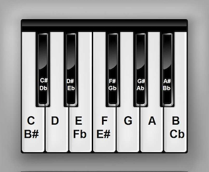

A high quality CTF from The Few Chosen CTF team. 
<!--more-->

#### Dizzy
`Embark on 'Dizzy', a carousel ride through cryptography! This warmup challenge spins you around the basics of ciphers and keys. Sharpen your mind, find the flag, and remember - in crypto, it's fun to get a little dizzy!`

```python
D = {}
for hint in "T4 l16 _36 510 _27 s26 _11 320 414 {6 }39 C2 T0 m28 317 y35 d31 F1 m22 g19 d38 z34 423 l15 329 c12 ;37 19 h13 _30 F5 t7 C3 325 z33 _21 h8 n18 132 k24".split(' '):
    D[int(hint[1:])] = hint[:1]
print(''.join(D[k] for k in sorted(D.keys())))
```

Beautiful solve from user `YeGo [yegorenji]` on Discord. 
```python
    import time
    enc = 'T4 l16 _36 510 _27 s26 _11 320 414 {6 }39 C2 T0 m28 317 y35 d31 F1 m22 g19 d38 z34 423 l15 329 c12 ;37 19 h13 _30 F5 t7 C3 325 z33 _21 h8 n18 132 k24'

    splitted = enc.split(' ')

    for c in splitted:
        char = c[0]
        place = int(c[1:])
        time.sleep(0.1)
        print('\033[C' * (place) + char, end='')
        print('\r', end='')
    print()
```
#### Alien Music
`We've intercepted an alien transmission that seems to be composed of sheet music notes. Our lead translator is tone-deaf, our pianist can't spell 'binary', and the guitarist keeps shouting 'hex' in his sleep! Can you help us decode the tune?`

`In Western music, there are a total of twelve notes per octave, named A, A#, B, C, C#, D, D#, E, F, F#, G and G#. The sharp notes, or ‘accidentals’, fall on the black keys, while the regular or ‘natural’ notes fall on the white keys.`



```python
tune = "DC# C#D# C#C C#C DC# C#D# E2 C#5 CA EC# CC DE CA EB EC# D#F EF# D6 D#4 CC EC EC CC# D#E CC E4"
KEYS="A,A#,B,C,C#,D,D#,E,F,F#,1,2,3,4,5,6".split(',')
VALS=[i for i in range(16)]

for c in tune.split(' '):
    out=[]
    for i,x in enumerate(c):
        if (x == '#'):
            out[-1]+=1
        else:
            out.append(VALS[KEYS.index(x)])
    print( chr( int(f"{out[0]:x}{out[1]:x}",16) ), end='')
print()
```
#### Some Traffic

1. File -> Export Objects -> HTTP -> select 3 multi-part/form-data objects
1. trim the headers in each and store them as PNG files. 
1. Run `zsteg -a` on each of the PNG files. 
1. Get the flag from the `output_modified.png` file.

`b8,g,lsb,yx         .. text: "FCCTF{H1dd3n_d4t4_1n_p1x3ls_i5n't_f4n_4nd_e4sy_to_f1nd!}TFCCTF{H1dd3n_d4t4_1n_p1x3ls_i5n't_f4n_4nd_e4sy_to_f1nd!}TFCCTF{H1dd3n_d4t4_1n_p1x3ls_i5n't_f4n_4nd_e4sy_to_f1nd!}TFCCTF{H1dd3n_d4t4_1n_p1x3ls_i5n't_f4n_4nd_e4sy_to_f1nd!}TFCCTF{H1dd3n_d4t4_1n_p1x3ls_"`


#### MCTEENX
`I fly in the sky, I got wings on my feet.`

```bash
    % echo "#\!/bin/bash" | xxd -g0  
    00000000: 23212f62696e2f626173680a          #!/bin/bash.

    % bkcrack -x 0 23212f62696e2f626173680a -C red.zip -c script.sh
    bkcrack 1.5.0 - 2022-07-07
    [21:50:23] Z reduction using 5 bytes of known plaintext
    100.0 % (5 / 5)
    [21:50:23] Attack on 1218664 Z values at index 6
    Keys: c0b1bc78 c3206dfc e7e5bae1
    9.7 % (118324 / 1218664)
    [21:53:44] Keys
    c0b1bc78 c3206dfc e7e5bae1

    % bkcrack -k c0b1bc78 c3206dfc e7e5bae1 -C red.zip -c script.sh -d script.sh
    [21:56:23] Writing deciphered data script.sh (maybe compressed)
    Wrote deciphered data.

    % ./script.sh   (creates red.png)

    % zsteg -a red.png
    ...
    b1,rgb,lsb,xy       .. text: "030a111418142c783b39380d397c0d25293324231c66220d367d3c23133c6713343e343b3931"
    ...
```
XOR the hex string with the flag header to get the 3-character key. Then, get the full flag by XOR-ing the hex string with the key. 

```python
from pwn import *
b = unhex("030a111418142c783b39380d397c0d25293324231c66220d367d3c23133c6713343e343b3931")
print(xor(b, b'TFCCTF{'))       # b'WLRWLRW,}z{Y\x7f\x07Ycjppeg2dNu)zXGz$P`xOo\x7fr'
print(xor(b, b'WLR'))           # b'TFCCTF{4int_n0_reasoN1n_a1nt_n0_fixin}'
```


#### Writeups, Resources
* https://vnhacker.blogspot.com/2014/06/why-javascript-crypto-is-useful.html
* Challenge source : https://github.com/qLuma/TFC-CTF-2023
* Challenge source : https://github.com/tomadimitrie/tfcctf-2023-challenges
* https://github.com/woodruffw/steg86
* https://medium.com/@sachalraja/tfc-ctf-2023-writeups-52d7a1a44d0f
* https://toolscord.com/
* https://discord-avatar.com/en 
* https://ireland.re/TheFewChosen_2023/
* https://nolliv22.com/categories/tfc-ctf-2023/
* https://xa21.netlify.app/tags/tfcctf-2023/
* https://github.com/JOvenOven/ctf-writeups/tree/main/TFC_CTF_2023
* https://xhacka.github.io/tags/tfcctf2023/
* https://yaytext.com/bold-italic/
* https://www.acceis.fr/cracking-encrypted-archives-pkzip-zip-zipcrypto-winzip-zip-aes-7-zip-rar/


### Challenges
|Category|Difficulty|Challenge|Description
|----|----|----|----
|Crypto|warmup|Dizzy|re-order letters of the flag
|Crypto|warmup|Mayday!| transcribe NATO phonetics and numbers
|Crypto|medium|AES CTF TOOL V1|
|Crypto|medium|AES CTF TOOL V2|
|Crypto|medium|CypherehpyC|
|Crypto|hard|Fermentation|
|Crypto|easy|Alien Music|Music notes to hex digits
|Crypto|easy|Rabid|
|misc|warmup|Rules|
|misc|medium|Broken Crypto|
|misc|medium|My First Calculator|
|misc|medium|My Third Calculator|
|misc|hard|mcclaustrophobia|
|misc|easy|DISCORD SHENANIGANS V3|Flag in profile image, but cropped
|reverse|warmup|pass|
|reverse|medium|Losedows|
|reverse|medium|process-monitor|
|reverse|insane|c3|
|reverse|insane|mcIOR|
|reverse|hard|C - -|
|reverse|hard|obf|
|forensics|warmup|Down Bad|
|forensics|medium|Some traffic|images in HTTP + zsteg
|forensics|medium|mcELLA|
|forensics|medium|mcteenX|bkcrack to crack a zip using bash header, zsteg, XOR with flag header to get the key
|forensics|easy|list|
|pwn|warmup|diary|
|pwn|warmup|shello-world|
|pwn|medium|Pwn;Gate|
|pwn|medium|notes|
|pwn|medium|rusty|
|pwn|hard|Inj|
|pwn|hard|Mafia Login|
|pwn|easy|easyrop|
|pwn|easy|random|
|web|warmup|Baby Ducky Notes|
|web|medium|Ducky Notes: Part 3|
|web|medium|mctree|
|web|hard|Ducky Notes: Endgame|
|web|easy|Baby Ducky Notes: Revenge|
|web|easy|Cookie Store|