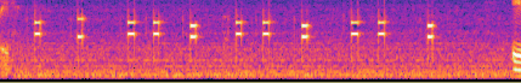
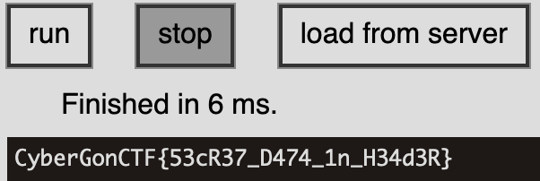
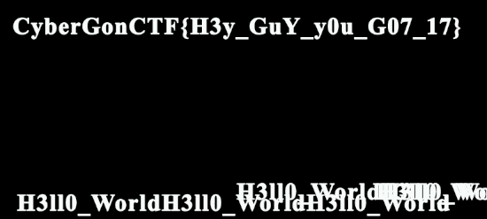
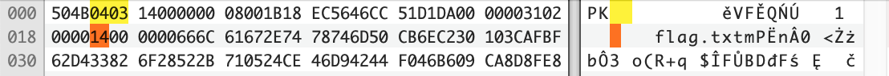

This was an interesting CTF hosted by a Myanmar-based cybersec firm.  My team was placed 5th in this CTF.

<!--more-->
### Solves

#### Dots
We are given an image with dots. Using Dcode, we can see that it is a representation of the Braille symbols.

Using the site to decode the symbols gives us the flag. 
**Flag:** `CybergonCTF{the_eyes_are_useless_when_the_mind_is_blind}`

#### Game
```bash
% echo "enolaerauoynehwyrramydoolbyalptonod" | rev
donotplaybloodymarrywhenyouarealone
```

#### Now you see me 1
Given: A file with whitespaces (`space, tab, CR and LF`)
```bash
% cat Now_You_See_Me.txt | tr ' \t' '01' | sed -e 's/^00//g'  | sed -e 's/^000/0/g' | egrep -e ".{8}" | tr -d '\r\n' | perl -lpe '$_=pack"B*",$_'
Congratulations this is for you !!

CybergonCTF{Always_Look_Beyond_What_You_Can_See}
```
Steps:
1. Replace `<space>` with `0` and `<tab>` with `1`
1. Trim leading zeros in each line, so that there is only one `0` at the beginning of the line
1. Treat this as a binary string and convert to ASCII.

#### Captured
`Our intels captured some conversation between Mr.Yit and his friend. Do you find some useful information ?`

This audio file has some audio, with a phone number that is in DTMF. As can be seen in the spectrogram below, the signal consists of two frequencies (Dual Tone Multiple Frequencies) and yields the numbers `09007007007`, which happens to be the flag.



#### Help Me
`How many languages can you speak ?`

We are given a video file that has 3 short flashes, 3 long flashes, followed by 3 short flashes again. This whole sequence is repeated two more times. This is a well known representation of `SOS` in morse code. So the flag is just `CyberGonCTF{SOS_SOS_SOS}`

#### All in One

We are given the following ciphertext, along with an image 
```
3n5g1jgAx0w{Bt@WPbH_9bm!mIgZ2aI}

9!SyZka>@a8[;B%tDySLX#bCV{nT+ZJYIS2;kD6]FDweC9%S9]R'*n[dV:Vz(kJ9>80r=31!E_a.@IOT3]F&mp+cP:9E!

yD7g,WeYM%9/U^!q_kf+/[N1s!2tBNfL/bKOc)]A
```
Recognizing that the image contains symbols from the Wakanda language, used Dcode to decode it:


This yields the following plaintext. 
```
ThisIsTheKey
B14cKP4n7h3R
```

At this point, I was stuck and could not figure out how to apply the key. It was 24-bytes long, 12 in each line. I tried various combinations of AES, but was not able to solve the cipher. 

After the CTF was complete, I learned that it is the Vigenere cipher with `B14cKP4n7h3R` as the key, with `A-Za-z0-9!@` as the alphabets. I modified a python implementation to cement my understanding of the Vigenere cipher. 

```python
    import string
    # borrowed from https://gist.github.com/dssstr/aedbb5e9f2185f366c6d6b50fad3e4a4

    def vigenere(
        text: str,
        key: str,
        alphabet=string.ascii_lowercase + string.ascii_uppercase + string.digits + "!@" ,
        encrypt=True):

        result = ''
        ki = 0  # need a separate index for the Key to prevent it being incremented if we encounter a strange character that is not in the alphabet
        for i in range(len(text)):
            if (text[i] in alphabet):
                letter_n = alphabet.index(text[i])
                key_n = alphabet.index(key[ki % len(key)])

                if encrypt:
                    value = (letter_n + key_n) % len(alphabet)
                else:
                    value = (letter_n - key_n) % len(alphabet)
                    # print(f"[{letter_n:2d} - {key_n:2d}] %{len(alphabet):2d} = {value:2d} : {alphabet[letter_n]} {key[i % len(key)]}  --> {alphabet[value]}")
                result += alphabet[value]
                ki += 1
            else: 
                print(f"{text[i]} not found in the alphabet ... passing it through as-is")
                result += text[i]
        return result

    def vigenere_encrypt(text, key):
        return vigenere(text=text, key=key, encrypt=True)

    def vigenere_decrypt(text, key):
        return vigenere(text=text, key=key, encrypt=False)

    text = '3n5g1jgAx0w{Bt@WPbH_9bm!mIgZ2aI}'
    key =  "B14cKP4n7h3R"
    print(vigenere_decrypt(text, key))
    # CyberGonCTF{W4k4ND4_f0r3v3R!!!!}
```

#### EZ-RSA
We are given the following source for the challenge, with my annotation:

```python
flag = open("flag.txt").read()
m = bytes_to_long(flag.encode())
p = getStrongPrime(512)     # strong p and q
q = getStrongPrime(512)     
n = p*q
e = 0x10001             # large e
c = pow(m,e,n)          # standard RSA

num = randint(100,999)  # random number 

p_encode = []
q_encode = []

p_list = re.findall('.',str(p)) # gets each character of stringified p and q ... so the character of each digit ... '0' to '9'
q_list = re.findall('.',str(q))

# each digit of p and q are XOR'd with the random number and turned back into a string and provided to us. 
for value in range(len(p_list)):
    p_encode.append(str(int(p_list[value]) ^ num))
    q_encode.append(str(int(q_list[value]) ^ num))

# we are given c, n, encoded p and q, (and e)
print(c)
print(n)
print(p_encode)
print(q_encode)
```

Since we have a small search space for the random number, we can bruteforce the search in `[100 - 999]` to see which values yield values between `ord('0') and ord('9')`, with the consraints that the contents of `p` and `q` should only be digits. Once we determine `num`, we can reverse-engineer `p` and `q` and decode the cipher. 

The solution is as follows: 
```python
    # we are given c, n, and encoded values of  p and q 

    # Bruteforce the original random number used
    possible_nums = []
    for i in range(100, 999):
        if (all(x >= ord('0') and x <= ord('9') for x in [int(pval) ^ i for pval in set(p)] )):
            if (all(x >= ord('0') and x <= ord('9') for x in [int(qval) ^ i for qval in set(q)] )):
                possible_nums.append(i)
    print(f"{len(possible_nums)} possible values found. Trying each one.")
    for num in possible_nums:
        fac_p = ''.join([chr(int(x)^num) for x in p])
        fac_p = int(fac_p)
        e = 0x10001

        if (n% fac_p == 0):
            fac_q = n // fac_p
            phi = (fac_p-1)*(fac_q-1)

            d = inverse(e, phi)
            m = pow(c, d, n)
            print(f"{num}: {long_to_bytes(m).decode()}")
            # 563: CyberGonCTF{345y_p34sy_R54_c1ph3R}
```

#### dO nOT aCCESS

We are given a hexavue cipher based image, which translates to the following text

```
ACTTCGTAGT
TGCGATTCCC
ATTGGAATTC
TGGTTGCTCG
CTTCTTTGAA
```
`Row-wise reading order` : `ACTTCGTAGTTGCGATTCCCATTGGAATTCTGGTTGCTCGCTTCTTTGAA`

`Column-wise reading order` : `ATATCCGTGTTCTGTTGGTCCAGTTGTAGTTTACTACTTGGCTCATCCGA`

The encoding uses the following scheme to translate a letter into a DNA codon-triplet. 


Reversing the encoding is pretty straight-forward lookup.

```python
    import string
    import itertools
    decoder = string.ascii_lowercase + string.ascii_uppercase + string.digits[1:]+ string.digits[0] + ' .'
    decoder_dict = {}
    for i, key in enumerate(itertools.product('ACGT', repeat=3)):
        decoder_dict[''.join(key)] = decoder[i]

    # ROW and COL reading orders
    for STR in ["ACTTCGTAGTTGCGATTCCCATTGGAATTCTGGTTGCTCGCTTCTTTGAA", "ATATCCGTGTTCTGTTGGTCCAGTTGTAGTTTACTACTTGGCTCATCCGA"]:
        flag = ""
        for i in range(3,len(STR),3):
            flag += decoder_dict[STR[i-3:i]]
        print(f"{STR} ===> {flag}")

#ACTTCGTAGTTGCGATTCCCATTGGAATTCTGGTTGCTCGCTTCTTTGAA ===> h3Y y0u G07 DN4   <--- correct flag
#ATATCCGTGTTCTGTTGGTCCAGTTGTAGTTTACTACTTGGCTCATCCGA ===> m2U0872l8l9CFP12
```

#### Hide and Seek
We are given a MS Word document file in `.docx` format. Knowing that `.docx` is zipped XML, we can unzip the files, first.
```
% unzip -l Secret_File.docx 
Archive:  Secret_File.docx
  Length      Date    Time    Name
---------  ---------- -----   ----
     1704  01-01-1980 00:00   [Content_Types].xml
      590  01-01-1980 00:00   _rels/.rels
     9252  01-01-1980 00:00   word/document.xml
     1209  01-01-1980 00:00   word/_rels/document.xml.rels
     3021  01-01-1980 00:00   word/footnotes.xml
     3015  01-01-1980 00:00   word/endnotes.xml
     8390  01-01-1980 00:00   word/header1.xml
     8393  01-01-1980 00:00   word/theme/theme1.xml
     3724  01-01-1980 00:00   word/settings.xml
    31761  01-01-1980 00:00   word/styles.xml
      894  01-01-1980 00:00   word/webSettings.xml
     1919  01-01-1980 00:00   word/fontTable.xml
      747  01-01-1980 00:00   docProps/core.xml
      984  01-01-1980 00:00   docProps/app.xml
---------                     -------
    75603                     14 files
```

Extracting the archive and checking each file for suspicious content, showed the following content in `word/header1.xml`.

```brainfuck
++++++++++[>+>+++>+++++++>++++++++++<<<<-]>>>---.>+++++++++++++++++++++.-----------------------.   +++.+++++++++++++.<++++.>---.-.<----.+++++++++++++++++.--------------.>+++++++++++++.<----------   -------.--.>------------------------.-----------------.<.++++.>+++++++++++++.<+++++++++++++.----   ------------.+++.---.>.<---.>+++++++++++++++.---------------.<+++++++++++++++++++++++.<+++++++++   ++++++++++++.+.>>+++++.<<-.>++++++++++.>+++++++++++++++++++++++++.
```
Knowing that this is `Brainfuck` language, I fed the string into a online interpreter to get the flag. 


#### Data Exfiltration

We are given a file with PNG extension, which looks to be malformed and does not open. Viewing the file in an hex editor shows that the file has none of the expected fields from a PNG file. The content has many strings that reference Adobe and Layers. Also, it shows that the tool used to create the file is Adobe Photoshop.
` <xmp:CreatorTool>Adobe Photoshop CS6 (Windows)</xmp:CreatorTool>`

So, I guessed it might be a photoshop image file. Looking for the fileformat of the Photoshop image file, showed that except for the first 4 bytes, the image follows the Adobe `8BPS` file format exactly.  So, changing the magic bytes of the file and opening it GIMP showed the flag in one of the layers of the image.

* Reference : https://www.adobe.com/devnet-apps/photoshop/fileformatashtml/

`The file header contains the basic properties of the image.`

File Data|Length|Description in the Standard|
|----|----|----|
|`8950 4e47`|4|Signature: always equal to '8BPS' . Do not try to read the file if the signature does not match this value.|
|`0001`|2|Version: always equal to 1. Do not try to read the file if the version does not match this value. (**PSB** version is 2.)
|`0000 0000 0000`|6|Reserved: must be zero.|
|`0003`|2|The number of channels in the image, including any alpha channels. Supported range is 1 to 56.|
|`0000 05dc`|4|The height of the image in pixels. Supported range is 1 to 30,000.(**PSB** max of 300,000.)|
|`0000 05dc`|4|The width of the image in pixels. Supported range is 1 to 30,000.(**PSB** max of 300,000)|
|`0008`|2|Depth: the number of bits per channel. Supported values are 1, 8, 16 and 32.|
|`0003`|2|The color mode of the file. Supported values are: Bitmap = 0; Grayscale = 1; Indexed = 2; RGB = 3; CMYK = 4; Multichannel = 7; Duotone = 8; Lab = 9.|

So, we can deduce that the file is a PSD file and we change the first four bytes (magic bytes) to be `3842 5053`, which is `8BPS`. We also change the file extension to be `.psd` and open the file in Photoshop or Gimp.

One of the layers of the image has the flag. 


#### Catch me if you can
We are given a file with `.gif` extension. But it would not open and seems to have bad magic bytes. Looking into it further, we can see that the magic byte of the given file is `9a` instead of the traditional `GIF89a`. So, we fix the gif file by inserting the characters `GIF8` at the beginning. The new file correctly identifies as a `500 x 500 GIF` file and shows the flag when opened. 

```bash
% file Stegano1.gif 
Stegano1.gif: data

% xxd Stegano1.gif | head -1
00000000: 3961 f401 f401 f700 0003 0303 7f81 8092  9a..............

% echo -n GIF8 > fixed.gif; cat Stegano1.gif >> fixed.gif

% file fixed.gif 
fixed.gif: GIF image data, version 89a, 500 x 500

% xxd fixed.gif| head -1
00000000: 4749 4638 3961 f401 f401 f700 0003 0303  GIF89a..........
```

#### 8Cel

For this forensics challenge, we are given a zip file called `8cel.zip`. Looking through the contents, we can see that it is a XLSX format MS Office Excel workbook.  Exploring the workbook, we find that `Sheet 2` has a set of 175 `EMBED` formula with base64 encoded strings. Extracting these 175 strings and decoding them shows several fake flags and ONE actual flag. While I solved this problem manually, the following series of bash commands shows the steps in solving this chall.  

```bash
% unzip -c 8cel.zip xl/worksheets/sheet2.xml | sed -e 's/</\n</g' | grep EMBED | cut -d, -f2 | tr -d '\")' | python3 -m base64 -d | sed -e 's/}C/}\nC/g' | grep -v F14
CyberGonCTF{y0u_G07_7h3_53cR37_1Nf0}
```
#### Frozen Xip
`This file is something wrong. Can you open it before the winter season?`

We are given a file called `xipper.PNG`



1. The magic bytes should be `504B0304` instead of `504B0403`
1. The byte at the offset 0x1A should be `0x08` instead of `0x14`. This represents the length of the file name `flag.txt`

Doing these two changes will fix the zip file header and allows us to extract the file, which contains a line from Robert Frost's poem: 
```
% xxd -c 50 flag.txt
00000000: 5468 6520 776f 6f64 7320 6172 6520 6c6f 7665 6c79 2c20 6461 726b 2061 6e64 2064 6565 7020 2f20 4275 7420 4920 6861 7665 2070  The woods are lovely, dark and deep / But I have p
00000032: 726f 6d69 7365 7320 746f 206b 6565 7020 2f20 416e 6420 6d69 6c65 7320 746f 2067 6f20 6265 666f 7265 2049 2073 6c65 6570 2e0a  romises to keep / And miles to go before I sleep..
00000064: e280 9420 526f 6265 7274 2046 726f 7374 2c20 e280 9c53 746f 7070 696e 6720 4279 2057 6f6f 6473 206f 6e20 6120 536e 6f77 7920  ... Robert Frost, ...Stopping By Woods on a Snowy 
00000096: 4576 656e 696e 6722 0920 2020 2020 0920 0a20 2020 2020 2009 2009 0920 2020 2009 2020 2020 0920 2020 0920 2020 2020 2009 2020  Evening".     . .      . ..    .    .   .      .  
000000c8: 0920 2020 2020 0920 0a09 2020 2020 0920 0920 2020 2009 2020 2020 2009 2009 2020 2020 2020 0920 2020 2020 0920 2020 2020 2009  .     . ..    . .    .     . .      .     .      .
000000fa: 200a 2020 0920 0920 2020 2020 0920 2009 2020 2020 2020 0920 2020 0909 2020 0920 2020 2020 2009 2020 2020 200a 2020 2020 2020   .  . .     .  .      .   ..  .      .     .      
0000012c: 2009 2020 0920 2009 2020 2020 2020 2009 0920 2020 2020 2009 0920 2009 2020 0920 2020 2020 0a20 2020 2020 2009 2020 0920 2020   .  .  .       ..      ..  .  .     .      .  .   
0000015e: 2020 2009 2020 2020 2009 2020 2020 2020 0920 2020 2020 2020 0920 2020 0909 2020 2020 2009 2020 2020 0a20 0920 2020 2020 2009     .     .      .       .   ..     .    . .      .
00000190: 2020 0920 2020 2020 2009 2020 2020 2020 0920 2020 2020 2009 2020 2020 2020 2009 2020 2009 2020 0920 2020 2020 2020 0a20 2020    .      .      .      .       .   .  .       .   
000001c2: 2020 0920 2020 0920 0920 2020 2020 0920 2020 2009 2020 2020 0920 2009 2020 2020 2009 2020 2020 2009 200a 0920 2009 2020 2020    .   . .     .    .    .  .     .     . ..  .    
000001f4: 2020 2009 2020 2020 2009 2020 2009 2020 2020 0920 2020 2009 0920 2009 2020 200a 2020 2020 0909 2009 2020 2020 2020 2009 2020     .     .   .    .    ..  .   .    .. .       .  
00000226: 2020 2020 0920 2020 2020 0a   	      	     	    
```

The ample number of whitespaces, along with name, description of the challenge, alludes to `Snow` - a whitespace steganography tool. Simply feeding the text file to `snow` gives us the flag.

```bash
% snow -C flag.txt 
CyberGonCTF{Z1pp3R_4nD_573G5n0W}

```

### Resources, Writeups
* OSInt enumeration : https://whatsmyname.app/
* https://www.spammimic.com/decode.shtml
* https://www.youtube.com/watch?v=sZAVLJTHtj4
* Sloppy Joe Pirates: https://www.youtube.com/watch?v=bFAElPXPB4w
* https://learn-cyber.net/writeup/What-Is-It
* https://learn-cyber.net/writeup/Super-Secure-Encryption
* https://learn-cyber.net/writeup/Old-Obfuscation
* https://learn-cyber.net/writeup/Hollywood
* https://users.cs.jmu.edu/buchhofp/forensics/formats/pkzip.html


### Challenges

|Category|Challenge|Description
|----|----|----
|CRYPTO|All in One|Vigenere with Wakanda text cipher
|CRYPTO|Dots|Braille to text 
|CRYPTO|EZ RSA|crack substitution cipher for p & q
|CRYPTO|Game|
|CRYPTO|Now You See Me 1|
|CRYPTO|Now You See Me 2|
|CRYPTO|Warm Up 1|
|CRYPTO|Warm Up 2|
|CRYPTO|dO nOT aCCESS|Hexavue -> DNA codon triplets -> text
|FORENSICS|8cel|Excel formula -> base64 
|FORENSICS|Device Info (ep1)|
|FORENSICS|Device Info (ep2)|
|FORENSICS|Frozen Xip|malformed zip -> SNOW whitespace steg
|FORENSICS|Hide and Seek|
|FORENSICS|Malfunctioning File|
|IR|Basic - 1|
|IR|Bonus|
|IR|Try Hard|
|IR|Victim Info|
|MISC|BMW for Sale|
|MISC|Back Door|
|MISC|Captured|
|MISC|Discord|
|MISC|Feedback|
|MISC|Find Me|
|MISC|Help Me|
|MISC|Memory|
|MISC|Move Move|
|MISC|Operation Ghost|
|MISC|Storm Zero Five Five Eight|
|MISC|Wallet Address|
|OSINT|Arrival|
|OSINT|Big Fan 1|
|OSINT|Big Fan 2|
|OSINT|Big Fan 3|
|OSINT|Channel|
|OSINT|Country|
|OSINT|Let`s Track Him|
|OSINT|Singer|
|OSINT|This is not the end ;)|
|OSINT|Time To Rest|
|OSINT|Warm Up 1|
|OSINT|Where Is His Next Point ?|
|PWN|Tour|
|PWN|autograph|
|PWN|notebook|
|PWN|really random|printf vulnerability
|PWN|teeny|SIGROP
|STEGANO|Catch Me If You Can|
|STEGANO|Data Exfiltration|malformed PSD -> layers
|STEGANO|Warm Up 1|
|STEGANO|Your Favorite MTV|
|STEGANO|Your_Craziest_Song|
|WEB|Cybergon's Blog|
|WEB|Do you believe in Luck|
|WEB|Flappy block v2|
|WEB|Love is Blurry|
|reversing|Hollywood|
|reversing|Mad Genius|
|reversing|Old Obfuscation|
|reversing|Super Secure Encryption|
|reversing|What is it|
