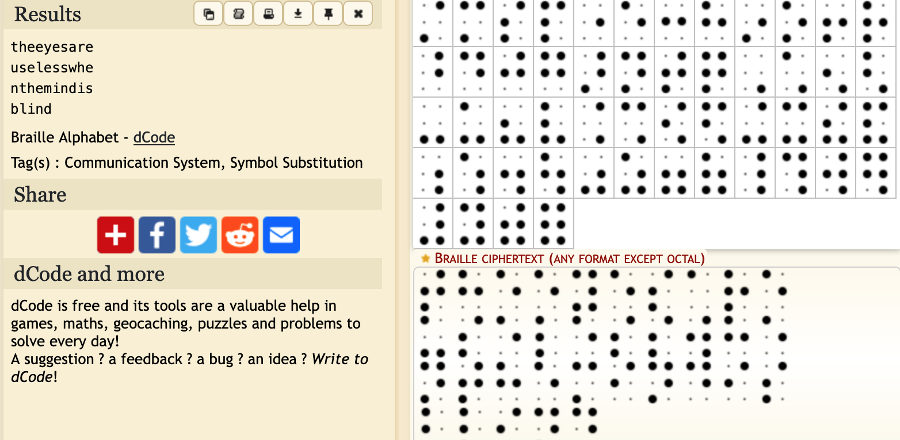
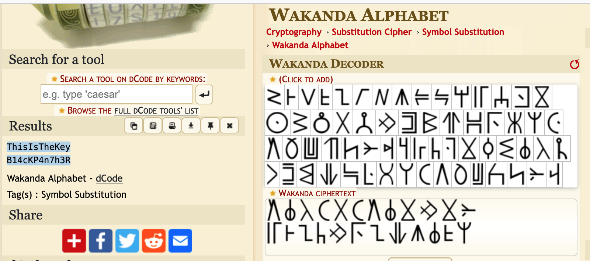

This was an interesting CTF hosted by a Myanmar-based cybersec firm.  My team was placed 5th in this CTF.

<!--more-->
### Solves

#### Dots
We are given an image with dots. Using Dcode, we can see that it is a representation of the Braille symbols.

Using the site to decode the symbols gives us the flag. 
**Flag:** `CybergonCTF{the_eyes_are_useless_when_the_mind_is_blind}`


#### All in One

We are given the following ciphertext, along with an image 
```
3n5g1jgAx0w{Bt@WPbH_9bm!mIgZ2aI}

9!SyZka>@a8[;B%tDySLX#bCV{nT+ZJYIS2;kD6]FDweC9%S9]R'*n[dV:Vz(kJ9>80r=31!E_a.@IOT3]F&mp+cP:9E!

yD7g,WeYM%9/U^!q_kf+/[N1s!2tBNfL/bKOc)]A
```
Recognizing that the image contains symbols from the Wakanda language, used Dcode to decode it:



This yields the following plaintext. 
```
ThisIsTheKey
B14cKP4n7h3R
```

At this point, I was stuck and could not figure out how to apply the key. It was 24-bytes long, 12 in each line. I tried various combinations of AES, but was not able to solve the cipher. 

After the CTF was complete, I learned that it is the Vigenere cipher with `B14cKP4n7h3R` as the key, with `A-Za-z0-9!@` as the alphabets. I modified a python implementation to cement my understanding of the Vigenere cipher. 

```python
    import string
    # borrowed from https://gist.github.com/dssstr/aedbb5e9f2185f366c6d6b50fad3e4a4

    def vigenere(
        text: str,
        key: str,
        alphabet=string.ascii_lowercase + string.ascii_uppercase + string.digits + "!@" ,
        encrypt=True):

        result = ''
        ki = 0  # need a separate index for the Key to prevent it being incremented if we encounter a strange character that is not in the alphabet
        for i in range(len(text)):
            if (text[i] in alphabet):
                letter_n = alphabet.index(text[i])
                key_n = alphabet.index(key[ki % len(key)])

                if encrypt:
                    value = (letter_n + key_n) % len(alphabet)
                else:
                    value = (letter_n - key_n) % len(alphabet)
                    # print(f"[{letter_n:2d} - {key_n:2d}] %{len(alphabet):2d} = {value:2d} : {alphabet[letter_n]} {key[i % len(key)]}  --> {alphabet[value]}")
                result += alphabet[value]
                ki += 1
            else: 
                print(f"{text[i]} not found in the alphabet ... passing it through as-is")
                result += text[i]
        return result

    def vigenere_encrypt(text, key):
        return vigenere(text=text, key=key, encrypt=True)

    def vigenere_decrypt(text, key):
        return vigenere(text=text, key=key, encrypt=False)

    text = '3n5g1jgAx0w{Bt@WPbH_9bm!mIgZ2aI}'
    key =  "B14cKP4n7h3R"
    print(vigenere_decrypt(text, key))
    # CyberGonCTF{W4k4ND4_f0r3v3R!!!!}
```

#### EZ-RSA
We are given the following source for the challenge, with my annotation:

```python
flag = open("flag.txt").read()
m = bytes_to_long(flag.encode())
p = getStrongPrime(512)     # strong p and q
q = getStrongPrime(512)     
n = p*q
e = 0x10001             # large e
c = pow(m,e,n)          # standard RSA

num = randint(100,999)  # random number 

p_encode = []
q_encode = []

p_list = re.findall('.',str(p)) # gets each character of stringified p and q ... so the character of each digit ... '0' to '9'
q_list = re.findall('.',str(q))

# each digit of p and q are XOR'd with the random number and turned back into a string and provided to us. 
for value in range(len(p_list)):
    p_encode.append(str(int(p_list[value]) ^ num))
    q_encode.append(str(int(q_list[value]) ^ num))

# we are given c, n, encoded p and q, (and e)
print(c)
print(n)
print(p_encode)
print(q_encode)
```

Since we have a small search space for the random number, we can bruteforce the search in `[100 - 999]` to see which values yield values between `ord('0') and ord('9')`, with the consraints that the contents of `p` and `q` should only be digits. Once we determine `num`, we can reverse-engineer `p` and `q` and decode the cipher. 

The solution is as follows: 
```python
    # we are given c, n, and encoded values of  p and q 

    # Bruteforce the original random number used
    possible_nums = []
    for i in range(100, 999):
        if (all(x >= ord('0') and x <= ord('9') for x in [int(pval) ^ i for pval in set(p)] )):
            if (all(x >= ord('0') and x <= ord('9') for x in [int(qval) ^ i for qval in set(q)] )):
                possible_nums.append(i)
    print(f"{len(possible_nums)} possible values found. Trying each one.")
    for num in possible_nums:
        fac_p = ''.join([chr(int(x)^num) for x in p])
        fac_p = int(fac_p)
        e = 0x10001

        if (n% fac_p == 0):
            fac_q = n // fac_p
            phi = (fac_p-1)*(fac_q-1)

            d = inverse(e, phi)
            m = pow(c, d, n)
            print(f"{num}: {long_to_bytes(m).decode()}")
            # 563: CyberGonCTF{345y_p34sy_R54_c1ph3R}
```

#### dO nOT aCCESS

We are given a hexavue cipher based image, which translates to the following text

```
ACTTCGTAGT
TGCGATTCCC
ATTGGAATTC
TGGTTGCTCG
CTTCTTTGAA
```
`Row-wise reading order` : `ACTTCGTAGTTGCGATTCCCATTGGAATTCTGGTTGCTCGCTTCTTTGAA`

`Column-wise reading order` : `ATATCCGTGTTCTGTTGGTCCAGTTGTAGTTTACTACTTGGCTCATCCGA`

The encoding uses the following scheme to translate a letter into a DNA codon-triplet. 


Reversing the encoding is pretty straight-forward lookup.

```python
    import string
    import itertools
    decoder = string.ascii_lowercase + string.ascii_uppercase + string.digits[1:]+ string.digits[0] + ' .'
    decoder_dict = {}
    for i, key in enumerate(itertools.product('ACGT', repeat=3)):
        decoder_dict[''.join(key)] = decoder[i]

    # ROW and COL reading orders
    for STR in ["ACTTCGTAGTTGCGATTCCCATTGGAATTCTGGTTGCTCGCTTCTTTGAA", "ATATCCGTGTTCTGTTGGTCCAGTTGTAGTTTACTACTTGGCTCATCCGA"]:
        flag = ""
        for i in range(3,len(STR),3):
            flag += decoder_dict[STR[i-3:i]]
        print(f"{STR} ===> {flag}")

#ACTTCGTAGTTGCGATTCCCATTGGAATTCTGGTTGCTCGCTTCTTTGAA ===> h3Y y0u G07 DN4   <--- correct flag
#ATATCCGTGTTCTGTTGGTCCAGTTGTAGTTTACTACTTGGCTCATCCGA ===> m2U0872l8l9CFP12
```

#### Hide and Seek
We are given a file with PNG extension, which looks to be malformed and does not open. Viewing the file in an hex editor shows that the file has none of the expected fields from a PNG file. The content has many strings that reference Adobe and Layers. So, I guessed it might be a photoshop image file. Looking for the fileformat of the Photoshop image file, showed that except for the first 4 bytes, the image follows the Adobe `8BPS` file format exactly.  So, changing the magic bytes of the file and opening it GIMP showed the flag in one of the layers of the image. 

* Reference : https://www.adobe.com/devnet-apps/photoshop/fileformatashtml/

`The file header contains the basic properties of the image.`

|Length|Description|
|----|----|
|4|Signature: always equal to '8BPS' . Do not try to read the file if the signature does not match this value.|
|2|Version: always equal to 1. Do not try to read the file if the version does not match this value. (**PSB** version is 2.)
|6|Reserved: must be zero.|
|2|The number of channels in the image, including any alpha channels. Supported range is 1 to 56.|
|4|The height of the image in pixels. Supported range is 1 to 30,000.(**PSB** max of 300,000.)|
|4|The width of the image in pixels. Supported range is 1 to 30,000.(**PSB** max of 300,000)|
|2|Depth: the number of bits per channel. Supported values are 1, 8, 16 and 32.|
|2|The color mode of the file. Supported values are: Bitmap = 0; Grayscale = 1; Indexed = 2; RGB = 3; CMYK = 4; Multichannel = 7; Duotone = 8; Lab = 9.|


#### Other solves
* DTMF in `Captured.m4a` : 
* Morse code in `Help_me.mp4` : {SOS_SOS_SOS}
* Base64 string in Excel sheet 
* 


### Resources, Writeups
* OSInt enumeration : https://whatsmyname.app/
* https://www.youtube.com/watch?v=sZAVLJTHtj4
* Sloppy Joe Pirates: https://www.youtube.com/watch?v=bFAElPXPB4w
* https://learn-cyber.net/writeup/What-Is-It
* https://learn-cyber.net/writeup/Super-Secure-Encryption
* https://learn-cyber.net/writeup/Old-Obfuscation
* https://learn-cyber.net/writeup/Hollywood


### Challenges
|Category|Challenge|Description
|----|----|----
|CRYPTO|All in One|Vigenere with Wakanda text cipher
|CRYPTO|Dots|Braille to text 
|CRYPTO|EZ RSA|crack substitution cipher for p & q
|CRYPTO|Game|
|CRYPTO|Now You See Me 1|
|CRYPTO|Now You See Me 2|
|CRYPTO|Warm Up 1|
|CRYPTO|Warm Up 2|
|CRYPTO|dO nOT aCCESS|Hexavue -> DNA codon triplets -> text
|FORENSICS|8cel|Excel formula -> base64 
|FORENSICS|Device Info (ep1)|
|FORENSICS|Device Info (ep2)|
|FORENSICS|Frozen Xip|malformed zip -> SNOW whitespace steg
|FORENSICS|Hide and Seek|
|FORENSICS|Malfunctioning File|
|IR|Basic - 1|
|IR|Try Hard|
|IR|Victim Info|
|MISC|BMW for Sale|
|MISC|Back Door|
|MISC|Captured|
|MISC|Discord|
|MISC|Find Me|
|MISC|Help Me|
|MISC|Memory|
|MISC|Move Move|
|MISC|Operation Ghost|
|MISC|Storm Zero Five Five Eight|
|MISC|Wallet Address|
|OSINT|Arrival|
|OSINT|Big Fan 1|
|OSINT|Big Fan 2|
|OSINT|Big Fan 3|
|OSINT|Channel|
|OSINT|Country|
|OSINT|Let`s Track Him|
|OSINT|Singer|
|OSINT|Time To Rest|
|OSINT|Warm Up 1|
|OSINT|Where Is His Next Point ?|
|PWN|Tour|
|PWN|autograph|
|PWN|notebook|
|PWN|really random|printf vulnerability
|PWN|teeny|SIGROP
|STEGANO|Catch Me If You Can|
|STEGANO|Data Exfiltration|malformed PSD -> layers
|STEGANO|Warm Up 1|
|STEGANO|Your Favorite MTV|
|STEGANO|Your_Craziest_Song|
|WEB|Cybergon's Blog|
|WEB|Do you believe in Luck|
|WEB|Flappy block v2|
|WEB|Love is Blurry|
|reversing|Hollywood|
|reversing|Mad Genius|
|reversing|Old Obfuscation|
|reversing|Super Secure Encryption|
|reversing|What is it|