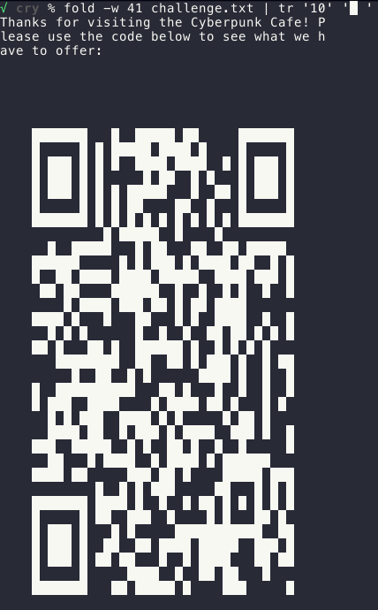

ToDo: Put the summary here

<!--more-->

### Solves
#### Cyberpunk Cafe
```bash
% cat challenge.txt
Thanks for visiting the Cyberpunk Cafe! Please use the code below to see what we have to offer:

000000000000000000000000000000000000000000000000000000... 10111010100000101100101000101110100

% tail -1 challenge.txt | wc
       0       1    1681

% python -c "print(pow(1681,0.5))"
41.0
```

```bash
% fold -w 41 challenge.txt | tr '10' '█ '
```



#### pi is overratEd

```
268293811
43467613
11502819
78705572
97132652
14581013
1710460813
```
* https://www.newjerusalem.org/Constants
* http://www.subidiom.com/pi/pi.asp

```
e = 2.7182...534655571565717573791021089719722600266340076895429
                                 ^ <-- 268,293,811st digit
e = 2.7182...986466215237333842560312310548810825311165920953020
                                 ^ <-- 43,467,613rd digit
e = 2.7182...199375436731120438311159510131964056178944953860444
                                 ^ <-- 11,502,819th digit
e = 2.7182...411513393387525824039510511403237922434710706786042
                                 ^ <-- 78,705,572nd digit
e = 2.7182...391867744703225949531149711613193728896498249481064
                                 ^ <-- 97,132,652nd digit
e = 2.7182...711676309231115762890511111033100276964735988829985
                                 ^ <-- 14,581,013rd digit
e = 2.7182...576377683123465069457108631254521100432595136557413
                                 ^ <-- 1,710,460,813rd digit
```
```python
print(''.join([chr(int(x)) for x in ("102 108 97 1" +  "03 123 105 " + "115 95 101 31 " + "95 105 114 "+ "114 97 116 1" + "05 111 110 3" + "7 108 63 125").split()]))

# flag{is_e_irraton%l?}
# 37 should be 97 ... giving the flag as 
# flag{is_e_irratonal?}
```


|Category|Challenge|Description
|----|----|----
|Crypto|PseudoRandom| time based seeed for PRNG
|Crypto|Quantum Crypto| Quantum key material ???
|Crypto|Zodiac| Zodiac cipher, azcrypt
|Forensics|Lost Evidence|
|Intro|CTF Basics|
|Intro|Discord Support|
|Misc|Better OneShotGPT|
|Misc|OneShotGPT|
|Reversing / Pwnable|Braggart|
|Reversing / Pwnable|Brick Breaker|
|Reversing / Pwnable|Skiddyana Pwnz and the Loom of Fate|
|Reversing / Pwnable|The Javascript One|Obfuscated JS
|SWAG|SWAG|
|Stego|Ancient Scrawls|trace mouse movements in a GIF
|Stego|Cyberpunk Cafe|binary string to QR code
|Stego|pi is overratEd|
|Tenable Publications|3 Strikes and you’re out!|
|Tenable Publications|Start Your Engines|
|Web / Cloud|Bad Waf No Donut|
|Web / Cloud|Cat Viewer|
|Web / Cloud|Rose|