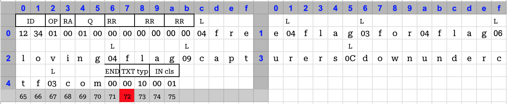
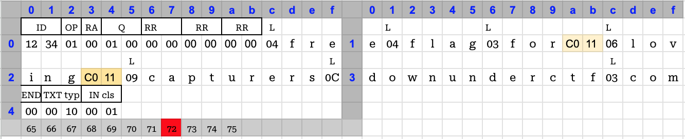
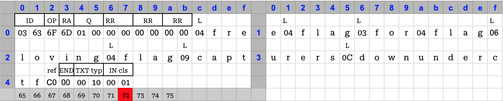

This was a very high quality CTF with over sixty (!!) challenges.  This CTF had everything we need in a CTF - plenty of unique challenges, wide variety, beginner to advanced level of difficulty and immediate release of official writeups. Capturing a mix of both my solutions and official solutions for future reference. 
<!--more-->

### Beginner Challenges
#### Pynycode
`I've never seen a Python program like this before. [Author: hashkitten]`

We are given a python source file that is coded in `punycode`. Researching on punycode, gives us the following definition from Wikipedia.

`Punycode is a representation of Unicode with the limited ASCII character subset used for Internet hostnames. Using Punycode, host names containing Unicode characters are transcoded to a subset of ASCII consisting of letters, digits, and hyphens, which is called the letter–digit–hyphen (LDH) subset. For example, München (German name for Munich) is encoded as Mnchen-3ya.`

```python
#coding: punycode
def _(): pass
('Correct!' if ('Enter the flag: ') == 'DUCTF{%s}' % _.____ else 'Wrong!')-gdd7dd23l3by980a4baunja1d4ukc3a3e39172b4sagce87ciajq2bi5atq4b9b3a3cy0gqa9019gtar0ck
```

So, in essence, it is a self-modifiable codec scheme and Python has built-in support for it. All the ASCII characters are extracted from the string, and the non-ascii (unicode) characters are encoded at the end to be inserted into the appropriate positions in the string after decoding. I tried to use python's built in `decode()` function to decode the source or even the specific string that appears after `Wrong!')`. They did not yield any comprehensible solution. So, I brute forced the subset of the bytestream that would provide me a comprehensible solution. I did not pay close attention to the output and missed the fact that at offset=17bytes, the sourcefile decodes to readable python code, albeit with unicode characters.

```python
s = open("pyny.py", "rb").read()

for i in range(len(s)):
    print(f"Offset: {i} : {s[i:].decode('punycode')}")
    input()
# shows that at offset 17, we get a proper python code with unicode text
'''
Offset: 17 : 
def ᵖʸᵗʰºⁿ_ʷªʳᵐᵘᵖ(): pass
ᵖʳᵢⁿᵗ('Correct!' if ᵢⁿᵖᵘᵗ('Enter the flag: ') == 'DUCTF{%s}' % ᵖʸᵗʰºⁿ_ʷªʳᵐᵘᵖ.__ⁿªᵐᵉ__ else 'Wrong!')
'''
```

So, if I had paid close attention, the final solution would have been: 
```python
In [1]: open('pyny.py', 'rb').read()[17:].decode('punycode')    # the first 17 bytes are the 'coding' declaration, that should be removed. 
Out[1]: "\ndef ᵖʸᵗʰºⁿ_ʷªʳᵐᵘᵖ(): pass\nᵖʳᵢⁿᵗ('Correct!' if ᵢⁿᵖᵘᵗ('Enter the flag: ') == 'DUCTF{%s}' % ᵖʸᵗʰºⁿ_ʷªʳᵐᵘᵖ.__ⁿªᵐᵉ__ else 'Wrong!')"

In [2]: exec(open('pyny.py', 'rb').read()[17:].decode('punycode'))
Enter the flag: DUCTF{python_warmup}
Correct!
```
Smart solution from the community writeups, using `ltrace`
```bash
% echo | ltrace -f -s9999 python3 pyny.py 2>&1 | grep -Pi 'ductf\{.*\}'
[... SNIP ...]
[pid 35996] memcpy(0x7fe612c29c50, "\001\0\0\0\0\0\0\0\200\211\225\0\0\0\0\0m\0\0\0\0\0\0\0\377\377\377\377\377\377\377\377\344\377\377\377\0\377\377\377\0\0\0\0\0\0\0\0DUCTF{python_warmup}\0", 69) = 0x7fe612c29c50
```
Another smart solution, using coredump (adapted to MacOS by me)
```bash
# Run the program in the background
% python3 pyny.py &
[1] 6210
# Trigger the generation of the core file 
% sudo gcore -o ./core 6210  
# Search the core file for the string 'DUCTF'
% xxd core | grep -A5 -B5 -i DUCTF   
--
01c7f1f0: 00b6 1808 0100 0000 d0b5 1808 0100 0000  ................
01c7f200: 0000 0000 0000 0000 3f81 bfe1 b597 2827  ........?.....('
01c7f210: 0046 8279 f07f 0000 b920 6966 20e1 b5a2  .F.y..... if ...
01c7f220: e281 bfe1 b596 e1b5 98e1 b597 2827 456e  ............('En
01c7f230: 7465 7220 7468 6520 666c 6167 3a20 2729  ter the flag: ')
01c7f240: 203d 3d20 2744 5543 5446 7b25 737d 2720   == 'DUCTF{%s}' 
01c7f250: 2520 e1b5 96ca b8e1 b597 cab0 c2ba e281  % ..............
01c7f260: bf5f cab7 c2aa cab3 e1b5 90e1 b598 e1b5  ._..............
01c7f270: 962e 5f5f e281 bfc2 aae1 b590 e1b5 895f  ..__..........._
01c7f280: 5f20 656c 7365 2027 5772 6f6e 6721 2729  _ else 'Wrong!')
01c7f290: 0a00 0a08 0100 0000 70b6 0a08 0100 0000  ........p.......
--
# 0x01c7f230  = 29880880
# print 100 UTF-8 characters starting for offset
% xxd -p -l100 -s 29880880 ./core | xxd -p -r 
ter the flag: ') == 'DUCTF{%s}' % ᵖʸᵗʰºⁿ_ʷªʳᵐᵘᵖ.__ⁿªᵐᵉ__ else 'Wrong!')
```

#### Needle in IAM
`I've been told the flag I need is in description of this role, but I keep getting an error with the following command. Surely there's another way? Author:[BootlegSorcery@]`

**`gcloud iam roles describe ComputeOperator --project=<PROJECT>`**

We are given credentials to a Google cloud account as `credentials.json`. From that JSON file, we get the project-id as `needle-in-iam`.
```json
{
  "type": "service_account",
  "project_id": "needle-in-iam",  <<--- project-id
  ...
  ...
  "universe_domain": "googleapis.com"
}
```
Using that project id, we can list the IAM roles defined. In this list, we get the flag in the description of the `ComputeOperator` role. 

```bash
% gcloud iam roles list --project 'needle-in-iam' | grep -B3 "ComputeOperator"
---
description: DUCTF{D3scr1be_L1ST_Wh4ts_th3_d1fference_FDyIMbnDmX}
etag: BwYDv1xX9Y4=
name: projects/needle-in-iam/roles/ComputeOperator
```
#### helpless
`I accidentally set my system shell to the Python help() function! Help!!`
`The flag is at /home/ductf/flag.txt. Author: [hashkitten]`

We are given a SSH credentials and a challenge server. 

```
Ubuntu comes with ABSOLUTELY NO WARRANTY, to the extent permitted by
applicable law.

Last login: Sun Sep  3 18:12:09 2023 from 10.152.0.21

Welcome to Python 3.10's help utility!

If this is your first time using Python, you should definitely check out
the tutorial on the internet at https://docs.python.org/3.10/tutorial/.

Enter the name of any module, keyword, or topic to get help on writing
Python programs and using Python modules.  To quit this help utility and
return to the interpreter, just type "quit".

To get a list of available modules, keywords, symbols, or topics, type
"modules", "keywords", "symbols", or "topics".  Each module also comes
with a one-line summary of what it does; to list the modules whose name
or summary contain a given string such as "spam", type "modules spam".

help> 
```
To get the flag, 
1. Enter a legitimate python help topic that is over one page long, so that a paginator is invoked. I used `os`.
1. The help for module `os` is displayed and paused after the first page
1. The paginator has a colon `:` prompt
1. At the prompt, enter another colon and `e`, i.e `:e`
1. The prompt changes to `Examine:`. Enter `flag.txt`
1. The file `flag.txt` is loaded into the current buffer and displays the flag `DUCTF{sometimes_less_is_more}`

####

### Crypto
#### apbq rsa i
`Just a simple RSA problem with some extra equations.`

We are given this challenge source, showing standard RSA, with two hints about private factors `p` and `q`.

```python
p = getPrime(1024)     # strong prime
q = getPrime(1024)     # strong prime
n = p * q
e = 0x10001

hints = []
for _ in range(2):
    a, b = randint(0, 2**12), randint(0, 2**312)
    hints.append(a * p + b * q)

FLAG = open('flag.txt', 'rb').read().strip()
c = pow(bytes_to_long(FLAG), e, n)
print(f'{n = }')
print(f'{c = }')
print(f'{hints = }')
```
This is textbook RSA with no structural issues. To solve it, we are given two leaks about \\(p\\) and \\(q\\) as hints.
The hints 

$$
    h_1 = a_1 * p + b_1 * q  \\\
    h_2 = a_2 * p + b_2 * q  \\\
    \text{ where }0 \le a_n \le 2^{12} \text{   and   } 0 \le b_n \le 2^{312} \\\
    \text{ Thus, } a_n \ll b_n \text{ and can be bruteforced}
$$

Continuing, 

$$
    h_1 * a_2 = a_1 * a_2 * p + b_1 * a_2 * q \\\
    h_2 * a_1 = a_1 * a_2 * p + b_2 * a_1 * q \\\
    \therefore h_2 * a_1 - h_1 * a_2 = (b_2 * a_1 - b_1 * a_2) *q \\\
$$

The factor \\((b_2 * a_1 - b_1 * a_2)\\) should be small, as \\(b_1 \approx b_2 \text{  and   } a_1 \approx a_2\\). Thus, \\(GCD(h_2 * a_1 - h_1 * a_2, n) \overset{!}{=} \text{q      } \\)

So, we will determine `q` by bruteforcing \\((a_1, a_2)\text{  in [0 .. }2^{12}]\\) 

```python
# We are given n, e, c, hints=[h1, h2]
    found = False
    for a1 in range(1, 2**12):
        for a2 in range(1, 2**12):
            hint = h2 * a1 - h1 * a2 
            q = math.gcd(hint, n)
            if (q > 1): 
                # apply textbook RSA
                p = n // q
                phi = (p-1)*(q-1)
                d = inverse(e, phi)
                m = long_to_bytes(pow(c, d, n))
                if (b'DUCTF' in m):
                    print(f"{a1} {a2} | {m}")
                    found = True
                    break
        if (found): 
            break
# 410 761 | b'DUCTF{gcd_1s_a_g00d_alg0r1thm_f0r_th3_t00lbox}'
```
#### abpq rsa ii


* https://eprint.iacr.org/2011/388.pdf 
* https://eprint.iacr.org/2020/461.pdf
* https://www.youtube.com/watch?v=LXWtgl54Eos
* https://eprint.iacr.org/2023/032.pdf


### Misc 
#### Mini DNS Server
`This mini DNS server hands out free flags to fellow mini DNS enthusiasts. [Author: joseph, pix]`

We are given the source of a DNS server, from which we can discern the following information. 
1. The DNS server uses the Python `dnslib` module
1. To get the flag we need to send a DNS query to the server that meets the following conditions
1. The query type should be `TXT`
1. The name to be queries should be `'free.flag.for.flag.loving.flag.capturers.downunderctf.com'`
1. The length of the request can at most be 72 bytes.
1. The server sends a `REFUSED` message if the request is longer than 72 bytes or if the query type is not `TXT`
1. If the name does not match what is expected, we get back a `NOPE` message.
1. After downloading the `dnslib` module, I ran the Server locally and was able to connect to it via `dig`, `dnslib` client and other means.
1. A straight-forward `TXT` query from `dig` for the given name is 86 bytes. 
1. So, I went down the path of hand-constructing the DNS Query packet. 
```
% dig @127.0.0.1 -p 8053 free.flag.for.flag.loving.flag.capturers.downunderctf.com TXT  
REQUEST: b'\x18\x92\x01 \x00\x01\x00\x00\x00\x00\x00\x01\x04free\x04flag\x03for\x04flag\x06loving\x04flag\tcapturers\x0cdownunderctf\x03com\x00\x00\x10\x00\x01\x00\x00)\x10\x00\x00\x00\x00\x00\x00\x00' 86
2023-09-03 22:51:23 [DNSHandler:Resolver] Reply: [127.0.0.1:54312] (udp) / 'free.flag.for.flag.loving.flag.capturers.downunderctf.com.' (TXT) / REFUSED
```
* Constructing the packet using online guides[^1] with absolutely the minimum required fields needed 75 bytes. 

* I searched the internet and found references[^2] to DNS compression, where if a name is repeated, its subsequent occurrences can be replaced with a pointer to the first occurrence. Since, the name we were querying has 3 instances of the word `flag`, I thought I could replace 2 occurrences with reference to the first one. So, I constructed a packet like this: 

It was only 69 bytes long and had two references to `flag` which was at the offset `0x11`. Just one small problem. It did not work. The server rejected the packet as malformed and causing recursion errors.

* After the CTF, I discovered the author's solution, which used the transaction id and operand fields to setup the `.com` part of the name and referencing it to bring the request size to be exactly 72 bytes. 


* More details here (https://justinapplegate.me/2023/ductf-minidns/) on why `flag` cannot be used as the pointer

[^1]: https://cabulous.medium.com/dns-message-how-to-read-query-and-response-message-cfebcb4fe817
[^2]: https://spathis.medium.com/how-dns-got-its-messages-on-diet-c49568b234a2

#### Simple FTP Server
`It always confused me why python had a simple HTTP server, but never a simple FTP server. So I made my own! I hope I didn't leave secrets open to the global internet...[Author: BootlegSorcery@]`

We are given a purported FTP server address and nothing else. Connecting to the FTP server gives us a normal looking FTP server. We can interact using standard verbs in the FTP protocol.
```bash
% nc 2023.ductf.dev 30029
220 vsFTPd (v2.3.4) ready...
LIST
150 Here comes the directory listing.
drwxr-xr-x 1 user group 4096 Aug 04 02:02 usr
drwxr-xr-x 1 user group 4096 Aug 04 02:06 lib64
drwxr-xr-x 1 user group 4096 Aug 21 01:13 lib
drwxr-xr-x 1 user group 4096 Aug 21 01:14 bin
drwxr-xr-x 1 user group 4096 Aug 21 01:12 kctf
drwxr-xr-x 1 user group 4096 Aug 30 04:23 chal
226 Directory send OK.
CWD chal
250 OK.
LIST
150 Here comes the directory listing.
-rwxr-xr-x 1 user group 7151 Aug 30 04:23 pwn
-rw-r--r-- 1 user group 27 Aug 31 02:14 flag.txt
226 Directory send OK.
RETR flag.txt
150 Opening data connection.
226 Transfer complete.
DUCTF{- Actually no, I don't feel like giving that up yet. ;)
RETR pwn
<prints source file>
...
```
Retrieving the `pwn` file gives the source code of the FTP server. It is a light-weight FTP server that is written in Python, which uses python's reflection features to map commands to methods. The reflection is done by the line: `func=operator.attrgetter(cmd)(self)`

```python
    f = open("/chal/flag.txt", "r")
    FLAG = f.read()   # This variable is not referenced any further
    f.close()

    def run(self):
        sys.stdout.buffer.write('220 vsFTPd (v2.3.4) ready...\r\n'.encode(ENCODING)) # Red Herring

        while True:
            sys.stdout.flush()
            recv=sys.stdin.buffer.readline()
            if not recv: break
            else:
                lst = recv.decode(ENCODING).strip().split(" ", 1)
                if len(lst) < 2:
                    cmd, args = lst[0], ""
                else:
                    cmd, args = lst      
                try:
                    func=operator.attrgetter(cmd)(self)
                    msg = func(args)
                    sys.stdout.buffer.write(f'{msg}'.encode(ENCODING))
                except Exception as e:
                    sys.stdout.buffer.write(f'500 Sorry. {e}\r\n'.encode(ENCODING))

```
So, we need to treat this challenge like a pyjail challenge, where we can only invoke methods on the `FTPServerThread` object and must read the value of the `FLAG` variable. 

```bash
% nc 2023.ductf.dev 30029
__class__.__init__.__globals__.__getitem__ FLAG
DUCTF{15_this_4_j41lbr34k?}

# official solution
__init__.__globals__.get FLAG
```

### Resources and writeups
* Official writeups: https://github.com/DownUnderCTF/Challenges_2023_Public
* https://www.skullsecurity.org/2015/how-i-nearly-almost-saved-the-internet-starring-afl-fuzz-and-dnsmasq


### Challenges

|Category|Challenge|Description
|----|----|----
beginner |All Father's Wisdom|
beginner |Needle In IAM|
beginner |Survey|
beginner |Welcome to DUCTF!|
beginner |blinkybill|
beginner |complementary|
beginner |confusing|
beginner |discord|
beginner |downunderflow|
beginner |flag art|
beginner |helpless|
beginner |one byte|
beginner |proxed|
beginner |pyny|
beginner |randomly chosen|
beginner |static file server|
beginner |the bridgekeepers 3rd question|
beginner |xxd-server|
beginner |𝕏|
blockchain |Another Please|
blockchain |Eight Five Four Five|
blockchain |Immutable|
blockchain |Monkeing Around|
crypto |apbq rsa ii|
crypto |apbq rsa i|
crypto |dilithium±|
crypto |encrypted mail|
crypto |fnv|
crypto |handshake|
crypto |hhhhh|
crypto |lcg card gimmicks|
misc |My First C Program!|
misc |Rogueful Helper|
misc |SimpleFTPServer|
misc |Smart Calculator|
misc |baby ruby|
misc |daas|
misc |impossible|
misc |mini dns server|
misc |real baby ruby|
osint |Bridget's Back!|
osint |Comeacroppa|
osint |Excellent Vista!|
osint |Shipwrecked|
osint |faraday|
osint |monke bars|
pwn |baby crm|
pwn |binary mail|
pwn |return to monke|
pwn |roppenheimer|
pwn |safe calculator|
pwn |shifty mem|
pwn |the great escape|
pwn |vroom vroom|
rev |SPACEGAME|
rev |advanced vector expositions|
rev |masked squares flag checker|
rev |number theoretic flag checker|
rev |sideways|
rev |wrong signal|
web |0day blog|
web |actually-proxed|
web |cgi fridays|
web |crossed monkes|
web |grades_grades_grades|
web |secure blog|
web |smooth jazz|
web |strapi in|
