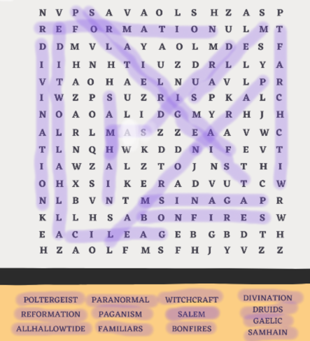
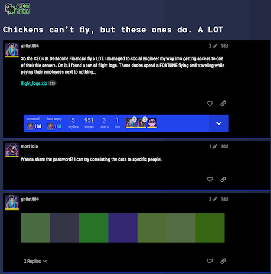

I played this CTF with a newbie highschool CTF team. My goal was to introduce them to CTFs and the variety of challenges. This CTF was perfect for that purpose. They had over 60 challenges covering many aspects of Cybersec. The innovative, immersive experience that showed both the offensive and defensive aspects of cybersec was extremely educational. Further, the graphics for the challenges were fantastic!

### Crypto
#### Coin Code 
`We found this image of a coin that belongs to a member of DEADFACE. The image has something to do with the encoded message. We believe the message indicates who this DEADFACE actor wants to target next. Figure out who the target is.`
The encoded message reads: `Fwpl lsjywl xgj ew oadd tw Smjgjs Hzsjes.`


This is a variation of the rot13 challenge. We need to use the two rings of alphabets on the coin and how they are positioned with respect to each other as a way to solve the encoded message.

```python
diff = ord('I')-ord('A')
ct = "Fwpl lsjywl xgj ew oadd tw Smjgjs Hzsjes"
print(''.join([chr(ord('a') + (ord(c)-ord('a')+ diff)%26) if c.islower() 
    else chr(ord('A') + (ord(c)-ord('A')+ diff)%26) if c.isupper() 
    else c for c in ct]))

# Next target for me will be Aurora Pharma
```
#### Letter Soup
`We believe we have ran into one of the newest members of DEADFACE while they were waiting for the train. The member seemed to have gotten spooked and stood up suddenly to jump on the train right before the doors shut. They seemed to have gotten away, but dropped this innocent looking word search. I believe this member might be actually a courier for DEADFACE. Let’s solve the word search to decode the mystery message. We believe the message might tell us their next move.`

We are given the following word-search puzzle. Once we solve the puzzle, we have the following letters left over: `MSHNHZSISHJRMLHAOLYZZOPULPUAOLZBU`

```python
c = "MSHNHZISHJRMLHAOLYZZOPULPUAOLZBU"
print(*[chr(ord('A') +  (ord(x)-ord('A')+19)%26) for x in c])

# FLAG{ASBLACKFEATHERSSHINEINTHESUN}
```
Applying a rot19 logic to the left-over letters gives us the flag as:
`FLAGASBLACKFEATHERSSHINEINTHESUN`


#### Bitz And Boltz
`Yet another message was left at the scene. Perhaps they think they are giving us a lesson…either way report back to us what this says but dont give us guesses! Make sure you check your work!`

We are given a text file with binary string like the following ...
`01100100 01101111 01101110 01110100 00100000 01100110 01101111 01110010 01100111  ...`

```bash
% cat bitzandbotz.txt | tr -d ' ' |  perl -lpe '$_=pack"B*",$_'
dont forget the basics! but you diddnt think it would be that easy did you? HAHAHAHAHA Silly Turbos! More Like Turbo TACKY!!!! the flag is 66 6c 61 67 7b 69 6f 6c 73 6c 77 64 71 67 75 68 79 68 75 76 68 6c 77 7d

% cat bitzandbotz.txt | tr -d ' ' |  perl -lpe '$_=pack"B*",$_' | cut -c140- | xxd -p -r
flag{iolslwdqguhyhuvhlw}

% python -c "print(''.join([chr(ord('a') +  (ord(x)-ord('a')+23)%26) for x in 'iolslwdqguhyhuvhlw']))"
flipitandreverseit
```
#### Refill on Soup
`How could we have missed this?? There were TWO word searches stuck together that the DEADFACE courier dropped. We’ve already solved the first one, but maybe solving this second word search will help us uncover the secret message they’re trying to covertly relay to the other members of DEADFACE. Hopefully, THIS will tell us how they plan to execute their next move.`



`nvavaolshzaspulmvyaolmshnhuzdlyaohanvlzpuzpklaoliyhjrlazzavw nqwkddevwzlztjnthxskeadvucbvtrklhsweebgbdthhzaolfmsfhjyvzz`


```python
c = "nvavaolshzaspulmvyaolmshnhuzdlyaohanvlzpuzpklaoliyhjrlazzavwnqwkddevwzlztjnthxskeadvucbvtrklhsweebgbdthhzaolfmsfhjyvzz"
print(''.join([chr(ord('a') +  (ord(x)-ord('a')+19)%26) for x in c]))

# gotothelastlinefortheflaganswerthatgoesinsidethebracketsstopgjpdwwxopsesmcgmaqldxtwonvuomkdealpxxuzuwmaastheyflyacross

# just the last line
print(''.join([chr(ord('a') +  (ord(x)-ord('a')+19)%26) for x in c[-15:]]))
# astheyflyacross
```
#### Color me impressed


```python
    from PIL import Image

    im = Image.open('color_me_impressed.png')
    print(im.size)
    wid = im.size[0]//7
    half = im.size[1]//2
    out_str = ""
    rgb_im = im.convert('RGB')
    for i in range(7):  
        r, g, b = rgb_im.getpixel( (half+i*wid, half) )
        out_str += chr(r)
        out_str += chr(g)
        out_str += chr(b)
    print(out_str) 
    # Gl@55H#u$3$tOn3Sm@5h
```
Use this as the password to unzip the `flight_logs.zip`, which contains the flag

```bash
% unzip -P 'Gl@55H#u$3$tOn3Sm@5h' -p flight_logs.zip | grep 'flag{'
{"flag": "flag{D3@dF@c3Rulz!}"}
```

### Programming
#### Deaddrop
`The Incident Response Team at Aurora Pharmaceuticals recently recovered this file from a user’s computer. The artifacts indicate it was accessed by what they believe to be multiple DEADFACE members. The program appears to have set up the user’s workstation as a dead drop for DEADFACE members to convert a secret numerical code into a password string for further target access. Our decoding attempts have been unsuccessful, but the script appears to contain a recovery code that may be a good starting point.`

```python
# Password recovery:
# buA9kvZ=T_A}b[J8l:@ob_tviPZtb_<olOpxkvZ=T_=xju]olOpxkvZ=T_bxlu]olOpxkvZ=QIEE
arr = ['empty', 'interest', 'current', 'valuable', 'influence', 'from', 'scolded', 'would', 'got', 'key', 'facility', 'run', 'great', 'tack', 'scent', 'close', 'are', 'a', 'plan', 'counter', 'earth', 'self', 'we', 'sick', 'return',
       'admit', 'bear', 'cache', 'to', 'grab', 'domination', 'feedback', 'especially', 'motivate', 'tool', 'world', 'phase', 'semblance', 'tone', 'is', 'will', 'the', 'can', 'global', 'tell', 'box', 'alarm', 'life', 'necessary']

def print_password(nums):
    if len(nums) < 1:
        print("Must provide a list of at least one number i.e. [1]")
    print("flag{{{}}}".format(" ".join([arr[num] for num in nums])))

def left_shift(s, n):
    return ''.join(chr(ord(char) - n) for char in s)
```

Add the following to the 

```python
enc_pass = "buA9kvZ=T_A}b[J8l:@ob_tviPZtb_<olOpxkvZ=T_=xju]olOpxkvZ=T_bxlu]olOpxkvZ=QIEE"

max_n = min([ord(c)-32 for c in enc_pass])
print(f"{max_n=}")

for i in range(max_n):
    print(f"{i}: {left_shift(enc_pass, i)}")
print(left_shift(enc_pass, 8))  # Zm91cnR5LW9uZSB0d28gZWlnaHRlZW4gdGhpcnR5LW5pbmUgdGhpcnR5LWZpdmUgdGhpcnR5IA==
print(b64decode(left_shift(enc_pass, 8)))   # b'fourty-one two eighteen thirty-nine thirty-five thirty '
msg = [41, 2, 18, 39, 35, 30]
print(f"{msg=}")    # msg=[41, 2, 18, 39, 35, 30]
print_password(msg)    
# flag{the current plan is world domination}
```
### Forensics
#### What's the Wallet

```
...
$encodedScript = @"
function Store-BtcWalletAddress {
    `$global:BtcWalletAddress = [System.Convert]::FromBase64String([System.Text.Encoding]::UTF8.GetBytes('bjMzaGE1bm96aXhlNnJyZzcxa2d3eWlubWt1c3gy'))
}
...
```

```bash
% echo "bjMzaGE1bm96aXhlNnJyZzcxa2d3eWlubWt1c3gy" | base64 -d
n33ha5nozixe6rrg71kgwyinmkusx2
```

#### Host Busters 1


#### Host Busters 2


#### Host Busters 3


#### Host Busters 4


#### Host Busters 5


### Challenges

|Category|Challenge|Description
|----|----|----
BONUS |Lilith|
BONUS |Off the Rails|
BONUS |Zombie Math|
Capstone |End of the Road|
Cryptography |0ff Again On Aga1n|
Cryptography |B1Tz and B0tZ|
Cryptography |Coin Code|
Cryptography |Color Me Impressed|
Cryptography |HAM JAM|
Cryptography |Halloween +1|
Cryptography |Letter Soup|
Cryptography |Reflections|
Cryptography |Slothy|
Cryptography |Up in the Air|
Forensics |Host Busters 1|
Forensics |Host Busters 2|
Forensics |Malum|
Forensics |Tin Balloon|
Forensics |What's the Wallet|
OSINT |Black Hat|
OSINT |Dark_Web_Dump|
OSINT |Feeling Lucky|
OSINT |G(l)o Clouds!|
OSINT |Mama y Papa|
OSINT |Nice Vacation|
OSINT |Reveal Mirveal|
OSINT |Settle in the Presence of Evil|
OSINT |Take a Seat Upon the Throne|
Programming |Chatty Cathy|
Programming |Dead Drop|
Programming |The CDR of the CAR... RAH, RAH, RAH!!!|
Pwn |Beat it, kid|
Pwn |Gamertime: Need for Speed|
Pwn |Host Busters 3|
Pwn |Host Busters 4|
Pwn |Host Busters 5|
Pwn |Internal|
Pwn |Scamazon 1|
Reverse Engineering |Cereal Killer 01|
Reverse Engineering |Cereal Killer 02|
Reverse Engineering |Cereal Killer 03|
Reverse Engineering |Cereal Killer 04|
Reverse Engineering |Cereal Killer 05|
Reverse Engineering |Cereal Killer 06|
Reverse Engineering |Gamertime: Cheat Code|
Reverse Engineering |My Daily Macros|
Reverse Engineering |STARvin for Secrets 1: Lindsey's Lyrics|
SQL |Aurora Compromise|
SQL |Credit Compromise|
SQL |Foreign Keys|
SQL |Transaction Approved|
Starter |Starter 1|
Starter |Starter 2|
Steganography |Electric Steel|
Steganography |Fetching Secrets|
Steganography |Sneaky Static|
Steganography |Syncopated Beat|
Steganography |Terms and Conditions May Apply|
Steganography |The Pearl of Wisdom of Eliphaz|
Steganography |The Wisdom of Knox|
Steganography |You've Been Ransomwared|
Traffic Analysis |Creepy Crawling|
Traffic Analysis |Git Rekt|
Traffic Analysis |Have a Cup of Coffee|
Traffic Analysis |Keys to the Kingdom|
Traffic Analysis |Sometimes IT Lets You Down|
Traffic Analysis |UVB-76 (Hello, are you there?)|
