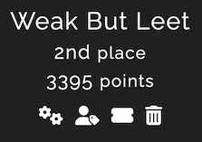
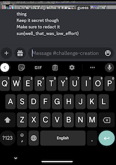
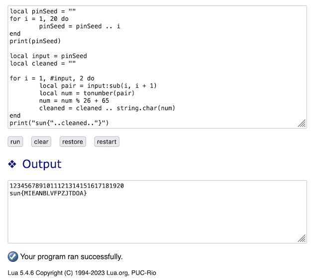

This was a companion CTF challenge to `Bsides Orlando`, with challenges in the beginner to intermediate level. I participated as part of `Weak But Leet` and we solved all the challenges and were placed second among all teams. 

<!--more-->
### Misc
#### Knowledge Repository
`Uhhhh. Looks like we lost control of our AI. It seems to have emailed folks. Like all the folks. There may have been a reply-all storm. We've isolated it down to just one email, and attached it to this message. Maybe we can bargain with it, but we need to understand its motives and intents. It seems to be throwing around a flag, but I'm not certain if it's a red flag or a sunny flag. Only time will tell.`

For me, this was both the most enjoyable and most frustrating challenge. I was stuck in the last step for a long time until a team mate stepped in and helped out. 

Let's start at the beginning. We are given a zip file, that produces an `.eml` file that shows an email (purportedly by the AI) and an base64 encoded attachment. 

1. We extract the attachment and convert it from base64 to create a binary file
```bash
 % sed -n "34,8009 p" greetings_human.eml | base64 -d > greeting.file
 % file greeting.file 
greeting.file: Git bundle
 % mv greeting.file greeting.bundle
```
2. We can see that the extracted binary file is a git bundle.
2. Create a local repository with that bundle
```bash
% git clone greeting.bundle
% cd greeting
% file ./data
data: RIFF (little-endian) data, WAVE audio, Microsoft PCM, 8 bit, mono 11050 Hz
``` 
4. Playing the audio file shows that it is a recording of morse code transmission
4. I used a [python-based morse audio decoder](https://github.com/mkouhia/morse-audio-decoder), which can decode the morse encoded message in a wavfile. 
```bash
% morse-audio-decoder ./data
ECHO QUEBEC UNIFORM ALFA LIMA SIERRASIERRA INDIA GOLF NOVEMBER
```
6. So, we have learnt that we can indeed decode morse from command-line and the message is made up of [NATO Phonetic Alphabet](https://en.wikipedia.org/wiki/NATO_phonetic_alphabet), like `ALFA, BRAVO, CHARLIE, etc`
6. Obviously, we need more data to figure out out the flag. Given that we have a `git` repository, we should look at the commit history. 
```
    % git log                   
    commit e2483776f7011364f613a64e05201b66b1aa2997 (HEAD)
    Author: 🖥️ <🖥️@example.com>
    Date:   Fri Sep 15 19:51:42 2023 -0400
        🖥️
    commit 8c68a7ff314129fc9ab847a986e0536aa72ac9d7
    Author: 🖥️ <🖥️@example.com>
    Date:   Fri Sep 15 19:51:42 2023 -0400
        🖥️
    ... 

    % git log | grep commit | wc
        3016    6032  144768
```
So, we can see that there are 3016 commits, giving us 3016 versions of the `data` audio file. Obviously, decoding that many audio files is going to be laborious. My hypothesis is that many of these would be duplicates. Let's test that hypothesis. 

8. We can use `git show <commit hash>:data` to get the particular version of audio file for that commit. Let's script getting each of the 3016 commits, and use a simple checksum to identify duplicates. We get all the checksums and the commit hashes into a file that can be processed further.
```bash
for i in `git log | grep commit | awk '{print $2}'` #get the commit hash id
do
  echo $i
  git show $i:data > $i.wav     # extract that version into a temporary wav file
  sum $i.wav >> all_chksums.txt # generate a checksum and store it in all_chksums.txt
  rm $i.wav                     # remove the temporary wav file
done
```
This step generates a list of checksums for the audio file for each commit. 
```
# first column is the checksum
27203 273 e2483776f7011364f613a64e05201b66b1aa2997.wav
27203 273 8c68a7ff314129fc9ab847a986e0536aa72ac9d7.wav
27203 273 45043b08e69799447b77e140b762619f1a9c8962.wav
55290 19 d65949efe42c6e8dcb0de45dbdd6d24fc4bb8234.wav
55290 19 3735f91c01bc090703ad88edbbee3b7034704833.wav
55290 19 a4a888d0baf87c02dde598f6b2e1a01241a29c2d.wav
19082 11 92145f03ccfb32b738733f69b2e3d8100fd5f0ca.wav
53883 27 30fd5ddd9633c4e7d22dcb30dc76ffd0705135b3.wav
...
```
9. Let's profile the data that we collected
```bash
# there are 3016 commits
% wc all_chksums.txt                   
    3016    9048  162224 all_chksums.txt

# If we extract only the checksums in the first column and check for uniqueness, 
# we can see that there are only 33 unique files across all 3016 commits.
% awk '{print $1}' all_chksums.txt | sort | uniq | wc
      33      33     193
```
10. Since there are only `33` unique audio files, it is a simple matter of extracting each audio file that has a unique checksum and decoding it using the `morse-audio-decoder` or the online site https://databorder.com/transfer/morse-sound-receiver/
```bash
# get the commit id for one of the checksums
% grep 46958 all_chksums.txt | head -1
46958 118 c3d08dbd91f7dcae3a5434383e293c8dd202c996.wav

# get the audio file for that commit
% git show c3d08dbd91f7dcae3a5434383e293c8dd202c996:data > c3d08dbd91f7dcae3a5434383e293c8dd202c996.wav 

# decode the wav file to get JULIETT - phonetic for J
% morse-audio-decoder c3d08dbd91f7dcae3a5434383e293c8dd202c996.wav
JULIETT
```
11. Doing this for the 33 unique checksums, and interpreting the phonetic alphabets gives us this lookup table

|Checksum|Symbol
|----|----
33937|2
22167|3
19082|4
38450|5
11831|6
41839|7
27203|=
55290|A
53883|B
2997|C
49301|D
48915|E
19796|F
21775|G
26628|H
27685|I
46958|J
12022|K
17155|L
735|M
64195|N
3165|O
44699|P
50385|Q
49985|R
64929|S
43023|T
55105|U
55179|V
49867|W
6717|X
60765|Y
62077|Z

We can see that the symbols used are `A-Z2-7` and the padding character `=`. This indicates that we are using Base 32, which consists of 32 alpha-numeric symbols and a padding character. 

11. Now that we know what letter each distinct audio file stands for, let's go through the all 3016 of them in order and translate them to the corresponding alpha-numeric symbol. The resulting string needs to be reversed, as the padding character, which comes from the last commit, should always be in the end. So, we surmise that the order is oldest commit to the newest. 
```python
# part 1 - populate the lookup table, key=checksum,  value = alphanum symbol
lookups = {}
L = open('checksums.txt', 'r')
for l in L.readlines():
    sum, let = l.split()
    sum = int(sum)
    lookups[sum] = let
print(lookups)

# part 2 - Go through the checksums and build a string of corresponding symbols using the lookup table
out = ''
F = open('all_chksums.txt', 'r')
for l in F.readlines():
    fields = l.strip().split()
    s = int(fields[0])  # first field is the checksum
    out += lookups[s]

print(out[::-1])    # reverse the string, so that the oldest commit is first, Store as `3016_b32.txt`
# D6FQQAA5ZP6GIAH7RVL67D63GYJP3TV7QIPVHQHRO2B3W ..... NR7BBP2MPSOD2L7MWYJHGX7IXIWPPVQCOB4AAA===
```
13. The resulting string is a valid Base32 string, which produces a binary data when decoded. I was stuck here for a long time until my team mate solved the problem for me. 
13. Let's capture the output of the decoding operation 

```bash
% cat 3016_b32.txt                      
D6FQQAA5ZP6GIAH7RVL67D63GYJP3TV7QIPVHQHRO2B3W ..... NR7BBP2MPSOD2L7MWYJHGX7IXIWPPVQCOB4AAA===

% base32 -d <3016_b32.txt >3016.file

% file 3016.file
3016.file: gzip compressed data, last modified: Sat Sep  9 19:44:29 2023

% mv 3016.file 3016.gz

% gunzip -c 3016.gz
Excerpt from The philosophical works of Leibnitz : comprising the Monadology, New system of nature, Principles of nature and of grace, Letters to Clarke, Refutation of Spinoza, and his other important philosophical opuscules, together with the Abridgment of the Theodicy and extracts from the New essays on human understanding : translated from the original Latin and French by Leibniz, Gottfried Wilhelm, Freiherr von, 1646-1716; Duncan, George Martin, 1857-1928; Easley, Ralph M. (Ralph Montgomery), b. 1858 (bookplate)

(https://archive.org/details/philosophicalwor00leibuoft/page/n11/mode/2up)

sun{XXXIII_THE_MONADOLOGY_is_a_nice_extra_read_no_flags_though}

BOOK IV. OF KNOWLEDGE.

CHAPTER I.

... <snip> ...
```
And there is the flag. This was a pretty interesting challenge. The last bit of figuring out that the binary data is a gzip stream seemed a bit guessy. Otherwise, pretty interesting challenge that emphasizes creative thinking and practical scripting.  

### Crypto
#### Beep Boop Cryptography

We are given a challenge file that has a series of words: `beep` or `boop`.  The immediate idea to convert these words to `1` and `0` and treat it as a binary sequence. That turned out to be the right approach. The resulting ascii string was `fha{rkgrezvangr-rkgrezvangr-rkgrezvangr}`, which looks like a `rot13` cipher. So, running the string through rot13, gives us the flag. 

The complete sequence of operations can be represented by this bash pipeline.
```bash
% sed -e 's/beep/0/g' BeepBoop | sed -e 's/boop/1/g' | tr -d ' ' | perl -lpe '$_=pack"B*",$_' | tr 'a-z' 'n-za-m' 
sun{exterminate-exterminate-exterminate}
```
### Forensics
#### Low Effort Wav

This challenge was solved by my team mate. I am capturing the solution here for my future reference. 

```
% file low_effort.wav 
low_effort.wav: PNG image data, 465 x 803, 8-bit/color RGBA, non-interlaced

% xxd low_effort.wav
00000000: 8950 4e47 0d0a 1a0a 0000 000d 4948 4452  .PNG........IHDR
00000010: 0000 01d1 0000 0323 0806 0000 00fa 062a  .......#.......*
00000020: a000 0000 0173 5247 4200 aece 1ce9 0000  .....sRGB.......
00000030: 0004 7342 4954 0808 0808 7c08 6488 0000  ..sBIT....|.d...
...

% mv low_effort.wav low_effort.png
% binwalk low_effort.png 
DECIMAL       HEXADECIMAL     DESCRIPTION
--------------------------------------------------------------------------------
0             0x0             PNG image, 465 x 803, 8-bit/color RGBA, non-interlaced
554           0x22A           TIFF image data, big-endian, offset of first image directory: 8
672           0x2A0           Zlib compressed data, default compression

% exiftool low_effort.png 
ExifTool Version Number         : 10.40
File Name                       : low_effort.png
Directory                       : .
File Size                       : 244 kB
File Modification Date/Time     : 2023:10:07 14:14:57+00:00
File Access Date/Time           : 2023:10:07 15:10:23+00:00
File Inode Change Date/Time     : 2023:10:07 14:14:57+00:00
File Permissions                : rw-r--r--
File Type                       : PNG
File Type Extension             : png
MIME Type                       : image/png
Image Width                     : 465
Image Height                    : 803
Bit Depth                       : 8
Color Type                      : RGB with Alpha
Compression                     : Deflate/Inflate
Filter                          : Adaptive
Interlace                       : Noninterlaced
SRGB Rendering                  : Perceptual
Significant Bits                : 8 8 8 8
XMP Toolkit                     : Image::ExifTool 12.59
Original File Name              : Screenshot_20230319-223111.png
Warning                         : [minor] Trailer data after PNG IEND chunk
Image Size                      : 465x803
Megapixels                      : 0.373

# There is also a EXIF tag called `UniqueCameraModel` that is set to Google Pixel 7
```
Use [Acropalypse site](https://acropalypse.app/) to recover the cropped portion of the image. Use `Google Pixel 7` as the camera model. 

* https://www.malwarebytes.com/blog/news/2023/03/google-pixel-cropped-or-edited-images-can-be-recovered
* https://cve.mitre.org/cgi-bin/cvename.cgi?name=CVE-2023-21036
* https://acropalypse.app/      <-- upload picture here and choose camera model as Google Pixel 7

### Reverse
#### Dill 
`Originally this was going to be about pickles, but .pyc sounds close enough to "pickles" so I decided to make it about that instead.`

We are given a zip file that contains a `.pyc`, which is python bytecode. Python bytecode can be decompiled by several tools, although matching the python version that created the bytecode is sometimes important. I was able to use a online python decompyler to reverse the given bytecode to the following source: 

```python
class Dill:
    prefix = 'sun{'
    suffix = '}'
    o = [5, 1, 3, 4, 7, 2, 6, 0]

    def __init__(self) -> None:
        self.encrypted = 'bGVnbGxpaGVwaWNrdD8Ka2V0ZXRpZGls'

    def validate(self, value: str) -> bool:
        if not (value.startswith(Dill.prefix) and value.endswith(Dill.suffix)):
            return False
        value = value[len(Dill.prefix):-len(Dill.suffix)]
        if len(value) != 32:
            return False
        c = [value[i:i + 4] for i in range(0, len(value), 4)]
        value = [c[i] for i in Dill.o]
        value = ''.join(value)
        if value != self.encrypted:
            return False
        else:
            return True
```
The most important elements are the encrypted value and the scrambling key.  We reverse engineer the logic by adding the following code to the decompiled python source.

```python
d = Dill()

unO = [' ']* 8
for i, x in enumerate(Dill.o):
    unO[int(x)] = i
print(f"Unscrambler: {Dill.o}  -> {unO}")   # Unscrambler: [5, 1, 3, 4, 7, 2, 6, 0]  -> [7, 1, 5, 2, 3, 0, 6, 4]

value = d.encrypted
c = [value[i:i + 4] for i in range(0, len(value), 4)]
print(c)        # ['bGVn', 'bGxp', 'aGVw', 'aWNr', 'dD8K', 'a2V0', 'ZXRp', 'ZGls']

value = [c[i] for i in unO]
print(''.join(value))       # ZGlsbGxpa2V0aGVwaWNrbGVnZXRpdD8K
```
Hence the flag is `sun{ZGlsbGxpa2V0aGVwaWNrbGVnZXRpdD8K}`

#### First Date
`I'm Excited, this is my first date in years but this time it's a Play Date! Sadly I'm locked out of it so if you could help me get in that would be great!`

We are given a zip file that contains some sort of a binary code with the extension `.pdz`

So, researching the internet a bit for what play date points us to a handheld gaming console. 
https://play.date/
https://en.wikipedia.org/wiki/Playdate_(console)

Further research pointed to this github project that is dedicated to reverse-engineering the playdate file. 
https://github.com/cranksters/playdate-reverse-engineering/blob/main/formats/pdz.md

From there on, it is just a matter of finding the right tools to extract and decompile the programs to get the logic. 

1. Unzip the given files to extract the `main.pdz` file. 
1. According to the [Github reverse engineering site](https://github.com/cranksters/playdate-reverse-engineering/blob/main/formats/pdz.md), `A file with the .pdz extension represents a file container that has been compiled by pdc. They mostly contain compiled Lua bytecode, but they can sometimes include other assets such as images or fonts. This format uses little endian byte order.`
1. Unpack the `.pdz` file using the `pdz.py` [utility](https://github.com/cranksters/playdate-reverse-engineering/blob/main/tools/pdz.py) to get a couple of `.luac` files
1. According to the site, `Lua-based Playdate games use a tweaked version of Lua 5.4.3. You will only find compiled Lua bytecode in .pdz files.`
1. The tools section of the site, has a link to `unluac - Fork of the unluac Lua decompiler, modified to support Playdate-flavoured Lua.`
1. Using the `unluac` tool on `main.luac` gives us the source code of `main.lua`,
```lua
	if pressedButtons == generateOrder() then
		print("Pin entered correctly!")
		gfx.setFont(gfx.font.kVariantBold)
		cleaned = clean(pressedButtons)
		print("Flag: sun{" .. cleaned .. "}")
```
The `clean()` function takes the input and scrambles it to produce a string, which forms the flag for the correct input. 
The `generateOrder()` function creates the original string that is passed as the input to the `validate()` function. 
```lua
function clean(input)
	local cleaned = ""
	for i = 1, #input, 2 do
		local pair = input:sub(i, i + 1)
		local num = tonumber(pair)
		num = num % 26 + 65
		cleaned = cleaned .. string.char(num)
	end
	return cleaned
end

function generateOrder()
	local pinSeed = ""
	for i = 1, 20 do
		pinSeed = pinSeed .. i
	end
	return pinSeed
end
```
7.  So, we cut to the chase by copying these functions to an online lua interpreter and figure out what valid input would pass the validation, hence would represent the flag. 



* https://github.com/scratchminer/unluac

### Scripting
#### DDR
`All the cool robots are playing Digital Dance Robots, a new rythmn game that... has absolutely no sound! Robots are just that good at these games... until they crash because they can't count to 256. Can you beat the high score and earn a prize?`

This is a very basic pwntools scripting challenge, we have to mimic a set of dance moves, depicted by arrow emoji using WSAD keys. There is a time limit for each round and we get the flag if we successfully solve 255 rounds. 

My solution is to map the Up-Down-Left-Right arrows to the WSAD letters respectively using a python dictionary and translate the incoming challenge string to the appropriate response.

```python
from pwn import * 

# context.log_level = 'debug'
map = {
    '⇨':'d',
    '⇧':'w',
    '⇦':'a',
    '⇩':'s',
}

C = remote('chal.2023.sunshinectf.games', 23200)
C.recvuntil(b'ENTER To Start --')
C.sendline()    # send enter to start
C.recvline()    # A couple of preambles and empty lines
C.recvline()
for i in range(256):
    challenge = C.recvline().strip()    # challenge sequence
    print(f"rcvd [{i:03d}]--> {challenge}")
    if (b'WIN!!!' in challenge):
        print(C.recvline())
        break
    response = ''
    for c in challenge.decode():
        if (c in map.keys()):
            response += map[c]
    C.sendline(response.encode())
C.interactive()
```
The script runs for a bit, and prints the flag once 255 rounds are complete.

```
[DEBUG] Sent 0x33 bytes:
    b'awaasssssaaawsaasawadwsadswssdwawwdddadasdaaasddas\n'
[DEBUG] Received 0x3d bytes:
    b'\r'
    b'YOU WIN!!!\r\n'
    b'Your prize is sun{d0_r0b0t5_kn0w_h0w_t0_d4nc3}\r\n'
```

### Challenges

|Category|Challenge|Description
|----|----|----
Crypto |BeepBoop Cryptography|
Forensics |Low Effort Wav 🌊|
Misc |Initialization|
Misc |Knowledge Repository|
Pwn |Bug Spray 🐛🪲🐞|
Pwn |Flock of Seagulls 🕊️|
Pwn |House of Sus|
Pwn |Robot Assembly Line|
Pwn |😎 Array of Sunshine ☀️|
Reversing |Dill|
Reversing |First Date|
Scripting |DDR|
Scripting |SimonProgrammer 1|
Scripting |SimonProgrammer 2|
Scripting |SimonProgrammer 3|
Web |BeepBoop Blog|
Web |Hotdog Stand|


```
[*] Misc/ Knowledge Repository
[*] Crypto/ Beep Boop Cryptography
[*] Forensics/ Low Effort Wav
[*] Reverse/ Dill
[*] Reverse/ First Date
[*] Scripting/ DDR
```