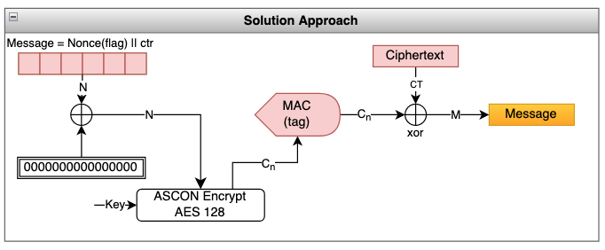

This is a CTF contest hosted by LosFuzzys. The challenges were of good quality. I would rate them to be of intermediate to hard level. I played with the team `Weak But Leet` and we were placed 44th.

<!--more-->

### Intro
#### ARISAI
`I heard that RSA with multiple primes is more secure. My N is very large, so there should not be a problem.`

```python
PRIME_LENGTH = 24
NUM_PRIMES = 256

FLAG = b"gctf{redacted}"

N = 1
e = 65537

for i in range(NUM_PRIMES):
    prime = getPrime(PRIME_LENGTH)
    N *= prime

ct = pow(bytes_to_long(FLAG), e, N)

print(f"{N=}")
print(f"{e=}")
print(f"{ct=}")
```
This is a case of a text-book RSA challenge, with the modulus that has multiple prime factors, than the typical two. In fact, we can see that `N` is a product of 256 24-bit primes.  The challenge here is to find the private exponent `d`. This article [^1] provides the roadmap to solve this challenge. 

[^1]: https://crypto.stackexchange.com/questions/74891/decrypting-multi-prime-rsa-with-e-n-and-factors-of-n-given


```python
from factordb.factordb import FactorDB
from Crypto.Util.number import inverse, long_to_bytes, bytes_to_long

# we are given n, e and ct
n = 
e = 
ct=

print(f"Bit length of N : {n.bit_length()}") # Bit length of N : 6030

f = FactorDB(n)
f.connect()
r = f.get_factor_list()

print(f"# of factors = {len(r)}")           # # of factors = 256

repeated_primes = []  # to keep track of non-distinct primes
phi = 1

for p in r:
    if (p in repeated_primes):  # we have seen the prime before
        phi *= p
    else: 
        phi *= (p-1)
        repeated_primes.append(p)   # add to list of primes


d = inverse(e, phi)
m = pow(ct, d, n)
print(long_to_bytes(m)) # b'gctf{maybe_I_should_have_used_bigger_primes}'
```

#### Los-ifier

### Crypto
#### Missing Bits
In this challenge, we are given a RSA private key in the DER format, but with the first 6 lines removed. Knowing that the private key is in the ASN.1 DER format, allows us to identify and extract the fields of the key. 

```bash
% base64 -d -i priv.key -o priv_key.bin     # convert partial RSA priv key to binary
```
The format of the complete RSA private key follows the following format in ASN.1 notation. 
```
RSAPrivateKey ::= SEQUENCE {
  version           Version,                        <--- MISSING
  modulus           INTEGER,  -- n                  <--- INCOMPLETE
  publicExponent    INTEGER,  -- e                  <--- EXTRACT (e)
  privateExponent   INTEGER,  -- d                  
  prime1            INTEGER,  -- p                  <--- EXTRACT (p)
  prime2            INTEGER,  -- q                  <--- EXTRACT (q)
  exponent1         INTEGER,  -- d mod (p-1)
  exponent2         INTEGER,  -- d mod (q-1)
  coefficient       INTEGER,  -- (inverse of q) mod p
  otherPrimeInfos   OtherPrimeInfos OPTIONAL
}
```
The first few lines removed from the base64 version of the private key has mangled the version and modulus fields. However, with the exponents and the private prime factors, we can recalculate all other values and decrypt the file.  Using this online diagram [^4] as a guide, we can identify the offset of `e`, `p` and `q`.

[^4]: https://www.cem.me/20141221-cert-binaries.html


Once we have those fields, the rest is textbook RSA decryption. 

```python
from pwn import *
from Crypto.Util.number import isPrime, bytes_to_long, long_to_bytes, inverse

# https://www.cem.me/20141221-cert-binaries.html

p = "e4188b37b163...cd340bcb32a21"  # copy prime factor P from binary RSA key
q = "f122e285b030...0facafcd8569e7" # copy prime factor Q from binary RSA key
e = 0x10001

p = int(p, 16)
q = int(q, 16)

print(isPrime(p))   # Confirm P is prime  : True
print(isPrime(q))   # Confirm Q is prime  : True

n = p * q
ct = open('ciphertext_message', 'rb').read()
phi = (p-1) * (q-1)
d = inverse(e, phi)

ct = bytes_to_long(ct)

print(long_to_bytes(pow(ct, d, n))) 
# b'Hey Bob this is Alice.\nI want to let you know that the Flag is gctf{7hi5_k3y_can_b3_r3c0ns7ruc7ed}'

print(f"{d:0x}")        # matches the private exponent in the partial RSA key
```

#### SLCG

The most relevant parts of the challenge source is as follows. In summary, the challenge constructs a pair of PRNG (using the linear congruential scheme). These pairs of LCGs are used to generate a pseudo-random value that is used to represent each `binary 1` or `binary 0` in the ascii value of the characters in the flag. While the first LCG in each chain is constructed out of random values, the subsequent generations use 4 consecutive values created by the previous LCG. Thus the LCGs are chained, making it so that the first LCG determines all the subsequent LCGs. 

```python

class LCG:
    def __init__(self, mod: int, mult: int, add: int, seed: int):
        self.mod = mod
        self.mult = mult
        self.add = add
        self.value = seed

    def __next__(self) -> int:
        self.value = (self.value * self.mult + self.add) % self.mod
        return self.value

    def __iter__(self) -> LCG:
        return self

    @classmethod
    def random_values(cls):
        return LCG(
            int.from_bytes(os.urandom(16)),
            int.from_bytes(os.urandom(16)),
            int.from_bytes(os.urandom(16)),
            int.from_bytes(os.urandom(16))
        )


class Encryptor:
    def __init__(self):
        self.lcgs: tuple[LCG] = (LCG.random_values(), LCG.random_values())

    def encrypt(self, message: str) -> list[int]:
        result = []
        for ascii_char in message:
            bin_char = list(map(int, list(f"{ascii_char:07b}")))

            for bit in bin_char:
                result.append(next(self.lcgs[bit]))

            self.lcgs = (
                LCG(
                    next(self.lcgs[0]), next(self.lcgs[0]),
                    next(self.lcgs[0]), next(self.lcgs[0])
                ),
                LCG(
                    next(self.lcgs[1]), next(self.lcgs[1]),
                    next(self.lcgs[1]), next(self.lcgs[1])
                )
            )
        return result
```

The encryption function does the following, which will help us craft a solution to determine the flag. 
1. Take each character of the flag, convert it to its ascii value
1. The character value is converted into a list of binary ones and zeros, with the most significant bit processed first. 
1. Note that only 7 bits of the character are used, without the leading zero bit. 
1. There are two LCG generators created for each character for `1` and `0`. 
1. After each character, the next pair of LCGs are created by using the random values created by the respective LCG. i.e, the next four values from the LCG are used as Modulus, Multiplier, Increment and Seed to create the next LCG.
1. Because of the binary setup, we do not need to crack both the LCGs. Only one will suffice. 
1. As we traverse through the bits of the character value, the next value is generated by the LCG corresponding to the `1` or `0` and used as the ciphertext. 
1. We are given a series of 364 ciphertext values, which correspond to 364 // 7 = 52 characters. 
1. We know that the flag starts with `gctf{`.
1. We can use this known text to determine which ciphertext correspond to which LCG, which will help us crack the LCG and recreate the sequence. 
1. Note that we need to only crack one of the LCGs, as it is a binary sequence. So, if the next value from that LCG does not match the ciphertext, assume that the ciphertext corresponds to the second, (uncracked) LCG. 

The complete solution is as follows: 

```python

# copy the LCG class from the provided challenge code
class LCG:
    def __init__(self, mod: int, mult: int, add: int, seed: int):
        self.mod = mod
        self.mult = mult
        self.add = add
        self.value = seed

    def __next__(self) -> int:
        self.value = (self.value * self.mult + self.add) % self.mod
        return self.value

    def __iter__(self) -> LCG:
        return self

ct = [.. 364 values ..]

# Implementation of LCG cracking from https://tailcall.net/posts/cracking-rngs-lcgs/
def crack_unknown_increment(states, modulus, multiplier):
    increment = (states[1] - states[0]*multiplier) % modulus
    print(f"[=] {modulus= } {multiplier= } {increment= }")
    return modulus, multiplier, increment    

def crack_unknown_multiplier(states, modulus):
    multiplier = ( (states[2] - states[1]) * pow(states[1] - states[0], -1, modulus) ) % modulus
    print(f"[=] {modulus= } {multiplier= }")
    return crack_unknown_increment(states, modulus, multiplier)

def crack_unknown_modulus(states):
    diffs = [s1 - s0 for s0, s1 in zip(states, states[1:])]
    zeroes = [t2*t0 - t1*t1 for t0, t1, t2 in zip(diffs, diffs[1:], diffs[2:])]
    modulus = abs(reduce(gcd, zeroes))
    print(f"[=] {modulus= }")
    #return modulus
    return crack_unknown_multiplier(states, modulus)

# Start with the letter 'g'
# First character 'g' ==> 103  --> [1, 1, 0, 0, 1, 1, 1]
states = [ct[0], ct[1], ct[4], ct[5], ct[6]]    # We know these values are from the same LCG
mod, mult, incr = crack_unknown_modulus(states)
# Use the first value from this LCG to calculate the seed. 
seed = ((ct[0] - incr) * pow(mult, -1, mod) ) % mod

lcg1 = LCG(mod, mult, incr, seed)  # this is the LCG we will use for the '1' bit

flag = ""
for i in range(0, len(ct), 7):      # for each character
    n = next(lcg1)
    char_bits = ""
    for pos in range(7):            # for each bit 
        if (ct[i+pos] == n):        # if we correctly predict the CT, it is a '1'
            n = next(lcg1)
            char_bits += '1'
        else:   
            char_bits += '0'
    print(flag, char_bits)
    flag += chr(int(char_bits, 2))  # convert the bits to a character, add to flag
    lcg1 = LCG(n, next(lcg1), next(lcg1), next(lcg1))   # derive a new LCG for the next character

print(flag)     # gctf{th15_lcg_3ncryp710n_w4sn7_s0_5s3cur3_aft3r_4ll}
```

#### Glacier Spirit

In this challenge, we have an implementation of a stream cipher using the Ascon package, which provides a lighweight encryption and hashing functions. This package is not relevant to the challenge except as a means to encrypt a block of message using a randomly generated key. 

Examining the source provided, we can discern the following. 
1. The server creates a nonce for each call to encrypt and uses the same encryption key for the duration of the session. 
1. As the first step, the server encrypts the flag after padding it to 16-byte boundary and provides us the `nonce`, `ciphertext` and the `MAC tag`. 
1. The `nonce` is 15 bytes long, `ciphertext` is 16 bytes for each block of padded message, and the `tag` is 16 bytes in length. 
1. After providing us with the triplet of information for the flag, the server provides us 8 chances to supply our own message and returns the calculated triplet values for that message.
1. Note that a different nonce is used for each message, but the same encryption key is reused. 

Pictorially, the encryption method can be shown as in the following diagram. The items shaded in red are disclosed for each message encrypted (including the flag)


The vulnerabilities in this encryption method are that: 
* The nonce used only once per message, but it is disclosed 
* There is no padding if the message is exactly fitting into the block boundary. Ideally, the message length should be prepended to the message and an empty block should be created along with the message.

We will exploit these errors in our solution. 



1. we know the `nonce` used in handling the flag 
1. we know that the ciphertext is the result of an XOR operation between the plaintext message and the encrypted value of the `[nonce||block number]`.
1. if we can find the encrypted value of `[nonce||01]`, `[nonce||02]`, and so on, we can `XOR` it with the ciphertext block to recover the plaintext. 
1. Note that if we construct our message as `nonce||01`, it is exactly 16 bytes in length. Due to the following line in the `pad_message` function, no padding is applied (as the pad length is zero).

```python
    return  (first_block_pad.to_bytes(length=1, byteorder='big') * (BLOCK_SIZE - first_block_pad)) + message
    # first_block_pad = 16 == BLOCK_SIZE
    # hence no padding when message_len is exactly equal to BLOCK_SIZE
```
The complete solution is given below. 

```python
from pwn import *

R = remote('chall.glacierctf.com', 13379)
# R = process(["python3", "glacier_spirit_challenge.py"])
R.recvuntil(b'gifts you a flag!\n\n')

# values for the flag
nonce, ct, tag = map(unhex, R.recvline().strip().split(b', ')) 

BS = 16
ctr = 1
flag = b""
for i in range(0, len(ct), BS):
    R.recvuntil(b'Offer your message:\n')
    R.sendline(enhex(nonce + (ctr).to_bytes(1, 'little')))
    ctr += 1
    R.recvuntil(b'blessed your message!\n\n')
    n, c, t = map(unhex, R.recvline().strip().split(b', '))
    flag += xor(ct[i:i+BS], t)
    print(flag)     # b'\x0fgctf{CTr_M0d3_cbc_M4C_ASCON_DeF3AT$_TH3_$p1rIT}'
R.interactive()
```
Overall, it was a fun challenge to break down each individual step of the server-side program and identify the solution. 

### Misc
#### IcyRiffs

In this challenge, we are given two sets of files for the [Clone Hero game](https://clonehero.net/). The files provided are: 
```
notes.chart     # Mapping of frets, events and flags
song.ini        # Metadata about the song, not relevant to the chall
song.ogg        # Music to be played as the background. Not relevant
```

In researching more about this format, I found a <cite> online simulator [^2]</cite> that can play the charts, which was very helpful to understand the format. I also found a <cite>easy to use parser on Github [^3]</cite> for the chart files. 

The solution consisted of two steps. First to analyze the `Invincible` file set to create a mapping of fret values to a character. The second step is to analyze the `Monsters Inc.` fileset to determine a subset of fret values and map them to a character, using the mapping created before. 

**PART 1**: Read the `notes.chart` under `Invincible` and create a dictionary of fret values to the character in the lyrics. 

```python
import chparse
# https://github.com/Kenny2github/chparse
chartfile = open('./Invincible/notes.chart')
chart = chparse.load(chartfile)

event_dict = {}
for l in chart.events:
    if ('lyric' in l.event):
        event_dict[l.time] = l.event.split()[1]


#  5 frets are bit mapped to create fretval
#  4  3  2  1  0
#  o  o  o  o  o
prevtime = 0
fretval = 0
lyric_dict = {}
for n in chart.instruments[chparse.EXPERT][chparse.GUITAR]:
    # print(f"{n.time = } {n.kind = } {n.fret = } {n.length = } {n.flags = }")
    if (prevtime == 0):
        fretval = 1 << n.fret
    elif (n.time == prevtime):
        fretval = fretval | (1 << n.fret)
    elif(n.time != prevtime):
        # new time marker
        print(f"{prevtime:5d} : {fretval:3d} : {event_dict[prevtime]}")
        lyric_dict[fretval] = event_dict[prevtime]
        fretval = 1 << n.fret

    prevtime = n.time

# the last letter
print(f"{prevtime:5d} : {fretval:3d} : {event_dict[prevtime]}")
lyric_dict[fretval] = event_dict[prevtime]
# {1:'b', 2:'c' ... }  Key = fretvalue,  Val = lyric character
# print(lyric_dict)
```
**PART 2**: Read the `notes.chart` under `Randy Newman - Monsters, Inc.` and identify the fret values at each unique time marker. If we have seen a `TAP` signal, map the fret value to the lyrics character and add it to the flag. 

```python
mchartfile = open('./Randy Newman - Monsters, Inc. (JoeyD)/notes.chart')
mchart = chparse.load(mchartfile)

flag = ""
prevtime = 0
fretval = 0
found_tap = False 
for n in mchart.instruments[chparse.EXPERT][chparse.GUITAR]:
    # print(f"==DEBUG== >> {n.time = } {n.kind = } {n.fret = } {n.length = } {n.flags = }  {flag}")
    if (prevtime == 0):
        fretval = 1 << n.fret
    elif (n.time == prevtime):
        fretval = fretval | (1 << n.fret)
    elif(n.time != prevtime):   # new time marker
        if (found_tap):         # if we have found the tap, add the current char to the flag
            flag += lyric_dict[fretval]
            print(f"{prevtime:5d} : {fretval:3d} : {lyric_dict[fretval]} |  {flag}")
            found_tap = False

        fretval = 1 << n.fret

    found_tap = chparse.TAP in n.flags  # if the current tick has a tap, add the next char to the flag
    prevtime = n.time
print(flag)         # gctf{through_th3_moun4!ns_4nd_snow}
```
Also, whoever thought of planting a fake steg clue in the album image, you are a sadist.


[^2]: https://nb48.github.io/chart-hero/
[^3]: https://github.com/Kenny2github/chparse

### References
* https://github.com/carlospolop/hacktricks/blob/master/generic-methodologies-and-resources/python/bypass-python-sandboxes/README.md
* https://hackmd.io/@Be2TrxAzSWeaqXGgoOwd2g/rkr4ZzWHT
* https://flocto.github.io/writeups/2023/deadsecctf/lcg-writeup/
* https://eprint.iacr.org/2022/847.pdf


### Challenges

|Category|Challenge|Description
|----|----|----
crypto |Glacier Spirit|
crypto |Missing Bits|
crypto |SLCG|
crypto |Shuffled AES|
crypto |Walking to the Sea Side|
intro |ARISAI|
intro |Los-ifier|
intro |My first Website|
intro |Skilift|
intro |Welcome challenge|
misc |Avatar|
misc |Glacier Military Daemon|
misc |IcyRiffs|
misc |Silent Snake|
pwn |35 Shades of Wasm|
pwn |FunChannel|
pwn |Glacier Rating|
pwn |Secure Password Storage|
pwn |Write Byte Where|
pwn |flipper|
rev |Password recovery|
rev |RPGO|
rev |SOP|
smartcontract |ChairLift|
smartcontract |GlacierCoin|
smartcontract |GlacierVault|
smartcontract |The Council of Apes|
web |Glacier Exchange|
web |Peak|
web |WhereIsTheScope|
