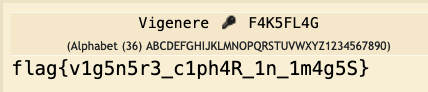

A very nice CTF organized by the Info Sec club at IIT Roorkee. A very high quality set of challenges in all categories. 
<!--more-->

### Beginner
#### Mini RSA

The key elements of the challenge are that there is a custom implementation of `pow(a,b,n)` and seemingly unrelated value derived by private primes `p` and `q` are being leaked. More about this in Mini_RSA_v2

```python
KEY_SIZE = 512
RSA_E = 3

# equivalent to pow(a, b, n)
def fast_exp(a, b, n):
    output = 1
    while b > 0:
        if b & 1:
            output = output * a % n
        a = a * a % n
        b >>= 1 
    return output    

# returns   pow(p, pow(q, a_, phi), n) + pow(q, pow(p, b_, phi), n)
def check(p, q, n):
    a_ = random.randint(1, 100)
    b_ = random.randint(1, 100)
    s = fast_exp(p, fast_exp(q, a_, (p - 1) * (q - 1)), n)
    t = fast_exp(q, fast_exp(p, b_, (p - 1) * (q - 1)), n)
    result = s + t
    print(result)       # s + t is leaked

# The flag is encrypted and the ciphertext, along with the modulus N is provided 
```

We see that the public exponent is very small, just 3. So, if the plaintext is small enough that 

\\(P^e\mod{N} := P^3\\), which happens when \\(P^3 < N\\)

Let's test it.

```python
from Crypto.Util.number import long_to_bytes
import gmpy2

# from output.txt
st=24986288511406610689718446624210347240800254679541887917496550238025724025245366296475758347972917098615315083893786596239213463034880126152583583770452304
c=5926440800047066468184992240057621921188346083131741617482777221394411358243130401052973132050605103035491365016082149869814064434831123043357292949645845605278066636109516907741970960547141266810284132826982396956610111589
n=155735289132981544011017189391760271645447983310532929187034314934077442930131653227631280820261488048477635481834924391697025189196282777696908403230429985112108890167443195955327245288626689006734302524489187183667470192109923398146045404320502820234742450852031718895027266342435688387321102862096023537079

# find the cuberoot as E=3.
pt,found = gmpy2.iroot(c, 3)
if (found):
    pt = int(pt)
    print(pt)
    print(long_to_bytes(pt))      # b'flag{S0_y0u_c4n_s0lv3_s0m3_RSA}'  
```
Just taking the cuberoot of the ciphertext gives us the flag. And, we did not have to touch that strange-looking `s+t` value

#### Mini RSA_v2
This is essentially the same challenge as the previous `Mini RSA`, with the exponent changed from `3` to `65537`. So, we can disregard the loophole that allowed us to crack the first problem. 

I solved this challenge intuitively by using small primes to figure out that the provided value **s+t == p+q**. From that point onwards, the solution is straight-forward. 

```python
st = ...    # s+t, which is equal to p+q
c  = ...
n  = ...
phi = n - st + 1    # (p-1)(q-1) = pq - (p+q) + 1 = n - st + 1
d = pow(RSA_E, -1, phi)
print(long_to_bytes(pow(c, d, n)))      # b'flag{I_4m_5tuck_0n_Th3_pl4n3t_Eg0_s4ve_M3}'
```

However, the reason as to why __s+t == p+q__ is an interesting one. (WIP)
#### Indecipherable-image-or-is-it?
We are given a PNG image.

1. Examine the image file using `zsteg`
1. There are 5808 extra bytes at the end of the file. These have magic bytes showing it is a ZIP file. 
1. The LSB 1 bit array gives us a text : "keka{1b0asx2w_hbin9K_Ah_6xwm0L}"
1. Extracting and expanding the ZIP file gives us a jpeg image : SECRET/images.jpeg
1. Running `stegseek` on this JPEG image with the rockyou wordlist, gives us a small text file with `F4K5FL4G`
1. Use the Vigenere decoder with the Key:= F4K5FL4G  and the ciphertext:=keka{1b0asx2w_hbin9K_Ah_6xwm0L} gives us the flag.

During the competiion, I solved all but the last step, which was a bit guessy, IMO. Or, perhaps it is a skills issue :)

```bash
% zsteg cutie.png b1,r,lsb,xy  
[?] 5808 bytes of extra data after image end (IEND), offset = 0xa6ea
extradata:0         .. file: Zip archive data, at least v2.0 to extract
    00000000: 50 4b 03 04 14 00 00 00  08 00 6b 7e 84 57 bd 7e  |PK........k~.W.~|
    00000010: 24 68 2a 16 00 00 b1 16  00 00 12 00 00 00 53 45  |$h*...........SE|
    00000020: 43 52 45 54 2f 69 6d 61  67 65 73 2e 6a 70 65 67  |CRET/images.jpeg|
    00000030: 9d 97 55 58 14 5e b7 c6  07 86 8e 21 04 a4 87 8e  |..UX.^.....!....|
    00000040: a1 1c 42 42 86 51 84 41  40 44 62 00 49 29 89 21  |..BB.Q.A@Db.I).!|
    00000050: a5 41 40 52 41 42 1a e9  ee 90 ee 52 60 28 e9 18  |.A@RAB.....R`(..|
    00000060: 40 5a 3a 44 52 6a f8 f8  7f cf 89 9b 73 71 ce 79  |@Z:DRj......sq.y|
    00000070: f7 e5 bb 9e fd bc bf bd  d6 c5 da b7 98 db 65 00  |..............e.|
    00000080: a5 0a 42 19 01 c0 c1 01  00 70 ee 0e e0 76 1e f0  |..B......p...v..|
    00000090: 14 40 4c 40 48 44 48 40  4c 44 48 44 42 42 4c 4a  |.@L@HDH@LDHDBBLJ|
    000000a0: 4e 47 41 4e 46 46 ce 44  43 4b 49 c7 c6 c2 c1 c1  |NGANFF.DCKI.....|
    000000b0: c6 02 06 73 f1 89 0b 72  f1 40 79 c1 60 21 98 10  |...s...r.@y.`!..|
    000000c0: 54 42 52 46 46 86 53 00  ae 00 97 7a 2a 2e 2d 23  |TBRFF.S....z*.-#|
    000000d0: f9 cf 25 38 24 24 24 e4  64 e4 8c 14 14 8c 92 dc  |..%8$$$.d.......|
    000000e0: 60 6e c9 ff b3 6e 3b 01  54 44 00 6f c0 2c 10 87  |`n...n;.TD.o.,..|
    000000f0: 03 80 4b 85 03 a4 c2 b9  ed 06 80 ef 72 e2 e3 fc  |..K.........r...|

b1,r,lsb,xy         .. text: "keka{1b0asx2w_hbin9K_Ah_6xwm0L}"

% stegseek SECRET/images.jpeg /input/tools/wordlists/rockyou.txt 
StegSeek 0.6 - https://github.com/RickdeJager/StegSeek

[i] Found passphrase: "easyone"          
[i] Original filename: "a.txt".
[i] Extracting to "images.jpeg.out".

% cat images.jpeg.out
F4K5FL4G
```
Finally, put the encoded flag and the key `F4K5FL4G` in to Vigenere decoder on `dcode.fr` and adjust the alphabets to get the right flag.



### Crypto
#### Something in Common

```python
flag = "This flag has been REDACTED"
moduli = "This array has been REDACTED"     # Array of pre-selected modulii

m = bytes_to_long(flag.encode())
e = 3
remainders = [pow(m,e,n) for n in moduli]   # Residuals or congruences

f = open('output.txt','w')
for i in range(len(moduli)):
    f.write(f"m ^ e mod {moduli[i]} = {remainders[i]}\n")   # we are given residuals and the corresponding modulus
f.write(f"\ne = {e}")       # e is small 
f.close()
```

Solving this challenge was more of a learning and discovery. While I immediately recognized that this was a problem that should be solved by CRT, the regular method for calculating CRT which is given below, did not work. It errored out in the step where the product of the modulii is inverted with respect to a modulus.  
```python
def crt(n, a):
    sum = 0
    prod = reduce(lambda a,b: a*b, n)

    for n_i, a_i in zip(n, a):
        print(f"checking ... {n_i} and {a_i}")
        p = prod // n_i
        sum += a_i * gmpy2.invert(p, n_i) * p       # <---- not invertible error here 
    return sum % prod
```

Researching this problem some more led me to the cause of the error (which is that the modulii are NOT co-prime to each other) and there is a more robust version of the CRT implementation that would handle this scenario. 

[Here is a fantastic explanation](https://forthright48.com/chinese-remainder-theorem-part-2-non-coprime-moduli/) of the theory and the background of how this `strong` version of the CRT works. I will not try to duplicate that explanation here. You should go and read it there. 

Sage and Sympy handles this scenario already. So, an easier way to solve this challenge is to use those library functions. However, I wanted to understand the mechanics of CRT and implement it from first principles. So, the final solution is:

```python
def lcm(numbers):
    return reduce(lambda x, y: x * y // gcd(x, y), numbers, 1)

def egcd(a, b):
    if a == 0:
        return (0, 1, b)
    else:
        y, x, g = egcd(b % a, a)
        return (x - (b // a) * y, y, g)
    
def crt_strong(n, a):
    assert len(n) == len(a)
    n0 = n[0]
    a0 = a[0]

    for i in range(1,len(n)):
        ni = n[i]
        ai = a[i]

        g = gcd(ni, n0)
        if (ai % g != a0 %g):
            print("Error ... no solution")
            return None

        u,v,mygcd = egcd(n0//g, ni//g)
        mod = (n0//g) * ni

        x = (a0 * (ni//g) * v + ai * (n0//g) * u) % mod 
        while(x < 0):
            x += mod
        a0 = x 
        n0 = mod
    return (a0, n0)   

N = []
R = []
e = 3
with open('output.txt', 'r') as F:
    for i in range(7):
        l = F.readline().strip().split(' ')
        N.append(int(l[4]))     # modulus
        R.append(int(l[6]))     # residual := CT^3 % modulus

# print pair-wise GCD to show that moduli are not co-prime 
print("\nGCD Matrix ... pair-wise GCD of all modulus values\n")
for i in range(len(N)):
    for j in range(len(N)):
        if (i != j):
            print(f"{gcd(N[i], N[j]):5d}", end = '')
        else: 
            print(f"    -", end = '')
    print('')
print('')

# the strong version of CRT accounts for modulii that are not pairwise co-prime 
m_cubed, L = crt_strong(N, R)   # Call Sage's crt() method automatically does this, so does sympy's crt() method
m,found = gmpy2.iroot(m_cubed, e)
print(found, long_to_bytes(m))  # True b'flag{Wh4t_d0_y0u_m34n_1t_h4s_t0_b3_co-pr1m3}'

'''
# Sympy implementation
from sympy.ntheory.modular import crt
from sympy import cbrt
print(long_to_bytes(cbrt(crt(N, R)[0])))

# Sage implementation 
f = crt(R, N)
print(ltb(ZZ(f).nth_root(3)))
'''
```
### Forensics
#### Forenscript
`It's thundering outside and you are you at your desk having solved 4 forensics challenges so far. Just pray to god you solve this one. You might want to know that sometimes too much curiosity hides the flag.`

We are given a binary file `a.bin`. Using XXD to dump the file shows that it might be a PNG image file, but the header chunks look wonky. Also, the entire file is not reversed but smaller pieces of it. By examining the first 12-16 bytes, we can see the pattern - every four bytes of the PNG file have been reversed. So, we need to undo this transformation. 

```bash 
% xxd a.bin | more
00000000: 474e 5089 0a1a 0a0d 0d00 0000 5244 4849  GNP.........RDHI
00000010: 460c 0000 a504 0000 0000 0608 3dab 1f00  F...........=...
...

# print as hex, take 8 chars (4 bytes), reverse their positions, assemble into one long hex, convert it back to binary, store as a.png
% xxd -c4 -p a.bin | sed -E 's/(..)(..)(..)(..)/\4\3\2\1/g' | tr -d '\n' | xxd -r -p > a.png

# viewing this image shows a message stating `FAKE FLAG`. So, there is another layer to this onion

% binwalk a.png 
DECIMAL       HEXADECIMAL     DESCRIPTION
--------------------------------------------------------------------------------
0             0x0             PNG image, 3142 x 1189, 8-bit/color RGBA, non-interlaced
91            0x5B            Zlib compressed data, compressed
60048         0xEA90          PNG image, 3142 x 1189, 8-bit/color RGBA, non-interlaced
60139         0xEAEB          Zlib compressed data, compressed

# we can see that there is another PNG image starting at offset=60048. Let's extract it.

% dd if=a.png of=b.png ibs=1 skip=60048 
% file b.png
b.png: PNG image data, 3142 x 1189, 8-bit/color RGBA, non-interlaced

# Opening this new image gives us the flag  flag{scr1pt1ng_r34lly_t0ugh_a4n't_1t??}
```
So, in retrospect, we can solve this challenge with a single bash command pipeline.
```bash
% xxd -c4 -p a.bin | sed -E 's/(..)(..)(..)(..)/\4\3\2\1/g' | tr -d '\n' | xxd -r -p | dd skip=60048 of=b.png ibs=1
# open b.png and get the flag
```

### Resources
* https://forthright48.com/chinese-remainder-theorem-part-2-non-coprime-moduli/
* https://connor-mccartney.github.io/cryptography/other/BackdoorCTF-2023-writeups
* https://nozyzy.github.io/posts/the-shakespearean-mouse/
* https://esolangpark.vercel.app/ide/shakespeare


### Challenges

|Category|Challenge|Description
|----|----|----
Beginner |Beginner-menace|
Beginner |Cheat Code|
Beginner |Escape The Room|
Beginner |Fruit Basket|
Beginner |Headache|
Beginner |Indecipherable-image-or-is-it?|
Beginner |Marks|
Beginner |Not So Guessy|
Beginner |Secret-of-Kurama|
Beginner |Something_in_Common|
Beginner |mini_RSA_v2|
Beginner |mini_RSA|
Beginner |secret_of_j4ck4l|
Blockchain |BabyBlackjack|
Blockchain |VulnChain|
Crypto |ColL3g10n|
Crypto |Curvy_Curves|
Crypto |Knapsack|
Crypto |PRSA|
Crypto |ProveMeWrong|
Crypto |Rebellious|
Crypto |Safe Curvy Curve|
Crypto |Secure_Matrix_Transmissions_v2|
Crypto |Secure_Matrix_Transmissions|
FeedBack |Feedback Form|
Forensics |Drunk|
Forensics |Forenscript|
Forensics |Sonic-Hide_and-Seek|
Forensics |The Shakespearean Mouse|
Misc |halo-jack again|
Misc |halo-jack|
Rev |Blowcode|
Rev |Gotta Go Fast|
Rev |Hiashi of the shades|
Rev |Open Sesame|
Rev |Secret Door|
Rev |Sl4ydroid|
Rev |baby eBPF|
pwn |Baby Formatter|
pwn |EmpDB|
pwn |Konsolidator|
pwn |Master Formatter v2|
pwn |Master Formatter|
pwn |Pizzeria|
web |Rocket Explorer|
web |Unintelligible-Chatbot|
web |armoured-notes|
web |php_sucks|
web |space-war|
web |too-many-admins|

