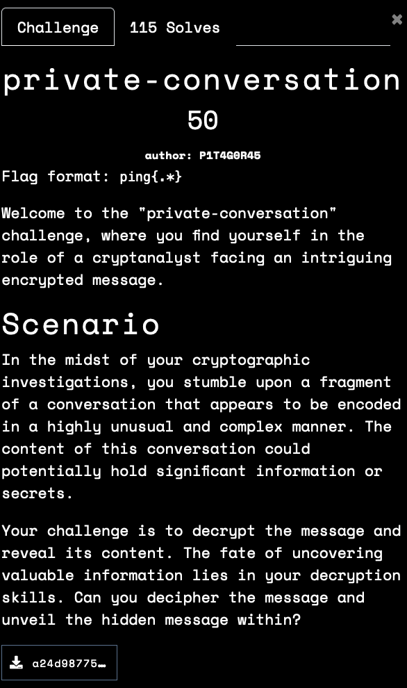
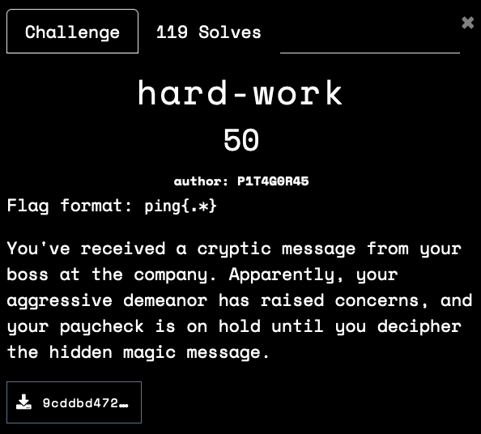
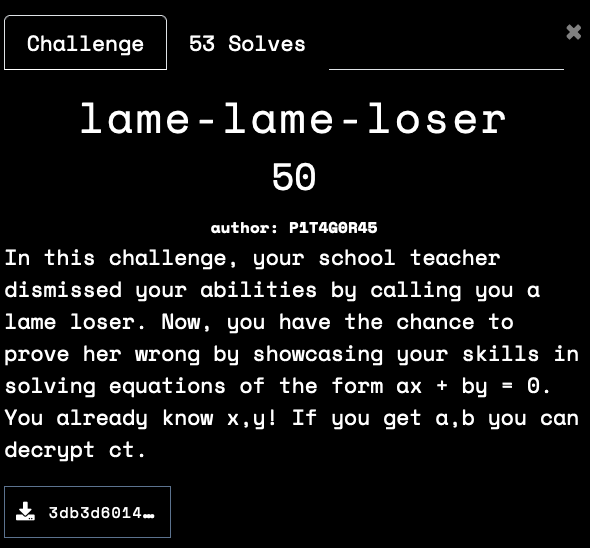
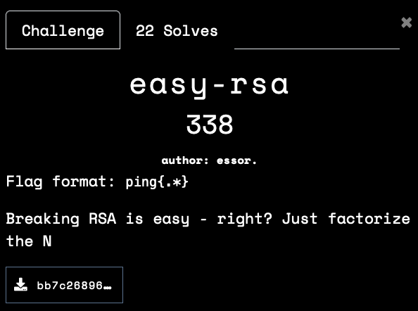
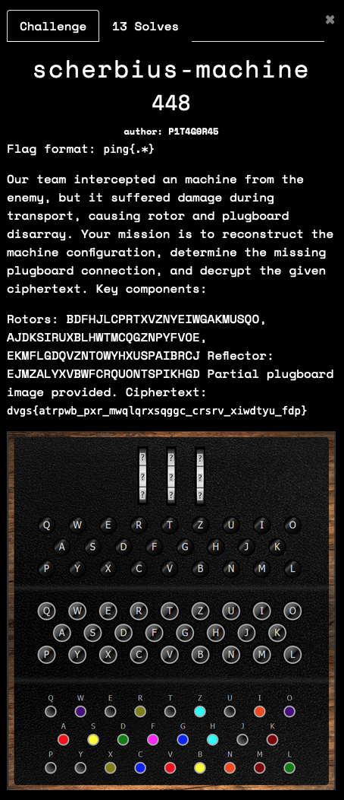
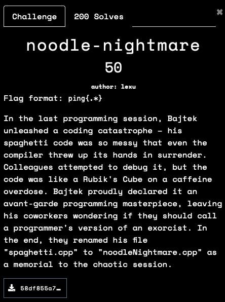
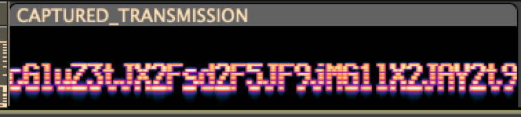
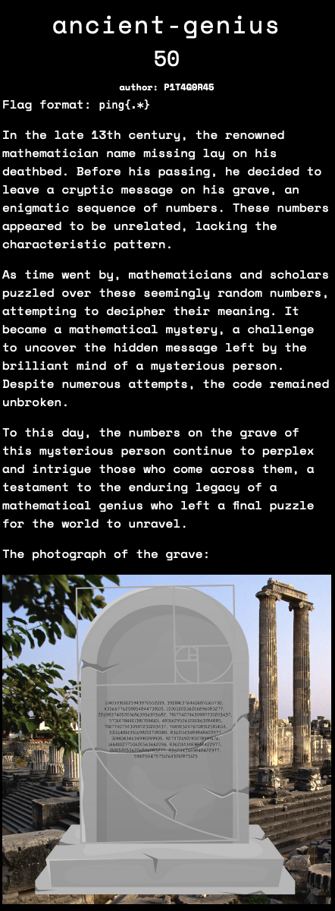

I focused on the Crypto challenges in this CTF. The challenges were of excellent quality. 
<!--more-->
I had limited time to spare for this CTF. I think I came close on several challenges, but could not solve them. Looking forward to learning from the writeups. 

### Solutions 
#### private-conversation

```bash
% unzip -l a24d9877549d9bb256616d238838ba2e_1.zip 
Archive:  a24d9877549d9bb256616d238838ba2e_1.zip
  Length      Date    Time    Name
---------  ---------- -----   ----
        0  11-05-2023 11:12   img/
     5581  11-05-2023 11:10   img/red-flag.png
    23038  11-05-2023 11:12   img/user1.png
    24209  11-05-2023 11:11   img/user2.png
    13365  11-05-2023 18:29   index.html            # this is the important file, ignore the rest
      747  11-05-2023 11:09   style.css
---------                     -------
    66940                     6 files
```
The provided files shows a static HTML/CSS setup, with the HTML file containing a long text with `x` and `d` in combination of upper and lower cases. The letters always seem to alternate, giving 4 unique combinations - `xd, xD, Xd and XD`.

With some trial and error, we can see that the combinations map to the following binary values

$$ 
\begin{array}{c|cc}
    \quad & d & D  \\\ \hline
    x & {00} & {01} \\\
    X & {10} & {11}
\end{array}
$$

With this information, we can decode the message to a binary stream, which when translated to ASCII gives us this C source. 

```c
#include <stdio.h>
int main()
{
    int o_983add0ed98b556d85ef118183b229dc[] = {112, 105, 110, 103, 123, 119, 104, 121, 95, 115, 111, 95, 115, 101, 114, 105, 111, 117, 115, 95, 88, 68, 125};
    const int o_1c1a387bd28e94ce019fcdce8bc08e93 = sizeof((o_983add0ed98b556d85ef118183b229dc)) / sizeof((o_983add0ed98b556d85ef118183b229dc[(0x0000000000000000 + 0x0000000000000200 + 0x0000000000000800 - 0x0000000000000A00)]));
    char o_7645f9e4a84a7e9f0748c6000a041980[o_1c1a387bd28e94ce019fcdce8bc08e93];
    for (int o_f8cd493a89f94a8b1e2e211842b4c8ec = (0x0000000000000000 + 0x0000000000000200 + 0x0000000000000800 - 0x0000000000000A00); (o_f8cd493a89f94a8b1e2e211842b4c8ec < o_1c1a387bd28e94ce019fcdce8bc08e93) & !!(o_f8cd493a89f94a8b1e2e211842b4c8ec < o_1c1a387bd28e94ce019fcdce8bc08e93); ++o_f8cd493a89f94a8b1e2e211842b4c8ec)
    {
        o_7645f9e4a84a7e9f0748c6000a041980[o_f8cd493a89f94a8b1e2e211842b4c8ec] = (char)(o_983add0ed98b556d85ef118183b229dc[o_f8cd493a89f94a8b1e2e211842b4c8ec]);
    };
    for (int o_54314e02607d2bca7f2adf644eae54cf = (0x0000000000000000 + 0x0000000000000200 + 0x0000000000000800 - 0x0000000000000A00); (o_54314e02607d2bca7f2adf644eae54cf < o_1c1a387bd28e94ce019fcdce8bc08e93) & !!(o_54314e02607d2bca7f2adf644eae54cf < o_1c1a387bd28e94ce019fcdce8bc08e93); ++o_54314e02607d2bca7f2adf644eae54cf)
    {
        putchar(o_7645f9e4a84a7e9f0748c6000a041980[o_54314e02607d2bca7f2adf644eae54cf]);
    };
    putchar('\n');
    return (0x0000000000000000 + 0x0000000000000200 + 0x0000000000000800 - 0x0000000000000A00);
};
```
While we can compile this code and run it, we can cut to the chase by extracting the array of values in line #3 and convert it to ascii.  In fact, we an do all of this in an one-line command pipeline in Bash.

```bash
# One-line pipeline in Bash to solve the challenge
# grep -Eo '>[xXdD]*<' index.html | sed -e 's/xd/00/g' -e 's/xD/01/g' -e 's/Xd/10/g' -e 's/XD/11/g' -e 's/[<>]//g' | perl -lpe '$_=pack"B*",$_' | grep -Eo "\{[0-9, ]*?\}" | tr -d '{,}' | xargs -n 1 | awk '{printf "%c", $0}' 
%  grep -Eo '>[xXdD]*<' index.html  # extract the message from HTML    
    | sed -e 's/xd/00/g' -e 's/xD/01/g' -e 's/Xd/10/g' -e 's/XD/11/g' -e 's/[<>]//g'  # translate pairs of characters to binary and remove unnecessary chars
    | perl -lpe '$_=pack"B*",$_'    # convert binary to ascii .... will produce a C source file
    | grep -Eo "\{[0-9, ]*?\}"      # extract the array
    | tr -d '{,}'                   # remove the extra characters
    | xargs -n 1                    # split into one per line
    | awk '{printf "%c", $0}'       # translate decimal to ascii charater and print    

ping{why_so_serious_XD}             # FLAG !
```

#### hard-work


We are provided just one text file with a text file that contains 1 line and 13514 characters.
Looking at the content of the files, we can see that there seems to be ascii hex values - primarily representing numbers. i.e `36 = 6, 20 = space and so on`. So with this hunch, we convert the text to their ascii values - which gives us another series of numbers. 
```bash
% cat task.txt
36 30 20 36 30 20 36 31 20 36 31 20 36 30 20 36 31 20 36 31 20 36 30 20 34 30 20 36 30 20 36 30 20 36 31 20 36 31 20 36 30 20 36 30 20 36 31 20 36 31 20 34 30 20 36 30 20 36 30 20 36 31 20 36 30 20  [<snip>]

# the converted file only has 3 values - 40, 60 and 61
% xxd -r -p task.txt | xargs -n 1 | sort | uniq -c
 166 40
 849 60
 487 61
```
Also, the value `40` appears exactly every 8 numbers. So, we can surmise some kind of a binary scheme.  The rest is a matter of translating `60` to `0` and `61` to `1` and converting it to a string of characters, which gives us a base64 string. Decoding that strings gives us the flag.

```bash
# xxd -r -p task.txt| sed -e 's/[6 ]//g' -e 's/40/\n/g'| perl -lpe '$_=pack"B*",$_'| tr -d '\n'| xxd -r -p | base64 -d
% xxd -r -p task.txt                    # convert hex to binary values
    | sed -e 's/[6 ]//g' -e 's/40/\n/g' # remove 6, 40 and spaces and insert a new line 
    | perl -lpe '$_=pack"B*",$_'        # binary to text
    | tr -d '\n'                        # collapse to a single line
    | xxd -r -p                         # Hex to bytes
    | base64 -d                         # Base 64 decode

ping{patience_is_the_key_to_tranquility}
```
#### lame-lame-loser



I think both the challenge title and ultimately, the flag hints at using the LLL algorithm here. I feel that this could be solved with basic number theory.

```python
from hashlib import sha256
from math import gcd
from Crypto.Cipher import AES
from Crypto.Util.Padding import pad
from secret import FLAG, x, y, a, b
out = open('out.txt', 'w')

assert FLAG.startswith('ping{')
assert FLAG.endswith('}')
assert x*a + y*b == 0
assert a > 0
assert b > 0
assert x.bit_length() >= 1023           # we are given this x, which is negative
assert y.bit_length() >= 1023           # we are given this y
assert a.bit_length() == 512            # a and b are exactly 512 bits long
assert b.bit_length() == 512
assert gcd(a, b) == 1

aes = AES.new(sha256(f'{a}||{b}'.encode()).digest(), AES.MODE_CBC, iv=bytes(16))
pt = pad(FLAG.encode(), 16)
ct = aes.encrypt(pt)

print(f'{x = }', file=out)
print(f'{y = }', file=out)
print(f'{ct = }', file=out)
```
The generic solution for \\( a\*x + b\*y = 0  \\), when given `x` and `y` is

\\(a = k\*\dfrac{y}{gcd(x,y)}, \quad b = k\*\dfrac{x}{gcd(x,y)} \quad where \quad k \in \Z \\) 

Solving for `a` and `b`, with `k == 1`, gives us 512 bit numbers. 

```python
from math import gcd
from Crypto.Cipher import AES
from hashlib import sha256

# x, y and ct are provided from the challenge. 
x = 
y = 
ct= 

g = gcd(x,y)
a = y//g
b = -x//g
print(f"a is {len(bin(a))-2} bits")
print(f"b is {len(bin(b))-2} bits")

aes = AES.new(sha256(f'{a}||{b}'.encode()).digest(), AES.MODE_CBC, iv=bytes(16))
print(aes.decrypt(ct))  # b'ping{135str4_135str4_107v4sz_41g0r1thm_r0cks_sc41ing} 
```

#### easy-rsa 


The challenge source is short and sweet. It does standard RSA to encrypt the flag. The following information is leaked.
1. The result of the logical AND between the primes (`q & p`)
1. The result of the logical AND between one the primes and the other prime shifted left by 1 (`q & (p<<1)`).

```python
#######   Challenge source file ###########
from Crypto.Util.number import getPrime
from Crypto.Util.number import bytes_to_long

p = getPrime(2048)
q = getPrime(2048)
n = p * q
e = 65537
d = pow(e, -1, (p-1)*(q-1))
flag = open("flag.txt","rb").read()

print(f"q & p = {q & p}")
print(f"q & (p << 1) = {q & (p << 1)}")
print(f"n = {n}")
print(f"ct = {pow(bytes_to_long(flag), e, n)}")
```
After doing several logical determinations, I found that I was still left with about 1200 bits of `q` and about 800 bits of `p` that cannot be determined. 

So, I turned to `Z3` to see if I can use it to determine the primes. Here is the annotated solution. This program ran for about 20 minutes on my older laptop. 

```python
from z3 import * 

from Crypto.Util.number import getPrime
from Crypto.Util.number import bytes_to_long, long_to_bytes

bitlen = 2048
# Given values ... 
q_and_p = 19255533152796212242992720925015052977165100229038356072853122758344297941391913731811288637503889893957835822989935905303713710752777324449266828571841201518847196873248114942547801080335290296371569234716421544911658172501145437393374846710803138137307808989325161763203891991730019545282414118666012446323593086041877728885890674444508568272709108666087094340700674807743690571277087703553222951943577713106957357837938244344527749744370370435090293574356857988176670599582946379436655614131476306476922532815575101035473325680474072477054146850541735494484153707953999275852485352550848613495775319945508202644999
q_and_ps = 7112801180654287964416909811366845221897670460107053268303965490368202211276157255630735531566632628465152668686888640536853981159344411188296318259605583929497982211483530931191597394343036880068072881710523781673885424996130058924135020477539221992619498201582190182198153594649904776914100045695897933800407597682900652789330655753567616853658441592170031153228700361032402777562805345962689285290223782295723638984115678627453468399955519885678698327942540059520178138360999657256216711952458812051551165176295610310500428357599329357195749872213722317472180820883692423118643045719988782875815244858084697476366
n = 629263048151678305452575447956575574759729289344426844202876190608729386386187311507156472537419877194722565074742404474698366095301561396335500009086708551715132944925359104482586968535982172950848450616991486882164933308508030447653541771655030633998773150256734151751231794877979894290664805083776347342841761965788022840306507239441472691061434470185155032785918312667155385234312006506953766398470559241684348455601303254513011313918610616344912164305133747945264184175075854717949201043915926552112919719551057640336347310797718453167003130736074852312783981575598197332137858417098138416213397261148554654179742495625000360596380874940069029982601426157700748784881191392765089982233146921318026797755334408105373194190261281426387522068561242744164826397282820570568637958792140799126352243030106388095542265469305391551869027843342339154723022877866472822563864376560243639560467511356673304688994611178354402493975884389423599865545923442816759098328052411030900992085384559185402018882151132333482321734163732964488703573324125780883694828630888629776285568460726623516777110511994045844185435441079697963865653276442218986812145494888396848459290412863370866388156404788872458013848321261694230557300704687955285231150137
ct = 35298631628116130359224654110168305695982263906500815601759249283108606781495993601939607677236970629068001134120097872048346298307953019858839919026717964105487869203149070597551936375993296199579660217021336136433998784937743603970683139418478689946222340268013996123454851821390724257210413455383613162701044471319404611416122452452921345595693933169636951035696702392623767085416101066602717724444002299274612686682594037338907063212581482954711824313661812748820691063881955175084607554637569409759030783300364288473371373832534871778535166888722850811961187103969586607877763143837938758790388347366625971683806113122596153715440188499656167803082999535346051898784036138811121907140409949123154237058329266014568111157279036477684552616957311754125182216065734001391180809071098197495830457756618079294014902429236831364119377802719574368458610707827017826257992031935701095686318205715338591241306163306525299337400170716508041836622056171392705019985962093427177719472269053233585174677794853848800112460097556102315773427435151857478042275125516910669415068837225875052551650890943588902290783802793542904493909655842024149436485583744880955905477870547039491983853968026355806167211650396511235141802512018515691794973835
e = 65537
# Two symbolic variables of the required bit length
P = BitVec(f'p', bitlen)        # create a bit vector of 2048 bits for each prime
Q = BitVec(f'q', bitlen)

S = Solver()

# Add the constraints
S.add(P * Q == n)               
S.add(P & Q == q_and_p)
S.add(Q & P.__lshift__(1) == q_and_ps)

if (S.check() == sat):
    # if constraints are met, get the model
    M = S.model()
    print(M)
    # the two factors of N
    p = M[P].as_long()
    q = M[Q].as_long()
    # standard RSA decryption from here ...
    phi = (p-1) * (q-1)
    d = pow(e, -1, phi)
    print(long_to_bytes(pow(ct, d, n)))     # b'ping{RSA_p_and_q_for_the_win!}'
else:
    print(S.check())
```

#### scherbius-machine


With the description, it is very clear that it is an Enigma machine based challenge. There are a couple of Enigma machine implementations on Github. I used [this one](https://github.com/ZAdamMac/python-enigma/tree/master).

From the image and the description in the challenge, we can discern the following:
1. The three rings are unknown - so must be brute forced.
1. The rotors are `III`, `II`, `I`
1. The reflector is `A`
1. The plugs connected are `AV BS CG DL HZ IN KM OW RX`
1. The `F` plug is unconnected.
1. The available plugs to be connected are `EJPQTUY`

So, putting these into the machine configuration and looking for a plain text that starts with `ping` should give us the flag. 

```python
from python_enigma import enigma
import string

rotor_config = [("III", "A"), ("II", "B"), ("I", "C")]

def to_flag_format(pt):
    return f"{pt[0:4]}{{{pt[4:10]}_{pt[10:13]}_{pt[13:25]}_{pt[25:30]}_{pt[30:37]}_{pt[37:40]}}}"

stator_type =  ["military","civilian"][0] 

for a in string.ascii_uppercase:
    for b in string.ascii_uppercase:
        for c in string.ascii_uppercase:
            for p in "EJPQTUY":
                plugs = f"AV BS CG DL F{p} HZ IN KM OW RX"
                machine = enigma.Enigma(catalog="default", stecker=plugs,
                                        rotors=rotor_config, reflector="Reflector A", operator=True, word_length=100, stator=stator_type)
                machine.set_wheels(f"{a}{b}{c}")
                ct = "dvgs{atrpwb_pxr_mwqlqrxsqggc_crsrv_xiwdtyu_fdp}"
                pt = machine.parse(ct.upper()).lower()
                if (pt.startswith('ping')):
                    print(f"{to_flag_format(pt)} {a} {b} {c} {p}")

'''
Outputs
ping{enigma_ist_uaszinierend_einen_schonev_jag} E C A J
ping{enigma_ist_uahzpnieyend_einen_schonev_cag} E C A Q
ping{enigma_ist_faszinierend_einen_schonen_tag} E C A U
'''
```
Of the three possibilities that started with `ping`,`ping{enigma_ist_faszinierend_einen_schonen_tag}` seemed to be a valid German phrase. Putting the phrase into Google Translate indeed indicates that it is a valid German phrase that means - `Enigma is fascinating. Have a nice day`. 

#### noodle-nightmare


```bash
% unzip -l 58df855a70e2573ee69865930774973a.zip 
Archive:  58df855a70e2573ee69865930774973a.zip
  Length      Date    Time    Name
---------  ---------- -----   ----
    34425  11-17-2023 14:21   noodleNightmare.cpp
        0  11-17-2023 14:21   spaghetti/
        3  11-17-2023 14:21   spaghetti/abjhpkzlvkoxakpkmumttqdiuxqcbwaohrlyttdyrwjucgosuz.cpp
        4  11-17-2023 14:21   spaghetti/acgpoytkwegzlcdvvrpkxxsvqocbaelpfsupfqzydsnwunvnyi.cpp
#----- <snip>
        5  11-17-2023 14:21   spaghetti/zzibjedgygsdnzkclvzmqyfqvaqozqpnutrefnlgmqvcmimlha.cpp
---------                     -------
    36172                     448 files    
# Store the output of the C++ preprocessor ... 
% g++ -E noodleNightmare.cpp -o noodle-nightmare.i
```
```cpp
// output of the pre-processor without any comments 
if
(
____
==
__
)
{
cout
<<
"Congratulations, you have untangled this spaghetti!"
<<
endl
 ;
}
else
{
cout
<<
"Not this time!"
<<
endl
 ;              // this is line 890 in the main program. Insert print statements after this line.
}
```
Modify the original `noodleNightmare.cpp` file to insert print statements, printing the value of the two variables that are being compared. One of the variables is our input, the other is the flag.

```cpp
// ---- <snip> ----
// the following code prints "Not this time!" 
#include "spaghetti/ysdhhqwvzmrgwlgzoomxnbhofswnshmaxtivntzyhglvcwgfsn.cpp"  
#include "spaghetti/tzcyzmfzgpwlmmwzjyztyedvtjwnafjcoebiqpllbkcgqrtlku.cpp"
#include "spaghetti/odpeswpyfiutfonuaxezaffpnvcsiualbyjpszbatalvtztiwu.cpp"
;                       // line #890
cout << ____ << endl;   // add these two lines to print our input and the actual flag
cout << __ << endl;     // one of these is the flag, the other is our input
#include "spaghetti/gjzmlkoxjnastqhmykroyvvycsvujbspjbojqyydkfampwrujw.cpp"
// ---- <snip> ----
```
Compile and run the program with any input. Fortunately, I did not have to breakout Ghidra or GDB.

```bash
# compile the modified source ... and run it.
% g++  noodleNightmare.cpp -o nn
% ./nn
People always say that my code is spaghetti, but I don't see it. Can you help me find the flag?
sdlkfjdsl
Not this time!
sdlkfjdsl
ping{it_is_bad_when_code_is_easier_to_read_in_assembly}    
```

#### ziggarettes

`main: ELF 64-bit LSB executable, x86-64, version 1 (SYSV), statically linked, stripped`

We are given a statically linked ELF executable. Loading it in Ghidra and navigating around the functions shows us a validation function that checks character by character in a large switch statement. 

```c
// partial view of the switch statement in the function 
    case 2:
    if (cVar1 != 'n') goto LAB_00202677;
    break;
    case 3:
    if (cVar1 != 'g') goto LAB_00202677;
    break;
    case 4:
    if (cVar1 != '{') goto LAB_00202677;
    break;
    case 5:
    if (cVar1 != 'z') goto LAB_00202677;
    break;
    case 6:
    case 9:
    if (cVar1 != '1') goto LAB_00202677;
    break;
```
With some creative search-and-replace using regex, we can convert that block of C code to the following python code. Executing this program will get us the flag. 

```python
case = ['_']*0x23       # since '_' is the default case
case [0] = case [0x20] = 'p'
case [1] ='i'
case [2] ='n'
case [3] ='g'
case [4] ='{'
case [5] ='z'
case [6] = case [9] ='1'
case [7] ='G'
case [10] ='S'
case [0xc] ='v'
case [0xd] = case [0x17] ='3'
case [0xe] ='R'
case [0xf] ='Y'
case [0x11] ='C'
case [0x12] ='0'
case [0x13] = case [0x1e] ='O'
case [0x14] = case [0x21] ='l'
case [0x16] = case [0x1f] ='2'
case [0x18] ='4'
case [0x19] ='m'
case [0x1a] = case [0x1c] ='K'
case [0x1b] = case [0x1d] ='I'
case [0x22] ='}'
print(''.join(case))    # ping{z1G_1S_v3RY_C0Ol_234mKIKIO2pl}
```

#### inside-bear

Running `binwalk` on the provided binary shows that there are three media files embedded within it. The wave file has the base64 encoded flag visible in the spectrogram view. 

```bash
DECIMAL       HEXADECIMAL     DESCRIPTION
--------------------------------------------------------------------------------
0             0x0             ELF, 64-bit LSB shared object, AMD x86-64, version 1 (SYSV)
15968         0x3E60          Zip archive data, at least v2.0 to extract, compressed size: 177574, uncompressed size: 338732, name: inside/CAPTURED_TRANSMISSION.wav
193604        0x2F444         Zip archive data, at least v2.0 to extract, compressed size: 325736, uncompressed size: 327800, name: inside/static.ogg
519387        0x7ECDB         Zip archive data, at least v2.0 to extract, compressed size: 791646, uncompressed size: 795282, name: inside/you-died.gif
1311288       0x140238        End of Zip archive, footer length: 22
```


```bash
% echo "cGluZ3tJX2Fsd2F5JF9jMG1lX2JAY2t9" | base64 -d
ping{I_alway$_c0me_b@ck}
```

#### ancient-genius

The numbers on the grave are : 
```
      114059301025943970552219
        3928413764606871165730
       43566776258854844738105
        1500520536206896083277
    22698374052006863956975682
                    7778742049
          31940434634990099905
     3311648143516982017180081
                10610209857723
      483162952612010163284885
          31940434634990099905
         135301852344706746049
                    4807526976
      298611126818977066918552
       43566776258854844738105
          31940434634990099905
                    7778742049
       43566776258854844738105
          31940434634990099905
        3928413764606871165730
        3928413764606871165730
                  139583862445
                   53316291173
          31940434634990099905
      114059301025943970552219
                    7778742049
    14028366653498915298923761
          83621143489848422977
    59425114757512643212875125
```
Search the first number in [Online Encyclopedia of Integer Sequences](https://oeis.org/) and we will see that that number is in the Fibonacci series. We can confirm that is the case for other numbers too. This, combined with the diagram of the seashell on the gravestone indicates that all of these numbers belong to the Fibonacci series. 

Using this table of [Fibnacci numbers](https://r-knott.surrey.ac.uk/Fibonacci/fibtable.html), we can see that the first number(`114059301025943970552219`) is 112th number on the list of Fibonacci numbers. 112 is `p` in decimal. 

So, using the index of these numbers using the site, gives us a series of numbers, which can be converted to ascii to give us the flag. 

```python
seq = [ .... ]  # sequence of numbers from the challenge
fib = [0, 1]    # create the sequence of 128 fibonacci numbers
while len(fib) < 128:
    fib.append(fib[-1] + fib[-2])

print(''.join([chr(fib.index(s)) for s in seq])) #ping{1_w@s_b0rn_1n_ii75_p1za}
```

### Challenges

|Category|Challenge|Description
|----|----|----
|crypto|ancient-genius|
|crypto|easy-rsa|
|crypto|hard-work|
|crypto|lame-lame-loser|
|crypto|old-friend-from-the-past|
|crypto|private-conversation|
|crypto|scherbius-machine|
|crypto|shrek|
|misc|inside-bear|
|misc|internet-cat|
|misc|ping-arcade|
|misc|quiz|
|misc|wow|
|misc|you-spin-me-round|
|pwn|dangle-me|
|pwn|post-office|
|pwn|without-love-it-cannot-be-seen|
|rev|excellent|
|rev|gta-6|
|rev|hangover|
|rev|imag-ine-an-elf|
|rev|noodle-nightmare|
|rev|python-rev-for-freaks|
|rev|ziggarettes|
|web|calc|
|web|dont-be-alarmed|
|web|double-secret|
|web|i-see-no-vulnerability|
|web|internet-explorer|
|web|kubica-shop|
|web|path-traversal-101|
|web|pocket-app|
|web|youtube-trailer|
||sanity-check|

