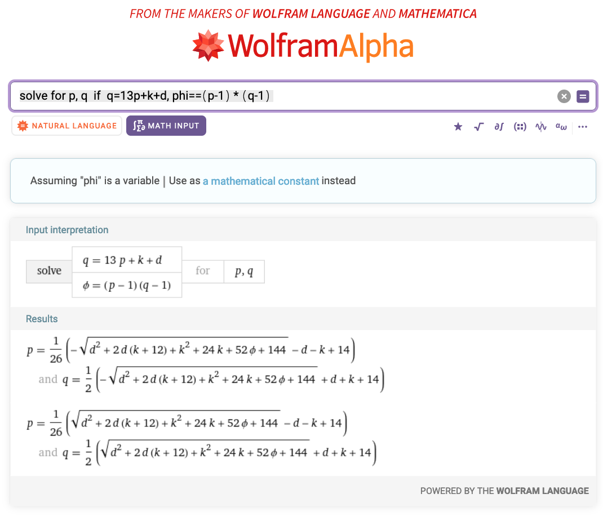
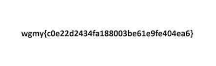

A CTF organized by a team from Malaysia. It was a tidy little event with some interesting challenges. 
<!--more-->
### Crypto
#### N-less RSA

This is a RSA challenge with unknown N, but we have the totient function `phi(n)`. We are also provided the logic used to determine the private primes `p` and `q`.

```python
def generate_secure_primes():
	p = getStrongPrime(1024)
	q = int(next_prime(p*13-37*0xcafebabe))
	return p,q

# Generate two large and secure prime numbers
p,q = generate_secure_primes()
n = p*q
e = 0x10001
phi = (p-1)*(q-1)
c = pow(bytes_to_long(flag),e,n)

# we are given phi, e and c, but not n
```
Given that we have `phi` and the relationship between `p` and `q`, we can solve for them using any of the following three methods.

Method 1: By factoring `phi`
```python 
# Use https://www.alpertron.com.ar/ECM.HTM to factor phi

from Crypto.Util.number import isPrime, long_to_bytes
from itertools import combinations
from functools import reduce


phi=340577739943302989719266782993735388309601832841016828686908999285012058530245805484748627329704139660173847425945160209180457321640204169512394827638011632306948785371994403007162635069343890640834477848338513291328321869076466503121338131643337897699133626182018407919166459719722436289514139437666592605970785141028842985108396221727683676279586155612945405799488550847950427003696307451671161762595060053112199628695991211895821814191763549926078643283870094478487353620765318396817109504580775042655552744298269080426470735712833027091210437312338074255871034468366218998780550658136080613292844182216509397934480
e=65537
ct=42363396533514892337794168740335890147978814270714150292304680028514711494019233652215720372759517148247019429253856607405178460072049996513931921948067945946086278782910016494966199807084840772350780861440737097778578207929043800432279437709296060384506082883401105820800844187947410153745248466533960754243807208804084908637481187348394987532434982032302570226378255458486161579167482667571132674473067323283939026297508548130085016660893371076973067425309491443342096329853486075971866389182944671697660246503465740169215121081002338163263904954365965203570590704089906222868145676419033148652705335290006075758484

factors = [2,2,2,2,5,17,23,127,34883,64327,31855469,41906999093,103832676376161046043,
42928682841447187075836289855892629156535900514107927517684293084786844441409957297894592527460787241683614840492974772427636887719994128565592152980944126724469079274172144474672062412412603584793646346956898729686409791648474545298852872995161295471414165954724402947,
6420760786362823769296653774296236632402429318675915367452603711386456193709958608737754568883471330653872083531628632121784399208909036073963921230370375260817560046504060944356316155772191086712627421688528565251967757404295337261653707746185260317688974197060087034705221140112831521071507609
]

print(len(factors))
# Work out which combination (product) of factors produce possible values for P-1 and Q-1
for n in range(1, len(factors)):
    comb = combinations(factors, n)
    print(f"testing [C({n})]...")
    for c in comb:
        prod = reduce(int.__mul__, c)
        # find the product of all the factors and see if it is 1 less than a prime number
        if isPrime(prod+1) and isPrime(phi//prod+1):
            p = prod+1
            q = phi//(p-1) + 1
            d = pow(e, -1, phi)
            pt = pow(ct, d, p*q)
            m = long_to_bytes(pt)
            # print(m.decode())
            if b"wgmy" in m:
                exit(m.decode())
```
Method 2: Bruteforce + quadratic roots to determine `p`
```python 
from Crypto.Util.number import long_to_bytes

F.<p> = ZZ[]

# given 
phi=340577739943302989719266782993735388309601832841016828686908999285012058530245805484748627329704139660173847425945160209180457321640204169512394827638011632306948785371994403007162635069343890640834477848338513291328321869076466503121338131643337897699133626182018407919166459719722436289514139437666592605970785141028842985108396221727683676279586155612945405799488550847950427003696307451671161762595060053112199628695991211895821814191763549926078643283870094478487353620765318396817109504580775042655552744298269080426470735712833027091210437312338074255871034468366218998780550658136080613292844182216509397934480
e=65537
c=42363396533514892337794168740335890147978814270714150292304680028514711494019233652215720372759517148247019429253856607405178460072049996513931921948067945946086278782910016494966199807084840772350780861440737097778578207929043800432279437709296060384506082883401105820800844187947410153745248466533960754243807208804084908637481187348394987532434982032302570226378255458486161579167482667571132674473067323283939026297508548130085016660893371076973067425309491443342096329853486075971866389182944671697660246503465740169215121081002338163263904954365965203570590704089906222868145676419033148652705335290006075758484

for i in range(1000):
    f = (p - 1) * (p*13-37*0xcafebabe + i) - phi
    if (len(f.roots()) != 0):
        p = f.roots()[0][0]
        q = phi // (p - 1) + 1
        assert phi % (p - 1) == 0
        assert phi % (q - 1) == 0

        n = p * q
        d = pow(e, -1, phi)
        m = pow(c, d, n)
        print(long_to_bytes(m))
        break
```
Method 3: Z3 solver
```python 
from z3 import *
from Crypto.Util.number import long_to_bytes

# given 
phi=340577739943302989719266782993735388309601832841016828686908999285012058530245805484748627329704139660173847425945160209180457321640204169512394827638011632306948785371994403007162635069343890640834477848338513291328321869076466503121338131643337897699133626182018407919166459719722436289514139437666592605970785141028842985108396221727683676279586155612945405799488550847950427003696307451671161762595060053112199628695991211895821814191763549926078643283870094478487353620765318396817109504580775042655552744298269080426470735712833027091210437312338074255871034468366218998780550658136080613292844182216509397934480
e=65537
c=42363396533514892337794168740335890147978814270714150292304680028514711494019233652215720372759517148247019429253856607405178460072049996513931921948067945946086278782910016494966199807084840772350780861440737097778578207929043800432279437709296060384506082883401105820800844187947410153745248466533960754243807208804084908637481187348394987532434982032302570226378255458486161579167482667571132674473067323283939026297508548130085016660893371076973067425309491443342096329853486075971866389182944671697660246503465740169215121081002338163263904954365965203570590704089906222868145676419033148652705335290006075758484

p = Int('p')
q = Int('q')
incr = Int('incr')

s = Solver()
s.add((p-1) * (q-1) == phi)
s.add(q == (p*13-37*0xcafebabe + incr))
# set the boundary conditions p, q and incr all should be positive integers
s.add(p > 0)
s.add(q > 0)
s.add(incr > 0)
# set an upper bound to `incr` as the nextPrime() should find one close to the start value (13p - k)
s.add(incr < 1000)  # tune as needed.

if s.check() == sat:
    m = s.model()
    P = m[p].as_long()
    Q = m[q].as_long()
    N = P*Q
    print(f'Found Solution: \n{P =}\n{Q =}')

    d = pow(e, -1, phi)
    print(long_to_bytes(pow(c, d, N)))      # b'wgmy{a9722440198c2abad490478875be2815}'
else:
    print('Unsat :(')
```
Method 4: 



```python
from Crypto.Util.number import long_to_bytes
# given 
phi=340577739943302989719266782993735388309601832841016828686908999285012058530245805484748627329704139660173847425945160209180457321640204169512394827638011632306948785371994403007162635069343890640834477848338513291328321869076466503121338131643337897699133626182018407919166459719722436289514139437666592605970785141028842985108396221727683676279586155612945405799488550847950427003696307451671161762595060053112199628695991211895821814191763549926078643283870094478487353620765318396817109504580775042655552744298269080426470735712833027091210437312338074255871034468366218998780550658136080613292844182216509397934480
e=65537
c=42363396533514892337794168740335890147978814270714150292304680028514711494019233652215720372759517148247019429253856607405178460072049996513931921948067945946086278782910016494966199807084840772350780861440737097778578207929043800432279437709296060384506082883401105820800844187947410153745248466533960754243807208804084908637481187348394987532434982032302570226378255458486161579167482667571132674473067323283939026297508548130085016660893371076973067425309491443342096329853486075971866389182944671697660246503465740169215121081002338163263904954365965203570590704089906222868145676419033148652705335290006075758484

k = -37*0xcafebabe
d = 0
while True:
    q = ( sqrt(d^2 + 2*d*(k+12) + k^2 + 24*k + 52*phi + 144) +d +k +14)/2
    if q in ZZ:
        break
    d += 1
p = (phi/(q-1)) +1
n = p*q
d = pow(e, -1, phi)
print(long_to_bytes(pow(c,d,n)))
```

#### Ho Ho Ho 2

```bash
Want to make a wish for this Christmas? Submit here and we will tell Santa!!

1. Register
2. Login
3. Make a wish
4. Wishlist (Santa Only)
5. Exit
Enter option: 1
Enter your name: aaaaaa
Use this token to login: 6076a84d0f90efbfb4a2ddc7a3f1436f
```
To solve this challenge, we need to login with the name with `Santa Claus` in it and have a valid token. 

The token generator is a LCG with just one randomly generated value
```python 
m = 0xb00ce3d162f598b408e9a0f64b815b2f
a = 0xaaa87c7c30adc1dcd06573702b126d0d
c = 0xcaacf9ebce1cdf5649126bc06e69a5bb
n = getRandomNBitInteger(64)

def generateToken(name):
	x = bytes_to_long(name.encode(errors="surrogateescape"))
    # LCG fast skip implementation
    # is equivalent to the following code
    # for _ in range(n):
    # 	x = (a*x + c) % m
	x = ((pow(a, n, (a-1)*m) - 1) // (a-1) * c + pow(a, n, m) * x) % m
	return hex(x)[2:]
```
The algorithm for the fast skip LCG calculation is explained very well at [this site](https://mechfrog88.github.io/wargames-2023).

$$
    Token \quad T = \overbrace{[[x\cdot a + c]\cdot a + c] \cdots + c]]}^{\text{nested n-times}}\\\
    T = x\cdot a^n + c\cdot a^{n-1}+ c\cdot a^{n-2}+ \cdots + c \\\
    T = x\cdot a^n + c\cdot ( a^{n-1} + a^{n-2} + \cdots + 1 ) \\\
    T = x\cdot a^n + c\cdot (\dfrac{a^n-1}{a-1}) \pmod{m}\\\
    \space \\\
    \text {Given x, m, a, c and T, calculate n}\\\
    \space \\\
    T \cdot {(a-1)} = x\cdot{a^n}\cdot{(a-1)} + c\cdot{a^n} - c\\\
    T \cdot {(a-1)}+c = x\cdot{(a-1)}\cdot{a^n} + c\cdot{a^n}\\\
    T\cdot{(a-1)}+c = {a^n}\cdot{(x\cdot{(a-1)} + c)} \\\
    {a^n} = \dfrac{ T\cdot{(a-1)}+c}{x\cdot{(a-1)} + c}\\\
    \space \\\
    {n} = {log_a} \Big[ \dfrac{ T\cdot{(a-1)}+c}{x\cdot{(a-1)} + c} \Big] \pmod {m}
    \space \\\
    \space \\\
    \text {In Sage, use the following equation and simplify to solve for  } a^n \\\
    T = x\cdot a^n + c\cdot (\dfrac{a^n-1}{a-1}) \pmod{m}\\\
    x\cdot a^n + c\cdot (\dfrac{a^n-1}{a-1}) - T =0  \pmod{m}\\\
$$

The full solution is: 
```python 
from pwn import *
from Crypto.Util.number import bytes_to_long

def regUser(R, username):
    R.recvuntil(b'Enter option:')
    R.sendline(b'1')
    R.recvuntil(b'name:')
    R.sendline(username)
    R.recvuntil(b'to login:')
    t = R.recvline().strip()
    return t

R = process(['python3', 'hohoho1-server.py'])
# R = remote('',)

context.log_level = 'debug'

uname = b'aaaaaaaa'
t = regUser(R, uname)
print(f"{uname}  --> {t}")
m = 0xb00ce3d162f598b408e9a0f64b815b2f
a = 0xaaa87c7c30adc1dcd06573702b126d0d
c = 0xcaacf9ebce1cdf5649126bc06e69a5bb

T = int(t, 16)
x = bytes_to_long(uname)
# `p` is the variable to represent a**n
#  T = a^n x + c (a^n - 1)/(a-1)
#  a^n (is not xor)
F.<p> = Zmod(m)[]
f = p*x + c * (p - 1) / (a - 1) - T
print(f"Simplified equation: {f = } = 0")
lst = f.coefficients()
an = (-lst[0]) / lst[1]

print(f"Coeff {lst = }\n {an = }")
# Find discrete log with base `a` to get `n`
n = int(an.log(a))
print(f"Found {n = }")

def generateToken(name):
	x = bytes_to_long(name.encode(errors="surrogateescape"))
	x = ((pow(a, n, (a-1)*m) - 1) // (a-1) * c + pow(a, n, m) * x) % m
	return hex(x)[2:]

# Generate a token for `Santa` using our calculated value for `n`
santa_token = generateToken('Santa Claus')

# Use the self-generated token to login as Santa
R.recvuntil(b'Enter option:')
R.sendline(b'2')
R.recvuntil(b'name:')
R.sendline(b'Santa Claus')
R.recvuntil(b'token:')
R.sendline(santa_token)

# Use option 4 to view the wishlist and get the flag
R.interactive()
```

### Forensic
#### See You
We are given a PCAP file with the instructions that one the machines was found to be exfiltrating information.  Wireshark's protocol statistics show a bunch of TLS traffic (which we can ignore) and some UDP traffic. A large portion of the UDP traffic comes from port 38884.  

```bash
% tshark -r artifact.pcapng -z io,phs
#<snip>
===================================================================
Protocol Hierarchy Statistics
Filter: 

eth                                      frames:21247 bytes:23866862
  ip                                     frames:21227 bytes:23865225
    udp                                  frames:18993 bytes:1295197
      data                               frames:18351 bytes:1248704
      dns                                frames:236 bytes:24597
      mdns                               frames:8 bytes:712
      llmnr                              frames:1 bytes:67
      jmirror                            frames:23 bytes:1817
        ipv6                             frames:22 bytes:1748
          _ws.malformed                  frames:19 bytes:1476
          data                           frames:2 bytes:182
        ip                               frames:1 bytes:69
          _ws.malformed                  frames:1 bytes:69
      ssdp                               frames:18 bytes:3766
      dhcp                               frames:2 bytes:666
    tcp                                  frames:2231 bytes:22569848
      tls                                frames:823 bytes:21959388
        tcp.segments                     frames:527 bytes:20067651
          tls                            frames:510 bytes:20007994
      http                               frames:36 bytes:12865
        data-text-lines                  frames:11 bytes:6776
    igmp                                 frames:3 bytes:180
  ipv6                                   frames:12 bytes:1229
    icmpv6                               frames:3 bytes:270
    udp                                  frames:9 bytes:959
      mdns                               frames:8 bytes:872
      llmnr                              frames:1 bytes:87
  arp                                    frames:8 bytes:408
===================================================================

% tshark -r artifact.pcapng -Y 'udp.srcport == 38884' -T fields -e 'udp.dstport' | cut -c 3- | awk '{printf "%c",$0}' | xxd 
00000000: 8950 4e47 0d0a 1a0a 0000 000d 4948 4452  .PNG........IHDR
00000010: 0000 0376 0000 0110 0802 0000 0073 fd71  ...v.........s.q
00000020: b400 0000 0173 5247 4200 aece 1ce9 0000  .....sRGB.......
# <snip>
% tshark -r artifact.pcapng -Y 'udp.srcport == 38884' -T fields -e 'udp.dstport' |                  
                            # ^^ Read the PCAP file, filter by udp source port == 38884, and extract only the UDP target port
cut -c 3- |                 # ignore the first 2 digits and capture the rest
awk '{printf "%02x",$0}' |  # Convert from decimal to hex
xxd -r -p > cu.png          # convert from hex string to byte values and store it as 'cu.png'
```
Open the resulting image file to read the flag. 


### References & Writeups
* https://www.alpertron.com.ar/ECM.HTM
* https://mechfrog88.github.io/wargames-2023
* https://zeynarz.github.io/posts/wgmy23/
* https://hackmd.io/@capri/BkeRmUo8T
* https://zachwong02.github.io/post/wgmy2023-compromised/ 
* https://vicevirus.github.io/posts/warmupweb-wgmy-2023/
* https://jerit3787.github.io/ctf/posts/wargamesmy-2023-writeup/
* https://zachwong02.github.io/post/wgmy2023-seeyou/
* https://d0ublew.github.io/categories/wgmy2023/
* https://github.com/jasonpeh373/Wargame2023-RE
* https://github.com/ItsZer01/CTF-Writeup/blob/main/2023/Wgmy2023.md
* https://mechfrog88.github.io/wargames-2023
* https://davidtan0527.github.io/ctfs/wargamesmy2023/magic_door
* https://github.com/4n86rakam1/writeup/tree/main/Wargames.MY_2023_CTF


### Challenges

|Category|Challenge|Description
|----|----|----
|CRYPTO|Hohoho 2 Continue|
|CRYPTO|Hohoho 2|
|CRYPTO|N-less RSA|
|FORENSIC|Can't Snoop|
|FORENSIC|Compromised|
|FORENSIC|SeeYou|
|MISC|Dialect|
|MISC|Sayur|
|MISC|Splice|
|MISC|Warmup - Game|
|OTHER|Feedback Form|
|PPC|Linux Memory Usage|
|PPC|Lokami Temple|
|PWN|Free Juice|
|PWN|Magic Door|
|PWN|Pak Mat Burger|
|REVERSE|Defeat the boss!|
|REVERSE|RmRf|
|WEB|My First AI Project|
|WEB|Pet Store Viewer|
|WEB|Report Google?|
|WEB|Secret|
|WEB|Status|
|WEB|Truco|
|WEB|Warmup - Web|
|WEB|myCloud|

