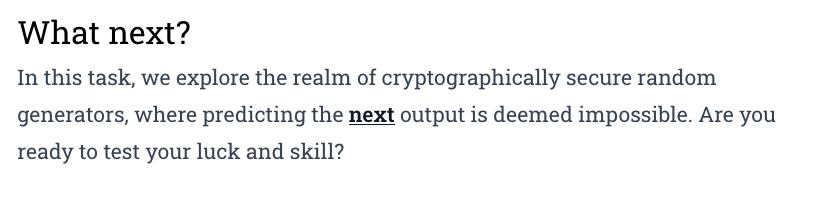
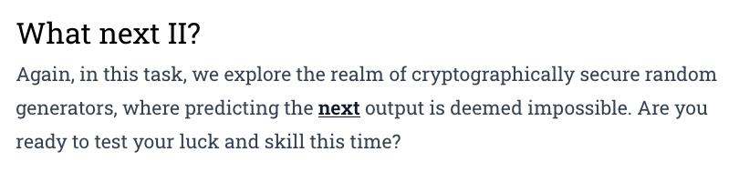
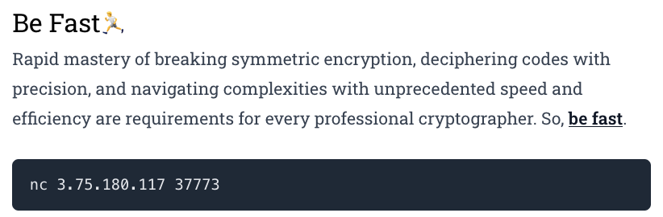
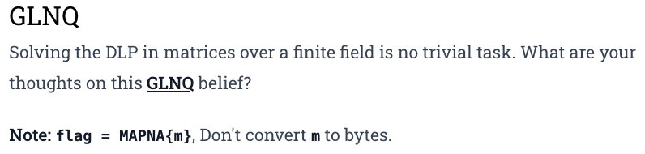
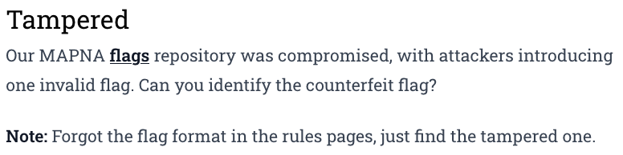
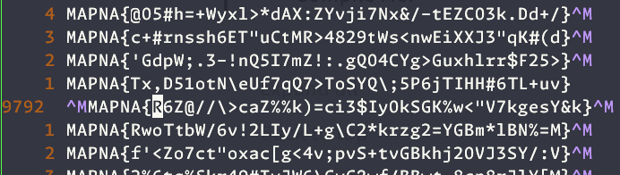

Organized by Asis, this CTF seems to be sponsored by an energy consortium called the MAPNA group. The challenges were indeed ... challenging!
<!--more-->

### Cryptography

#### What Next


Trivial XOR operation. No need to mess around with MT19937
```python
KEY = 23226475334448992634882677537728533150528705952262010830460862502359965393545
enc = 2290064970177041546889165766737348623235283630135906565145883208626788551598431732

m = KEY ^ enc
print(long_to_bytes(m)) # b'MAPNA{R_U_MT19937_PRNG_Predictor?}'
```
#### What Next II


In this challenge, we are not given the KEY, but instead the preceding random numbers that could help us reproduce it. 

```python
from mt19937predictor import MT19937Predictor
from Crypto.Util.number import long_to_bytes

TMP = [ ... given array ...]
enc = ... given ...

def decrypt(cipher, KEY):
    m = KEY ^ cipher
    return long_to_bytes(m)

M = MT19937Predictor()

# we need 624 * 32 = 19968 bits to seed the generator
# we have 256 * 79 = 20224 bits, we only need 78 and we can use the last one as validation

for i in range(1, len(TMP)-1):
    assert TMP[i] % (i**2) == 0
    randbits = TMP[i]// (i**2)
    M.setrandbits(randbits, 256)

my_rand = M.getrandbits(256)

# verify that the rand generators are synched
assert TMP[-1] == my_rand * (79 ** 2)

# reproduce the key 
KEY = sum([M.getrandbits(256 >> _) ** 2 for _ in range(8)]) 
# decrypt to get the flag
print(decrypt(enc, KEY))        # b'MAPNA{4Re_y0U_MT19937_PRNG_pr3d!cT0r_R3ven9E_4057950503c1e3992}'
```

#### Be Fast


The analysis of the given challenge source gives us: 
```python
def main():
	border = "+"
	pr(border*72)
	pr(border, ".::        Hi all, you should be fast, I mean super fact!!       ::.", border)
	pr(border, "You should send twenty 8-byte keys to encrypt the secret message and", border)
	pr(border, "just decrypt the ciphertext to get the flag, Are you ready to start?", border)
	pr(border*72)

	secret_msg = b'TOP_SECRET:' + os.urandom(40)            # <--- Known plaintext, enough to fill the first block (8 bytes)
	
	cnt, STEP, KEYS = 0, 14, []             # <--- Even though the banner says to provide 20 keys, we only need 14 
	md = 1

	while True:
		pr(border, "please send your key as hex: ")
		alarm(md + 1)
		ans = sc().decode().strip()
		alarm(0)
		try:
			key = unhexlify(ans)
			if len(key) == 8 and key not in KEYS:
				KEYS += [key]
				cnt += 1
			else:
				die(border, 'Kidding me!? Bye!!')
		except:
			die(border, 'Your key is not valid! Bye!!')
		if len(KEYS) == STEP:
			print(KEYS)
			HKEY = KEYS[:7]			            # The first seven keys - not used for encryption ... only as a counter
			shuffle(HKEY)			
			NKEY = KEYS[-7:]                    # The last seven keys are shuffled.
			shuffle(NKEY)
			for h in HKEY: NKEY = [key, shift(key, 1)] + NKEY       # key = last (14th) key .. this key is shifted (rotated) 7 times

            # the final key array is [14 rotated version of the last key] + shuffled permutation of the last 7 keys                
			enc = encrypt(secret_msg, NKEY[0])
			for key in NKEY[1:]:
				enc = encrypt(enc, key)
			pr(border, f'enc = {hexlify(enc)}')
			pr(border, f'Can you guess the secret message? ')
			alarm(md + 1)                   # we get 2 seconds to decrypt the secret message and send it over 
			msg = sc().strip()
			alarm(0)
			if msg == hexlify(secret_msg):
				die(border, f'Congrats, you deserve the flag: {flag}')
			else:
				die(border, f'Sorry, your input is incorrect! Bye!!')
```

So, our approach to solve the problem would be : 
1. We need to provide 14 8-byte keys.
1. The first 7 keys don't matter as they are not used in the encryption step
1. The last 7 keys are shuffled in some random order. Permutations(7,7) = 5040 possibilities. 
1. The last key is rotated/shifted for 14 rounds. 
1. We can pick the last key so that the rotation/shifts shouldn't matter. I chose all ones : `1111111111111111`
1. The encryption order is : 14 * [last_key] + [a permutation of the last seven keys]
1. We can take the first block `b'TOP_SECR'` and run it through all possible permutations and store the resulting mapping for a reverse lookup
1. We then connect to the server, send the keys and get the encrypted message back.
1. Use the first 8 bytes to lookup the appropriate permutation used on the server. 
1. Reverse the encryption function in the opposite order.  Reverse of the permutation order + 14 rounds with the [last_key]
1. Send the resulting message to the server and receive the flag. You can confirm that the message indeed has the known header `TOP_SECRET:`

```python 
from pwn import * 
from itertools import permutations
from Crypto.Cipher import DES

context.log_level = 'error'
keys = [
    b'1000000000000011', b'1000000000000012', b'1000000000000013', b'1000000000000014', b'1000000000000015', b'1000000000000016', b'1000000000000017',
    b'1000000000000018', b'1000000000000019', b'100000000000001a', b'100000000000001b', b'100000000000001c', b'100000000000001d', b'1111111111111111',
]

secret_block = b'TOP_SECR'      # first block of the message
signatures = {}
static_enc = b''
static_key = unhex(keys[-1])

def encrypt(msg, key):
	# msg = pad(msg)
	assert len(msg) % 8 == 0
	assert len(key) == 8
	des = DES.new(key, DES.MODE_ECB)
	enc = des.encrypt(msg)
	return enc

def decrypt(cipher, key):
     des = DES.new(key, DES.MODE_ECB)
     msg = des.decrypt(cipher)
     return msg

perms = list(permutations(keys[7:], 7))
print(f"Permutations: {len(perms)}   {perms[0]}")
enc = secret_block
for i in range(14):
    enc = encrypt(enc, static_key)
static_enc = enc

for l in perms:
    enc = static_enc
    binary_keys = []
    for k in l: 
        binary_k = unhex(k)
        enc = encrypt(enc, binary_k)
        binary_keys.append(binary_k)
    signatures[enc] = binary_keys

# R = process(["python3", "be_fast.py"])
R = remote('3.75.180.117',37773)
R.recvuntil(b'ready to start?')
R.recvline()

for i in range(14):
    R.recvuntil(b'key as hex:')
    R.sendline(keys[i])
R.recvuntil(b'+ enc = ')
enc = R.recvline().decode()
enc = bytes(enc, 'utf-8').decode().split("'")[1]
print(">>>>", enc)
enc_bytes = unhex(enc)

# get the correct permutation of the 7 keys used by the server
NKEYS = signatures[enc_bytes[:8]]
message = enc_bytes

# decrypt in the reverse order of encryption
for k in NKEYS[::-1]:
     print(k)
     message = decrypt(message, k)
# finally use the static key that does not change
for i in range(14):
     message = decrypt(message, static_key)

# The final message must start with b'TOP_SECRET:'
print(f"Final message: {message}")
R.recvuntil(b'guess the secret message?')
R.sendline(enhex(message).strip('ff'))      # strip the padding characters 
R.interactive()        # MAPNA{DES_h4s_A_f3W_5pec1f!c_kEys_7eRm3d_we4K_k3Ys_And_Sem1-wE4k_KeY5!}
```
#### Shibs


#### GLNQ


### Forensics
#### Tampered

```bash
% sort flag.txt
^MMAPNA{R6Z@//\>caZ%%k)=ci3$IyOkSGK%w<"V7kgesY&k}
MAPNA{!!+8zTQ>mXG(Bki%pk&ne*ERY;8(K$/G3tEFL#NP}
MAPNA{!!Ih-)bL'ShqKU*Hau,1e&f<2I7s5wrTlYCBu49\}
...
```
Opening the file in Vim and searching for that outlier, brings us to line 9792, where we can see the discontinuity in the pattern. The previous like has a carriage return before the newline, unlike others.


### Reverse
#### Compile Me
We are given the following source code to compile and run. 
```c
Welcome,to,MAPNA,CTF,Year_2k24;main(){for(++CTF;to=-~getchar();Welcome+=11==to,Year_2k24++)CTF=to>0xe^012>to&&'`'^to^65?!to:!CTF?++MAPNA:CTF;printf("MAPNA{%4d__%d__%d_!}\n",(to+20)^(Welcome+24)+1390,MAPNA+=(!CTF&&Year_2k24)+10,Year_2k24+31337);}
```
Even though the challenge instructions ask us to provide the challenge source as the **argument**, what we need to provide is the name of the challenge source as the input to get the flag.
```bash
% gcc -Wno-implicit-function-declaration -Wno-implicit-int -Wno-parentheses -o source source.c
% echo "source.c" | ./source 
MAPNA{1427__11__31346_!}
```

### Challenges

|Category|Challenge|Description
|----|----|----


