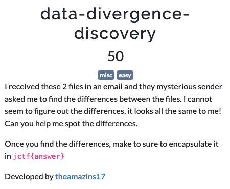
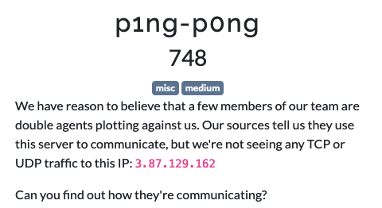
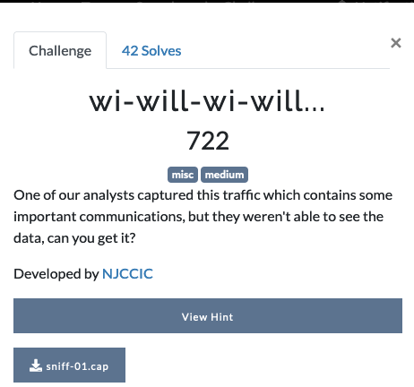
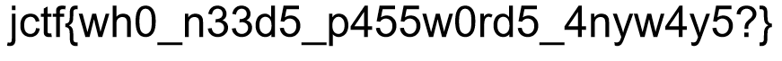
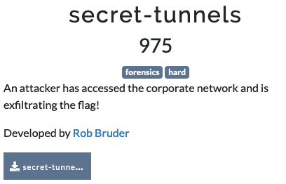
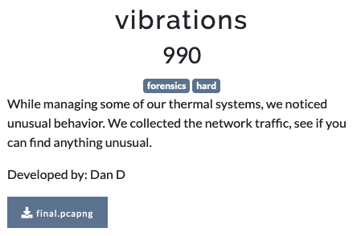
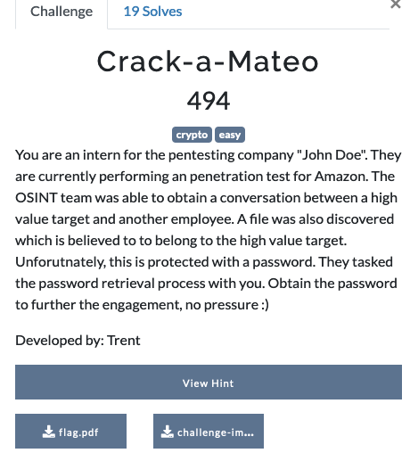
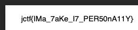

Another edition of JerseyCTF, organized by NJIT. It is my third year of participating in this CTF and it was as much fun as the other years. 
<!--more-->
Interestingly, there were a number of challenges that were in crossover categories - i.e, combinations of OSINT, Misc and Forensics techniques were used in the same challenge. So, it brought some amount of novelty to the CTF. I participated as part of the team `Weak But Leet`. 

Here are some of the challenges I solved and how I approached them. I came close to solving a couple more.

### Miscellaneous

#### Data-Divergence-Discovery

```
$ git diff  --no-index --word-diff=porcelain --word-diff-regex=. neon-echoes-1.txt neon-echoes-2.txt | grep "^+" | grep -v ".txt" | tr -d '+\n'
qu4ntum_c1ph3r5 

# My original solution
$ fold -w1 neon-echoes-1.txt > n1.txt
$ fold -w1 neon-echoes-2.txt > n2.txt
# Get either changed or deleted character from the first file and assemble them to get the flag
$ diff n1.txt n2.txt | grep ">" | tr -d "> \n"
qu4ntum_c1ph3r5 
```
#### the-droid-youre-looking-for 

We are given an APK file. There are a number of decompilers that can unpack the `.apk` file and decompile the class files to java source. 

1. Decompile and extract the source and configuration files of the APK
1. Search for the string `jctf`, which will find the match in `resources/res/layout/activity_main.xml`
1. Learn that it is the text label with the tag `android:text`
1. Extract all text labels in the file.  Assemble to get the flag.

```
% grep -Eo 'android:text=\".*?\"' activity_main.xml 
android:text="jctf{"
android:text="c4n_y0u_s33_m3?"
android:text="}"
android:text="Get Flag"
```
#### p1ng-p0ng



A simple challenge, but a lot of cool things to learn here. 

* Given the challenge title, using a simple `ping` command gives us a seemingly malformed packet, that has an error message in the response.

```
$ ping 3.87.129.162
PING 3.87.129.162 (3.87.129.162): 56 data bytes
38 bytes from 3.87.129.162: icmp_seq=0 ttl=55 time=479333613884.272 ms
wrong total length 58 instead of 84
wrong data byte #8 should be 0x8 but was 0x63
cp:
	49 6e 76 61 6c 69 64 20 63 6f 6d 6d 61 6e 64 2e 
	20 54 72 79 20 22 28 48 45 4c 50 29 22 2e  0  0      <<--- Invalid command. Try "(HELP)".
	0  0  0  0  0  0  0  0  0  0  0  0  0  0  0  0 
	0  0  0  0  0  0  0  0 
dp:
	66  0 8a 69  0  0 ab b4  8  9  a  b  c  d  e  f 
	10 11 12 13 14 15 16 17 18 19 1a 1b 1c 1d 1e 1f 
	20 21 22 23 24 25 26 27 28 29 2a 2b 2c 2d 2e 2f 
	30 31 32 33 34 35 36 37 
```
1. So, it is apparent that we need to construct a custom data packet and send it over ICMP. 
1. Looking into this, I learnt about `nping` that is part of the `nmap` suite, which allows us to control the data to be sent over ICMP.
1. Using the `(HELP)` command shows that there are valid commands to add, get the count and retrieve the entries from the server through ICMP. 

```
$  sudo nping --icmp -c1 -v3 --data-string "(HELP)" 3.87.129.162
Starting Nping 0.7.94 ( https://nmap.org/nping ) at 2024-03-24 16:25 EDT
SENT (0.0071s) ICMP [192.168.1.225 > 3.87.129.162 Echo request (type=8/code=0) id=37623 seq=1] IP [ver=4 ihl=5 tos=0x00 iplen=34 id=49455 foff=0 ttl=64 proto=1 csum=0x7229]
0000   45 00 00 22 c1 2f 00 00  40 01 72 29 c0 a8 01 e1  E.."./..@.r)....
0010   03 57 81 a2 08 00 a7 49  92 f7 00 01 28 48 45 4c  .W.....I....(HEL
0020   50 29                                             P)              
RCVD (0.5894s) ICMP [3.87.129.162 > 192.168.1.225 Echo reply (type=0/code=0) id=37623 seq=1] IP [ver=4 ihl=5 tos=0x00 iplen=144 id=63958 flg=D foff=0 ttl=55 proto=1 csum=0x0214]
0000   45 00 00 90 f9 d6 40 00  37 01 02 14 03 57 81 a2  E.....@.7....W..
0010   c0 a8 01 e1 00 00 6c 63  92 f7 00 01 43 6f 6e 6e  ......lc....Conn
0020   65 63 74 69 6f 6e 20 73  75 63 63 65 73 73 66 75  ection.successfu
0030   6c 2e 20 41 76 61 69 6c  61 62 6c 65 20 63 6f 6d  l..Available.com
0040   6d 61 6e 64 73 3a 20 22  28 48 45 4c 50 29 22 2c  mands:."(HELP)",
0050   20 22 28 47 45 54 3b 49  44 3b 45 4e 54 52 59 5f  ."(GET;ID;ENTRY_
0060   4e 55 4d 29 22 2c 20 22  28 41 44 44 3b 49 44 3b  NUM)",."(ADD;ID;
0070   45 4e 54 52 59 5f 43 4f  4e 54 45 4e 54 29 22 2c  ENTRY_CONTENT)",
0080   20 22 28 45 4e 54 52 59  5f 43 4f 55 4e 54 29 22  ."(ENTRY_COUNT)"
```
1. After some trial and error, we can see that the command `(GET;;1)` returns the first message from the server. 
1. Iterating over the list of messages gives us the fragments of messages that can be assembled into the flag.

|Command|Response|
|----|----|
|(HELP)| Available commands: "(HELP)", "(GET;ID;ENTRY_NUM)", "(ADD;ID;ENTRY_CONTENT)", "(ENTRY_COUNT)"|
|(ENTRY_COUNT)| # of Entries: 8|
|(GET;;1)|USE ICMP FOR COMMS -TL|
|(GET;;2)|PLS SEND FLAG -TL|
|(GET;;3)|SENDING NOW -RB|
|(GET;;4)|jctf{|
|(GET;;5)|1L0V3|
|(GET;;6)|1CMP7UNN3L1NG|
|(GET;;7)|}|
|(GET;;8)|THX -TL|

Assembling entries 4,5,6 and 7 provides the flag.

#### wi-will-wi-will...  (INCOMPLETE)


* We are given a packet capture file. 
* Use `pcap2john.py` to generate the hash from the pcap file.
* Use `john` and `rockyou` wordlist to find the WPA password for the SSID `bletchley_park`, which is `WinstonChurchill`
* Add the password to Wireshark. `File -> Preferences -> Protocols -> IEEE 802.11 -> Decryption keys`
 
### Forensics

#### locked out
```
$ bkcrack -x 0 3c7376672076657273696f6e3d22312e3122 -C locked-out.zip -c nokeynoprob.svg 
[16:40:00] Z reduction using 11 bytes of known plaintext
100.0 % (11 / 11)
[16:40:00] Attack on 575505 Z values at index 6
Keys: 9c9d83e5 7915abee 58998fbc
99.4 % (571963 / 575505)
[16:48:08] Keys
9c9d83e5 7915abee 58998fbc

# Use the keys to decrypt the zip file

$ bkcrack -k 9c9d83e5 7915abee 58998fbc -C locked-out.zip -c flag.png -d locked_flag.png
[17:09:32] Writing deciphered data locked_flag.png (maybe compressed)
```


#### secret tunnels

* Using protocol hierarchy statistics of Wireshark, we can see that there are a number of DNS queries and responses.
* Extract only the A records of the hostnames in the `jerseyctf.com` domain. 
* Assembling the unique hostnames in order and decoding it with Base64 gives us a password protected zip file, which has a file named `flag.txt`
* Running `John` against the zip file with the `rockyou` wordlist, quickly yields the password as `njit1220`

```
% tshark -r secret-tunnels.pcapng -Y "dns" | grep -Eo "A (.*?)\.jerseyctf.com" | uniq | cut -d. -f1 | sed -e 's/^A //g' | base64 -d  > st.zip

% unzip -P njit1220 -c st.zip
Archive:  st.zip
 extracting: flag.txt                
jctf{dn57unn3l1n6}
```
#### vibrations

1. Use the protocol statistics to determine that the bulk of the traffic is `modbus`
1. There are several devices. Trial and error determines that the device with IP `10.0.2.7` is the one of interest.
1. The TCP payload shows the following structure: `000400000006000600[03]00[66]`
1. We are interested in the third byte from the end, which is the position and the last byte, which contains the data value.
1. We also see that some times, the data value is `01` and a second message with the same position contains the actual data value. 
1. Use the powerful string utilities in bash to extract the payload, sort it in the right order and convert to ascii values. 
1. It can be done in a single bash command pipeline as shown here:
```
% tshark -r final.pcapng -Y "modbus && ip.src==10.0.2.7" -T fields -e "tcp.payload" | cut -c19- | sort | grep -Ev "01$" | cut -c 5- | xxd -r -p
jctf{I_rEllAy_H0p3_thi$_i$nt_a_p0ol_sy$t3m_aGa1n}
```
#### digital-footprint


* We are given a packet capture `digitalfootprint.pcapng`
* We see that there are some files being uploaded using HTTP forms in this traffic.
* We can export all the objects using the handy `--export-object` feature of Wireshark

```
% tshark -r digitalfootprint.pcapng --export-object "http,export_path"
% echo "jctf{" | base64
amN0Zgo=
% cd export_path; grep "amN0Z" *
upload(14):EwAACxMBAJqcGAAAADNQTFRFamN0ZntzdDBtcGluZ180cjB1bmRfMW5fdGgzX211ZF80bDNhdmlu
% cat upload\(14\)
------WebKitFormBoundaryiwc7R5HapjiHMEOs
Content-Disposition: form-data; name="file"; filename="this4u.txt"
Content-Type: text/plain

iVBORw0KGgoAAAANSUhEUgAAA1IAAAAyCAMAAABh5BryAAAAAXNSR0IB2cksfwAAAAlwSFlzAAAL
EwAACxMBAJqcGAAAADNQTFRFamN0ZntzdDBtcGluZ180cjB1bmRfMW5fdGgzX211ZF80bDNhdmlu
Z190cjRjM3N9////wtvc2wAAAQpJREFUeJzt07EBgkAAwEBABQHF339aZ0hDddkgxU1Tbs4tuUfu
mXvl1tyWe+f23JGr32fuk/vmrtwvN0YXhRRSSCGFFFJIIYUUUkghhRRSSCGFFFJIIYUUUkghhRRS
SCGFFFJIIYUUUkghhRRSSCGFFFJIIYUUUkghhRRSSCGFFFJIIYUUUkghhRRSSCGFFFJIIYUUUkgh
hRRSSCGFFFJIIYUUUkghhRRSSCGFFFJIIYUUUkghhRRSSCGFFFJIIYUUUkghhRRSSCGFFFJIIYUU
UkghhRRSSCGFFFJIIYUUUkghhRRSSCGFFFJIIYUUUkghhRRSSCGFFFJIIYUUUkghhRRSSCGF1M2k
/h7v0p1YDHnwAAAAAElFTkSuQmCC

------WebKitFormBoundaryiwc7R5HapjiHMEOs--

# Extract the B64 text and decode it

% grep -A8 "iVB" upload\(14\) | base64 -d | xxd 
00000000: 8950 4e47 0d0a 1a0a 0000 000d 4948 4452  .PNG........IHDR
00000010: 0000 0352 0000 0032 0803 0000 0061 e41a  ...R...2.....a..
00000020: f200 0000 0173 5247 4201 d9c9 2c7f 0000  .....sRGB...,...
00000030: 0009 7048 5973 0000 0b13 0000 0b13 0100  ..pHYs..........
00000040: 9a9c 1800 0000 3350 4c54 456a 6374 667b  ......3PLTEjctf{
00000050: 7374 306d 7069 6e67 5f34 7230 756e 645f  st0mping_4r0und_
00000060: 316e 5f74 6833 5f6d 7564 5f34 6c33 6176  1n_th3_mud_4l3av
00000070: 696e 675f 7472 3463 3373 7dff ffff c2db  ing_tr4c3s}.....
00000080: dcdb 0000 010a 4944 4154 789c edd3 b101  ......IDATx.....
00000090: 8240 00c0 4040 0501 c5df 7f5a 6748 4375  .@..@@.....ZgHCu
000000a0: d920 c54d 536e ce2d b947 ee99 7be5 d6dc  . .MSn.-.G..{...
000000b0: 967b e7f6 dc91 abdf 67ee 93fb e6ae dc2f  .{......g....../
000000c0: 3746 1785 1452 4821 8514 5248 2185 1452  7F...RH!..RH!..R
000000d0: 4821 8514 5248 2185 1452 4821 8514 5248  H!..RH!..RH!..RH
000000e0: 2185 1452 4821 8514 5248 2185 1452 4821  !..RH!..RH!..RH!
000000f0: 8514 5248 2185 1452 4821 8514 5248 2185  ..RH!..RH!..RH!.
00000100: 1452 4821 8514 5248 2185 1452 4821 8514  .RH!..RH!..RH!..
00000110: 5248 2185 1452 4821 8514 5248 2185 1452  RH!..RH!..RH!..R
00000120: 4821 8514 5248 2185 1452 4821 8514 5248  H!..RH!..RH!..RH
00000130: 2185 1452 4821 8514 5248 2185 1452 4821  !..RH!..RH!..RH!
00000140: 8514 5248 2185 1452 4821 8514 5248 2185  ..RH!..RH!..RH!.
00000150: 1452 4821 8514 5248 2185 1452 4821 8514  .RH!..RH!..RH!..
00000160: 5248 2185 1452 4821 8514 5248 2185 1452  RH!..RH!..RH!..R
00000170: 4821 8514 5248 2185 1452 4821 8514 5248  H!..RH!..RH!..RH
00000180: 2185 1452 4821 8514 5248 2185 d4cd a4fe  !..RH!..RH!.....
00000190: 1eef d29d 580c 79f0 0000 0000 4945 4e44  ....X.y.....IEND
000001a0: ae42 6082                                .B`.
```
* As you can see there is a string resembling the flag structure in the PLTE field of the PNG. However, this is not the complete flag.
* This data when saved to disk, produces the following image:


* Extracting the hex color code of each block and translating it to ASCII, provides us the flag.
|COLOR|STRING|
|----|----|
|#6a6374|jct|
|#667b73|f{s|
|#74306d|t0m|
|#70696e|pin|
|#675f34|g_4|
|#723075|r0u|
|#6e645f|nd_|
|#316e5f|1n_|
|#746833|th3|
|#5f6d75|_mu|
|#645f34|d_4|
|#6e645f|nd_|
|#6c3361|l3a|
|#76696e|vin|
|#675f74|g_t|
|#723463|r4c|
|#33737d|3s}|

Flag : `jctf{st0mping_4r0und_1n_th3_mud_4nd_l3aving_tr4c3s}`

### Crypto
#### Crack-a-Mateo

We are given a password-protected PDF file and a screencap of a text conversation.

The personal info is used to create a potential password list using a tool called [CUPP](https://github.com/Mebus/cupp)

The known information that can be gathered from the text messages are:
```
Victim: Mateo, DOB: 10 May 1979
Spouse: Jennifer, DOB: 16 Sep 1979
Daughter: Melia, DOB: 18 Sep 2010 (or could be 2011)
Special keywords: Amazon, Luis Vuitton

Use these parameters: 
  Add special chars at the end of words?  Y
  Add some random numbers at the end of words? N
  Leet mode? (i.e. leet = 1337) Y
```
This generates a potential wordlist with 17232 potential passwords. Using `john` to crack the pdf hash, gives us the password: `m3l14!@'#'`
```
% wc mateo.txt 
   17231   17232  175207 mateo.txt

% john --wordlist=mateo.txt flag.pdf.hash
Using default input encoding: UTF-8
Loaded 1 password hash (PDF [MD5 SHA2 RC4/AES 32/64])
Cost 1 (revision) is 3 for all loaded hashes
Press 'q' or Ctrl-C to abort, almost any other key for status
m3l14!@'#'       (flag.pdf)
1g 0:00:00:00 DONE (2024-03-24 20:34) 4.545g/s 49763p/s 49763c/s 49763C/s m3l14!@$..m3l14!@'#'
Use the "--show --format=PDF" options to display all of the cracked passwords reliably
Session completed
```


### Resources
* https://github.com/DvorakDwarf/Infinite-Storage-Glitch


### Challenges

|Category|Challenge|Description
|----|----|----


