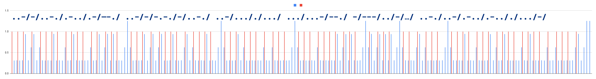

This CTF was organized by the University of Texas, Austin's Info Security association. I participated as part of the team `Weak But Leet` and we were placed 9th out of approximately 900 teams participating. 
<!--more-->
Here are some of the challenges I solved and the approach I took.
### Crypto
#### RSA 256

We are given the following values for this RSA based challenge. 
```
N = 77483692467084448965814418730866278616923517800664484047176015901835675610073
e = 65537
c = 43711206624343807006656378470987868686365943634542525258065694164173101323321
```
N seems to be incredibly small. We can see that it can be factored easily. 
```
from math import gcd
from Crypto.Util.number import long_to_bytes, inverse
from factordb.factordb import FactorDB

N = 77483692467084448965814418730866278616923517800664484047176015901835675610073
e = 65537
c = 43711206624343807006656378470987868686365943634542525258065694164173101323321

def decrypt(ct, e, p, q):
    phi = (p-1)*(q-1)
    d = inverse(e, phi)
    return long_to_bytes(pow(ct, d, p*q))

f = FactorDB(N)
f.connect()
p, q = f.get_factor_list()
print(p, q)
print(decrypt(c, e, p, q)) #b'utflag{just_send_plaintext}'
```
#### Numbers go brrr ...


This challenge uses a randomly generated seed to derive the key for a AES based encryption. We are given an opportunity to encrypt any text of our choice and are also provided the encrypted flag using the same key scheme (not the same key). Since the search space for the seed is small (1e6), it is quite trivial to bruteforce it. We just need to be careful to reconstruct the number of calls to `encrypt()` so that the state of the seed is properly set for the next operation.

```python
from Crypto.Cipher import AES
from Crypto.Util.Padding import pad
from pwn import *

possible_seeds = [x for x in range(10 ** 6)]
seed = 0
my_string = b"ABCDEFGHabcdefgh"
encrypted_vals = {}
def get_random_number():
    global seed 
    seed = int(str(seed * seed).zfill(12)[3:9])
    return seed

def encrypt(message):
    key = b''
    for i in range(8):
        key += (get_random_number() % (2 ** 16)).to_bytes(2, 'big')
    cipher = AES.new(key, AES.MODE_ECB)
    ciphertext = cipher.encrypt(pad(message, AES.block_size))
    return ciphertext.hex()

def decrypt(message):
    key = b''
    for i in range(8):
        key += (get_random_number() % (2 ** 16)).to_bytes(2, 'big')
    cipher = AES.new(key, AES.MODE_ECB)
    pt = cipher.decrypt(unhex(message))
    return pt


P = remote('betta.utctf.live', 7356)
# P = process (['python3','main.py'])

P.recvuntil(b'2 - encrypt a message)?')
P.sendline(b'2') # encrypt a message
P.recvuntil(b'your message?')
P.sendline(my_string)
P.recvuntil(b'encrypted message: ')
E = P.recvline().strip().decode()
P.recvuntil(b'2 - encrypt a message)?')
P.sendline(b'1') # get encrypted flag
P.recvuntil(b'encrypted flag: ')
F = P.recvline().strip().decode()
# E = '801fa795bdee61bc65ac606d1ca1dad81dc9a4e7e39116ec24185edaa32e3026'
# F = '4ae905d3eee4a7228ba5007f4ac185c7ab88124e5d6726e3b000ad4b6db654348bf7a95f6837b4a2dcf73138aa5834e0'

print(f"{my_string} --> {E}")
print(f"{F=}")

# brute force the seed
for s in possible_seeds:
    seed = s
    enc = encrypt(my_string)
    if (enc == E):
        print(s, enc)
        seed = s # reset the seed 
        print("My string --> ",decrypt(E))
        print("Flag: ")
        exit(decrypt(F))
    if (s %10000 == 0):
        print(f"{s}")
```
Running against the server with our chosen text retrieves the seed. We then use it to decrypt the flag. 

```bash
% python3 solve_brrr.py
[+] Opening connection to betta.utctf.live on port 7356: Done
b'ABCDEFGHabcdefgh' --> 92beb658211b567309b7c0c6bf1e3e0bedb1bca2db4bb2bdfa2b9fad85833662
F='7ccf8fb3bb1c88a5c1f748b1185a0de85ddd642452f690ebaa99b284792de0b1f3278e95b651200de33ca5b9c67d6572'
0
10000
20000
30000
40000
43337 92beb658211b567309b7c0c6bf1e3e0bedb1bca2db4bb2bdfa2b9fad85833662
My string -->  b'ABCDEFGHabcdefgh\x10\x10\x10\x10\x10\x10\x10\x10\x10\x10\x10\x10\x10\x10\x10\x10'
Flag: 
b'utflag{deep_seated_and_recurring_self-doubts}\x03\x03\x03'
[*] Closed connection to betta.utctf.live port 7356
```

#### Numbers go brrr 2 ...


#### Bits and pieces


Another RSA based challenge. We are given three sets of `n, e and c`. The chosen values of modulus are not cryptographically secure and can be easily overcome. 

```python
from math import gcd
from Crypto.Util.number import long_to_bytes, inverse
from factordb.factordb import FactorDB

n1=16895844090302140592659203092326754397916615877156418083775983326567262857434286784352755691231372524046947817027609871339779052340298851455825343914565349651333283551138205456284824077873043013595313773956794816682958706482754685120090750397747015038669047713101397337825418638859770626618854997324831793483659910322937454178396049671348919161991562332828398316094938835561259917841140366936226953293604869404280861112141284704018480497443189808649594222983536682286615023646284397886256209485789545675225329069539408667982428192470430204799653602931007107335558965120815430420898506688511671241705574335613090682013
e1=65537
c1=7818321254750334008379589501292325137682074322887683915464861106561934924365660251934320703022566522347141167914364318838415147127470950035180892461318743733126352087505518644388733527228841614726465965063829798897019439281915857574681062185664885100301873341937972872093168047018772766147350521571412432577721606426701002748739547026207569446359265024200993747841661884692928926039185964274224841237045619928248330951699007619244530879692563852129885323775823816451787955743942968401187507702618237082254283484203161006940664144806744142758756632646039371103714891470816121641325719797534020540250766889785919814382

n2=22160567763948492895090996477047180485455524932702696697570991168736807463988465318899280678030104758714228331712868417831523511943197686617200545714707332594532611440360591874484774459472586464202240208125663048882939144024375040954148333792401257005790372881106262295967972148685076689432551379850079201234407868804450612865472429316169948404048708078383285810578598637431494164050174843806035033795105585543061957794162099125273596995686952118842090801867908842775373362066408634559153339824637727686109642585264413233583449179272399592842009933883647300090091041520319428330663770540635256486617825262149407200317
e2=65537
c2=19690520754051173647211685164072637555800784045910293368304706863370317909953687036313142136905145035923461684882237012444470624603324950525342723531350867347220681870482876998144413576696234307889695564386378507641438147676387327512816972488162619290220067572175960616418052216207456516160477378246666363877325851823689429475469383672825775159901117234555363911938490115559955086071530659273866145507400856136591391884526718884267990093630051614232280554396776513566245029154917966361698708629039129727327128483243363394841238956869151344974086425362274696045998136718784402364220587942046822063205137520791363319144

n3=30411521910612406343993844830038303042143033746292579505901870953143975096282414718336718528037226099433670922614061664943892535514165683437199134278311973454116349060301041910849566746140890727885805721657086881479617492719586633881232556353366139554061188176830768575643015098049227964483233358203790768451798571704097416317067159175992894745746804122229684121275771877235870287805477152050742436672871552080666302532175003523693101768152753770024596485981429603734379784791055870925138803002395176578318147445903935688821423158926063921552282638439035914577171715576836189246536239295484699682522744627111615899081
e3=65537
c3=17407076170882273876432597038388758264230617761068651657734759714156681119134231664293550430901872572856333330745780794113236587515588367725879684954488698153571665447141528395185542787913364717776209909588729447283115651585815847333568874548696816813748100515388820080812467785181990042664564706242879424162602753729028187519433639583471983065246575409341038859576101783940398158000236250734758549527625716150775997198493235465480875148169558815498752869321570202908633179473348243670372581519248414555681834596365572626822309814663046580083035403339576751500705695598043247593357230327746709126221695232509039271637


def decrypt(ct, e, p, q):
    phi = (p-1)*(q-1)
    d = inverse(e, phi)
    return long_to_bytes(pow(ct, d, p*q))

# the first modulus can easily be factored using FactorDB
f = FactorDB(n1)
f.connect()
p1, q1 = f.get_factor_list()

# Modulus 2 and 3 share a prime factor. Use GCD to determine the factor and its complement.
p23 = gcd(n2, n3)
q2 = n2 // p23
q3 = n3 // p23

pt = bytearray(decrypt(c1, e1, p1, q1))
pt.extend(decrypt(c2, e2, p23, q2))
pt.extend(decrypt(c3, e3, p23, q3))

print(pt.decode())  
# utflag{oh_no_it_didnt_work_</3_i_guess_i_can_just_use_standard_libraries_in_the_future}
```

#### Cryptordle


This challenge has a game of wordle, where you are given 6 tries to guess a 5-character word. With each guess, you are given some information about correctly placed letters. In this mathematical equivalent of the challenge, the information provided is the product of the difference between the letters of the guessed word and the answer, taken to modulo 31.

The approach I took was to develop an oracle of the responses for 5 consistent guesses and record the sequence of responses for each of the words in the wordle list (taken from https://github.com/pythonmcpi/wordle-wordlist/blob/main/wordlist.txt).  Since this list only contains 2239 words, it was quite trivial to calculate the response and store them for lookup.  Then, we connect to the server, send that exact sequence of 5 canned guesses, capture the responses and lookup the original word from the list. Doing this three times will earn us the flag. 

```python
from pwn import *
lookups = defaultdict(list)

def calc_response(guess, offset=0):
    ans = 1
    for i in range(5):
        ans = (ans * (-1*guess[i] + offset + i)) % 31
    return ans

def calc_response_series(solution):
    guess = [ord(c)-ord('a') for c in solution]
    answers = [calc_response(guess, x) for x in range(5)]
    # print(f"{guess}  -> {answers}  --> {solution}")
    str_ans = str(answers)
    lookups[str_ans].append(solution)

# Wordle wordlist from https://github.com/pythonmcpi/wordle-wordlist/blob/main/wordlist.txt
W = open('wordle.txt', 'r')
words = W.read().strip().split('\n')

for w in words:
    calc_response_series(w)

print(f"Precalculated words: {len(lookups)}")

#P = process(["python3", "cryptordle_2.py"])
P = remote('betta.utctf.live', 7496)
canned = [b'abcde', b'bcdef', b'cdefg', b'defgh', b'efghi']
for iter in range(3):
    responses = []
    for attempts in range(5):
        P.recvuntil(b"guess?\n")
        P.sendline(canned[attempts])
        responses.append(int(P.recvline().strip()))
    str_ans = str(responses)
    print(f"looking up ... {str_ans} ... {lookups[str_ans]}")
    my_answer = lookups[str_ans][0]
    P.recvuntil(b'guess?\n')
    P.sendline(my_answer.encode())
    guess_response = P.recvline().strip()
    print(guess_response)
P.interactive()   
```

```bash
% python3 solve_cryptordle.py
Precalculated words: 2263
[+] Opening connection to betta.utctf.live on port 7496: Done
looking up ... [0, 10, 22, 25, 10] ... ['suite']
b'Good job! Onward...'
looking up ... [24, 0, 20, 7, 24] ... ['wooer']
b'Good job! Onward...'
looking up ... [17, 10, 27, 7, 24] ... ['gamut']
b'Good job! Onward...'
[*] Switching to interactive mode
Nice! You got it :) Have a flag:
utflag{sometimes_pure_guessing_is_the_strat}
```

#### simple signature


This is a simple challenge that tests our understanding of modular arithmatics. We are just given the server information. No source code is provided. Essentially, the server implements textbook RSA encryption oracle. In the discovery stage, the Oracle provides a signature (encrypted value) for any message we provide. In the challenge stage, we are asked to predict the signature for a message that was not used in the discovery stage. 

We can take advantage of the property \\( a \mod n * b \mod n = (a * b) \mod n \\).

So if we use `2` and `3` as the messages and get their corresponding signatures, we can multipy them to get the signature of `6`.  You could also use just `2` and predict `4` or any other power using the same approach. 

```
 % nc betta.utctf.live 4374
Welcome to the signature generator!
This service generates signatures for nonnegative integer messages.
Today's RSA parameters are: 
n = 17007115661299815607779165325006475925060995570648249126487030335644203023481846638117502461440332111444430916767200503666795042264359564422897594202938598017705990008042877313795222435128369842652331645057052654864153662402967586505198149442619066069665399964917886690584407737138071046442779048899209367834725450164047862000686231313652343200922838123212694312780180541822058518287645925643501380574048457140971384357731590128868557198143735637246158985421310165371697896791564736610273577022563266299497980201341938025773037378412970953178288939570091648227422253383650988673431907753115858499383009001338523288087
e = 65537
Enter a message as an integer (enter 0 to stop): 2
Your signature is: 6672957953572898291912874637593697014101172364647215740830900911644569712185295765745418452963497463275123251748952403305001368745981830456197804415177494270001131898055965726185773582177908222725950920241045612464232492749961514337999947924777746096071879416722777928572833948616707226872981090448612762382663274986788162021813367382415915672886879690116171900002788502748187211138753302953634267728098740540801330595107303819427658290454721300644156991165726094646851144048881902055363646383706901609234926756120255588681727697911438036366466679519130986883486700046862967465455783444359689098389239391853331493149
Enter a message as an integer (enter 0 to stop): 3
Your signature is: 2489355093949788277772248629243069986608791937535601737135622933254496365765932518220438140785809898088376102226248195015617328688580982151381273120828016088777408113045970326379287582105630891959710381877864144955748352250386354887117900428266230023602707106952578855774464713335240514344219988834753712048133975681621557356736836815344888196103902767834383982656310862090337589073425432345749789501727668558023522752244962712971711970202489196742528339273279883755796908964160428004572278447515065391236485876470418430841869466382073943825117186740672592574369890018680015742556388573397785190613698745962915695490
Enter a message as an integer (enter 0 to stop): 0
Now, come up with your own pair!
Enter a message: 6
Enter a signature: 14071926959502352328380108893612792408930849940054769138731539539797284861381027564760805034456674079194751849440050601008224090587555734474642565439947816573139566057142197638959372821291461186224771449119199402392012619783441779586295184695621428676659073013109298875136062352474750406101619288057300425450550330323130832272063150985860276007537835351448157112351580410138120126218032966787106781425709270942254627926303136136674377015196131322660751367363551425575897100657913517435897399704928026360474015505014191516023064743653631124181763466586472824010087247361266453912366414029602415895092188782055670958869
Congrats! Here is the flag: utflag{a1m05t_t3xtb00k_3x3rc153}
```

### Forensics
#### Gibberish


This was probably the most frustrating of the challenges in this CTF. Yes, even more than Insanity. First things first. 
We are given a PCAP file, that seems to contain USB HID traffic. Exploring the data for a while gives us the source address and the fields of interest. 

```bash
% tshark -r keyboard.pcapng -T fields -e frame.time_epoch -e usbhid.data -Y "usb.src == 1.13.1"
...
1711740183.168567000	0000000000000000        Example showing 6 keys being pressed simultaneously
1711740191.173510000	0000040000000000
1711740191.306985000	0000040800000000
1711740191.365781000	0000040806000000
1711740191.553956000	0000040806110000
1711740191.558936000	0000040806111000
1711740191.715559000	0000040806111033        [MODIFIERS][00][K1][K2][K3][K4][K5][K6]
1711740191.878911000	0000040811103300
1711740191.889882000	0000081110330000
1711740191.900091000	0000111033000000
1711740191.926066000	0000111000000000
1711740191.947494000	0000110000000000
1711740191.949953000	0000000000000000
...
```
We know that USBHID key values will need to tranlated according to the appropriate keyboard layout, as well as to account for the modifier keys (control, shift, alt) being added. 
```python
from pwn import *

# USB keyboard HID key codes
usb_codes = {
   0x04:['a','A'], 0x05:['b','B'], 0x06:['c','C'], 0x07:['d','D'], 0x08:['e','E'], 0x09:['f','F'],
   0x0A:['g','G'], 0x0B:['h','H'], 0x0C:['i','I'], 0x0D:['j','J'], 0x0E:['k','K'], 0x0F:['l','L'],
   0x10:['m','M'], 0x11:['n','N'], 0x12:['o','O'], 0x13:['p','P'], 0x14:['q','Q'], 0x15:['r','R'],
   0x16:['s','S'], 0x17:['t','T'], 0x18:['u','U'], 0x19:['v','V'], 0x1A:['w','W'], 0x1B:['x','X'],
   0x1C:['y','Y'], 0x1D:['z','Z'], 0x1E:['1','!'], 0x1F:['2','@'], 0x20:['3','#'], 0x21:['4','$'],
   0x22:['5','%'], 0x23:['6','^'], 0x24:['7','&'], 0x25:['8','*'], 0x26:['9','('], 0x27:['0',')'],
   0x28:['\n','\n'], 0x29:['[ESC]','[ESC]'], 0x2A:['⌫','⌫'], 0x2B:['\t','\t'],
   0x2C:[' ',' '], 0x2D:['-','_'], 0x2E:['=','+'], 0x2F:['[','{'], 0x30:[']','}'], 0x31:['\',"|'],
   0x32:['#','~'], 0x33:";:", 0x34:"'\"", 0x36:",<",  0x37:".>", 0x38:"/?",
   0x39:['[CAPSLOCK]','[CAPSLOCK]'], 0x3A:['F1'], 0x3B:['F2'], 0x3C:['F3'], 0x3D:['F4'], 0x3E:['F5'], 
   0x3F:['F6'], 0x41:['F7'], 0x42:['F8'], 0x43:['F9'], 0x44:['F10'], 0x45:['F11'],
   0x46:['F12'], 0x4f:[u'→',u'→'], 0x50:[u'←',u'←'], 0x51:[u'↓',u'↓'], 0x52:[u'↑',u'↑']
   }

# tshark -r keyboard.pcapng -T fields -e frame.time_epoch -e usbhid.data -Y "usb.src == 1.13.1"  > hid_data.txt
# 1711739472.285762000	00001a0000000000
F = open('hid_data.txt', 'r').readlines()
old_ts = 0.0
prev_keys = []
key_sequence = []
key_batch = []
for line in F:
    ts, keys = line.strip().split('\t')
    ts = float(ts)
    delta = ts - old_ts
    keys = unhex(keys)
    shifted = 0
    # Detect if Shift is pressed
    if (keys[0] & 0x22 > 0 ):       
        shifted = 1
    assert keys[1] == 0x00
    pressed_keys = []
    for i in range(2,8):
        if keys[i] != 0x0:
            pressed_keys.append(usb_codes[keys[i]][shifted])
    print(f"{delta:.4f} : {pressed_keys}")
    if (len(pressed_keys) == 0):
        # find the longest series and store it
        if (len(key_batch) > 0):
            k = max(key_batch, key=len)
            key_sequence.append(k)
            key_batch.clear()            
    else:
        key_batch.append(''.join(pressed_keys))

    old_ts = ts
    prev_keys = pressed_keys

S = ''.join(key_sequence)
print('\n'.join(key_sequence))
```

The following sequence shows the key sequence `fgmik[` being recorded.  
```
DELAY  : KEYS
0.0272 : []                                 < no keys pressed
7.8514 : ['f']                              < keys started to be held
0.0404 : ['f', 'g']
0.0340 : ['f', 'g', 'm']
0.0516 : ['f', 'g', 'm', 'i']
0.0105 : ['f', 'g', 'm', 'i', 'k']
0.3199 : ['f', 'g', 'm', 'i', 'k', '[']     < 6 keys simultaneously held down >
0.1880 : ['g', 'm', 'i', 'k', '[']          < keys being released>
0.0006 : ['m', 'i', 'k', '[']
0.2700 : ['m', 'i', 'k']
0.0415 : ['m', 'i']
0.0020 : ['m']
0.0018 : []                                 < all keys are released>
14.8371 : ['w']                             < next sequence starts after a noticeable gap>
```
For each batch, the longest sequence of keys is assumed to be the pertinent one and we store it. Using Plover and with a lot of guesswork, we determine that the following set of keystrokes are the ones corresponding to the flag. After battling with Plover some more, I tried another way. I saw that Plover had a rich suite of test cases. 

```python
def test_gibberish(capture, machine, strokes):
    machine.start_capture()
    ks = ["anp","wercfl","wv","mp","wecrfl","weflkp","rfnjik","fgikm[","awervl","wenm","fgikm[","vik","fgikm[","cnm","fgikm[","sdjnp","sdfnm","fgmik[","svcnk[","fgmik[","a","fgikm[","sdvcnm","sdvcnm","fgmik[","mnuop[","wefgk"]
    for k in ks:
        s = ' '.join([c for c in k])
        send_input(capture, s)
        print(f"{s} --> {strokes}")
        capture.reset_mock()
        del strokes[:]
    assert 1 == 1
```
I added another test case using the same framework and fed our keystrokes and converted them into stenographical text. For example, the keystrokes `m p` gives us `u t`. So, doing this for the keystrokes of interest gives us the Steno equivalents for the QWERTY text entered. 
```
% pytest -s test_keyboard.py   
======================================== test session starts ========================================
platform darwin -- Python 3.10.12, pytest-8.1.1, pluggy-1.4.0
rootdir: 
configfile: pytest.ini
plugins: anyio-3.6.2
collected 7 items                                                                                   

test_keyboard.py ...
a n p       --> [{'S-'}, {'-E'}, {'-T'}]
w e r c f l --> [{'T-'}, {'P-'}, {'H-'}, {'A-'}, {'R-'}, {'-G'}]
w v         --> [{'T-'}, {'O-'}]
m p         --> [{'-U'}, {'-T'}]
w e c r f l --> [{'T-'}, {'P-'}, {'A-'}, {'H-'}, {'R-'}, {'-G'}]
w e f l k p --> [{'T-'}, {'P-'}, {'R-'}, {'-G'}, {'-B'}, {'-T'}]
r f n j i k --> [{'H-'}, {'R-'}, {'-E'}, {'-R'}, {'-P'}, {'-B'}]
f g i k m [ --> [{'R-'}, {'*'}, {'-P'}, {'-B'}, {'-U'}, {'-D'}]
a w e r v l --> [{'S-'}, {'T-'}, {'P-'}, {'H-'}, {'O-'}, {'-G'}]
w e n m     --> [{'T-'}, {'P-'}, {'-E'}, {'-U'}]
f g i k m [ --> [{'R-'}, {'*'}, {'-P'}, {'-B'}, {'-U'}, {'-D'}]
v i k       --> [{'O-'}, {'-P'}, {'-B'}]
f g i k m [ --> [{'R-'}, {'*'}, {'-P'}, {'-B'}, {'-U'}, {'-D'}]
c n m       --> [{'A-'}, {'-E'}, {'-U'}]
f g i k m [ --> [{'R-'}, {'*'}, {'-P'}, {'-B'}, {'-U'}, {'-D'}]
s d j n p   --> [{'K-'}, {'W-'}, {'-R'}, {'-E'}, {'-T'}]
s d f n m   --> [{'K-'}, {'W-'}, {'R-'}, {'-E'}, {'-U'}]
f g m i k [ --> [{'R-'}, {'*'}, {'-U'}, {'-P'}, {'-B'}, {'-D'}]
s v c n k [ --> [{'K-'}, {'O-'}, {'A-'}, {'-E'}, {'-B'}, {'-D'}]
f g m i k [ --> [{'R-'}, {'*'}, {'-U'}, {'-P'}, {'-B'}, {'-D'}]
a           --> [{'S-'}]
f g i k m [ --> [{'R-'}, {'*'}, {'-P'}, {'-B'}, {'-U'}, {'-D'}]
s d v c n m --> [{'K-'}, {'W-'}, {'O-'}, {'A-'}, {'-E'}, {'-U'}]
s d v c n m --> [{'K-'}, {'W-'}, {'O-'}, {'A-'}, {'-E'}, {'-U'}]
f g m i k [ --> [{'R-'}, {'*'}, {'-U'}, {'-P'}, {'-B'}, {'-D'}]
m n u o p [ --> [{'-U'}, {'-E'}, {'-F'}, {'-L'}, {'-T'}, {'-D'}]
w e f g k   --> [{'T-'}, {'P-'}, {'R-'}, {'*'}, {'-B'}]
....
```
The next step was to use a lot of ~~guesswork~~ intelligence to `read` the steno text to have it make sense, while referencing the online resources to lookup values for symbols and punctuations. For example R*PBUD is the underscore character.  

|QWERTY text|Steno text|possible words|
|----|----|----|
|a n p       |[{'S-'}, {'-E'}, {'-T'}]| set |
|w e r c f l |[{'T-'}, {'P-'}, {'H-'}, {'A-'}, {'R-'}, {'-G'}]| flag | 
|w v         |[{'T-'}, {'O-'}]| to | 
|m p         |[{'-U'}, {'-T'}]| ut |
|w e c r f l |[{'T-'}, {'P-'}, {'A-'}, {'H-'}, {'R-'}, {'-G'}]| flag|
|w e f l k p |[{'T-'}, {'P-'}, {'R-'}, {'-G'}, {'-B'}, {'-T'}]| { |
|r f n j i k |[{'H-'}, {'R-'}, {'-E'}, {'-R'}, {'-P'}, {'-B'}]| learning |
|f g i k m [ |[{'R-'}, {'*'}, {'-P'}, {'-B'}, {'-U'}, {'-D'}]| _ |
|a w e r v l |[{'S-'}, {'T-'}, {'P-'}, {'H-'}, {'O-'}, {'-G'}]| steno (??) |
|w e n m     |[{'T-'}, {'P-'}, {'-E'}, {'-U'}]| graphy (??) |
|f g i k m [ |[{'R-'}, {'*'}, {'-P'}, {'-B'}, {'-U'}, {'-D'}]| _ |
|v i k       |[{'O-'}, {'-P'}, {'-B'}]| on |
|f g i k m [ |[{'R-'}, {'*'}, {'-P'}, {'-B'}, {'-U'}, {'-D'}]| _ |
|c n m       |[{'A-'}, {'-E'}, {'-U'}]| a |
|f g i k m [ |[{'R-'}, {'*'}, {'-P'}, {'-B'}, {'-U'}, {'-D'}]| _ |
|s d j n p   |[{'K-'}, {'W-'}, {'-R'}, {'-E'}, {'-T'}]| qwerty |
|s d f n m   |[{'K-'}, {'W-'}, {'R-'}, {'-E'}, {'-U'}]| qwerty |
|f g m i k [ |[{'R-'}, {'*'}, {'-U'}, {'-P'}, {'-B'}, {'-D'}]| _ |
|s v c n k [ |[{'K-'}, {'O-'}, {'A-'}, {'-E'}, {'-B'}, {'-D'}]| keyboard | 
|f g m i k [ |[{'R-'}, {'*'}, {'-U'}, {'-P'}, {'-B'}, {'-D'}]| _ |
|a           |[{'S-'}]| is | 
|f g i k m [ |[{'R-'}, {'*'}, {'-P'}, {'-B'}, {'-U'}, {'-D'}]| _ |
|s d v c n m |[{'K-'}, {'W-'}, {'O-'}, {'A-'}, {'-E'}, {'-U'}]|deleted by backspaces |
|s d v c n m |[{'K-'}, {'W-'}, {'O-'}, {'A-'}, {'-E'}, {'-U'}]|quite|
|f g m i k [ |[{'R-'}, {'*'}, {'-U'}, {'-P'}, {'-B'}, {'-D'}]| _ |
|m n u o p [ |[{'-U'}, {'-E'}, {'-F'}, {'-L'}, {'-T'}, {'-D'}]| difficult|
|w e f g k   |[{'T-'}, {'P-'}, {'R-'}, {'*'}, {'-B'}]| } |


[This site](https://spectra.sammdot.ca/) was incredibly useful to ~~guess~~ decode the steno text into normal english. 

`utflag{learning_stenography_on_a_qwerty_keyboard_is_quite_difficult}`

#### Insanity Check: Reimagined


A teammate discovered that the favicon for the http://utctf.live/ site seemed to have some interesting information. Digging into it a bit more, we can see that the SVG file has logic for animations. The SVG file itself is pretty cool. It changes colors slowly with the color gradient lightening and darkening over time. However, you can manipulate the parameters for the `center` object to speed up the animation and we can see it blinks in a non-uniform manner.  Looking closely at the animation code, we can see that the percentage values and the color codes for the fill seem to be of interest. 


Let's extract it into a file to process it later. 
```bash
% grep "fill:" favicon.svg | sed -e 's/ {/,/g' -e 's/ fill: #//g' -e 's/; }//g' | tr -d %
0.000,FFFF
0.314,FFF6
0.629,FFFF
0.943,FFF6
1.258,FFFF
2.201,FFF6
2.516,FFF6
...
# save to a text file and process with python
% grep "fill:" favicon.svg | sed -e 's/ {/,/g' -e 's/ fill: #//g' -e 's/; }//g' | tr -d % > favicon_data.txt
```
Next we calculate the difference between progress values in each row. And, for sure it seems to be uneven. Charting these delays shows that there is a clear pattern of what appears to be morse code. 


A close up view of the first word shows the scheme used.


```
   ~ 0.3 0.3 -> dot
   ~ 0.9 0.3 -> dash
   ~ 0.6     -> end of symbol
   ~ 1.2     -> Space, end of word
```
While we can visually decode the morse code, I wanted to save whatever little bit of sanity left in me and wrote the following quick and dirty python script to extract the morse code. 

```python
def translate(delta):
    ans = ''
    if (delta < 0.4):   # short
        ans += '.'
    elif (delta > 1.0): # space, eow
        ans += ':'
    elif (delta > 0.8): # long
        ans += '-'
    else: 
        ans += '/'      # end of symbol
    return ans

    '''
    favicon_data.txt
    0.000,FFFF
    0.314,FFF6
    0.629,FFFF
    0.943,FFF6
    '''
morse = ""
F = open('favicon_data.txt', 'r').readlines()   
old_ts = 0
for line in F:
    ts, val = line.split(',')
    val = val.strip()       # not used
    ts = float(ts)
    delta = ts - old_ts
    print(f"{val} --> {delta:.2f}")
    if (delta > 0):
        morse += translate(delta)
    old_ts = ts

# short delay + short delay = dot,  long delay + short delay = dash
morse = morse.replace("..", '.').replace("-.", "-")
print(morse)
# ..-/-/..-./.-../.-/--./:/..-/-/-.-./-/..-./:/..-/..././.../:/.../...-/--./:/-/---/:/../-/.../:/..-./..-/.-../.-.././.../-/::
# UTFLAG UTCTF USES SVG TO ITS FULLEST  
# utflag{utctf_uses_svg_to_its_fullest}
```
### Resources
* http://www.openstenoproject.org/
* http://www.openstenoproject.org/plover/
* https://spectra.sammdot.ca/

### Challenges

|Category|Challenge|Description
|----|----|----
|Binary Exploitation|E-Corp|
|Binary Exploitation|Handwritten Webserver|
|Cryptography|Beginner: Anti-dcode.fr|
|Cryptography|Cryptordle|
|Cryptography|Forgery|
|Cryptography|RSA-256|
|Cryptography|bits and pieces|
|Cryptography|numbers go brrr 2|
|Cryptography|numbers go brrr|
|Cryptography|simple signature|
|Forensics|A Very Professional Website|
|Forensics|Contracts|
|Forensics|Gibberish|
|Forensics|Insanity Check: Reimagined|
|Forensics|OSINT 1|
|Forensics|OSINT 2|
|Forensics|OSINT 3|
|Forensics|Study Music|
|Misc|CCV|
|Misc|Survey|
|Reverse Engineering|Accelerated Hell|
|Reverse Engineering|Beginner: Basic Reversing Problem|
|Reverse Engineering|Fruit Deals|
|Reverse Engineering|In The Dark|
|Reverse Engineering|PES-128|
|Web|Beginner: Off-Brand Cookie Clicker|
|Web|Easy Mergers v0.1|
|Web|Home on the Range|
|Web|Schrödinger|
|Web|Unsound|

