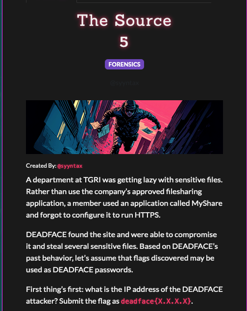
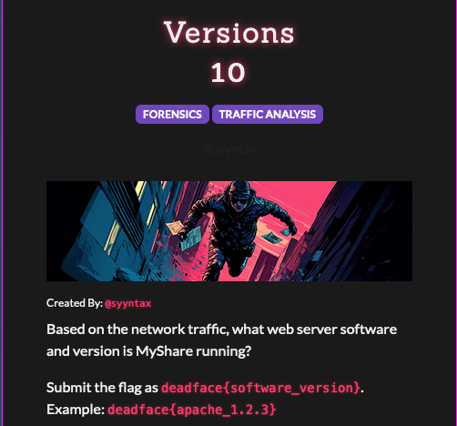
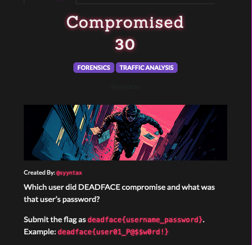
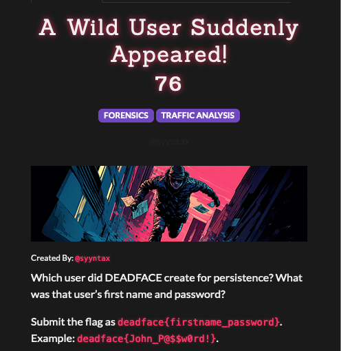
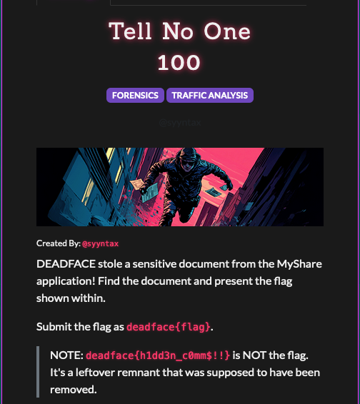
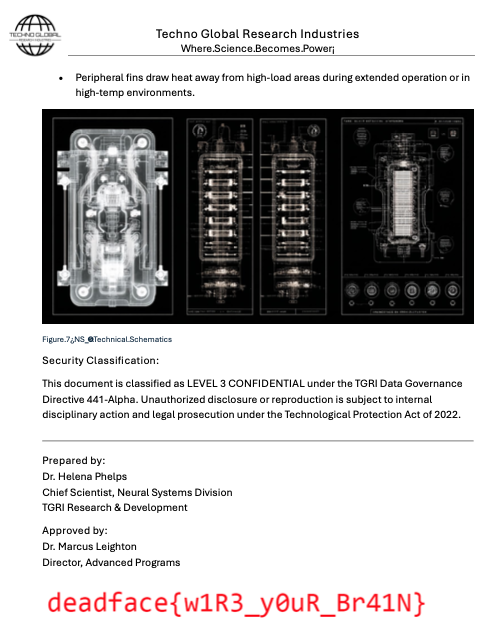
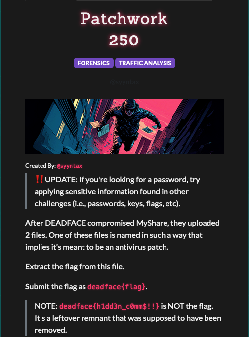

<!--more-->

# Forensics
We are given a tar file with the following files: An access log, two error logs and a packet capture file. 

```
drwxr-xr-x  0 syyntax syyntax     0 Jul 21 10:21 artifacts/
-rw-r--r--  0 syyntax syyntax 291301 Jul 21 10:21 artifacts/access.log
-rw-r--r--  0 syyntax syyntax 104472 Jul 21 10:21 artifacts/error.php.log
-rw-r--r--  0 syyntax syyntax    359 Jul 21 10:20 artifacts/error.log
-rw-r--r--  0 tcpdump tcpdump 29606786 Jul 21 10:20 artifacts/cap-1753106207.pcap
```
### The Source


``` 
$ grep POST access.log
134.199.202.160 - - [21/Jul/2025:13:57:01 +0000] "POST / HTTP/1.1" 302 5 "-" "curl/8.14.1"
134.199.202.160 - - [21/Jul/2025:14:00:30 +0000] "POST /sdk HTTP/1.1" 302 5 "-" "Mozilla/5.0 (compatible; Nmap Scripting Engine; https://nmap.org/book/nse.html)"
134.199.202.160 - - [21/Jul/2025:14:00:59 +0000] "POST /login.php HTTP/1.0" 200 1001 "-" "Mozilla/5.0 (Hydra)"
134.199.202.160 - - [21/Jul/2025:14:00:59 +0000] "POST /login.php HTTP/1.0" 200 1001 "-" "Mozilla/5.0 (Hydra)"
...
```
### Calling Card

```
POST / HTTP/1.1
Host: files.techglobalresearch.com
User-Agent: curl/8.14.1
Accept: */*
FLAG: deadface{l3ts_get_Th3s3_fiL3$}    <<<<<<< FLAG
Content-Length: 437
Content-Type: application/x-www-form-urlencoded

{message: 'SeKAmXZlIGdhaW5lZCBmdWxsIGFjY2VzcyB0byB5b3VyIG5ldHdvcmsuIEV2ZXJ5IGZpbGUsIGV2ZXJ5IGNyZWRlbnRpYWwsIGV2ZXJ5IHN5c3RlbSDigJQgdW5kZXIgbXkgY29udHJvbC4gWW91IGRpZG7igJl0IG5vdGljZSBiZWNhdXNlIEkgZGlkbuKAmXQgd2FudCB5b3UgdG8uCgpUaGlzIHdhc27igJl0IGx1Y2suIEl0IHdhcyBwcmVjaXNpb24uIFlvdXIgZGVmZW5zZXMgd2VyZSBpbmFkZXF1YXRlLCBhbmQgSeKAmXZlIHByb3ZlbiBpdC4KClRoaXMgYXR0YWNrIGlzIGJyb3VnaHQgdG8geW91IGJ5IG1pcnZlYWwuIFRoYW5rcyBmb3IgdGhlIHNlY3JldHMh'}
```

### Versions


```
artifacts % tshark -r cap-1753106207.pcap  -Y frame.number==2031  -Tfields -ehttp.server
nginx/1.25.5
```
### Compromised

```
artifacts % tail -5 error.php.log 
[21-Jul-2025 14:09:01 UTC] [LOGIN_FAILURE] User: "bsampsel" - IP: 134.199.202.160
[21-Jul-2025 14:09:01 UTC] [LOGIN_SUCCESS] User: "bsampsel" - IP: 134.199.202.160    <<<<< login success 
[21-Jul-2025 14:10:13 UTC] [LOGIN_SUCCESS] User: "bsampsel" - IP: 134.199.202.160
[21-Jul-2025 14:11:53 UTC] [LOGIN_SUCCESS] User: "dtenuto" - IP: 134.199.202.160
[21-Jul-2025 14:20:09 UTC] PHP Deprecated:  htmlspecialchars(): Passing null to parameter #1 ($string) of type string is deprecated in /var/www/html/public/uploads/info.php on line 36

artifacts % tshark -r cap-1753106207.pcap  -Tfields -e text | grep -i "login.php" | grep POST | tail -5
Timestamps,POST /login.php HTTP/1.0\\r\\n,\\r\\n,Form item: "username" = "bsampsel",Form item: "password" = "Sparkles19872023"
Timestamps,POST /login.php HTTP/1.0\\r\\n,\\r\\n,Form item: "username" = "bsampsel",Form item: "password" = "Sparkles2025"
Timestamps,POST /login.php HTTP/1.0\\r\\n,\\r\\n,Form item: "username" = "bsampsel",Form item: "password" = "Sparkles2025!"   <<<<<<< successful login 
Timestamps,POST /login.php HTTP/1.1\\r\\n,\\r\\n,Form item: "username" = "bsampsel",Form item: "password" = "Sparkles2025!"
Timestamps,POST /login.php HTTP/1.1\\r\\n,\\r\\n,Form item: "username" = "dtenuto",Form item: "password" = "SuP3RS3cr3tD34DF4C3#"
```
deadface{bsampsel_Sparkles2025!}
### A Wild User Suddenly Appeared

```
artifacts % tshark -r cap-1753106207.pcap  -Tfields -e text | grep POST | grep admin.php
Timestamps,POST /admin.php?page=create_user HTTP/1.1\\r\\n,\\r\\n,Form item: "first_name" = "Dorla",Form item: "last_name" = "Tenuto",Form item: "email" = "dtenuto@techglobalresearch.adsfglskdafhj.com",Form item: "username" = "dtenuto",Form item: "password" = "SuP3RS3cr3tD34DF4C3#",Form item: "is_admin" = "1",Form item: "add_user" = ""
```
### Tell No One

```
%  tshark -r cap-1753106207.pcap  --export-objects "http,exports" 
% artifacts % ls -la downloaded
total 3600
      160 Oct 26 11:33 .
      448 Oct 28 18:07 ..
     5602 Jul 20 00:53 2025-06-20_phelps.helena.txt
  1561277 Jul 20 00:53 ns-9.png
   268432 Jul 20 00:54 tgri-rnd-2025-0719.pdf
```
Opening the PDF file gives us the flag

### Patchwork

* `access.log` shows that a file `info.php` was uploaded. Examining the file shows that it is a PHP reverse shell.
* Export Objects shows that there were 5 invocations of `info.php`. One of them is a zip file.
* We find that the zip file is password protected, but contains two binaries - a linux and a windows one.
* Use JTR to crack the zip with previous flags (See hint from [The Source](#the-source)) 


## Challenges

|Category|Challenge|Description
|----|----|----


