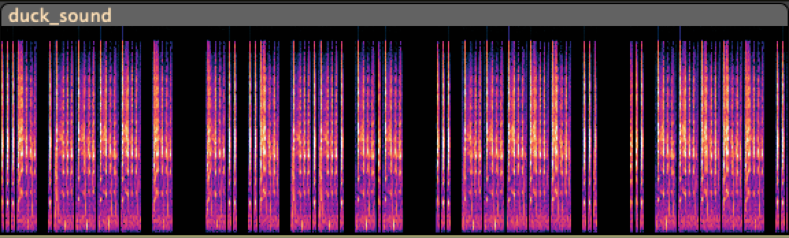

This was an interesting CTF with some fresh takes at classic CTF challenges. Here is a brief writeup of the challenges that I either solved during the CTF or afterwards, in an attempt to learn some techniques and to capture some approaches for later use.
<!--more-->
## Crypto
### Lost Some Binary
```
 % cat Lost_Some_Binary.txt| sed -e 's/ /\n/g' | cut -c8- | tr -d '\n'| perl -lpe '$_=pack"B*",$_'
v1t{LSB:>}
```
### RSA 101
This was quite a controversial challenge that attracted some strong sentiments from the participants, who claimed it was too guessy. An RSA challenge that is guessy? How could that be?
The challenge simply consists of the following RSA parameters:
```
n = 31698460634924412577399959706905435239651
e = 65537
c = 23648999580642514140599125257944114844209
```
We can notice that the cipher text `c` is very close to the value of `n`. This becomes important later on.
`N` is indeed quite small and we can factor it using ECM and see that 101 is one of the factors. The name of the challenge was one of the hints. 
Now that we know one the factors, the rest of the steps is trivial. 
```python
p = 101 # one factor

assert n % p == 0
q = n//p
phi = (p-1)*(q-1)
d = inverse(e, phi)
m = pow(c,d,n)
print(long_to_bytes(m))  # oops ... prints unprintable characters
print(f"m(hex) = {m:02X}")  # 190A2F07690F57386BCE37C08E09F1849A
```
Here the trick is to see that `m < n` hence, we need to scale the value to `m` to get to the actual message. Since we know all operations in RSA are modular wrt to `n`, we can add `n` until we get our flag.
```python
count = 0
msg = b""
while b'v1t' not in msg: 
    msg = long_to_bytes(m + count*n)
    count+=1
print(f"Flag: {msg}")
```
### Modulo Mystery
We are given the following program and the file containing the encoded data.
```python
inp = input("Enter plaintext: ")

def encrypt(pt):
    key = random.randint(1, 100)
    results = [str(ord(ch) % key) for ch in pt]   
    print("Encrypted:", " ".join(results))
    with open('flag.enc', 'w') as f:
        f.write(" ".join(results))
    return key

k = encrypt(inp)
print("Key (for debug):", k)

# flag.enc
# 16 49 14 21 7 48 49 15 6 48 44 10 12 49 20 0 23
```
The key steps are: 
1. Pick a number between 1 and 100 at random
2. Use it as a modulus to get the modular residue from the ASCII value of the character from the flag.

To solve this challenge, we need to find the modulus first. 
1. We know it is a value between 1 and 100
2. The maximum residue we get in the encrypted file is 49
3. So, the modulus has to be greater than 49. 
4. The new range for the modulus is 50 - 100.
5. Knowing the first three letters of the flag are `v1t`, we can narrow down the modulus to be the factor of 3 values, that is in the range 50-100.
6. Thus the modulus can be determined to be 51
7. Test each printable character to see if it would produce the residue with 51 as the modulus. 
8. We get two possible values for each character.
9. Use logic to determine the appropriate character
10. The flag is `v1t{m0dul0_pr1z3}`

```python
flagc = list(map(int, "16 49 14 21 7 48 49 15 6 48 44 10 12 49 20 0 23".split()))
print(flagc)
'''
ord('v')%M = 16
ord('v') - 16 = (k*M)
ord('1') - 49 = (l*M)
ord('t') - 14 = (j*M)
GCD (v1, v2, v3) => M
'''
v1 = ord('v')-flagc[0]
v2 = ord('1')-flagc[1]
v3 = ord('t')-flagc[2]

M = math.gcd(v1, v2, v3)
print(v1, v2, v3, "GCD=", M)

# common divisor of v1, v2, v3 and > 49, <=100
key = 51
for c in flagc:
    v = [chr(i) for i in range(32, 128) if i%key == c ]
    print(v)
'''
['C', 'v']
['1', 'd']
['A', 't']
['H', '{']
[':', 'm']
['0', 'c']
['1', 'd']
['B', 'u']
['9', 'l']
['0', 'c']
[',', '_']
['=', 'p']
['?', 'r']
['1', 'd']
['G', 'z']
['3', 'f']
['J', '}']
'''
```
### Misconfigured RSA
Another RSA challenge. We are given n, e=65537 and c. 
N is a large, 1024 bit long number. We probe for vulnerabilities with N and find that it is a prime and not a product of two primes.

```python
print(f"is N prime? {sympy.isprime(n)}")        # True
phi = n-1                   # phi is N-1 if N is prime
d = inverse(e, phi)
m = pow(c,d,n)
print(long_to_bytes(m))     # b'v1t{f3rm4t_l1ttl3_duck}'
```

### <White text>
We are given a text file filled with 

```
 % xxd -c1000 -p  txt |                     
 sed -e 's/20/O/g' -e 's/09/I/g' -e 's/0d0a//g' | 
 tr 'OI' '01' | 
 sed -e 's/10000//g' | 
 cut -c 3- | 
 perl -lpe '$_=pack"B*",$_'
v1t{1_c4nt_s33_4nyth1ng}?
```

### Shamir's Duck

### Random Stuff

## Misc
### Talking Duck
 
Interpret the spectrogram as morse code. Short pause separates letters. Long pause separates words.
```
...- .---- -/-.. ..- -.-. -.-/... ----- .../... ----- ... 
V1T DUCK S0S S0S
```
### Emoji Thief

### RotBrain

### Specimen 512

### Polyglot

### Challenges

|Category|Challenge|Description
|----|----|----


