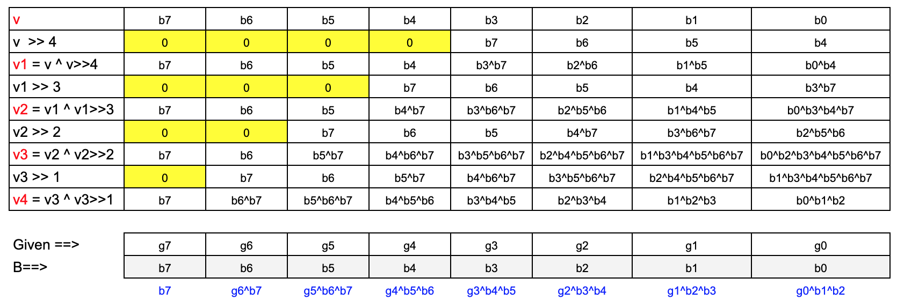
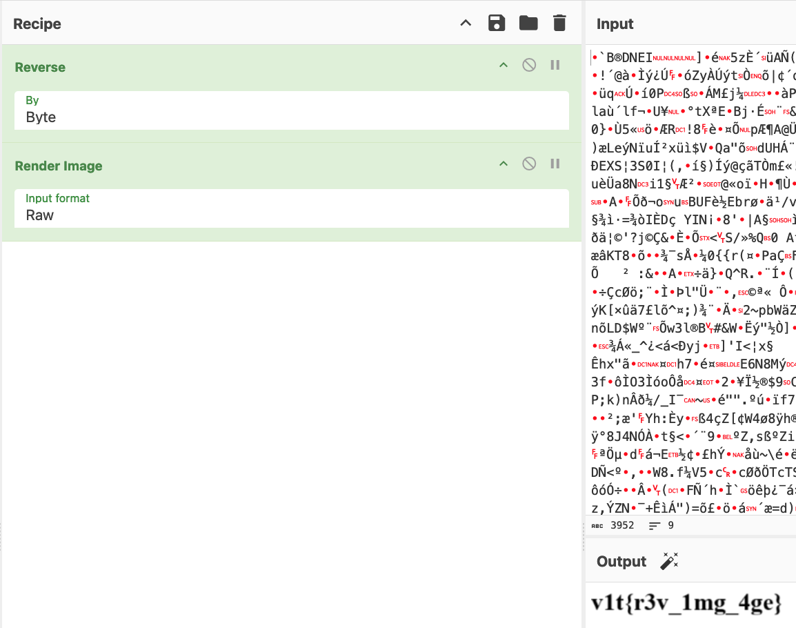

This was an interesting CTF with some fresh takes at classic CTF challenges. Here is a brief writeup of the challenges that I either solved during the CTF or afterwards, in an attempt to learn some techniques and to capture some approaches for later use.
<!--more-->
## Crypto
### Lost Some Binary
```
 % cat Lost_Some_Binary.txt| sed -e 's/ /\n/g' | cut -c8- | tr -d '\n'| perl -lpe '$_=pack"B*",$_'
v1t{LSB:>}
```
### RSA 101
This was quite a controversial challenge that attracted some strong sentiments from the participants, who claimed it was too guessy. An RSA challenge that is guessy? How could that be?
The challenge simply consists of the following RSA parameters:
```
n = 31698460634924412577399959706905435239651
e = 65537
c = 23648999580642514140599125257944114844209
```
We can notice that the cipher text `c` is very close to the value of `n`. This becomes important later on.
`N` is indeed quite small and we can factor it using ECM and see that 101 is one of the factors. The name of the challenge was one of the hints. 
Now that we know one the factors, the rest of the steps is trivial. 
```python
p = 101 # one factor

assert n % p == 0
q = n//p
phi = (p-1)*(q-1)
d = inverse(e, phi)
m = pow(c,d,n)
print(long_to_bytes(m))  # oops ... prints unprintable characters
print(f"m(hex) = {m:02X}")  # 190A2F07690F57386BCE37C08E09F1849A
```
Here the trick is to see that `m < n` hence, we need to scale the value to `m` to get to the actual message. Since we know all operations in RSA are modular wrt to `n`, we can add `n` until we get our flag.
```python
count = 0
msg = b""
while b'v1t' not in msg: 
    msg = long_to_bytes(m + count*n)
    count+=1
print(f"Flag: {msg}")
```
### Modulo Mystery
We are given the following program and the file containing the encoded data.
```python
inp = input("Enter plaintext: ")

def encrypt(pt):
    key = random.randint(1, 100)
    results = [str(ord(ch) % key) for ch in pt]   
    print("Encrypted:", " ".join(results))
    with open('flag.enc', 'w') as f:
        f.write(" ".join(results))
    return key

k = encrypt(inp)
print("Key (for debug):", k)

# flag.enc
# 16 49 14 21 7 48 49 15 6 48 44 10 12 49 20 0 23
```
The key steps are: 
1. Pick a number between 1 and 100 at random
2. Use it as a modulus to get the modular residue from the ASCII value of the character from the flag.

To solve this challenge, we need to find the modulus first. 
1. We know it is a value between 1 and 100
2. The maximum residue we get in the encrypted file is 49
3. So, the modulus has to be greater than 49. 
4. The new range for the modulus is 50 - 100.
5. Knowing the first three letters of the flag are `v1t`, we can narrow down the modulus to be the factor of 3 values, that is in the range 50-100.
6. Thus the modulus can be determined to be 51
7. Test each printable character to see if it would produce the residue with 51 as the modulus. 
8. We get two possible values for each character.
9. Use logic to determine the appropriate character
10. The flag is `v1t{m0dul0_pr1z3}`

```python
flagc = list(map(int, "16 49 14 21 7 48 49 15 6 48 44 10 12 49 20 0 23".split()))
print(flagc)
'''
ord('v')%M = 16
ord('v') - 16 = (k*M)
ord('1') - 49 = (l*M)
ord('t') - 14 = (j*M)
GCD (v1, v2, v3) => M
'''
v1 = ord('v')-flagc[0]
v2 = ord('1')-flagc[1]
v3 = ord('t')-flagc[2]

M = math.gcd(v1, v2, v3)
print(v1, v2, v3, "GCD=", M)   #102

# common divisor of v1, v2, v3 and > 49, <=100
key = 51
for c in flagc:
    v = [chr(i) for i in range(32, 128) if i%key == c ]
    print(v)
'''
['C', 'v']
['1', 'd']
['A', 't']
['H', '{']
[':', 'm']
['0', 'c']
['1', 'd']
['B', 'u']
['9', 'l']
['0', 'c']
[',', '_']
['=', 'p']
['?', 'r']
['1', 'd']
['G', 'z']
['3', 'f']
['J', '}']
'''
```
### Misconfigured RSA
Another RSA challenge. We are given n, e=65537 and c. 
N is a large, 1024 bit long number. We probe for vulnerabilities with N and find that it is a prime and not a product of two primes.

```python
print(f"is N prime? {sympy.isprime(n)}")        # True
phi = n-1                   # phi is N-1 if N is prime
d = inverse(e, phi)
m = pow(c,d,n)
print(long_to_bytes(m))     # b'v1t{f3rm4t_l1ttl3_duck}'
```

### Whitespace.TXT
We are given a text file filled with white spaces. Looking with `xxd` we can see that the file consists of varying patterns of 0x20 (space), 0x09 (tab), 0x0a (CR) and 0x0d (LF) characters. Decode the pattern to get the binary value of the flag.

```
 % xxd -c1000 -p  txt |                     
 sed -e 's/20/O/g' -e 's/09/I/g' -e 's/0d0a//g' | 
 tr 'OI' '01' | 
 sed -e 's/10000//g' | 
 cut -c 3- | 
 perl -lpe '$_=pack"B*",$_'
v1t{1_c4nt_s33_4nyth1ng}?
```

### Shamir's Duck

### Random Stuff
This problem came in two parts, each part refers a different technique and reveals one part of the flag. 
#### Part 1
This part referenced a PRNG, using a non-linear, congruential generator - with a twist. In this case, all the parameters of the NLCG are revealed. However, we have to reverse engineer the current value of the RNG to determine the original seed, when the lowest 20 bits are lost.

```python
part_1 = "<flag_part_1>".encode()

class LCG():
    def __init__(self, seed, a, c, m):
        self.seed = seed
        self.a = a
        self.c = c
        self.m = m
        self.state = seed
        
    # Non-linear generator as it uses (a*s^e+c)%m  instead of the usual (a*s+e) % m
    # also that we are given only the highest ~30 bits of s. The lower 20 bits are discarded
    def next(self):
        self.seed = (self.a * self.seed ** 65537 + self.c) % m
        return self.seed >> 20
# a,c and seed are ~50 bits, modulus m is ~100 bits    
a = getPrime(50)
c = getPrime(50)
m = getPrime(100)
seed = getRandomInteger(50)
lcg = LCG(seed, a, c, m)
key = sha256(long_to_bytes(seed)).digest()
enc = AES.new(key, AES.MODE_ECB).encrypt(pad(part_1, 16))

# We are given the values below
print(f"{enc = }") # enc = b'\xe6\x97\x9f\xb9\xc9>\xde\x1e\x85\xbb\xebQ"Ii\xda\'\x1f\xae\x19\x05M\x01\xe1kzS\x8fi\xf4\x8cz'
print(f"{a = }") # a = 958181900694223
print(f"{c = }") # c = 1044984108221161
print(f"{m = }") # m = 675709840048419795804542182249
print(f"{lcg.next() = }") # lcg.next() = 176787694147066159797379
```

The formula in the provided code is:
$$X_{next} = (a \cdot X_{current}^{65537} + c) \pmod m$$
Where:
* $X_{current}$ is `self.seed` (the previous state).
* $X_{next}$ is the new value of `self.seed`.
* The value returned by `next()` is $Y = X_{next} \gg 20$, which means $Y = \lfloor X_{next} / 2^{20} \rfloor$.

The problem effectively boils down to finding $X_0$ given $Y$, $a$, $c$, and $m$.

$$X_{next} = (a \cdot X_{0}^{65537} + c) \pmod m$$
$$Y = X_{next} \gg 20 = \lfloor \frac{X_{next}}{2^{20}} \rfloor$$

From the definition of integer division:
$$Y \cdot 2^{20} \le X_{next} < (Y + 1) \cdot 2^{20}$$

Since $X_{next}$ is the result of a modulo $m$ operation, the *actual* value of $X_{next}$ used in the return must be in the range $[0, m-1]$.

Therefore, the actual $X_{next}$ must satisfy:
$$X_{next} \in [0, m-1] \cap [Y \cdot 2^{20}, (Y + 1) \cdot 2^{20} - 1]$$

We now have the equation for $X_{next}$:
$$X_{next} \equiv a \cdot X_{0}^{65537} + c \pmod m$$
Rearranging to isolate the term with $X_0$:
$$a \cdot X_{0}^{65537} \equiv X_{next} - c \pmod m$$

Let $R = X_{next} - c \pmod m$. The equation is:
$$a \cdot X_{0}^{65537} \equiv R \pmod m$$

Since $a$ and $m$ are both 50-bit and 100-bit primes respectively, they are relatively prime, so $a$ has a modular multiplicative inverse modulo $m$, let's call it $a^{-1}$.

$$X_{0}^{65537} \equiv R \cdot a^{-1} \pmod m$$

Let $S = R \cdot a^{-1} \pmod m$. The final equation is a discrete root problem:
$$X_{0}^{65537} \equiv S \pmod m$$
We have the equation $X_0^e \equiv S \pmod m$, where $e=65537$ and $m$ is prime. The order of the multiplicative group modulo $m$ is $\phi(m) = m - 1$.

We need to find the multiplicative inverse of the exponent $e=65537$ modulo $m-1$. That is, find $d$ such that:
$$e \cdot d \equiv 1 \pmod{m-1}$$
This $d$ can be found using the **Extended Euclidean Algorithm** if $\gcd(e, m-1) = 1$. Since $e = 2^{16} + 1$, it is a Fermat number, and its primality is not guaranteed, but it's very likely co-prime to $m-1$ since $m$ is a randomly chosen large prime.

If we find $d$, then we can calculate $X_0$:
$$(X_0^e)^d \equiv S^d \pmod m$$
$$X_0^{e d} \equiv S^d \pmod m$$

Since $e d \equiv 1 \pmod{m-1}$, we have $e d = k(m-1) + 1$ for some integer $k$. By **Fermat's Little Theorem** (or Euler's Theorem), for $X_0 \not\equiv 0 \pmod m$:
$$X_0^{e d} = X_0^{k(m-1) + 1} = (X_0^{m-1})^k \cdot X_0^1 \equiv 1^k \cdot X_0 \equiv X_0 \pmod m$$

Thus, the solution for the seed $X_0$ is:
$$X_0 \equiv S^d \pmod m$$

Since the original `seed` $X_0$ was a 50-bit integer, the calculated $X_0 \pmod m$ will be the unique seed value we are looking for (as $m$ is a 100-bit number, the solution will be in the range $[0, m-1]$).

1.  **Determine $X_{next}$:** Given $Y$, find the unique value $X_{next} \in [0, m-1]$ such that $Y \cdot 2^{20} \le X_{next} < (Y + 1) \cdot 2^{20}$.
2.  **Calculate $S$:**
    * Find $R = (X_{next} - c) \pmod m$.
    * Find $a^{-1} = a^{\phi(m) - 1} \pmod m$ (since $m$ is prime, $\phi(m)=m-1$) using the Extended Euclidean Algorithm or modular exponentiation.
    * Calculate $S = (R \cdot a^{-1}) \pmod m$.
3.  **Find the Exponent Inverse $d$:** Use the Extended Euclidean Algorithm to find $d$ such that $65537 \cdot d \equiv 1 \pmod{m-1}$.
4.  **Calculate $X_0$ (The Seed):** The seed is $X_0 = S^d \pmod m$.

This $X_0$ will be the original `seed` value used to initialize the `LCG` object.

The complete solution is as follows
```python
enc = b'\xe6\x97\x9f\xb9\xc9>\xde\x1e\x85\xbb\xebQ"Ii\xda\'\x1f\xae\x19\x05M\x01\xe1kzS\x8fi\xf4\x8cz'
a = 958181900694223
c = 1044984108221161
m = 675709840048419795804542182249
Y = 176787694147066159797379        # value of [ lcg.next() >> SHIFT_BITS ]
e = 65537
SHIFT_BITS = 20

L = Y * (1 << SHIFT_BITS)  # Lower bound for X0
R = (Y + 1) * (1 << SHIFT_BITS) # Upper bound for X0 (exclusive)

a_inv = inverse(a, m)
d = inverse(e, m - 1)

print (f"Testing possible values: {R-L}")
for x0 in range (L, R):
    # Calculate P: P = (X0 - c) * a_inv mod m
    X0_minus_c = (x0 - c) % m
    P = (X0_minus_c * a_inv) % m
    #seed 
    S = pow(P, d, m)

    # use this seed to regenerate x0. if we get it back, we have the right seed
    x0_check = (a * pow(S, e, m) + c) % m
    if (x0_check == x0):
        key = sha256(long_to_bytes(S)).digest()
        cipher = AES.new(key, AES.MODE_ECB)
        dec = cipher.decrypt(enc)
        if (dec.startswith(b'v1t{')):
            print(f"{S=}\n{dec=}")
            break
# S=529909332019471
# dec=b'v1t{Pseud0_R4nd0m_G3ner4t0r\x05\x05\x05\x05\x05'
```
#### Part 2
The second part of the flag is obfuscated by a series of XOR and bit-shift operations as shown:
```python
    flag = bytearray(b"th4t_y0u_h4ve_t0_f1nd")
    length = len(flag)

    for i in range(length):
        if i > 0:
            flag[i] ^= flag[i-1]

        v = flag[i] & 0xFF
        v ^= (v >> 4)
        v &= 0xFF
        v ^= (v >> 3)
        v &= 0xFF
        v ^= (v >> 2)
        v &= 0xFF
        v ^= (v >> 1)
        v &= 0xFF

        flag[i] = v
        print(f"{v:02x}", end="")   # given to be 6768107b1a357132741539783d6a661b5f3b
```
The challenge is to unravel the XOR and the bit-shifts to determine the original input. 
I re-wrote the program to use different variables for each step to help me understand it better. 
```python
for i in range(length):
    if i > 0:
        flag[i] ^= flag[i-1]

    v = flag[i] & 0xFF
    v1 = v ^ (v >> 4)
    v1 &= 0xFF

    v2 = v1 ^ (v1 >> 3)
    v2 &= 0xFF

    v3 = v2 ^ (v2 >> 2)
    v3 &= 0xFF

    v4 = v3 ^ (v3 >> 1)
    v4 &= 0xFF

    flag[i] = v4
```
Methodically capturing the bit manipulations for each byte shows the following logic. 

We can determine the original bits from the encoded value. The last step is to XOR the value with the encoded value of the previous character.

The final solution is 
```python
def extractBitByPosition(byteval, pos):
    # pos = 0 for LSB, 7 for MSB
    shifted_val = byteval >> pos
    return shifted_val & 1; 

def undoXORchain(v):
    result_bits = []
    result_bits.append(extractBitByPosition(v,7))   #G7
    result_bits.append(extractBitByPosition(v,6)^result_bits[0]) # G6^B7
    result_bits.append(extractBitByPosition(v,5)^result_bits[0]^result_bits[1])  #G5^B6^B7
    result_bits.append(extractBitByPosition(v,4)^result_bits[1]^result_bits[2])  #G4^B5^B6
    result_bits.append(extractBitByPosition(v,3)^result_bits[2]^result_bits[3])  #G3^B4^B5
    result_bits.append(extractBitByPosition(v,2)^result_bits[3]^result_bits[4])  #G2^B3^B4
    result_bits.append(extractBitByPosition(v,1)^result_bits[4]^result_bits[5])  #G1^B2^B3
    result_bits.append(extractBitByPosition(v,0)^result_bits[5]^result_bits[6]) #G0^B1^B2
    return int("".join(str(c) for c in result_bits), 2)

    enc = bytes.fromhex("6768107b1a357132741539783d6a661b5f3b")

    for i,c in enumerate(enc):
        o = undoXORchain(c)
        if i > 0: 
            o ^= enc[i-1]
        print(chr(o), end="") # _1s_n0t_th4t_h4rd}
```
## Misc
### Talking Duck
 
Interpret the spectrogram as morse code. Short pause separates letters. Long pause separates words.
```
...- .---- -/-.. ..- -.-. -.-/... ----- .../... ----- ... 
V1T DUCK S0S S0S
```
### Emoji Thief


### RotBrain
We are given an file called `gnp.egami`, which is `image.png` reversed. So, we expect data to be ordered in a reversed manner. Looking at the beginning and end of the file confirms our suspicion. 

```bash
% xxd gnp.egami| head 
00000000: c282 6042 c2ae 444e 4549 0000 0000 5dc2  ..`B..DNEI....].
00000010: 93c3 a915 357a c388 c2b4 0fc3 bc41 c391  ....5z.......A..
00000020: 28c2 95c3 824a 20c3 a8c2 944a c3a1 2510  (....J ....J..%.
00000030: 744a 2570 c292 c288 3a25 12c2 b849 441d  tJ%p....:%...ID.
00000040: 12c2 895c 24c2 a20e c289 44c2 ae12 50c2  ...\$.....D...P.
00000050: 9fc3 be25 12c2 b84f 01c2 8364 2b4b c399  ...%...O...d+K..
00000060: 3604 72c3 bb69 7dc2 9c20 115f c3ad c29a  6.r..i}.. ._....
00000070: 1ac2 ae71 37c2 a851 34c2 8d5c 7e77 c3b9  ...q7..Q4..\~w..
00000080: c28a 21c2 b440 c3a0 c285 c38c c3bd c2bf  ..!..@..........
00000090: c39a 0cc2 9ec3 b35a 79c3 80c3 9ac3 bd74  .......Zy......t
% xxd gnp.egami| tail 
00001680: 6666 6666 6665 56c3 a665 41c2 9950 657c  fffffeV..eA..Pe|
00001690: 6666 556d 5155 c2b9 c299 c299 c299 c299  ffUmQU..........
000016a0: c299 c299 c294 c3a0 0517 472b 6c05 c39c  ..........G+l...
000016b0: c3ad 5e78 5441 4449 050f 0000 781f 66c3  ..^xTADI....x.f.
000016c0: 9e01 7412 0000 7412 0000 7359 4870 0900  ..t...t...sYHp..
000016d0: 0000 0561 c3bc 0bc2 8fc2 b100 0041 4d41  ...a.........AMA
000016e0: 6704 0000 00c3 a91c c38e c2ae 0042 4752  g............BGR
000016f0: 7301 0000 005b 260f 6400 0000 0608 2700  s....[&.d.....'.
00001700: 0000 c39c 0000 0052 4448 490d 0000 000a  .......RDHI.....
00001710: 1a0a 0d47 4e50 c289                      ...GNP..
```
We see the familiar PNG header at the bottom of the file and the IEND header at the beginning. 

While I was exploring different ways to approach the problem, I accidentally discovered that CyberChef can solve this problem easily. I am sure that is not the intended solution.



### Specimen 512

### Polyglot

### Challenges

|Category|Challenge|Description
|----|----|----


